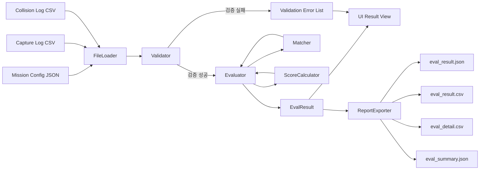
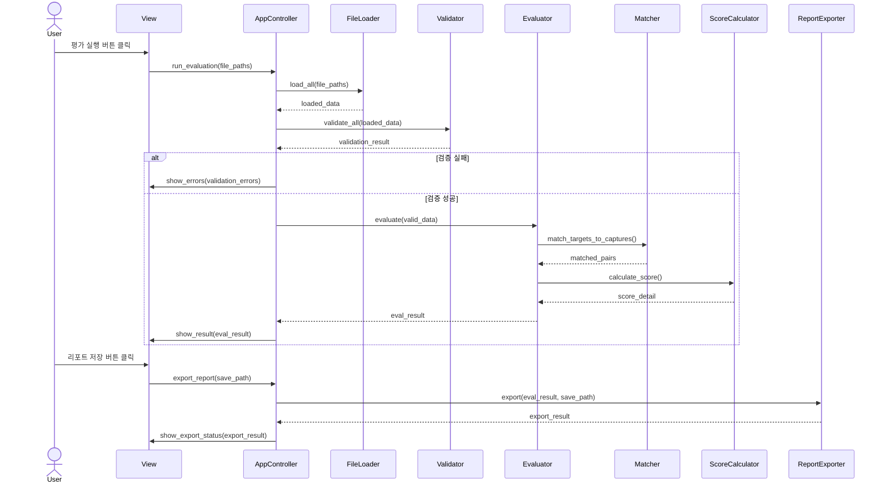
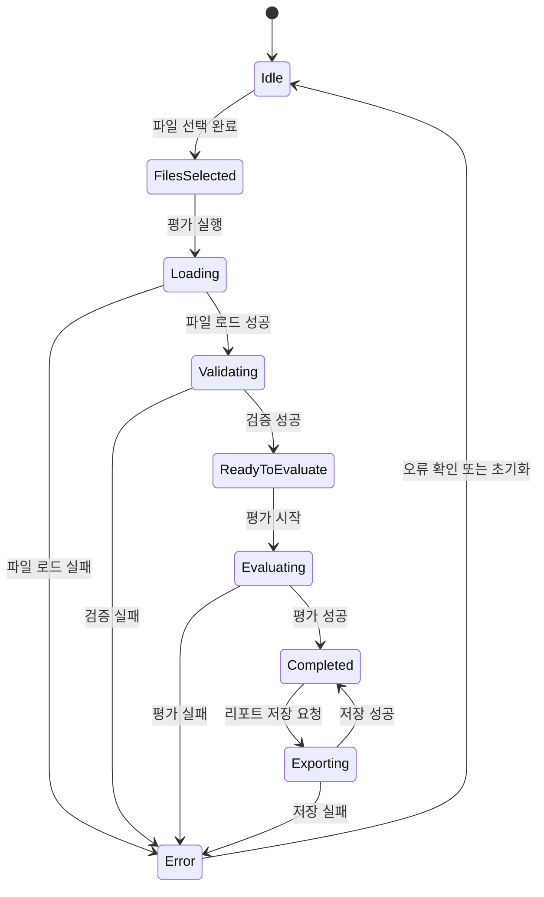
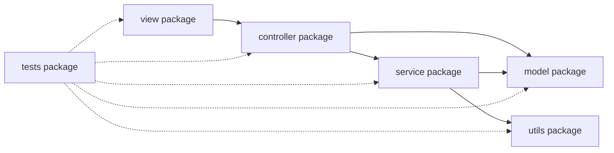
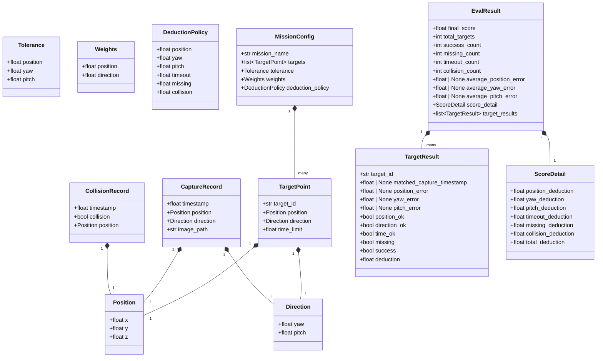

# Software Design Document (SDD)
## 드론 항공촬영 임무 평가 시스템

**버전**: 1.1  
**작성일**: 2026-05-26  
**기반 문서**: 사용자 제공 SDD 초안, `소프트웨어공학_프로젝트.docx (SRS)` 확인 필요

---

## 1. 개요

### 1.1 목적

본 문서는 AirSim 기반 드론 항공촬영 시뮬레이션 결과를 평가하는 교육용 실습 플랫폼의 소프트웨어 설계를 정의한다. 본 문서의 목적은 구현 구조, 데이터 인터페이스, 평가 알고리즘, 예외 처리, UI 동작을 명확히 규정하여 구현자와 검증자가 동일한 기준으로 시스템을 개발하고 시험할 수 있도록 하는 것이다.

### 1.2 범위

본 시스템의 범위는 다음과 같다.

- 입력 파일 로드: 임무 설정 파일, 비행 로그, 촬영 로그, 충돌 로그
- 입력 데이터 검증: 형식, 필수 필드, 값 범위, 이미지 경로
- 목표-촬영 매칭: 목표 지점과 촬영 기록 간 1:1 매칭
- 평가 수행: 위치, 방향, 시간, 누락, 충돌 기준 평가
- 결과 표시: 점수, 상세 결과, 그래프, 이미지 미리보기
- 결과 저장: JSON 및 CSV 형식의 평가 결과 파일 생성
- 확장 기능: 입력 데이터 미리보기, 평가 이력 관리, 시각화 이미지 저장, 애플리케이션 로그 기록

본 시스템의 범위에 포함되지 않는 항목은 다음과 같다.

- AirSim 시뮬레이션 실행 기능
- 드론 제어 기능
- 이미지 품질 분석 기능
- 네트워크 기반 다중 사용자 기능

### 1.3 실행 환경 및 기술 제약

- 구현 언어: Python 3.x
- UI 프레임워크: PyQt5
- 시각화 라이브러리: matplotlib
- 실행 환경: Windows 기반 Desktop PC
- 문자 인코딩: UTF-8
- 좌표계: AirSim NED 좌표계

### 1.4 용어 정의

| 용어 | 정의 |
|------|------|
| 임무 설정 파일 | 목표 촬영 위치, 방향, 제한 시간, 평가 기준을 정의한 JSON 파일 |
| 목표 | 하나의 촬영 평가 단위가 되는 목표 지점 정의 |
| 촬영 기록 | 드론이 촬영한 1건의 로그 레코드 |
| 비행 로그 | 드론의 시간별 위치, 자세, 속도 기록 |
| 충돌 로그 | 충돌 발생 여부와 관련 정보를 저장한 기록 |
| 이미지 폴더 | 촬영 로그의 상대 경로 이미지 파일을 해석하거나 이미지 존재 여부 검증 시 사용하는 기준 디렉토리 |
| 허용 오차 | 목표 만족 판정에 사용하는 최대 허용 위치/방향 오차 |
| 평가 기준 | 허용 오차, 시간 제한, 성공 판정 규칙 등 평가 판단에 사용하는 기준 |
| 감점 기준 | 평가 항목별 감점 계수 및 감점 계산 규칙 |
| 종합 비용 | 목표-촬영 매칭에 사용하는 비용 값 |
| 누락 | 어떤 촬영 기록에도 매칭되지 않은 목표 |
| 시간 초과 | 매칭된 촬영 기록의 촬영 시각이 목표 제한 시간을 초과한 상태 |
| 충돌 수 | `collision == true`로 판정된 충돌 이벤트 레코드의 개수 |
| 충돌 발생 여부 | 충돌 수가 1 이상인지 여부를 나타내는 불리언 요약 값 |
| NED 좌표계 | North-East-Down 좌표계. 단위는 meter |

### 1.5 확인 필요 사항

다음 항목은 현재 제공된 초안만으로 확정할 수 없으므로 SRS 원본 확인 후 확정해야 한다.

- JSON 로그 파일의 최상위 구조가 모든 로그 유형에서 동일한지 여부
- 결과 파일 자동 저장이 필수인지, 사용자 수동 저장만 허용하는지 여부
- 평가 진행률 표시가 실제 단계 기반인지, 레코드 단위 세부 진행률이 필요한지 여부

---

## 2. 시스템 아키텍처

### 2.1 아키텍처 패턴

시스템은 MVC(Model-View-Controller) 패턴을 적용한다.

```text
+----------------+       +------------------+       +----------------+
| View           | <---> | AppController    | <---> | Model          |
| PyQt5 UI       |       | Workflow Control |       | Data Classes   |
+----------------+       +------------------+       +----------------+
                                 |
                 +---------------+------------------------------+
                 |               |              |               |
          +------+-----+  +------+-----+ +------+-----+ +-------+------+
          | FileLoader |  | Validator  | | Evaluator  | | ReportExporter|
          +------------+  +------------+ +------+-----+ +--------------+
                                               |
                  +-----------------------------+---------------------------+
                  |                             |                           |
          +-------+--------+           +--------+--------+          +-------+--------+
          | Matcher        |           | ScoreCalculator |          | HistoryManager |
          +----------------+           +-----------------+          +----------------+
                  |
          +-------+------------------+
          | VisualizationService     |
          +--------------------------+
```

### 2.2 컴포넌트 책임

| 컴포넌트 | 책임 | 입력 | 출력 |
|----------|------|------|------|
| MainWindow | UI 이벤트 수신 및 결과 표시 | 사용자 입력, Controller 응답 | 화면 상태 |
| AppController | 전체 처리 흐름 제어 | UI 요청 | 평가 결과, 오류 정보 |
| FileLoader | CSV/JSON 파일 파싱 | 파일 경로 | 모델 객체 목록 |
| Validator | 구조/값/경로 검증 | 모델 객체, 파일 경로 | 검증 결과, 오류 목록 |
| Evaluator | 매칭과 점수 계산 orchestration | 검증 완료 데이터 | `EvalResult` |
| Matcher | 목표-촬영 최적 1:1 매칭 | 목표 목록, 촬영 목록, 가중치 | 매칭 쌍 |
| ScoreCalculator | 감점 및 최종 점수 계산 | 매칭 결과, 정책 값 | `ScoreDetail`, `final_score` |
| ReportExporter | 결과 저장 | `EvalResult`, 저장 경로 | JSON/CSV 파일 |
| VisualizationService | 그래프 데이터 생성 및 차트 저장 | `EvalResult` | 그래프 객체, 이미지 파일 |
| HistoryManager | 이전 평가 결과 저장/로드/비교 | 평가 결과 파일 | 이력 목록, 비교 결과 |

### 2.3 처리 흐름

1. 사용자가 입력 파일 경로를 선택한다.
2. `AppController`가 파일 존재 여부를 확인한다.
3. `FileLoader`가 각 입력 파일을 파싱하여 모델 객체를 생성한다.
4. `Validator`가 구조 및 값 검증을 수행한다.
5. 검증 실패 시 평가를 중단하고 오류를 UI에 표시한다.
6. 검증 성공 시 `Evaluator`가 매칭, 조건 판정, 점수 계산을 수행한다.
7. `AppController`가 결과를 UI에 전달한다.
8. 사용자가 선택하면 `ReportExporter`가 결과 파일을 저장한다.

### 2.4 모듈 의존성 규칙

- `view` 계층은 `controller`만 호출할 수 있어야 하며 `service`를 직접 호출하지 않아야 한다.
- `controller` 계층은 `service`와 `model`을 호출할 수 있어야 한다.
- `service` 계층은 `model`과 `utils`를 사용할 수 있어야 한다.
- `model` 계층은 다른 계층에 의존하지 않아야 한다.
- `utils` 계층은 공통 보조 기능만 제공하며 상위 계층 상태를 직접 보유하지 않아야 한다.
- 테스트 코드는 각 계층의 공개 인터페이스를 기준으로 작성해야 한다.

---

## 3. 모듈 설계

### 3.1 디렉토리 구조

```text
drone_eval/
├── main.py
├── controller/
│   └── app_controller.py
├── model/
│   ├── mission.py
│   ├── logs.py
│   ├── result.py
│   └── history.py
├── service/
│   ├── file_loader.py
│   ├── validator.py
│   ├── evaluator.py
│   ├── matcher.py
│   ├── score_calculator.py
│   ├── report_exporter.py
│   ├── history_manager.py
│   ├── visualization_service.py
│   └── preview_service.py
├── view/
│   ├── main_window.py
│   ├── tab_file_select.py
│   ├── tab_mission.py
│   ├── tab_run.py
│   ├── tab_summary.py
│   ├── tab_detail.py
│   ├── tab_visual.py
│   ├── tab_report.py
│   ├── tab_preview.py
│   └── tab_history.py
└── utils/
    ├── angle_utils.py
    ├── logger.py
    └── exceptions.py
```

### 3.2 주요 데이터 모델

```python
@dataclass
class TargetPoint:
    target_id: str
    x: float
    y: float
    z: float
    yaw: float
    pitch: float
    time_limit: float

@dataclass
class ScorePolicy:
    position_penalty_per_meter: float
    direction_yaw_penalty_per_degree: float
    direction_pitch_penalty_per_degree: float
    missing_capture_penalty: float
    collision_penalty: float
    timeout_penalty: float
    position_weight: float
    direction_weight: float

@dataclass
class MissionConfig:
    mission_id: str
    allow_position_error: float
    allow_yaw_error: float
    allow_pitch_error: float
    targets: List[TargetPoint]
    score_policy: ScorePolicy

@dataclass
class FlightRecord:
    timestamp: float
    x: float
    y: float
    z: float
    roll: float
    pitch: float
    yaw: float
    speed: float

@dataclass
class CaptureRecord:
    timestamp: float
    x: float
    y: float
    z: float
    roll: float
    pitch: float
    yaw: float
    image_path: str

@dataclass
class CollisionRecord:
    timestamp: float
    collision: bool
    x: float
    y: float
    z: float

@dataclass
class TargetResult:
    target_id: str
    matched_capture: Optional[CaptureRecord]
    matched_capture_timestamp: Optional[float]
    position_error: Optional[float]
    yaw_error: Optional[float]
    pitch_error: Optional[float]
    position_ok: bool
    direction_ok: bool
    time_ok: bool
    image_linked: bool
    is_missing: bool
    is_timeout: bool
    position_deduction: float
    direction_deduction: float
    timeout_deduction: float

@dataclass
class ScoreDetail:
    total_position_deduction: float
    total_direction_deduction: float
    total_missing_deduction: float
    total_collision_deduction: float
    total_timeout_deduction: float
    total_deduction: float
    base_score: float

@dataclass
class EvalResult:
    mission_id: str
    target_results: List[TargetResult]
    collision_records: List[CollisionRecord]
    total_targets: int
    success_count: int
    missing_count: int
    collision_count: int
    timeout_count: int
    avg_position_error: Optional[float]
    avg_yaw_error: Optional[float]
    avg_pitch_error: Optional[float]
    score_detail: ScoreDetail
    final_score: float
```

### 3.3 설계 제약

- `TargetResult.position_error`, `yaw_error`, `pitch_error`는 목표가 누락된 경우 `None`이어야 한다.
- `TargetResult.matched_capture_timestamp`는 매칭된 촬영 기록이 있을 때 해당 `CaptureRecord.timestamp`와 동일해야 하며, 누락된 목표는 `None`이어야 한다.
- 누락된 목표의 `timeout_deduction`은 항상 `0`이어야 한다.
- 평균 오차 값은 매칭된 촬영 기록이 1건 이상일 때만 계산하며, 그렇지 않으면 `None`이어야 한다.
- 평균 오차는 누락되지 않은 목표 중 매칭된 촬영 기록이 있는 목표만을 대상으로 계산해야 한다.
- `success_count`는 누락되지 않은 목표 중 `position_ok`, `direction_ok`, `time_ok`가 모두 `True`인 목표 수여야 한다.
- 점수 관련 필드명은 `score`와 `deduction`을 혼용하지 않고, 감점값은 모두 `deduction`으로 통일한다.
- `TargetPoint.time_limit`은 목표별 제한 시간을 의미하며, 임무 전체 공통 제한 시간을 의미하지 않는다.

---

## 4. 데이터 명세

### 4.1 공통 규칙

- 모든 입력 파일은 UTF-8 인코딩이어야 한다.
- 숫자 필드는 부동소수점으로 파싱 가능해야 한다.
- 필수 필드가 누락된 레코드는 평가에서 제외하고 오류 목록에 기록해야 한다.
- 로그 레코드 순서는 입력 순서를 유지하되, 시간 계산은 각 레코드의 `timestamp` 값으로 수행해야 한다.
- 파일 전체를 읽을 수 없는 형식 오류 또는 파싱 오류는 평가 중단 사유로 처리해야 한다.
- 개별 레코드 단위의 필수 필드 누락, NaN 값, 수치 변환 실패는 해당 레코드만 평가 대상에서 제외해야 한다.

### 4.2 임무 설정 파일

- 형식: JSON 객체
- 필수 최상위 필드:
  - `mission_id`
  - `allow_position_error`
  - `allow_yaw_error`
  - `allow_pitch_error`
  - `targets`
  - `score_policy`

예시:

```json
{
  "mission_id": "mission_001",
  "allow_position_error": 2.0,
  "allow_yaw_error": 10.0,
  "allow_pitch_error": 10.0,
  "targets": [
    {
      "target_id": "T1",
      "x": 10.0,
      "y": 5.0,
      "z": -20.0,
      "yaw": 90.0,
      "pitch": -30.0,
      "time_limit": 60.0
    }
  ],
  "score_policy": {
    "position_penalty_per_meter": 5.0,
    "direction_yaw_penalty_per_degree": 2.0,
    "direction_pitch_penalty_per_degree": 2.0,
    "missing_capture_penalty": 10.0,
    "collision_penalty": 20.0,
    "timeout_penalty": 5.0,
    "position_weight": 1.0,
    "direction_weight": 1.0
  }
}
```

검증 규칙:

- `targets`는 길이 1 이상의 배열이어야 한다.
- `target_id`는 임무 내에서 중복되면 안 된다.
- 허용 오차와 감점 계수는 0 이상이어야 한다.
- `position_weight`와 `direction_weight`는 0보다 커야 한다.

### 4.3 비행 로그

- 형식: CSV 또는 JSON
- CSV 헤더:

```text
timestamp,x,y,z,roll,pitch,yaw,speed
```

- 필수 필드: `timestamp`, `x`, `y`, `z`, `roll`, `pitch`, `yaw`, `speed`

### 4.4 촬영 로그

- 형식: CSV 또는 JSON
- CSV 헤더:

```text
timestamp,x,y,z,roll,pitch,yaw,image_path
```

- 필수 필드: `timestamp`, `x`, `y`, `z`, `roll`, `pitch`, `yaw`, `image_path`
- `roll` 필드는 입력으로는 유지하되 평가 계산에는 사용하지 않는다. 본 시스템은 촬영 방향 평가를 yaw/pitch 기준으로만 수행하며, roll은 표시 및 원본 로그 보존 목적의 보조 정보로 취급한다.

### 4.5 충돌 로그

- 형식: CSV 또는 JSON
- CSV 헤더:

```text
timestamp,collision,x,y,z
```

- 필수 필드: `timestamp`, `collision`, `x`, `y`, `z`
- `collision` 값은 `true/false`, `1/0`, `yes/no`, `y/n` 형식을 허용할 수 있다.
- `collision == true`로 해석된 레코드만 충돌 이벤트로 처리한다.

### 4.6 JSON 로그 형식

CSV 대신 JSON을 사용할 경우, 각 로그 파일은 레코드 객체 배열이어야 한다.

예시:

```json
[
  {
    "timestamp": 1.0,
    "x": 10.1,
    "y": 5.2,
    "z": -20.0,
    "roll": 0.0,
    "pitch": -30.0,
    "yaw": 90.0,
    "image_path": "C:/images/cap001.png"
  }
]
```

---

## 5. 평가 알고리즘 설계

### 5.1 임무 시작 시각

- 임무 시작 시각 `t_start`는 비행 로그의 첫 번째 유효 레코드의 `timestamp`로 정의한다.
- 비행 로그에 유효 레코드가 없으면 평가를 중단하고 오류를 반환해야 한다.

### 5.2 오차 계산

위치 오차:

```text
position_error = sqrt((cx - tx)^2 + (cy - ty)^2 + (cz - tz)^2)
```

방향 오차:

```text
yaw_error   = abs(normalize_angle(capture.yaw   - target.yaw))
pitch_error = abs(normalize_angle(capture.pitch - target.pitch))
```

각도 정규화:

```text
normalize_angle(a) = ((a + 180) % 360) - 180
```

### 5.3 판정 규칙

- `position_ok = position_error <= allow_position_error`
- `direction_ok = (yaw_error <= allow_yaw_error) AND (pitch_error <= allow_pitch_error)`
- `time_ok = (capture.timestamp - t_start) <= target.time_limit`
- `is_timeout = NOT time_ok`
- `image_linked = Path(image_path).is_file()`

성공 판정 규칙:

- `success_count`는 다음 조건을 모두 만족하는 목표 수로 계산한다.
- 목표가 누락되지 않아야 한다.
- `position_ok`가 `True`여야 한다.
- `direction_ok`가 `True`여야 한다.
- `time_ok`가 `True`여야 한다.

### 5.4 목표-촬영 매칭 비용

```text
cost(target_i, capture_j) =
    position_error(i, j) * position_weight
  + yaw_error(i, j)      * direction_weight
  + pitch_error(i, j)    * direction_weight
```

매칭 후보 규칙:

- 비용 행렬에는 모든 유효 촬영 기록을 포함해야 한다.
- `time_ok` 위반 촬영 기록도 매칭 후보에서 사전 제외하지 않는다.
- 허용 위치 오차 또는 허용 방향 오차를 초과한 촬영 기록도 매칭 후보에서 사전 제외하지 않는다.
- 조건 위반 여부는 매칭 후 `position_ok`, `direction_ok`, `time_ok` 판정과 감점 계산으로 처리해야 한다.

### 5.5 감점 규칙

위치 감점:

```text
if position_error > allow_position_error:
    position_deduction =
        (position_error - allow_position_error) * position_penalty_per_meter
else:
    position_deduction = 0
```

방향 감점:

```text
if yaw_error > allow_yaw_error:
    yaw_deduction =
        (yaw_error - allow_yaw_error) * direction_yaw_penalty_per_degree
else:
    yaw_deduction = 0

if pitch_error > allow_pitch_error:
    pitch_deduction =
        (pitch_error - allow_pitch_error) * direction_pitch_penalty_per_degree
else:
    pitch_deduction = 0

direction_deduction = yaw_deduction + pitch_deduction
```

시간 초과 감점:

```text
if is_missing is True:
    timeout_deduction = 0
elif time_ok is False:
    timeout_deduction = timeout_penalty
else:
    timeout_deduction = 0
```

누락 및 충돌 감점:

```text
missing_deduction   = missing_count   * missing_capture_penalty
collision_deduction = collision_count * collision_penalty
```

### 5.6 최종 점수

```text
base_score = 100.0

total_deduction =
    sum(position_deduction for all matched targets)
  + sum(direction_deduction for all matched targets)
  + sum(timeout_deduction for all matched targets)
  + missing_deduction
  + collision_deduction

final_score = max(0.0, base_score - total_deduction)
```

---

## 6. 목표-촬영 매칭 알고리즘

### 6.1 적용 알고리즘

- 구현은 `scipy.optimize.linear_sum_assignment`를 사용한다.
- 매칭은 전역 최적 1:1 매칭이어야 한다.
- 매칭 단계는 비용 최소화만 수행하며, 시간 초과 및 허용 오차 초과 여부는 매칭 이후 평가 단계에서 판정해야 한다.

### 6.2 처리 절차

1. 목표 수를 `N`, 촬영 수를 `M`으로 정의한다.
2. 크기 `N x M` 비용 행렬을 생성한다.
3. `linear_sum_assignment`를 호출한다.
4. 반환된 인덱스를 기준으로 목표와 촬영 기록을 매칭한다.
5. 매칭되지 않은 목표는 누락으로 처리한다.
6. 매칭되지 않은 촬영 기록은 평가 결과에 반영하지 않는다.

### 6.3 경계 조건

- `N > 0`이고 `M = 0`이면 모든 목표를 누락으로 처리한다.
- `N = 0`인 임무 설정 파일은 유효하지 않으며 입력 검증 실패로 처리한다.
- 동일 비용의 복수 해가 있을 수 있다. 이 경우 `linear_sum_assignment`의 반환 결과를 그대로 사용한다.

### 6.4 경계값 설계 표

| 항목 | 입력 조건 | 기대 결과 |
|---|---|---|
| 위치 허용 경계 | `position_error == allow_position_error` | `position_ok = True`, 위치 감점 0 |
| Yaw 허용 경계 | `yaw_error == allow_yaw_error` | `direction_ok` 판정에서 Yaw 조건 만족 |
| Pitch 허용 경계 | `pitch_error == allow_pitch_error` | `direction_ok` 판정에서 Pitch 조건 만족 |
| 시간 허용 경계 | `capture.timestamp - t_start == target.time_limit` | `time_ok = True`, 시간 감점 0 |
| 촬영 0건 | `M = 0` | 모든 목표 누락 처리 |
| 목표 0건 | `N = 0` | 입력 검증 실패 |
| 충돌 0건 | `collision_count = 0` | 충돌 감점 0 |
| 총 감점 100 초과 | `total_deduction > 100` | `final_score = 0` |
| 이미지 경로 없음 | 존재하지 않는 이미지 파일 | `image_linked = False`, 평가 계속 |

---

## 7. UI 설계

### 7.1 화면 구성

시스템은 `QMainWindow`와 `QTabWidget` 기반의 7개 탭으로 구성한다.

| 탭 | 이름 | 목적 |
|----|------|------|
| 1 | 파일 선택 | 입력 파일 경로 지정 및 기본 검증 결과 표시 |
| 2 | 임무 설정 확인 | 목표 목록과 평가 기준 확인 |
| 3 | 평가 실행 | 평가 시작 및 진행 상태 표시 |
| 4 | 결과 요약 | 최종 점수와 주요 집계 결과 표시 |
| 5 | 상세 결과 | 목표별 상세 판정과 이미지 미리보기 표시 |
| 6 | 시각화 | 그래프 기반 분석 결과 표시 |
| 7 | 리포트 저장 | 평가 결과 파일 저장 |

### 7.2 파일 선택 탭

와이어프레임:

```text
[임무 설정 파일]  [경로 표시................................] [찾아보기]
[비행 로그]       [경로 표시................................] [찾아보기]
[촬영 로그]       [경로 표시................................] [찾아보기]
[충돌 로그]       [경로 표시................................] [찾아보기]
[이미지 폴더]     [경로 표시................................] [찾아보기]

[오류 메시지 영역 - 읽기 전용]
```

입력 항목:

- 임무 설정 파일
- 비행 로그
- 촬영 로그
- 충돌 로그
- 이미지 폴더

동작 요구사항:

- 각 입력 항목은 경로 표시 영역과 파일 선택 버튼을 포함해야 한다.
- 필수 입력 누락 시 평가 시작 버튼은 비활성화되어야 한다.
- 오류 메시지 영역은 읽기 전용이어야 한다.
- 이미지 폴더는 촬영 로그의 `image_path`가 상대 경로인 경우 기준 경로로 사용해야 한다.
- 촬영 로그의 `image_path`가 절대 경로인 경우 이미지 폴더를 사용하지 않고 해당 절대 경로를 우선해야 한다.

### 7.3 임무 설정 확인 탭

와이어프레임:

```text
[임무 ID] mission_001
[허용 위치 오차] 2.0 m   [허용 Yaw 오차] 10.0 deg   [허용 Pitch 오차] 10.0 deg
[감점 정책 요약] 위치 5.0/m, Yaw 2.0/deg, Pitch 2.0/deg, 누락 10.0, 충돌 20.0, 시간초과 5.0

[목표 목록 테이블]
| 목표ID | X | Y | Z | Yaw | Pitch | 제한시간 |
| T1     |   |   |   |     |       |          |
```

동작 요구사항:

- 임무 설정 파일 로드 성공 시 목표 목록과 평가 기준 요약을 표시해야 한다.
- 임무 설정 파일 로드 실패 시 테이블을 비우고 오류 메시지를 표시해야 한다.
- 목표 목록은 `target_id` 기준 입력 순서를 유지해야 한다.

### 7.4 평가 실행 탭

와이어프레임:

```text
[평가 시작]

진행 단계
[파일 로드    ] [████████░░] 80%
[입력 검증    ] [████████░░] 80%
[매칭 및 평가 ] [░░░░░░░░░░]  0%
[결과 준비    ] [░░░░░░░░░░]  0%

상태 메시지: 촬영 로그 로드 중...
```

동작 요구사항:

- 사용자가 `평가 시작` 버튼을 누르면 중복 실행이 불가능해야 한다.
- 진행 상태는 최소 다음 4단계를 표시해야 한다.
  - 파일 로드
  - 입력 검증
  - 매칭 및 평가
  - 결과 표시 준비
- 단계 실패 시 현재 단계와 오류 메시지를 표시해야 한다.

### 7.5 결과 요약 탭

와이어프레임:

```text
[최종 점수] 72.5 / 100

[요약 테이블]
| 항목            | 값   |
| 총 목표 수      | 5    |
| 성공 수         | 3    |
| 누락 수         | 1    |
| 충돌 수         | 2    |
| 시간 초과 수    | 1    |
| 총 위치 감점    | 8.0  |
| 총 방향 감점    | 4.5  |
| 총 누락 감점    | 10.0 |
| 총 충돌 감점    | 40.0 |
| 총 시간 감점    | 5.0  |
```

동작 요구사항:

- 최종 점수는 소수점 표시 규칙을 구현 시 1개 기준으로 통일해야 한다.
- 요약 테이블 값은 `EvalResult`와 `ScoreDetail`에서 직접 계산 가능한 값만 표시해야 한다.

### 7.6 상세 결과 탭

와이어프레임:

```text
[목표별 상세 결과 테이블]
| 목표ID | 매칭시각 | 위치오차 | Yaw오차 | Pitch오차 | 위치판정 | 방향판정 | 시간판정 | 누락 | 이미지 |

[선택된 행의 이미지 미리보기]
```

표시 컬럼:

- 목표ID
- 매칭 촬영 시각
- 위치오차
- Yaw오차
- Pitch오차
- 위치 판정
- 방향 판정
- 시간 판정
- 목표별 성공 여부
- 누락 여부
- 이미지 연결 여부

동작 요구사항:

- 사용자가 테이블 행을 선택하면 해당 행의 매칭 이미지 미리보기를 시도해야 한다.
- 이미지가 없거나 열 수 없으면 대체 텍스트를 표시해야 한다.

### 7.7 시각화 탭

표시 차트:

- 목표별 위치 오차 그래프
- 목표별 방향 오차 그래프
- 감점 항목별 합계 그래프
- 성공/누락/충돌/시간 초과 집계 그래프

### 7.8 리포트 저장 탭

와이어프레임:

```text
[저장 폴더] [경로 표시................................] [찾아보기]

[저장할 파일]
[ ] eval_result.json
[ ] eval_result.csv
[ ] eval_detail.csv
[ ] eval_summary.json

[리포트 저장]
[저장 결과 메시지 영역]
```

동작 요구사항:

- 기본 선택 상태와 파일 선택 가능 여부는 SRS 확인 후 확정해야 한다.
- 저장 성공 시 생성된 파일 목록을 표시해야 한다.
- 저장 실패 시 실패 원인과 실패 파일 목록을 표시해야 한다.

---

## 8. 파일 입출력 인터페이스

### 8.1 입력 로드 순서

1. 임무 설정 파일 로드
2. 비행 로그 로드
3. 촬영 로그 로드
4. 충돌 로그 로드
5. 이미지 경로 검증

이미지 경로 검증 규칙:

- `image_path`가 절대 경로이면 해당 경로의 존재 여부를 직접 검증해야 한다.
- `image_path`가 상대 경로이면 사용자가 선택한 이미지 폴더를 기준으로 결합하여 검증해야 한다.
- 이미지 폴더가 없고 `image_path`가 상대 경로인 경우 해당 촬영 기록은 이미지 연결 오류로 처리해야 한다.

### 8.2 출력 파일

출력 파일은 사용자가 지정한 폴더에 저장해야 한다.

필수 출력 파일:

- `eval_result.json`
- `eval_result.csv`
- `eval_detail.csv`
- `eval_summary.json`

출력 파일 용도:

- `eval_result.json`은 구조화된 결과 데이터를 다른 프로그램이나 후속 처리 로직이 읽기 쉽도록 저장하는 용도이다.
- `eval_result.csv`는 동일한 요약 정보를 단일 행 표 형식으로 저장하여 스프레드시트 확인, 과제 제출, 수동 비교에 사용하기 위한 용도이다.
- `eval_detail.csv`는 목표별 상세 판정과 감점 내역을 표 형식으로 확인하기 위한 용도이다.
- `eval_summary.json`은 화면 요약과 동일한 핵심 집계 정보만 별도로 제공하기 위한 용도이다.

### 8.3 출력 JSON 구조

`eval_result.json` 예시:

```json
{
  "mission_id": "mission_001",
  "final_score": 72.5,
  "total_targets": 5,
  "success_count": 3,
  "missing_count": 1,
  "collision_count": 2,
  "timeout_count": 1,
  "score_detail": {
    "total_position_deduction": 8.0,
    "total_direction_deduction": 4.5,
    "total_missing_deduction": 10.0,
    "total_collision_deduction": 40.0,
    "total_timeout_deduction": 5.0,
    "total_deduction": 67.5,
    "base_score": 100.0
  }
}
```

`eval_result.csv` 헤더:

```text
mission_id,final_score,total_targets,success_count,missing_count,collision_count,timeout_count,total_position_deduction,total_direction_deduction,total_missing_deduction,total_collision_deduction,total_timeout_deduction,total_deduction,base_score
```

`eval_result.csv`는 `eval_result.json`의 요약 필드를 단일 행으로 평탄화하여 저장해야 한다.

`eval_detail.csv` 헤더:

```text
target_id,matched_capture_timestamp,position_error,yaw_error,pitch_error,position_ok,direction_ok,time_ok,image_linked,is_missing,is_timeout,position_deduction,direction_deduction,timeout_deduction
```

`matched_capture_timestamp`는 매칭된 촬영 기록의 `timestamp` 값을 저장하며, 매칭되지 않은 목표는 빈 값으로 기록해야 한다.

`eval_summary.json` 예시:

```json
{
  "mission_id": "mission_001",
  "total_targets": 5,
  "success_count": 3,
  "missing_count": 1,
  "collision_count": 2,
  "timeout_count": 1,
  "avg_position_error": 1.8,
  "avg_yaw_error": 6.2,
  "avg_pitch_error": 4.1,
  "final_score": 72.5
}
```

### 8.4 저장 실패 처리

- 저장 경로가 없거나 쓰기 권한이 없으면 저장을 중단하고 오류 메시지를 표시해야 한다.
- 일부 파일 저장에 실패한 경우, 성공/실패 파일 목록을 사용자에게 표시해야 한다.

부분 저장 실패 규칙:

- 파일별 저장은 독립적으로 시도해야 한다.
- 일부 파일 저장이 실패하더라도 이미 저장된 파일은 유지해야 한다.
- 저장 결과는 최소 `성공 파일 목록`, `실패 파일 목록`, `실패 원인 목록`을 포함하여 사용자에게 전달해야 한다.

### 8.5 파일명 및 덮어쓰기 정책

기본 파일명:

- `eval_result.json`
- `eval_result.csv`
- `eval_detail.csv`
- `eval_summary.json`

정책:

- 사용자가 별도 파일명을 지정하지 않으면 기본 파일명을 사용해야 한다.
- 같은 이름의 파일이 이미 존재하는 경우 구현 시 다음 중 하나를 선택해 일관되게 적용해야 한다.
  - 사용자 확인 후 덮어쓰기
  - 덮어쓰지 않고 저장 실패 처리
  - 타임스탬프를 붙여 새 파일명으로 저장
- 한 구현 버전에서는 덮어쓰기 정책을 혼용하지 않아야 한다.
- 저장 결과 메시지에는 최종 저장된 실제 파일명을 표시해야 한다.

---

## 9. 예외 처리 설계

| 예외 상황 | 판정 기준 | 처리 방식 |
|-----------|-----------|-----------|
| 필수 입력 파일 누락 | 필수 경로 미지정 또는 파일 없음 | 평가 시작 불가, 오류 메시지 표시 |
| 임무 설정 파일 형식 오류 | JSON 파싱 실패 또는 필수 필드 누락 | 로드 실패, 평가 중단 |
| 로그 파일 형식 오류 | CSV/JSON 파싱 실패 | 로드 실패, 평가 중단 |
| 필수 필드 누락 | 필수 컬럼 또는 키 미존재 | 해당 레코드 제외, 오류 목록 기록 |
| 숫자 변환 실패 | float 변환 실패, NaN 포함 | 해당 레코드 제외, 오류 목록 기록 |
| 비행 로그 유효 레코드 없음 | `t_start` 계산 불가 | 평가 중단 |
| 촬영 로그 없음 | 유효 촬영 기록 수 0 | 모든 목표 누락 처리 후 평가 계속 |
| 충돌 로그 없음 | 파일 미선택 또는 유효 이벤트 0 | 충돌 0건으로 평가 계속 |
| 이미지 파일 없음 | `image_path` 대상 파일 미존재 | `image_linked=False`, 평가 계속 |
| 한글 경로 포함 | 경로 문자열에 비ASCII 문자 포함 | `pathlib.Path` 기반 처리 |

### 9.1 행 제외와 평가 중단 기준

| 구분 | 조건 | 처리 방식 |
|---|---|---|
| 평가 중단 | 필수 입력 파일 누락 | 평가 시작 자체를 차단한다. |
| 평가 중단 | JSON 파싱 실패, 지원하지 않는 확장자, 파일 접근 실패 | 파일 전체 로드를 실패로 처리하고 평가를 중단한다. |
| 평가 중단 | 비행 로그 유효 레코드 없음 | `t_start` 계산 불가로 평가를 중단한다. |
| 레코드 제외 | 필수 컬럼/키 누락 | 해당 레코드만 오류 목록에 기록하고 제외한다. |
| 레코드 제외 | NaN 값, 숫자 변환 실패 | 해당 레코드만 오류 목록에 기록하고 제외한다. |
| 경고 후 계속 | 이미지 파일 없음 | 평가는 계속하고 `image_linked=False`로 기록한다. |

### 9.2 집계 필드 해석 규칙

- `collision_count`는 충돌 이벤트 레코드 수를 의미한다.
- `충돌 발생 여부`는 `collision_count > 0`인지 여부를 의미한다.
- `success_count`는 목표별 성공 여부가 `True`인 목표 수를 의미한다.
- `timeout_count`는 매칭된 목표 중 `time_ok == False`인 목표 수를 의미한다.

---

## 10. 비기능 요구사항 대응

| 요구사항 | 설계 대응 | 검증 기준 |
|----------|-----------|-----------|
| 성능 | 벡터 연산 및 Hungarian algorithm 사용 | 100MB 이하 입력에서 30초 이내 완료 |
| 신뢰성 | 랜덤 요소 없이 동일 입력에 동일 결과 보장 | 동일 입력 3회 실행 시 결과 동일 |
| 유지보수성 | 기능별 모듈 분리 및 데이터 모델 분리 | 주요 서비스 모듈 독립 단위 테스트 가능 |
| 확장성 | `ScorePolicy` 및 `Evaluator` 확장 구조 사용 | 신규 평가 항목 추가 시 기존 UI 구조 유지 가능 |
| 사용성 | 탭 기반 UI와 한국어 오류 메시지 제공 | 비전문가 사용 시 파일 선택부터 저장까지 단일 흐름 수행 가능 |

---

## 11. 컴포넌트 인터페이스 명세

### 11.1 FileLoader 인터페이스

| 메서드 | 입력 | 반환 | 예외 | 설명 |
|---|---|---|---|---|
| `load_mission_config(path)` | `str \| Path` | `MissionConfig` | `ValueError`, `JSONDecodeError`, `OSError` | 임무 설정 JSON을 읽어 모델 객체로 변환한다. |
| `load_flight_records(path)` | `str \| Path` | `list[FlightRecord]` | `ValueError`, `JSONDecodeError`, `OSError` | 비행 로그 CSV/JSON을 읽어 비행 레코드 목록으로 반환한다. |
| `load_capture_records(path)` | `str \| Path` | `list[CaptureRecord]` | `ValueError`, `JSONDecodeError`, `OSError` | 촬영 로그 CSV/JSON을 읽어 촬영 레코드 목록으로 반환한다. |
| `load_collision_records(path)` | `str \| Path` | `list[CollisionRecord]` | `ValueError`, `JSONDecodeError`, `OSError` | 충돌 로그 CSV/JSON을 읽어 충돌 레코드 목록으로 반환한다. |

입력 제약:

- 파일 확장자는 `.json` 또는 `.csv`여야 한다.
- 인코딩은 UTF-8 기준으로 처리한다.
- `collision` 값은 `true/false`, `1/0`, `yes/no`, `y/n` 형식을 허용할 수 있다.

### 11.2 Validator 인터페이스

| 메서드 | 입력 | 반환 | 설명 |
|---|---|---|---|
| `validate_mission_config(mission)` | `MissionConfig` | `list[str]` | 임무 설정 데이터의 구조 및 값 범위를 검증한다. |
| `validate_flight_records(records)` | `list[FlightRecord]` | `list[str]` | 비행 로그 수치 필드의 NaN 및 값 이상 여부를 검증한다. |
| `validate_capture_records(records)` | `list[CaptureRecord]` | `list[str]` | 촬영 로그 수치 필드, 이미지 경로, NaN 여부를 검증한다. |
| `validate_collision_records(records)` | `list[CollisionRecord]` | `list[str]` | 충돌 로그 수치 필드의 NaN 여부를 검증한다. |

검증 규칙:

- 오류가 없으면 빈 리스트를 반환해야 한다.
- 오류가 있으면 사용자 표시가 가능한 문자열 목록을 반환해야 한다.
- `target_id`는 중복되면 안 된다.
- `position_weight`, `direction_weight`는 0보다 커야 한다.
- 모든 감점 계수는 0 이상이어야 한다.

### 11.3 Matcher 인터페이스

| 메서드 | 입력 | 반환 | 설명 |
|---|---|---|---|
| `match(targets, captures, mission)` | `list[TargetPoint]`, `list[CaptureRecord]`, `MissionConfig` | `dict[int, int]` | 목표 인덱스와 촬영 인덱스 간 최적 1:1 매칭 결과를 반환한다. |
| `calculate_cost(target, capture, mission)` | `TargetPoint`, `CaptureRecord`, `MissionConfig` | `float` | 위치/방향 오차와 가중치를 적용한 종합 비용을 계산한다. |

반환 규칙:

- 키는 목표 인덱스, 값은 촬영 기록 인덱스이다.
- 촬영 수가 목표 수보다 적으면 일부 목표 인덱스는 결과에 포함되지 않을 수 있다.
- 촬영 수가 더 많으면 남는 촬영 기록은 결과에 포함되지 않는다.

### 11.4 ScoreCalculator 인터페이스

| 메서드 | 입력 | 반환 | 설명 |
|---|---|---|---|
| `calculate_position_deduction(position_error, mission)` | `float`, `MissionConfig` | `float` | 위치 초과 오차에 대한 감점을 계산한다. |
| `calculate_direction_deduction(yaw_error, pitch_error, mission)` | `float`, `float`, `MissionConfig` | `float` | Yaw 및 Pitch 초과 오차에 대한 감점을 계산한다. |
| `calculate_timeout_deduction(is_missing, time_ok, mission)` | `bool`, `bool`, `MissionConfig` | `float` | 시간 초과 감점을 계산한다. |
| `summarize(target_results, collision_count, mission)` | `list[TargetResult]`, `int`, `MissionConfig` | `tuple[ScoreDetail, float]` | 총 감점과 최종 점수를 계산한다. |

### 11.5 Evaluator 인터페이스

| 메서드 | 입력 | 반환 | 예외 | 설명 |
|---|---|---|---|---|
| `evaluate(mission, flight_records, capture_records, collision_records)` | `MissionConfig`, `list[FlightRecord]`, `list[CaptureRecord]`, `list[CollisionRecord]` | `EvalResult` | `ValueError` | 전체 평가 흐름을 수행하고 종합 결과를 생성한다. |

처리 규칙:

- `flight_records`가 비어 있으면 평가를 수행할 수 없으므로 예외를 발생시켜야 한다.
- `t_start`는 첫 번째 유효 비행 레코드의 `timestamp`를 기준으로 계산해야 한다.
- `success_count`는 위치, 방향, 시간 조건을 모두 만족한 목표 수여야 한다.
- 평균 오차는 매칭된 목표만을 대상으로 계산해야 한다.

### 11.6 ReportExporter 인터페이스

| 메서드 | 입력 | 반환 | 설명 |
|---|---|---|---|
| `export_eval_result_json(result, path)` | `EvalResult`, `str \| Path` | `None` | 평가 결과 요약 JSON을 저장한다. |
| `export_eval_result_csv(result, path)` | `EvalResult`, `str \| Path` | `None` | 평가 결과 요약 CSV를 저장한다. |
| `export_eval_detail_csv(result, path)` | `EvalResult`, `str \| Path` | `None` | 목표별 상세 결과 CSV를 저장한다. |
| `export_eval_summary_json(result, path)` | `EvalResult`, `str \| Path` | `None` | 화면 요약용 JSON을 저장한다. |

저장 규칙:

- 출력 디렉토리가 존재하지 않거나 쓰기 권한이 없으면 저장 실패를 보고해야 한다.
- `eval_result.csv`는 `eval_result.json`의 요약 데이터를 단일 행으로 평탄화한 구조여야 한다.
- `eval_detail.csv`는 매칭되지 않은 목표의 `matched_capture_timestamp`를 빈 값으로 저장해야 한다.

---

## 12. 시퀀스 설계

### 12.1 파일 로드 시퀀스

```text
사용자
  -> View: 입력 파일 선택
View
  -> AppController: 파일 경로 전달
AppController
  -> FileLoader: mission 파일 로드
FileLoader
  -> AppController: MissionConfig 반환
AppController
  -> FileLoader: flight/capture/collision 로그 로드
FileLoader
  -> AppController: 레코드 목록 반환
AppController
  -> Validator: 입력 검증 요청
Validator
  -> AppController: 오류 목록 반환
AppController
  -> View: 성공 또는 오류 메시지 표시
```

### 12.2 평가 실행 시퀀스

```text
사용자
  -> View: 평가 시작 버튼 클릭
View
  -> AppController: 평가 실행 요청
AppController
  -> View: 진행 상태 "파일 로드"
AppController
  -> Validator: 최종 검증
Validator
  -> AppController: 검증 결과
AppController
  -> View: 진행 상태 "매칭 및 평가"
AppController
  -> Evaluator: 평가 실행
Evaluator
  -> Matcher: 최적 매칭
Matcher
  -> Evaluator: 매칭 결과 반환
Evaluator
  -> ScoreCalculator: 총 감점 및 최종 점수 계산
ScoreCalculator
  -> Evaluator: ScoreDetail, final_score 반환
Evaluator
  -> AppController: EvalResult 반환
AppController
  -> View: 결과 요약/상세/그래프 갱신
```

### 12.3 결과 저장 시퀀스

```text
사용자
  -> View: 저장 버튼 클릭
View
  -> AppController: 저장 요청
AppController
  -> ReportExporter: eval_result.json 저장
  -> ReportExporter: eval_result.csv 저장
  -> ReportExporter: eval_detail.csv 저장
  -> ReportExporter: eval_summary.json 저장
ReportExporter
  -> AppController: 저장 성공 또는 실패 반환
AppController
  -> View: 저장 결과 메시지 표시
```

### 12.4 실패 시퀀스

```text
사용자
  -> View: 평가 시작 버튼 클릭
View
  -> AppController: 평가 실행 요청
AppController
  -> Validator: 입력 검증
Validator
  -> AppController: 오류 목록 반환
AppController
  -> View: 오류 메시지 영역 표시
AppController
  -> View: 평가 중단 상태 표시
```

---

## 13. 오류 코드 및 메시지 설계

### 13.1 오류 코드 체계

| 오류 코드 | 분류 | 의미 | 사용자 메시지 예시 |
|---|---|---|---|
| `E001` | 입력 파일 | 임무 설정 파일 누락 | 임무 설정 파일이 선택되지 않았습니다. |
| `E002` | 입력 파일 | 비행 로그 누락 | 비행 로그 파일이 선택되지 않았습니다. |
| `E003` | 형식 오류 | 임무 설정 JSON 파싱 실패 | 임무 설정 파일 형식이 올바르지 않습니다. |
| `E004` | 형식 오류 | 로그 파일 확장자 미지원 | 지원하지 않는 로그 파일 형식입니다. |
| `E005` | 데이터 검증 | 중복 `target_id` | 목표 ID가 중복되었습니다. |
| `E006` | 데이터 검증 | 가중치 값 오류 | 평가 가중치는 0보다 커야 합니다. |
| `E007` | 데이터 검증 | NaN 값 포함 | 로그 데이터에 NaN 값이 포함되어 있습니다. |
| `E008` | 데이터 검증 | 이미지 파일 누락 | 촬영 이미지 파일을 찾을 수 없습니다. |
| `E009` | 평가 실행 | 유효 비행 로그 없음 | 유효한 비행 로그가 없어 평가를 시작할 수 없습니다. |
| `E010` | 저장 실패 | 출력 경로 쓰기 실패 | 결과 파일을 저장할 수 없습니다. |

### 13.2 오류 메시지 표시 원칙

- 사용자 메시지는 한국어로 표시해야 한다.
- 내부 디버그 메시지는 로그 파일에만 남기고, UI에는 상세 스택 트레이스를 직접 표시하지 않는다.
- 한 번의 평가 실행에서 여러 오류가 발생한 경우, 오류 메시지 영역에 목록 형태로 누적 표시해야 한다.
- 이미지 파일 누락은 치명적 오류가 아니므로 평가를 계속 진행하고 경고로 분류해야 한다.

### 13.3 오류 우선순위

| 우선순위 | 대상 | 처리 방식 |
|---|---|---|
| 높음 | 필수 입력 파일 누락, JSON 파싱 실패, 유효 비행 로그 없음 | 평가 중단 |
| 중간 | 필수 필드 누락, NaN 값, 중복 목표 ID | 해당 레코드 제외 또는 검증 실패 후 평가 중단 |
| 낮음 | 이미지 파일 누락, 일부 파일 저장 실패 | 경고 표시 후 가능한 범위에서 계속 진행 |

---

## 14. 상태 전이 설계

### 14.1 상태 목록

| 상태 ID | 상태명 | 설명 |
|---|---|---|
| `S0` | 초기 상태 | 어떤 입력 파일도 확정되지 않은 상태 |
| `S1` | 파일 선택 완료 | 필수 입력 파일 경로가 모두 지정된 상태 |
| `S2` | 검증 완료 | 입력 데이터 로드 및 검증이 성공한 상태 |
| `S3` | 평가 실행 중 | 매칭, 오차 계산, 감점 계산이 진행 중인 상태 |
| `S4` | 결과 생성 완료 | `EvalResult`가 생성되어 화면에 표시 가능한 상태 |
| `S5` | 저장 완료 | 결과 파일 저장이 완료된 상태 |
| `SE` | 오류 상태 | 로드, 검증, 평가, 저장 중 치명적 오류가 발생한 상태 |

### 14.2 상태 전이 규칙

| 현재 상태 | 이벤트 | 다음 상태 | 설명 |
|---|---|---|---|
| `S0` | 필수 입력 파일 선택 완료 | `S1` | 평가 시작 버튼 활성화 가능 |
| `S1` | 검증 성공 | `S2` | 임무 설정 및 로그 데이터가 유효함 |
| `S1` | 검증 실패 | `SE` | 오류 메시지를 표시하고 진행 중단 |
| `S2` | 평가 시작 | `S3` | 평가 진행률 표시 시작 |
| `S3` | 평가 성공 | `S4` | 결과 요약, 상세 결과, 그래프 표시 가능 |
| `S3` | 평가 실패 | `SE` | 오류 메시지를 표시하고 진행 중단 |
| `S4` | 저장 성공 | `S5` | 저장 결과 메시지 표시 |
| `S4` | 저장 일부 실패 | `S4` | 결과는 유지하고 실패 파일 목록 표시 |
| `SE` | 사용자 수정 후 재검증 | `S1` 또는 `S2` | 오류 원인 수정 후 흐름 재개 |

### 14.3 상태별 허용 동작

| 상태 | 허용 동작 | 비허용 동작 |
|---|---|---|
| `S0` | 파일 선택 | 평가 시작, 결과 저장 |
| `S1` | 파일 재선택, 검증 | 결과 저장 |
| `S2` | 평가 시작, 파일 재선택 | 결과 저장 |
| `S3` | 진행 상태 조회 | 중복 평가 시작 |
| `S4` | 결과 조회, 이미지 미리보기, 결과 저장 | 중복 평가 시작 |
| `S5` | 결과 재저장, 결과 조회 | 없음 |
| `SE` | 오류 확인, 파일 재선택 | 결과 저장 |

---

## 15. UI 탭별 상세 위젯 설계

### 15.1 파일 선택 탭 상세

| 위젯 ID | 위젯 종류 | 역할 | 이벤트 | 비고 |
|---|---|---|---|---|
| `mission_path_edit` | `QLineEdit` | 임무 설정 파일 경로 표시 | 읽기 전용 | 직접 편집 비활성 권장 |
| `mission_browse_btn` | `QPushButton` | 임무 설정 파일 선택 | 클릭 시 파일 다이얼로그 | JSON 필터 적용 |
| `flight_path_edit` | `QLineEdit` | 비행 로그 경로 표시 | 읽기 전용 | |
| `capture_path_edit` | `QLineEdit` | 촬영 로그 경로 표시 | 읽기 전용 | |
| `collision_path_edit` | `QLineEdit` | 충돌 로그 경로 표시 | 읽기 전용 | 선택 입력 가능 |
| `image_dir_edit` | `QLineEdit` | 이미지 폴더 경로 표시 | 읽기 전용 | 상대 경로 검증용 |
| `error_text` | `QTextEdit` | 오류 메시지 목록 표시 | 갱신 전용 | 읽기 전용 |

### 15.2 평가 실행 탭 상세

| 위젯 ID | 위젯 종류 | 역할 | 이벤트 | 비고 |
|---|---|---|---|---|
| `run_button` | `QPushButton` | 평가 시작 | 클릭 시 평가 실행 | 실행 중 비활성화 |
| `load_progress` | `QProgressBar` | 파일 로드 단계 진행률 | 상태 갱신 | |
| `validate_progress` | `QProgressBar` | 입력 검증 단계 진행률 | 상태 갱신 | |
| `evaluate_progress` | `QProgressBar` | 매칭 및 평가 단계 진행률 | 상태 갱신 | |
| `prepare_progress` | `QProgressBar` | 결과 준비 단계 진행률 | 상태 갱신 | |
| `status_label` | `QLabel` | 현재 상태 메시지 표시 | 상태 갱신 | |

### 15.3 상세 결과 탭 상세

| 위젯 ID | 위젯 종류 | 역할 | 이벤트 | 비고 |
|---|---|---|---|---|
| `detail_table` | `QTableWidget` | 목표별 상세 결과 표시 | 행 선택 시 이미지 갱신 | 정렬 기능 선택적 지원 |
| `preview_label` | `QLabel` | 이미지 미리보기 표시 | 선택 결과 반영 | 이미지 없으면 대체 텍스트 표시 |
| `detail_filter_edit` | `QLineEdit` | 목표 ID 필터 | 텍스트 변경 시 테이블 필터 | 선택 확장 기능 |

### 15.4 시각화 탭 상세

| 위젯 ID | 위젯 종류 | 역할 | 이벤트 | 비고 |
|---|---|---|---|---|
| `figure_canvas` | `FigureCanvas` | 그래프 렌더링 | 결과 갱신 시 다시 그림 | 2x2 배치 |
| `save_chart_btn` | `QPushButton` | 차트 이미지 저장 | 클릭 시 PNG 저장 | 확장 기능 |

### 15.5 리포트 저장 탭 상세

| 위젯 ID | 위젯 종류 | 역할 | 이벤트 | 비고 |
|---|---|---|---|---|
| `save_dir_edit` | `QLineEdit` | 저장 폴더 표시 | 읽기 전용 | |
| `save_dir_btn` | `QPushButton` | 저장 폴더 선택 | 클릭 시 폴더 선택 | |
| `save_result_json_chk` | `QCheckBox` | `eval_result.json` 저장 여부 | 체크 상태 조회 | |
| `save_result_csv_chk` | `QCheckBox` | `eval_result.csv` 저장 여부 | 체크 상태 조회 | |
| `save_detail_csv_chk` | `QCheckBox` | `eval_detail.csv` 저장 여부 | 체크 상태 조회 | |
| `save_summary_json_chk` | `QCheckBox` | `eval_summary.json` 저장 여부 | 체크 상태 조회 | |
| `save_btn` | `QPushButton` | 저장 실행 | 클릭 시 파일 저장 | |
| `save_message_label` | `QLabel` | 저장 결과 메시지 표시 | 상태 갱신 | |

---

## 16. 데이터 딕셔너리

### 16.1 MissionConfig 필드 정의

| 필드명 | 타입 | 단위 | Nullable | 설명 | 검증 규칙 |
|---|---|---|---|---|---|
| `mission_id` | `str` | - | 아니오 | 임무 식별자 | 빈 문자열 불가 권장 |
| `allow_position_error` | `float` | meter | 아니오 | 허용 위치 오차 | 0 이상 |
| `allow_yaw_error` | `float` | degree | 아니오 | 허용 Yaw 오차 | 0 이상 |
| `allow_pitch_error` | `float` | degree | 아니오 | 허용 Pitch 오차 | 0 이상 |
| `targets` | `list[TargetPoint]` | - | 아니오 | 목표 목록 | 1건 이상 |
| `score_policy` | `ScorePolicy` | - | 아니오 | 감점 정책 | 필수 |

### 16.2 CaptureRecord 필드 정의

| 필드명 | 타입 | 단위 | Nullable | 설명 | 검증 규칙 |
|---|---|---|---|---|---|
| `timestamp` | `float` | second | 아니오 | 촬영 시각 | NaN 불가 |
| `x` | `float` | meter | 아니오 | NED North 위치 | NaN 불가 |
| `y` | `float` | meter | 아니오 | NED East 위치 | NaN 불가 |
| `z` | `float` | meter | 아니오 | NED Down 위치 | NaN 불가 |
| `roll` | `float` | degree | 아니오 | 카메라 롤 | 평가 계산 미사용 |
| `pitch` | `float` | degree | 아니오 | 카메라 피치 | NaN 불가 |
| `yaw` | `float` | degree | 아니오 | 카메라 요 | NaN 불가 |
| `image_path` | `str` | - | 아니오 | 이미지 파일 경로 | 빈 문자열 불가 |

### 16.3 TargetResult 필드 정의

| 필드명 | 타입 | Nullable | 설명 | 규칙 |
|---|---|---|---|---|
| `matched_capture_timestamp` | `float` | 예 | 매칭된 촬영 시각 | 누락 시 `None` |
| `position_error` | `float` | 예 | 위치 오차 | 누락 시 `None` |
| `yaw_error` | `float` | 예 | Yaw 오차 | 누락 시 `None` |
| `pitch_error` | `float` | 예 | Pitch 오차 | 누락 시 `None` |
| `position_ok` | `bool` | 아니오 | 위치 조건 만족 여부 | 오차 비교 결과 |
| `direction_ok` | `bool` | 아니오 | 방향 조건 만족 여부 | Yaw/Pitch 비교 결과 |
| `time_ok` | `bool` | 아니오 | 시간 조건 만족 여부 | 제한 시간 비교 결과 |
| `image_linked` | `bool` | 아니오 | 이미지 연결 여부 | 경로 검증 결과 |
| `is_missing` | `bool` | 아니오 | 누락 여부 | 매칭 결과 |
| `is_timeout` | `bool` | 아니오 | 시간 초과 여부 | `not time_ok` |

### 16.4 집계 필드 정의

| 필드명 | 타입 | 설명 | 계산 기준 |
|---|---|---|---|
| `success_count` | `int` | 목표별 성공 수 | `position_ok`, `direction_ok`, `time_ok` 모두 `True` |
| `missing_count` | `int` | 누락 목표 수 | `is_missing == True` |
| `collision_count` | `int` | 충돌 이벤트 수 | `collision == True` 레코드 수 |
| `timeout_count` | `int` | 시간 초과 목표 수 | 매칭된 목표 중 `time_ok == False` |

---

## 17. 알고리즘 선택 근거 및 복잡도

### 17.1 매칭 알고리즘 선택 근거

- 목표-촬영 매칭은 전체 조합의 비용 합을 최소화해야 하므로 전역 최적화가 필요하다.
- 단순 탐욕 방식은 초기 선택에 따라 전체 결과가 달라질 수 있어 평가 일관성이 낮아질 수 있다.
- Hungarian algorithm은 직사각 비용 행렬에서도 최적 1:1 매칭을 계산할 수 있어 본 문제 구조에 적합하다.
- `scipy.optimize.linear_sum_assignment`는 구현 안정성과 검증 용이성을 제공한다.

### 17.2 계산 복잡도

| 단계 | 주요 연산 | 복잡도 설명 |
|---|---|---|
| 파일 로드 | CSV/JSON 파싱 | 입력 레코드 수에 선형 비례 |
| 비용 행렬 생성 | 목표 수 `N`, 촬영 수 `M` | 대략 `O(N*M)` |
| 매칭 수행 | Hungarian algorithm | 일반적으로 `O(k^3)`, `k = max(N, M)` |
| 결과 집계 | 목표별 감점 및 집계 계산 | `O(N)` |

### 17.3 대용량 입력 대응 전략

- 형식 오류와 잘못된 레코드를 먼저 제거하여 후속 계산량을 줄인다.
- 비용 행렬 생성과 매칭 계산을 핵심 성능 구간으로 간주하고 별도 측정 가능하게 유지한다.
- 차트 생성과 저장은 평가 완료 후 별도 단계에서 수행하여 핵심 평가 시간을 분리한다.

---

## 18. 예외 처리 시나리오

### 18.1 시나리오 A: 임무 설정 파일 누락

1. 사용자가 비행 로그와 촬영 로그만 선택한다.
2. 시스템은 임무 설정 파일이 없음을 감지한다.
3. `평가 시작` 버튼은 비활성화 상태를 유지한다.
4. 오류 메시지 영역에 누락 원인을 표시한다.

### 18.2 시나리오 B: 촬영 로그 일부 행 손상

1. 촬영 로그 파일은 정상적으로 열리지만 일부 행에 NaN 또는 필수 필드 누락이 존재한다.
2. 해당 행은 오류 목록에 기록된다.
3. 유효한 행만 평가 대상으로 사용한다.
4. 파일 전체 로드는 실패로 처리하지 않는다.

### 18.3 시나리오 C: 이미지 파일 누락

1. 촬영 로그와 매칭은 정상적으로 수행된다.
2. 이미지 파일만 존재하지 않는다.
3. `image_linked=False`로 기록한다.
4. 평가는 계속 진행하며 최종 점수 계산도 수행한다.

### 18.4 시나리오 D: 저장 중 일부 파일 실패

1. `eval_result.json`과 `eval_summary.json` 저장은 성공한다.
2. `eval_detail.csv` 저장 중 쓰기 권한 오류가 발생한다.
3. 성공 파일은 유지한다.
4. 실패 파일 목록과 원인을 사용자에게 표시한다.

---

## 19. 통합 실행 시나리오

### 19.1 정상 실행 예시

1. 사용자가 임무 설정 파일, 비행 로그, 촬영 로그, 충돌 로그, 이미지 폴더를 선택한다.
2. 시스템이 파일 존재 여부와 기본 형식을 확인한다.
3. 시스템이 임무 설정과 로그 레코드를 메모리로 로드한다.
4. 시스템이 NaN, 누락 필드, 가중치 값, 이미지 경로를 검증한다.
5. 사용자가 평가 시작 버튼을 누른다.
6. 시스템이 비용 행렬을 생성하고 목표-촬영 매칭을 수행한다.
7. 시스템이 목표별 오차, 조건 만족 여부, 감점을 계산한다.
8. 시스템이 최종 점수와 요약 정보를 생성한다.
9. 사용자가 결과 요약, 상세 결과, 그래프를 확인한다.
10. 사용자가 리포트 저장을 실행한다.

### 19.2 오류 복구 예시

1. 사용자가 촬영 로그 파일을 잘못 선택한다.
2. 시스템이 형식 오류를 표시한다.
3. 사용자가 파일을 다시 선택한다.
4. 시스템이 검증을 재실행하고 정상 흐름으로 복귀한다.

---

## 20. 로그 설계

### 20.1 로그 기록 대상

- 애플리케이션 시작 및 종료
- 입력 파일 선택 및 경로 변경
- 파일 로드 성공/실패
- 검증 오류 목록
- 평가 시작, 매칭 완료, 결과 생성 완료
- 파일 저장 성공/실패

### 20.2 로그 레벨

| 레벨 | 용도 |
|---|---|
| `INFO` | 정상 처리 흐름 기록 |
| `WARNING` | 이미지 누락, 일부 행 제외 등 경고 상황 기록 |
| `ERROR` | 파일 파싱 실패, 저장 실패, 평가 불가 상태 기록 |
| `DEBUG` | 개발 및 디버깅용 상세 값 기록 |

### 20.3 로그 출력 정책

- 사용자 UI 메시지와 내부 로그 메시지는 분리해야 한다.
- UI에는 요약된 한국어 메시지를 표시한다.
- 로그 파일에는 오류 원인과 내부 예외 세부 정보를 기록할 수 있다.

---

## 21. 성능 및 품질 설계 상세화

### 21.1 성능 설계

- 파일 로드 단계는 입력 형식 판별과 파싱을 분리하여 실패 지점을 빠르게 식별해야 한다.
- 평가 단계는 매칭과 점수 집계를 분리하여 병목을 측정 가능하게 해야 한다.
- 대형 로그 파일에서는 차트 렌더링보다 핵심 점수 계산을 우선 완료해야 한다.

### 21.2 품질 설계

- 동일 입력에 대해 항상 동일한 결과를 생성해야 한다.
- 랜덤 요소를 도입하지 않아야 한다.
- 공개 인터페이스는 자동화 테스트로 검증 가능해야 한다.
- 설계 변경 시 SRS, SDD, STD 간 필드명과 규칙이 일치해야 한다.

---

## 22. 테스트 설계 확장 메모

- 단위 테스트는 `FileLoader`, `Validator`, `Matcher`, `ScoreCalculator`, `Evaluator`, `ReportExporter`를 기준으로 유지한다.
- 통합 테스트는 `AppController`와 주요 UI 이벤트 흐름을 기준으로 추가한다.
- UI 자동화 테스트는 `pytest-qt` 또는 동등한 도구 도입을 고려한다.
- 요구사항-테스트 추적표는 STD의 시험 ID와 자동화 시험 파일 매핑을 기준으로 유지한다.

---

## 23. 향후 확장 시나리오

- Roll 평가 항목 추가
- 다중 드론 로그 입력 지원
- 이미지 품질 평가 또는 객체 검출 기반 평가 추가
- 웹 기반 대시보드 UI 확장
- 평가 결과 HTML 리포트 생성

---

## 24. 구현 규모 확장 계획

본 시스템은 과제 제출용 완성형 프로젝트로 확장할 때 다음 영역을 추가 구현한다.

- PyQt5 UI 실제 구현
- AppController 기반 화면-서비스 연결
- 시각화 서비스 및 차트 PNG 저장
- 입력 데이터 미리보기 탭
- 평가 이력 저장 및 비교 기능
- 애플리케이션 로깅 및 사용자 예외 처리
- 서비스 및 컨트롤러 자동화 테스트 확대

예상 총 줄 수:

- 현재 서비스 및 테스트: 약 1800~2200줄
- UI, 컨트롤러, 시각화, 이력, 로깅, 추가 테스트 확장 후: 약 5000~7300줄

세부 구현 계획은 `docs/IMPLEMENTATION_PLAN.md`를 따른다.

---

## 25. 시험 가능성 기준

본 문서의 모든 핵심 요구사항은 다음 방식으로 시험 가능해야 한다.

- 입력 검증: 정상/오류 샘플 파일로 성공 및 실패 여부 확인
- 매칭 알고리즘: 소규모 고정 데이터셋으로 기대 매칭 결과 비교
- 경계값 조건: 허용 오차와 정확히 같은 입력, 촬영 수 0건, 목표 수 0건, 총 감점 100 초과 조건 확인
- 점수 계산: 수작업 계산값과 프로그램 출력 비교
- UI 동작: 필수 입력 누락, 평가 실행, 결과 표시, 저장 실패 상황 확인
- 예외 처리: 손상 파일, 누락 필드, 이미지 누락, 빈 로그 파일 확인

---

## 26. 문서 일관성 메모

- 본 문서에서는 `감점`의 내부 데이터 표현을 모두 `deduction`으로 통일하였다.
- 초안에 있던 `score_detail.position_score`, `direction_score`, `time_score`는 실제 값이 감점인지 점수인지 모호하므로 제거하고 감점 합계 구조로 정리하였다.
- 출력 예시와 데이터 클래스 간 필드명을 일치시켰다.

---

## 27. 사용자 관점 점검 항목

### 27.1 기본 사용 흐름 점검

사용자는 다음 흐름을 별도 설명 없이 수행할 수 있어야 한다.

1. 임무 설정 파일 선택
2. 비행 로그 선택
3. 촬영 로그 선택
4. 충돌 로그 선택 또는 생략
5. 필요 시 이미지 폴더 선택
6. 임무 설정 확인
7. 평가 시작
8. 결과 요약 확인
9. 상세 결과 및 이미지 확인
10. 결과 저장

점검 기준:

- 각 단계에서 다음 행동이 화면상 명확해야 한다.
- 필수 입력과 선택 입력이 시각적으로 구분되어야 한다.
- 파일 선택이 완료되기 전에는 평가 시작이 불가능해야 한다.
- 저장 가능한 시점이 결과 생성 이후라는 점이 분명해야 한다.

### 27.2 사용자 혼동 가능 지점

| 혼동 지점 | 원인 | 대응 설계 |
|---|---|---|
| 이미지 폴더 선택 이유를 모름 | 촬영 로그에 `image_path`가 이미 존재함 | 상대 경로 이미지 검증에 사용된다는 안내 문구 표시 |
| 충돌 로그가 필수인지 모름 | UI에 파일 선택 항목이 존재함 | 선택 입력임을 라벨 또는 보조 문구로 표시 |
| 감점 방식이 복잡하게 느껴짐 | 내부 계산식이 사용자에게 보이지 않음 | 결과 요약 탭에 항목별 감점 표를 제공 |
| 목표별 성공 기준을 모름 | 위치, 방향, 시간 조건이 분리되어 있음 | 상세 결과 탭에 조건별 판정 컬럼 표시 |

---

## 28. 오류 메시지 UX 설계

### 28.1 사용자 메시지 원칙

- 오류 메시지는 기술 용어보다 사용자 행동 중심으로 작성해야 한다.
- 한 메시지에는 원인과 권장 조치를 함께 포함하는 것이 바람직하다.
- 내부 디버그 문자열을 그대로 UI에 노출하지 않아야 한다.

### 28.2 메시지 예시

| 상황 | 내부 오류 예시 | 사용자 표시 메시지 예시 |
|---|---|---|
| 임무 설정 파일 누락 | `E001 mission file missing` | 임무 설정 파일이 선택되지 않았습니다. 파일을 선택한 뒤 다시 시도하세요. |
| 가중치 값 오류 | `position_weight must be > 0` | 임무 설정 파일의 평가 가중치 값이 올바르지 않습니다. 0보다 큰 값인지 확인하세요. |
| NaN 포함 | `capture record 3: pitch is NaN` | 촬영 로그의 일부 행에 비어 있거나 잘못된 숫자 값이 있습니다. 로그 파일을 확인하세요. |
| 이미지 누락 | `image file not found` | 촬영 이미지 파일을 찾을 수 없습니다. 이미지는 표시되지 않지만 평가는 계속 진행됩니다. |
| 저장 실패 | `permission denied` | 결과 파일을 저장할 수 없습니다. 저장 경로 또는 권한을 확인하세요. |

### 28.3 메시지 표시 방식

- 치명적 오류는 오류 메시지 영역 상단에 강조 표시해야 한다.
- 경고 메시지는 평가 진행을 막지 않되, 시각적으로 구분되어야 한다.
- 여러 오류가 있을 경우 번호 목록 또는 행 목록으로 누적 표시하는 것이 바람직하다.

---

## 29. UI 안내 문구 및 툴팁 설계

### 29.1 파일 선택 화면 안내 문구

| 대상 | 안내 문구 예시 |
|---|---|
| 임무 설정 파일 | 목표 위치, 방향, 제한 시간, 감점 기준이 포함된 JSON 파일을 선택하세요. |
| 비행 로그 | AirSim에서 생성된 비행 로그 CSV 또는 JSON 파일을 선택하세요. |
| 촬영 로그 | 촬영 시각과 이미지 경로가 포함된 촬영 로그를 선택하세요. |
| 충돌 로그 | 충돌 로그가 없는 경우 생략할 수 있습니다. |
| 이미지 폴더 | 촬영 로그의 이미지 경로가 상대 경로일 경우 기준 폴더로 사용됩니다. |

### 29.2 결과 화면 안내 문구

| 대상 | 안내 문구 예시 |
|---|---|
| 결과 요약 탭 | 항목별 감점 내역과 최종 점수를 확인할 수 있습니다. |
| 상세 결과 탭 | 각 목표의 위치, 방향, 시간 조건 만족 여부를 확인할 수 있습니다. |
| 시각화 탭 | 목표별 오차와 감점 분포를 그래프로 확인할 수 있습니다. |
| 리포트 저장 탭 | 저장할 파일 형식을 선택한 뒤 결과를 파일로 저장할 수 있습니다. |

---

## 30. 결과 해석 가이드

### 30.1 최종 점수 해석

- 최종 점수는 100점에서 감점 합계를 차감한 값이다.
- 최종 점수가 높을수록 목표 위치, 방향, 시간 조건을 더 정확히 만족한 것이다.
- 최종 점수가 0에 가까울수록 누락, 충돌, 시간 초과 또는 큰 오차가 많았음을 의미한다.

### 30.2 상세 결과 해석

| 항목 | 해석 |
|---|---|
| `position_ok` | 목표 위치 허용 오차 이내에서 촬영되었는지 여부 |
| `direction_ok` | 목표 방향 허용 오차 이내에서 촬영되었는지 여부 |
| `time_ok` | 해당 목표의 제한 시간 이내에서 촬영되었는지 여부 |
| `is_missing` | 어떤 촬영 기록과도 매칭되지 않은 목표인지 여부 |
| `is_timeout` | 매칭은 되었지만 시간 조건을 만족하지 못한 목표인지 여부 |
| `image_linked` | 결과 화면에서 이미지 파일을 열 수 있는지 여부 |

### 30.3 교육용 피드백 활용

- 위치 오차가 큰 목표는 조종 경로 또는 접근 위치를 재검토해야 한다.
- 방향 오차가 큰 목표는 카메라 자세 제어 또는 촬영 타이밍을 재검토해야 한다.
- 시간 초과가 잦은 경우 비행 경로 최적화가 필요하다.
- 충돌이 발생한 경우 안전한 접근 고도와 경로 계획을 우선 개선해야 한다.

---

## 31. 사용자 도움말 및 복구 흐름

### 31.1 초보자용 도움말 요소

- 파일 형식 예시 버튼 또는 도움말 텍스트
- 지원 확장자 안내
- 상대 경로/절대 경로 설명
- 감점 방식 요약 설명

### 31.2 오류 후 복구 흐름

1. 오류 메시지를 확인한다.
2. 잘못된 파일 또는 경로를 다시 선택한다.
3. 입력 검증을 다시 수행한다.
4. 오류가 해결되면 평가를 재시작한다.

복구 설계 원칙:

- 사용자가 처음부터 모든 파일을 다시 선택할 필요가 없도록 해야 한다.
- 수정된 항목만 다시 선택해도 재검증 가능해야 한다.
- 이전 평가 결과는 새 평가가 완료되기 전까지 유지하는 것이 바람직하다.

## 전체 시스템 Data Flow Diagram

### 31.3 Data Flow Diagram의 목적

이 다이어그램은 임무 설정과 로그 입력이 파일 로드, 검증, 매칭, 점수 계산, 결과 표시, 리포트 저장으로 이어지는 전체 데이터 흐름을 한눈에 보여주기 위한 것이다. 또한 UI가 평가 로직을 직접 수행하지 않고, 평가 결과를 소비하는 역할에 머물러야 한다는 분리 원칙을 명시한다.

### 31.4 Mermaid flowchart



### 31.5 노드 설명

| 노드 | 입력 | 출력 | 역할 |
|---|---|---|---|
| Mission Config JSON | 임무 설정 JSON 파일 | 원본 JSON 텍스트 | 목표, 허용 오차, 가중치, 감점 정책의 원천 데이터이다. |
| Capture Log CSV | 촬영 로그 CSV 파일 | 원본 CSV 레코드 | 촬영 시각, 위치, 방향, 이미지 경로를 제공한다. |
| Collision Log CSV | 충돌 로그 CSV 파일 | 원본 CSV 레코드 | 충돌 발생 여부와 위치 정보를 제공한다. |
| FileLoader | 입력 파일 경로 또는 원본 파일 | 모델 객체 목록 | 파일 내용을 파싱하여 `MissionConfig`, 로그 레코드로 변환한다. |
| Validator | 모델 객체 | Validation Error List 또는 통과 신호 | 필수 필드, 값 범위, 경로, 형식 규칙을 검사한다. |
| Validation Error List | 검증 실패 정보 | UI 표시용 오류 목록 | 검증 실패 사유를 사용자에게 전달한다. |
| Evaluator | 검증 완료 모델 객체 | `EvalResult` 생성 요청 | 전체 평가 흐름을 조율하고 최종 결과를 구성한다. |
| Matcher | 목표 목록, 촬영 목록, 평가 기준 | 매칭 결과 | 목표와 촬영 기록의 1:1 매칭을 계산한다. |
| ScoreCalculator | 매칭 결과, 감점 정책 | 감점 합계와 최종 점수 | 목표별 감점과 총점을 계산한다. |
| EvalResult | 평가 요약과 상세 결과 | UI/저장용 구조화 결과 | 화면 표시와 파일 저장에 공통으로 사용되는 결과 객체이다. |
| UI Result View | `EvalResult`, 오류 목록 | 화면 표시 상태 | 결과 요약, 상세 결과, 오류 메시지를 표시한다. |
| ReportExporter | `EvalResult`, 저장 경로 | 출력 파일 | 결과를 JSON/CSV 파일로 저장한다. |
| eval_result.json | `EvalResult` 요약 | JSON 파일 | 전체 평가 요약을 구조화된 JSON으로 저장한다. |
| eval_result.csv | `EvalResult` 요약 | CSV 파일 | 요약 정보를 단일 행 CSV로 저장한다. |
| eval_detail.csv | 목표별 상세 결과 | CSV 파일 | 목표별 판정과 감점을 행 단위로 저장한다. |
| eval_summary.json | 집계 정보 | JSON 파일 | UI 요약 화면에 필요한 핵심 집계만 저장한다. |

### 31.6 단계별 데이터 흐름

1. 사용자는 임무 설정 JSON, 촬영 로그 CSV, 충돌 로그 CSV를 입력한다.
2. `FileLoader`는 각 파일을 읽고 문서에 정의된 모델 객체로 변환한다.
3. `Validator`는 구조, 필수 필드, 수치 범위, 경로 유효성을 검사한다.
4. 검증이 통과하면 `Evaluator`가 `Matcher`와 `ScoreCalculator`를 호출해 `EvalResult`를 생성한다.
5. `UI Result View`는 `EvalResult`를 받아 화면에 요약과 상세 결과를 표시한다.
6. `ReportExporter`는 동일한 `EvalResult`를 사용해 `eval_result.json`, `eval_result.csv`, `eval_detail.csv`, `eval_summary.json`을 저장한다.

### 31.7 오류 흐름

- `Validator`에서 구조 오류, 필수 필드 누락, 값 범위 위반, 경로 오류가 발생하면 평가를 중단하고 `Validation Error List`만 UI에 전달한다.
- 숫자 변환 실패, NaN 포함, 레코드 단위 필드 누락처럼 개별 레코드에 국한되는 문제는 해당 레코드를 제외하는 방향으로 처리하되, 전체 데이터 로드가 실패하지 않으면 평가를 계속할 수 있다.
- 파일 전체 파싱 실패, 지원하지 않는 형식, 읽기 불가 상태처럼 입력 자체가 무효한 경우에는 평가를 중단한다.
- 이미지 파일 누락은 평가 중단 사유가 아니라 결과 표시 시 경고 정보로만 반영한다.

### 31.8 설계상 분리 원칙

- `FileLoader`는 읽기와 객체 생성만 담당하고, 검증이나 점수 계산을 수행하지 않는다.
- `Validator`는 판정 결과만 반환하고, UI 갱신이나 파일 저장을 직접 수행하지 않는다.
- `Evaluator`는 전체 흐름을 조율하되, 매칭과 점수 계산의 세부 규칙은 `Matcher`와 `ScoreCalculator`로 분리한다.
- `UI Result View`는 결과를 표시만 하고, 평가 알고리즘이나 저장 형식에 의존하지 않는다.
- `ReportExporter`는 출력 파일 생성을 전담하고, 화면 갱신과는 분리된다.

## 평가 실행 Sequence Diagram

### 31.9 Sequence Diagram의 목적

이 시퀀스 다이어그램은 사용자가 평가를 시작한 뒤, 파일 로드와 검증, 평가 실행, 결과 표시, 리포트 저장이 어떤 순서로 호출되는지 보여주기 위한 것이다. 특히 Controller는 흐름을 조율만 하고, 파일 파싱이나 매칭, 점수 계산은 각각의 Service가 담당해야 한다는 책임 분리를 명확히 한다.

### 31.10 Mermaid sequenceDiagram



### 31.11 참여 객체 설명

| 객체 | 입력 | 출력 | 역할 |
|---|---|---|---|
| User | UI 조작 | 버튼 클릭 이벤트 | 평가 실행과 리포트 저장을 요청한다. |
| View | 사용자 이벤트, `EvalResult`, 오류 정보 | Controller 호출, 화면 표시 | 사용자의 요청을 전달하고 결과를 표시한다. |
| AppController | 파일 경로, 검증 결과, 평가 결과 | Service 호출, UI 갱신 요청 | 전체 흐름을 조율하고 상태 전이를 관리한다. |
| FileLoader | 파일 경로 | `loaded_data` | 입력 파일을 읽어 모델 데이터로 변환한다. |
| Validator | `loaded_data` | `validation_result` | 입력 데이터의 구조와 값 유효성을 검사한다. |
| Evaluator | `valid_data` | `eval_result` | 검증 통과 데이터를 기반으로 평가를 수행한다. |
| Matcher | 목표와 촬영 데이터 | `matched_pairs` | 목표와 촬영 기록의 매칭 결과를 계산한다. |
| ScoreCalculator | 매칭 결과와 정책 값 | `score_detail` | 감점과 최종 점수 계산에 필요한 상세 결과를 만든다. |
| ReportExporter | `eval_result`, 저장 경로 | `export_result` | 평가 결과를 파일로 저장한다. |

### 31.12 정상 평가 흐름

1. 사용자가 View에서 평가 실행 버튼을 누른다.
2. View는 `AppController.run_evaluation(file_paths)`를 호출한다.
3. `AppController`는 `FileLoader.load_all(file_paths)`를 호출해 입력 데이터를 읽는다.
4. `FileLoader`는 원본 파일을 파싱해 `loaded_data`를 반환한다.
5. `AppController`는 `Validator.validate_all(loaded_data)`를 호출해 검증을 수행한다.
6. 검증이 성공하면 `AppController`는 `Evaluator.evaluate(valid_data)`를 호출한다.
7. `Evaluator`는 `Matcher.match_targets_to_captures()`와 `ScoreCalculator.calculate_score()`를 순서대로 사용해 `eval_result`를 만든다.
8. `AppController`는 `View.show_result(eval_result)`를 호출해 화면에 결과를 표시한다.

### 31.13 검증 실패 흐름

- `Validator`가 구조 오류, 필수 필드 누락, 값 범위 위반, 파싱 가능하지만 레코드 제외가 필요한 오류를 구분해 반환한다.
- 전체 입력이 무효한 경우에는 검증 실패로 처리하고 `AppController`는 `View.show_errors(validation_errors)`를 호출한다.
- 개별 레코드 단위의 결함처럼 평가 계속이 가능한 경우에는 해당 레코드만 제외하고, 나머지 유효 데이터로 평가를 진행할 수 있다.
- 이때 UI는 경고성 오류 목록을 보여주되, 평가 중단 여부는 `validation_result`의 실패 범위에 따라 결정한다.

### 31.14 평가 실패 흐름

- 검증을 통과했더라도 `Evaluator` 내부에서 유효 비행 기준 미충족, 매칭 불가, 점수 계산 불가능 상태가 발생하면 평가 실패로 처리한다.
- 평가 실패는 입력 검증 실패와 다르며, 전자는 평가 로직 실행 중 발생한 실패이고 후자는 입력 데이터 자체의 유효성 실패이다.
- 평가 실패 시 `AppController`는 가능한 범위의 오류 정보를 `View`에 전달하고, 성공한 경우와 동일하게 이전 결과 화면을 유지하거나 오류 상태를 표시해야 한다.

### 31.15 리포트 저장 흐름

1. 평가는 이미 완료되어 `eval_result`가 존재해야 한다.
2. 사용자가 View에서 리포트 저장 버튼을 누른다.
3. View는 `AppController.export_report(save_path)`를 호출한다.
4. `AppController`는 `ReportExporter.export(eval_result, save_path)`를 호출한다.
5. `ReportExporter`는 결과를 저장하고 `export_result`를 반환한다.
6. `AppController`는 `View.show_export_status(export_result)`를 호출해 저장 성공 또는 실패를 알린다.

### 31.16 Controller와 Service의 책임 분리

- `AppController`는 입력 경로 전달, 실행 순서 제어, 오류와 결과의 UI 전달만 담당한다.
- `AppController`는 파일 파싱, 목표-촬영 매칭, 점수 계산을 직접 수행하지 않는다.
- `FileLoader`, `Validator`, `Evaluator`, `Matcher`, `ScoreCalculator`, `ReportExporter`는 각각의 처리 책임만 수행하고 UI를 직접 호출하지 않는다.
- `View`는 사용자 입력을 Controller로 전달하고 결과만 표시하며, Service 계층의 내부 구현을 알 필요가 없다.
- 리포트 저장은 평가 완료 이후 사용자가 별도로 요청할 때 실행되는 후속 흐름으로 분리한다.

## 평가 상태 전이도

### 31.17 상태 전이도 목적

이 상태 전이도는 파일 선택부터 로드, 검증, 평가, 완료, 저장, 오류 복구까지의 화면 상태 변화를 정의하기 위한 것이다. 사용자가 어떤 시점에 어떤 행동을 할 수 있는지, 그리고 Controller가 어떤 상태값을 기준으로 UI를 제어해야 하는지를 명확히 한다.

### 31.18 Mermaid stateDiagram-v2



### 31.19 상태 목록 설명

| 상태 | 설명 | 허용 사용자 동작 |
|---|---|---|
| Idle | 초기 상태로, 파일 선택 전 또는 오류 복구 후 초기화된 상태이다. | 파일 선택, 초기화 |
| FilesSelected | 필수 입력 파일이 선택되었지만 아직 로드와 검증이 시작되지 않은 상태이다. | 파일 재선택, 평가 실행 |
| Loading | FileLoader가 입력 파일을 읽는 중인 상태이다. | 진행 상태 확인 |
| Validating | Validator가 입력 데이터를 검사하는 중인 상태이다. | 진행 상태 확인 |
| ReadyToEvaluate | 검증이 끝나 평가를 시작할 수 있는 상태이다. | 평가 시작 |
| Evaluating | Matcher와 ScoreCalculator를 포함한 평가가 실행 중인 상태이다. | 진행 상태 확인 |
| Completed | 평가가 끝나 결과가 생성된 상태이다. | 결과 조회, 리포트 저장 |
| Exporting | ReportExporter가 결과 파일을 저장하는 중인 상태이다. | 저장 진행 상태 확인 |
| Error | 복구 가능한 오류가 발생해 사용자 조치가 필요한 상태이다. | 오류 확인, 초기화, 파일 재선택 |

### 31.20 상태 전이 조건

| 현재 상태 | 이벤트 | 다음 상태 | 조건 |
|---|---|---|---|
| Idle | 파일 선택 완료 | FilesSelected | 필수 파일 경로가 모두 지정됨 |
| FilesSelected | 평가 실행 | Loading | 사용자가 평가 실행을 요청함 |
| Loading | 파일 로드 성공 | Validating | 모든 필수 입력이 정상적으로 로드됨 |
| Loading | 파일 로드 실패 | Error | JSON/CSV 파싱 실패, 파일 접근 실패 등 |
| Validating | 검증 성공 | ReadyToEvaluate | 구조와 값 검증을 모두 통과함 |
| Validating | 검증 실패 | Error | 필수 필드 누락, 값 범위 오류, 전체 입력 무효 등 |
| ReadyToEvaluate | 평가 시작 | Evaluating | Controller가 평가 실행을 개시함 |
| Evaluating | 평가 성공 | Completed | EvalResult 생성 완료 |
| Evaluating | 평가 실패 | Error | 매칭 불가, 평가 중 예외, 유효 비행 로그 없음 등 |
| Completed | 리포트 저장 요청 | Exporting | 사용자가 저장을 요청함 |
| Exporting | 저장 성공 | Completed | 결과 파일 저장 완료 |
| Exporting | 저장 실패 | Error | 쓰기 실패, 경로 오류, 권한 문제 등 |
| Error | 오류 확인 또는 초기화 | Idle | 오류를 확인하고 다시 시작함 |

### 31.21 오류 상태 처리

- Error 상태는 프로그램 종료 상태가 아니라 복구 가능한 오류 표시 상태이다.
- 파일 로드 실패, 검증 실패, 평가 실패, 저장 실패가 발생하면 Controller는 원인에 맞는 오류 메시지를 UI에 전달하고 Error 상태로 전환한다.
- 사용자가 오류를 확인하거나 초기화를 수행하면 Idle 상태로 돌아가며, 필요한 파일만 다시 선택해도 흐름을 재개할 수 있다.
- 평가 중 발생한 오류는 결과가 완전히 생성되지 못했음을 의미하므로, Completed와 구분해서 처리해야 한다.

### 31.22 UI 버튼 활성/비활성 기준

- Idle 상태에서는 파일 선택 버튼은 활성화되고, 평가 실행 버튼과 리포트 저장 버튼은 비활성화된다.
- FilesSelected 상태에서는 평가 실행 버튼이 활성화되지만, 평가가 시작되면 파일 선택 버튼은 비활성화되어야 한다.
- Loading, Validating, Evaluating, Exporting 상태에서는 평가 흐름이 진행 중이므로 파일 선택과 리포트 저장 관련 버튼을 제한해야 한다.
- ReadyToEvaluate 상태에서는 평가 실행 버튼이 활성화되고, 리포트 저장 버튼은 아직 비활성화된다.
- Completed 상태에서는 결과 조회와 리포트 저장이 가능하므로, 결과 저장 버튼을 활성화할 수 있다.
- Error 상태에서는 오류 확인과 파일 재선택은 허용하되, 평가 실행과 리포트 저장은 차단해야 한다.

### 31.23 Controller가 관리해야 하는 상태값

- Controller는 현재 워크플로 상태를 단일 상태값으로 관리해 UI 버튼 활성화와 메시지 표시를 제어해야 한다.
- 최소한 `Idle`, `FilesSelected`, `Loading`, `Validating`, `ReadyToEvaluate`, `Evaluating`, `Completed`, `Exporting`, `Error`를 구분해야 한다.
- Controller는 파일 로드 완료 여부, 검증 통과 여부, 평가 결과 생성 여부, 저장 진행 여부를 상태값에 반영해야 한다.
- Controller는 평가 중에 파일 선택과 리포트 저장 요청이 동시에 들어오지 않도록 상태 기반으로 입력을 차단해야 한다.
- Service 계층은 상태값을 직접 보관하거나 UI 상태를 변경하지 않고, 처리 결과만 Controller에 반환해야 한다.

## 모듈 의존성 다이어그램

### 31.24 모듈 의존성 다이어그램의 목적

이 다이어그램은 패키지 간 참조 방향을 고정해 계층 분리를 유지하기 위한 설계 기준을 제시한다. 특히 View는 UI 표시만 담당하고, Controller는 UI와 Service를 중재하며, Service는 평가 로직을 수행하고, Model은 순수 데이터 구조로 유지되어야 한다는 점을 명확히 한다.

### 31.25 Mermaid flowchart 다이어그램



### 31.26 패키지별 책임 설명

| 패키지 | 책임 | 참조 대상 |
|---|---|---|
| view package | 사용자 입력 수집, 화면 표시, 상태 반영 | controller package |
| controller package | UI와 평가 서비스를 중재, 실행 순서 제어, 상태 전달 | service package, model package |
| service package | 파일 로드, 검증, 매칭, 점수 계산, 저장 처리 | model package, utils package |
| model package | 임무, 로그, 결과를 담는 순수 데이터 구조 제공 | 다른 계층에 의존하지 않음 |
| utils package | 각도 계산 등 범용 보조 함수 제공 | 상위 계층에 의존하지 않음 |
| tests package | 공개 인터페이스 기준의 단위/통합 테스트 | 모든 계층 |

### 31.27 허용 의존 관계

| from | to | 허용 이유 |
|---|---|---|
| view package | controller package | UI 이벤트를 Controller로 전달해야 한다. |
| controller package | service package | 평가 실행과 저장 흐름을 위임해야 한다. |
| controller package | model package | 결과와 입력 모델을 다루기 위해 참조가 필요하다. |
| service package | model package | 입력과 결과를 구조화된 데이터로 처리해야 한다. |
| service package | utils package | 각도 계산, 공통 계산 함수를 사용해야 한다. |
| tests package | 모든 계층 | 구현을 검증하기 위한 참조가 허용된다. |

### 31.28 금지 의존 관계

| from | to | 금지 이유 |
|---|---|---|
| model package | view package | 모델은 순수 데이터 구조여야 하며 UI를 알아서는 안 된다. |
| model package | controller package | 모델은 제어 흐름을 포함하지 않아야 한다. |
| model package | service package | 모델은 처리 로직에 의존하지 않아야 한다. |
| utils package | view package | utils는 범용 계산 함수만 제공해야 한다. |
| utils package | controller package | utils는 상태나 UI 흐름을 알면 안 된다. |
| utils package | service package | utils는 상위 계층에 의존하면 안 된다. |
| service package | view package | Service는 UI 위젯을 직접 알면 안 된다. |

### 31.29 순환 참조 방지 원칙

- 계층 간 의존은 단방향으로 유지하고, 상위 계층이 하위 계층을 호출하는 방향만 허용한다.
- `view -> controller -> service -> model/utils`의 흐름을 유지해 역참조를 차단한다.
- `model`과 `utils`는 재사용 가능한 저수준 계층으로 두고, 상위 계층의 상태나 UI 객체를 참조하지 않는다.
- 공통 기능이 필요할 때는 상위 계층으로 끌어올리지 말고 `utils` 또는 `model`의 책임으로 분리한다.

### 31.30 구현 시 import 규칙

- `view`는 `controller`만 직접 import하고, `service`를 직접 import하지 않는다.
- `controller`는 `service`와 `model`을 import할 수 있지만, UI 위젯 모듈은 직접 import하지 않는다.
- `service`는 `model`과 `utils`만 import하고, `view`와 `controller`를 import하지 않는다.
- `model`은 다른 계층을 import하지 않는다.
- `utils`는 공통 계산 함수만 포함하고, 상위 계층 import를 추가하지 않는다.
- `tests`는 검증 목적에 한해 각 계층의 공개 인터페이스를 import할 수 있다.

### 31.31 계층별 변경 영향도

- `view package` 변경은 주로 사용자 경험과 이벤트 전달에 영향을 주며, 계산 로직에는 직접 영향을 주지 않아야 한다.
- `controller package` 변경은 화면 상태 전이와 Service 호출 순서에 영향을 주므로, UI와 Service 경계에서 가장 주의 깊게 검토해야 한다.
- `service package` 변경은 평가 결과와 저장 결과에 직접 영향을 주므로, 결과 형식과 검증 규칙의 회귀 여부를 함께 확인해야 한다.
- `model package` 변경은 데이터 계약을 바꾸는 것이므로, Service와 테스트 전반에 영향이 퍼질 수 있다.
- `utils package` 변경은 수치 계산 결과에 영향을 줄 수 있으므로, 관련 단위 테스트를 우선적으로 재검증해야 한다.
- `tests package` 변경은 실제 실행 로직을 바꾸지 않지만, 설계 기준과 실제 구현이 일치하는지 확인하는 기준점 역할을 한다.

## 데이터 모델 관계도

### 31.32 데이터 모델 관계도의 목적

이 관계도는 입력 모델, 로그 모델, 결과 모델 사이의 포함 관계와 데이터 흐름을 시각화하기 위한 것이다. 특히 모델이 순수 데이터 구조로 유지되어야 하며, 결과 모델은 입력 모델과 분리된 산출물이라는 점을 명확히 한다.

### 31.33 Mermaid classDiagram



### 31.34 주요 데이터 모델 설명

| 모델 | 구분 | 핵심 역할 | 단위/특징 |
|---|---|---|---|
| Position | 입력/로그 공통 | 3차원 좌표를 표현한다. | 좌표 단위는 meter이다. |
| Direction | 입력/로그 공통 | 촬영 방향을 표현한다. | 각도 단위는 degree이다. |
| TargetPoint | 입력 모델 | 목표 위치, 방향, 제한 시간을 정의한다. | 시간 단위는 second이다. |
| Tolerance | 입력 모델 | 위치, yaw, pitch 허용 오차를 담는다. | 각도와 거리 기준을 함께 표현한다. |
| Weights | 입력 모델 | 매칭 비용 계산용 가중치를 담는다. | 위치와 방향 가중치를 구분한다. |
| DeductionPolicy | 입력 모델 | 항목별 감점 기준을 담는다. | 감점 정책은 평가 기준 입력이다. |
| MissionConfig | 입력 모델 | 임무 전체 설정을 묶는다. | 여러 TargetPoint를 포함한다. |
| CaptureRecord | 로그 모델 | 촬영 시각, 위치, 방향, 이미지 경로를 담는다. | 좌표 단위는 meter, 각도 단위는 degree이다. |
| CollisionRecord | 로그 모델 | 충돌 시각, 충돌 여부, 위치를 담는다. | collision은 bool 판정값이다. |
| TargetResult | 결과 모델 | 목표별 평가 결과를 담는다. | 성공, 누락, 시간 판정 포함이다. |
| ScoreDetail | 결과 모델 | 감점 항목별 상세 결과를 담는다. | 최종 점수 계산의 근거이다. |
| EvalResult | 결과 모델 | 전체 평가의 집계 결과를 담는다. | 목표별 결과와 감점 상세를 포함한다. |

### 31.35 모델 간 포함 관계

- `MissionConfig`는 여러 `TargetPoint`를 포함하며, 각 `TargetPoint`는 하나의 `Position`과 하나의 `Direction`을 포함한다.
- `CaptureRecord`는 촬영 시점의 좌표와 방향을 함께 보관하기 위해 `Position`과 `Direction`을 포함한다.
- `CollisionRecord`는 충돌이 발생한 시점의 위치를 나타내기 위해 `Position`을 포함한다.
- `EvalResult`는 여러 `TargetResult`를 포함하고, 감점 집계를 표현하기 위해 `ScoreDetail`을 포함한다.
- `TargetResult`는 평가 후 산출되는 목표별 결과이며, 입력 모델과 결과 모델을 연결하는 중간 산출물이다.

### 31.36 입력 모델과 결과 모델의 분리 원칙

- 입력 모델은 임무 설정과 로그를 표현하고, 결과 모델은 평가 후 산출된 값을 표현한다.
- 입력 모델에는 평가 결과를 저장하지 않으며, 결과 모델에는 원본 입력 파일의 구조를 그대로 복제하지 않는다.
- `MissionConfig`, `CaptureRecord`, `CollisionRecord`는 입력과 기록을 위한 모델이고, `TargetResult`, `ScoreDetail`, `EvalResult`는 평가 산출물을 위한 모델이다.
- 이 분리는 평가 로직과 출력 형식을 분리해 설계 변경 시 영향 범위를 줄이기 위한 것이다.

### 31.37 None 허용 필드 설명

- `TargetResult.position_error`, `yaw_error`, `pitch_error`는 누락 target이면 `None`이 될 수 있다.
- `TargetResult.matched_capture_timestamp`는 매칭 실패 시 `None`이 될 수 있다.
- `EvalResult.average_position_error`, `average_yaw_error`, `average_pitch_error`는 계산 가능한 매칭 결과가 없으면 `None`이 될 수 있다.
- `None` 허용은 값이 없음을 명시하기 위한 것으로, 0과 동일하게 해석하면 안 된다.

### 31.38 bool 판정 필드 설명

- `TargetResult.position_ok`는 위치 오차가 허용 범위 이내이면 `true`이다.
- `TargetResult.direction_ok`는 yaw와 pitch 오차가 모두 허용 범위 이내이면 `true`이다.
- `TargetResult.time_ok`는 제한 시간 이내에 촬영되었으면 `true`이다.
- `TargetResult.missing`은 매칭된 촬영 기록이 없을 때 `true`이다.
- `TargetResult.success`는 `position_ok`, `direction_ok`, `time_ok`가 모두 `true`일 때 `true`이다.
- `CollisionRecord.collision`은 충돌 판정 결과를 나타내는 bool 값이다.

### 31.39 모델 변경 시 영향 범위

- `Position`이나 `Direction` 구조가 바뀌면 입력 모델, 로그 모델, 결과 계산에 연쇄 영향이 생긴다.
- `MissionConfig`의 필드가 바뀌면 파일 로더, 검증기, 매칭 로직, UI 확인 화면에 영향을 준다.
- `TargetResult` 또는 `ScoreDetail`이 바뀌면 결과 요약, 상세 결과, 리포트 저장 형식이 함께 수정되어야 한다.
- `EvalResult`가 바뀌면 화면 표시, 저장 파일, 테스트 기준이 함께 갱신되어야 한다.
- 모델 변경은 상위 서비스와 UI의 직접적인 데이터 계약 변경이므로, 관련 계층을 함께 검토해야 한다.

## 입력 파일 스키마 상세 설계

### 31.40 입력 파일 스키마 상세 설계의 목적

이 섹션은 임무 설정 파일과 로그 파일의 필드, 타입, 단위, 오류 처리 기준을 문서 수준에서 고정하기 위한 것이다. 파일 로더와 검증기가 동일한 해석 기준을 사용하도록 하여, 입력 형식 차이로 인한 해석 오류를 줄인다.

### 31.41 mission_config.json 스키마 표

| 필드명 | 타입 | 필수 여부 | 단위 | 허용 범위 | 기본값 | 오류 처리 | 관련 데이터 모델 |
|---|---|---|---|---|---|---|---|
| mission_name | str | 필수 | - | 빈 문자열 비권장 | 없음 | 누락 또는 비문자열이면 스키마 오류 | MissionConfig |
| targets | list[object] | 필수 | - | 1개 이상 | 없음 | 누락, 비어 있음, 배열 외 타입이면 스키마 오류 | MissionConfig |
| targets[].target_id | str | 필수 | - | 임무 내 중복 불가 | 없음 | 중복 또는 누락이면 검증 오류 | TargetPoint |
| targets[].position.x | float | 필수 | meter | NaN/Infinity 제외 | 없음 | 수치 변환 실패 또는 비정상 값이면 검증 오류 | Position |
| targets[].position.y | float | 필수 | meter | NaN/Infinity 제외 | 없음 | 수치 변환 실패 또는 비정상 값이면 검증 오류 | Position |
| targets[].position.z | float | 필수 | meter | NaN/Infinity 제외 | 없음 | 수치 변환 실패 또는 비정상 값이면 검증 오류 | Position |
| targets[].direction.yaw | float | 필수 | degree | NaN/Infinity 제외 | 없음 | 수치 변환 실패 또는 비정상 값이면 검증 오류 | Direction |
| targets[].direction.pitch | float | 필수 | degree | NaN/Infinity 제외 | 없음 | 수치 변환 실패 또는 비정상 값이면 검증 오류 | Direction |
| targets[].time_limit | float | 필수 | second | 0 이상, NaN/Infinity 제외 | 없음 | 수치 변환 실패 또는 음수면 검증 오류 | TargetPoint |
| tolerance.position | float | 필수 | meter | 0 이상, NaN/Infinity 제외 | 없음 | 수치 변환 실패 또는 음수면 검증 오류 | Tolerance |
| tolerance.yaw | float | 필수 | degree | 0 이상, NaN/Infinity 제외 | 없음 | 수치 변환 실패 또는 음수면 검증 오류 | Tolerance |
| tolerance.pitch | float | 필수 | degree | 0 이상, NaN/Infinity 제외 | 없음 | 수치 변환 실패 또는 음수면 검증 오류 | Tolerance |
| weights.position | float | 필수 | - | 0 초과, NaN/Infinity 제외 | 없음 | 수치 변환 실패 또는 0 이하이면 검증 오류 | Weights |
| weights.direction | float | 필수 | - | 0 초과, NaN/Infinity 제외 | 없음 | 수치 변환 실패 또는 0 이하이면 검증 오류 | Weights |
| deduction_policy.position | float | 필수 | meter당 감점 | 0 이상, NaN/Infinity 제외 | 없음 | 수치 변환 실패 또는 음수면 검증 오류 | DeductionPolicy |
| deduction_policy.yaw | float | 필수 | degree당 감점 | 0 이상, NaN/Infinity 제외 | 없음 | 수치 변환 실패 또는 음수면 검증 오류 | DeductionPolicy |
| deduction_policy.pitch | float | 필수 | degree당 감점 | 0 이상, NaN/Infinity 제외 | 없음 | 수치 변환 실패 또는 음수면 검증 오류 | DeductionPolicy |
| deduction_policy.timeout | float | 필수 | 점수 | 0 이상, NaN/Infinity 제외 | 없음 | 수치 변환 실패 또는 음수면 검증 오류 | DeductionPolicy |
| deduction_policy.missing | float | 필수 | 점수 | 0 이상, NaN/Infinity 제외 | 없음 | 수치 변환 실패 또는 음수면 검증 오류 | DeductionPolicy |
| deduction_policy.collision | float | 필수 | 점수 | 0 이상, NaN/Infinity 제외 | 없음 | 수치 변환 실패 또는 음수면 검증 오류 | DeductionPolicy |

### 31.42 capture_log.csv 스키마 표

| 필드명 | 타입 | 필수 여부 | 단위 | 허용 범위 | 기본값 | 오류 처리 | 관련 데이터 모델 |
|---|---|---|---|---|---|---|---|
| timestamp | float | 필수 | second | 0 이상, NaN/Infinity 제외 | 없음 | 수치 변환 실패 또는 음수면 검증 오류 | CaptureRecord |
| x | float | 필수 | meter | NaN/Infinity 제외 | 없음 | 수치 변환 실패 또는 비정상 값이면 검증 오류 | Position |
| y | float | 필수 | meter | NaN/Infinity 제외 | 없음 | 수치 변환 실패 또는 비정상 값이면 검증 오류 | Position |
| z | float | 필수 | meter | NaN/Infinity 제외 | 없음 | 수치 변환 실패 또는 비정상 값이면 검증 오류 | Position |
| yaw | float | 필수 | degree | NaN/Infinity 제외 | 없음 | 수치 변환 실패 또는 비정상 값이면 검증 오류 | Direction |
| pitch | float | 필수 | degree | NaN/Infinity 제외 | 없음 | 수치 변환 실패 또는 비정상 값이면 검증 오류 | Direction |
| image_path | str | 필수 | - | 문자열이어야 함 | 없음 | 문자열이 아니면 스키마 오류, 존재 여부는 Validator 검증 | CaptureRecord |

### 31.43 collision_log.csv 스키마 표

| 필드명 | 타입 | 필수 여부 | 단위 | 허용 범위 | 기본값 | 오류 처리 | 관련 데이터 모델 |
|---|---|---|---|---|---|---|---|
| timestamp | float | 필수 | second | 0 이상, NaN/Infinity 제외 | 없음 | 수치 변환 실패 또는 음수면 검증 오류 | CollisionRecord |
| collision | bool | 필수 | - | true, false, 1, 0, yes, no | 없음 | 허용 문자열/숫자 외 값이면 스키마 오류 | CollisionRecord |
| x | float | 필수 | meter | NaN/Infinity 제외 | 없음 | 수치 변환 실패 또는 비정상 값이면 검증 오류 | Position |
| y | float | 필수 | meter | NaN/Infinity 제외 | 없음 | 수치 변환 실패 또는 비정상 값이면 검증 오류 | Position |
| z | float | 필수 | meter | NaN/Infinity 제외 | 없음 | 수치 변환 실패 또는 비정상 값이면 검증 오류 | Position |

### 31.44 공통 파일 처리 규칙

- 모든 입력 파일은 UTF-8로 해석한다.
- CSV와 JSON은 파일 전체를 먼저 식별한 뒤 형식에 맞게 파싱한다.
- 숫자 필드는 NaN과 Infinity를 허용하지 않는다.
- timestamp는 0 이상이어야 한다.
- target_id는 임무 내에서 중복되면 안 된다.
- targets는 최소 1개 이상이어야 한다.
- image_path는 문자열이어야 하며 파일 존재 여부는 Validator에서 확인한다.
- collision 값은 대소문자를 구분하지 않고 허용된 문자열이나 숫자만 받아들인다.

### 31.45 CSV 헤더 처리 규칙

- CSV 헤더는 필수이며, 헤더가 없으면 스키마 오류로 처리한다.
- CSV 필드 순서는 고정 위치가 아니라 헤더 이름을 기준으로 해석한다.
- 헤더 이름이 기대 목록과 다르면 로드 단계에서 오류를 반환한다.
- 추가 컬럼이 존재하더라도 필수 컬럼이 모두 있으면 허용할 수 있지만, 필수 컬럼 누락은 허용하지 않는다.

### 31.46 JSON 최상위 구조 처리 규칙

- mission_config.json은 단일 JSON 객체여야 한다.
- 최상위 객체는 mission_name, targets, tolerance, weights, deduction_policy를 포함해야 한다.
- targets는 배열이어야 하며 각 원소는 TargetPoint 구조를 따라야 한다.
- 임의의 중첩 구조나 배열 최상위 형식은 허용하지 않는다.

### 31.47 숫자 필드 처리 규칙

- 모든 숫자 필드는 float로 파싱 가능해야 한다.
- NaN, Infinity, -Infinity는 허용하지 않는다.
- 음수 허용 여부는 필드 의미에 따라 다르며, time_limit과 timestamp는 0 이상이어야 한다.
- 허용 범위를 벗어난 값은 로드 실패와 구분하여 검증 오류로 보고할 수 있다.

### 31.48 경로 필드 처리 규칙

- image_path는 문자열이어야 한다.
- 상대 경로일 수 있으며, 존재 여부는 Validator가 이미지 폴더 기준으로 확인한다.
- 절대 경로일 경우에는 그대로 해석하며, 실제 파일 존재 여부를 별도로 확인한다.
- 경로 문자열 자체가 비어 있거나 문자열이 아니면 스키마 오류로 처리한다.

### 31.49 스키마 오류와 검증 오류의 구분

- 스키마 오류는 파일 구조, 필드명, 타입, 헤더, 최상위 형태가 문서와 맞지 않을 때 발생한다.
- 검증 오류는 구조는 맞지만 값 범위, 중복, 존재 여부, NaN, 파일 존재 여부 같은 세부 규칙 위반일 때 발생한다.
- 스키마 오류는 파일 로드 단계에서 입력 형식 자체가 맞지 않음을 의미한다.
- 검증 오류는 입력을 일부 또는 전부 사용 가능한지 판단하는 단계에서 발생한다.

### 31.50 향후 flight_log.csv 확장 가능성

- flight_log.csv는 이번 구현 범위에 포함하지 않는다.
- 향후 확장 시에는 timestamp, x, y, z, roll, pitch, yaw, speed와 같은 비행 기록 필드를 별도 스키마로 정의할 수 있다.
- 이 확장은 현재 MissionConfig, CaptureRecord, CollisionRecord, TargetResult, EvalResult 구조와 충돌하지 않도록 독립적으로 추가해야 한다.
- 현재 단계에서는 flight_log.csv를 전제하지 않으며, 로드와 검증 규칙도 여기에 맞추지 않는다.
