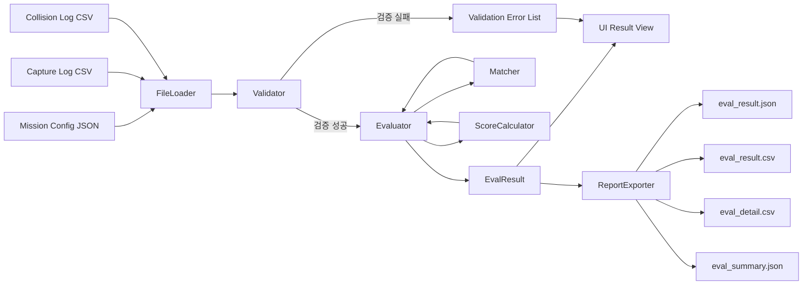
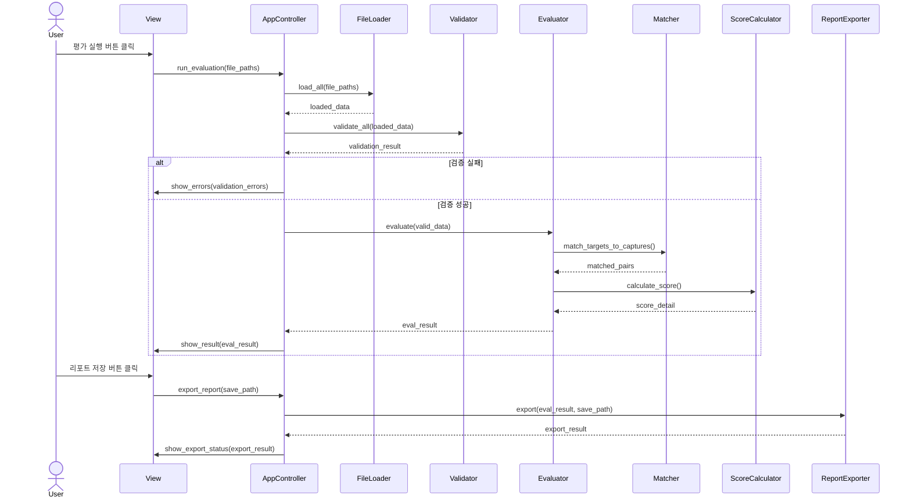
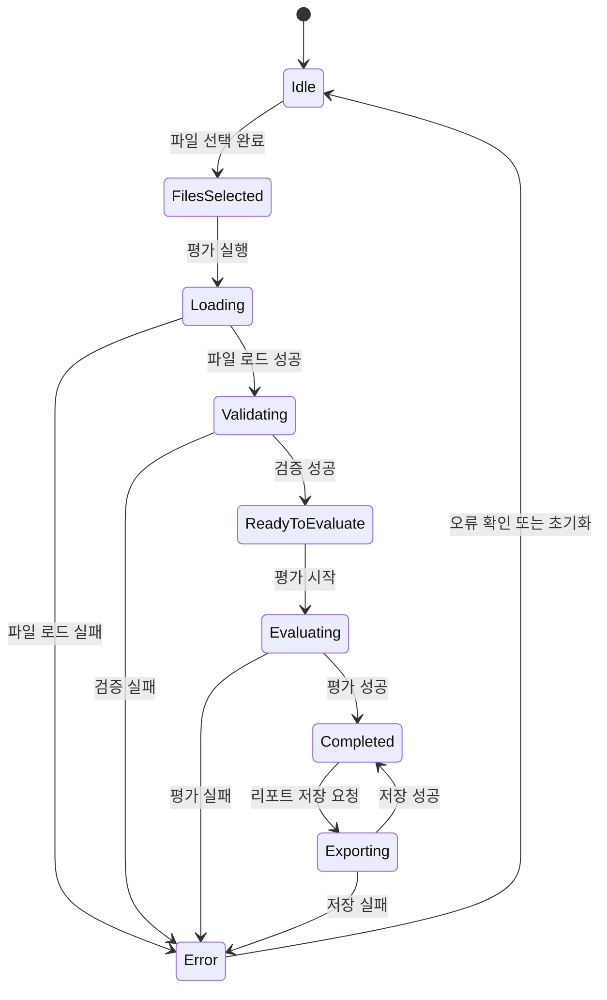
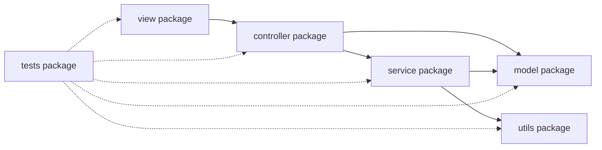
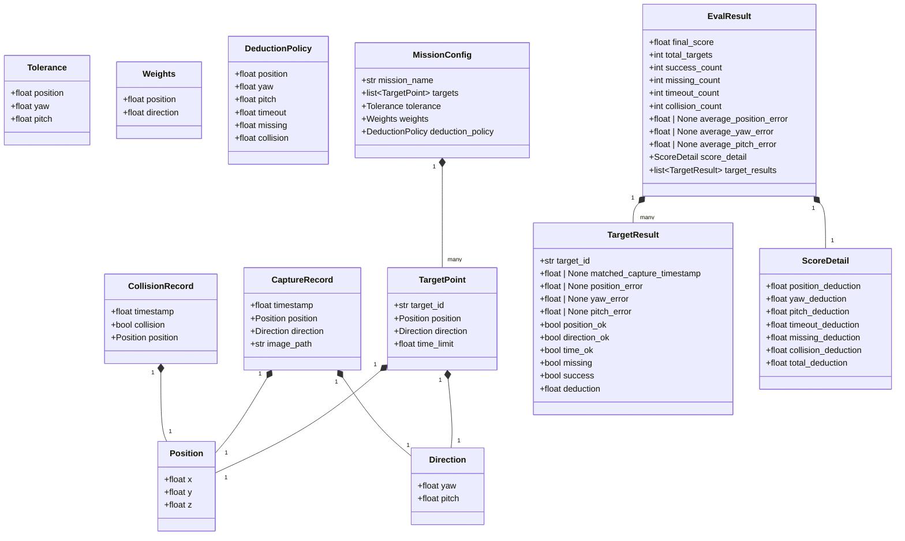

# Software Design Document (SDD)
## 드론 항공촬영 임무 평가 시스템

**버전**: 1.1  
**작성일**: 2026-05-26  
**기반 문서**: 사용자 제공 SDD 초안, `소프트웨어공학_프로젝트.docx (SRS)` 확인 필요

---

## 1. 개요

### 1.1 목적

본 문서는 AirSim 기반 드론 항공촬영 시뮬레이션 결과를 평가하는 교육용 실습 플랫폼의 소프트웨어 설계를 정의한다. 본 문서의 목적은 구현 구조, 데이터 인터페이스, 평가 알고리즘, 예외 처리, UI 동작을 명확히 규정하여 구현자와 검증자가 동일한 기준으로 시스템을 개발하고 시험할 수 있도록 하는 것이다.

### 1.2 범위

본 시스템의 범위는 다음과 같다.

- 입력 파일 로드: 임무 설정 파일, 비행 로그, 촬영 로그, 충돌 로그
- 입력 데이터 검증: 형식, 필수 필드, 값 범위, 이미지 경로
- 목표-촬영 매칭: 목표 지점과 촬영 기록 간 1:1 매칭
- 평가 수행: 위치, 방향, 시간, 누락, 충돌 기준 평가
- 결과 표시: 점수, 상세 결과, 그래프, 이미지 미리보기
- 결과 저장: JSON 및 CSV 형식의 평가 결과 파일 생성
- 확장 기능: 입력 데이터 미리보기, 평가 이력 관리, 시각화 이미지 저장, 애플리케이션 로그 기록

본 시스템의 범위에 포함되지 않는 항목은 다음과 같다.

- AirSim 시뮬레이션 실행 기능
- 드론 제어 기능
- 이미지 품질 분석 기능
- 네트워크 기반 다중 사용자 기능

### 1.3 실행 환경 및 기술 제약

- 구현 언어: Python 3.x
- UI 프레임워크: PyQt5
- 시각화 라이브러리: matplotlib
- 실행 환경: Windows 기반 Desktop PC
- 문자 인코딩: UTF-8
- 좌표계: AirSim NED 좌표계

### 1.4 용어 정의

| 용어 | 정의 |
|------|------|
| 임무 설정 파일 | 목표 촬영 위치, 방향, 제한 시간, 평가 기준을 정의한 JSON 파일 |
| 목표 | 하나의 촬영 평가 단위가 되는 목표 지점 정의 |
| 촬영 기록 | 드론이 촬영한 1건의 로그 레코드 |
| 비행 로그 | 드론의 시간별 위치, 자세, 속도 기록 |
| 충돌 로그 | 충돌 발생 여부와 관련 정보를 저장한 기록 |
| 이미지 폴더 | 촬영 로그의 상대 경로 이미지 파일을 해석하거나 이미지 존재 여부 검증 시 사용하는 기준 디렉토리 |
| 허용 오차 | 목표 만족 판정에 사용하는 최대 허용 위치/방향 오차 |
| 평가 기준 | 허용 오차, 시간 제한, 성공 판정 규칙 등 평가 판단에 사용하는 기준 |
| 감점 기준 | 평가 항목별 감점 계수 및 감점 계산 규칙 |
| 종합 비용 | 목표-촬영 매칭에 사용하는 비용 값 |
| 누락 | 어떤 촬영 기록에도 매칭되지 않은 목표 |
| 시간 초과 | 매칭된 촬영 기록의 촬영 시각이 목표 제한 시간을 초과한 상태 |
| 충돌 수 | `collision == true`로 판정된 충돌 이벤트 레코드의 개수 |
| 충돌 발생 여부 | 충돌 수가 1 이상인지 여부를 나타내는 불리언 요약 값 |
| NED 좌표계 | North-East-Down 좌표계. 단위는 meter |

### 1.5 확인 필요 사항

다음 항목은 현재 제공된 초안만으로 확정할 수 없으므로 SRS 원본 확인 후 확정해야 한다.

- JSON 로그 파일의 최상위 구조가 모든 로그 유형에서 동일한지 여부
- 결과 파일 자동 저장이 필수인지, 사용자 수동 저장만 허용하는지 여부
- 평가 진행률 표시가 실제 단계 기반인지, 레코드 단위 세부 진행률이 필요한지 여부

---

## 2. 시스템 아키텍처

### 2.1 아키텍처 패턴

시스템은 MVC(Model-View-Controller) 패턴을 적용한다.

```text
+----------------+       +------------------+       +----------------+
| View           | <---> | AppController    | <---> | Model          |
| PyQt5 UI       |       | Workflow Control |       | Data Classes   |
+----------------+       +------------------+       +----------------+
                                 |
                 +---------------+------------------------------+
                 |               |              |               |
          +------+-----+  +------+-----+ +------+-----+ +-------+------+
          | FileLoader |  | Validator  | | Evaluator  | | ReportExporter|
          +------------+  +------------+ +------+-----+ +--------------+
                                               |
                  +-----------------------------+---------------------------+
                  |                             |                           |
          +-------+--------+           +--------+--------+          +-------+--------+
          | Matcher        |           | ScoreCalculator |          | HistoryManager |
          +----------------+           +-----------------+          +----------------+
                  |
          +-------+------------------+
          | VisualizationService     |
          +--------------------------+
```

### 2.2 컴포넌트 책임

| 컴포넌트 | 책임 | 입력 | 출력 |
|----------|------|------|------|
| MainWindow | UI 이벤트 수신 및 결과 표시 | 사용자 입력, Controller 응답 | 화면 상태 |
| AppController | 전체 처리 흐름 제어 | UI 요청 | 평가 결과, 오류 정보 |
| FileLoader | CSV/JSON 파일 파싱 | 파일 경로 | 모델 객체 목록 |
| Validator | 구조/값/경로 검증 | 모델 객체, 파일 경로 | 검증 결과, 오류 목록 |
| Evaluator | 매칭과 점수 계산 orchestration | 검증 완료 데이터 | `EvalResult` |
| Matcher | 목표-촬영 최적 1:1 매칭 | 목표 목록, 촬영 목록, 가중치 | 매칭 쌍 |
| ScoreCalculator | 감점 및 최종 점수 계산 | 매칭 결과, 정책 값 | `ScoreDetail`, `final_score` |
| ReportExporter | 결과 저장 | `EvalResult`, 저장 경로 | JSON/CSV 파일 |
| VisualizationService | 그래프 데이터 생성 및 차트 저장 | `EvalResult` | 그래프 객체, 이미지 파일 |
| HistoryManager | 이전 평가 결과 저장/로드/비교 | 평가 결과 파일 | 이력 목록, 비교 결과 |

### 2.3 처리 흐름

1. 사용자가 입력 파일 경로를 선택한다.
2. `AppController`가 파일 존재 여부를 확인한다.
3. `FileLoader`가 각 입력 파일을 파싱하여 모델 객체를 생성한다.
4. `Validator`가 구조 및 값 검증을 수행한다.
5. 검증 실패 시 평가를 중단하고 오류를 UI에 표시한다.
6. 검증 성공 시 `Evaluator`가 매칭, 조건 판정, 점수 계산을 수행한다.
7. `AppController`가 결과를 UI에 전달한다.
8. 사용자가 선택하면 `ReportExporter`가 결과 파일을 저장한다.

### 2.4 모듈 의존성 규칙

- `view` 계층은 `controller`만 호출할 수 있어야 하며 `service`를 직접 호출하지 않아야 한다.
- `controller` 계층은 `service`와 `model`을 호출할 수 있어야 한다.
- `service` 계층은 `model`과 `utils`를 사용할 수 있어야 한다.
- `model` 계층은 다른 계층에 의존하지 않아야 한다.
- `utils` 계층은 공통 보조 기능만 제공하며 상위 계층 상태를 직접 보유하지 않아야 한다.
- 테스트 코드는 각 계층의 공개 인터페이스를 기준으로 작성해야 한다.

---

## 3. 모듈 설계

### 3.1 디렉토리 구조

```text
drone_eval/
├── main.py
├── controller/
│   └── app_controller.py
├── model/
│   ├── mission.py
│   ├── logs.py
│   ├── result.py
│   └── history.py
├── service/
│   ├── file_loader.py
│   ├── validator.py
│   ├── evaluator.py
│   ├── matcher.py
│   ├── score_calculator.py
│   ├── report_exporter.py
│   ├── history_manager.py
│   ├── visualization_service.py
│   └── preview_service.py
├── view/
│   ├── main_window.py
│   ├── tab_file_select.py
│   ├── tab_mission.py
│   ├── tab_run.py
│   ├── tab_summary.py
│   ├── tab_detail.py
│   ├── tab_visual.py
│   ├── tab_report.py
│   ├── tab_preview.py
│   └── tab_history.py
└── utils/
    ├── angle_utils.py
    ├── logger.py
    └── exceptions.py
```

### 3.2 주요 데이터 모델

```python
@dataclass
class TargetPoint:
    target_id: str
    x: float
    y: float
    z: float
    yaw: float
    pitch: float
    time_limit: float

@dataclass
class ScorePolicy:
    position_penalty_per_meter: float
    direction_yaw_penalty_per_degree: float
    direction_pitch_penalty_per_degree: float
    missing_capture_penalty: float
    collision_penalty: float
    timeout_penalty: float
    position_weight: float
    direction_weight: float

@dataclass
class MissionConfig:
    mission_id: str
    allow_position_error: float
    allow_yaw_error: float
    allow_pitch_error: float
    targets: List[TargetPoint]
    score_policy: ScorePolicy

@dataclass
class FlightRecord:
    timestamp: float
    x: float
    y: float
    z: float
    roll: float
    pitch: float
    yaw: float
    speed: float

@dataclass
class CaptureRecord:
    timestamp: float
    x: float
    y: float
    z: float
    roll: float
    pitch: float
    yaw: float
    image_path: str

@dataclass
class CollisionRecord:
    timestamp: float
    collision: bool
    x: float
    y: float
    z: float

@dataclass
class TargetResult:
    target_id: str
    matched_capture: Optional[CaptureRecord]
    matched_capture_timestamp: Optional[float]
    position_error: Optional[float]
    yaw_error: Optional[float]
    pitch_error: Optional[float]
    position_ok: bool
    direction_ok: bool
    time_ok: bool
    image_linked: bool
    is_missing: bool
    is_timeout: bool
    position_deduction: float
    direction_deduction: float
    timeout_deduction: float

@dataclass
class ScoreDetail:
    total_position_deduction: float
    total_direction_deduction: float
    total_missing_deduction: float
    total_collision_deduction: float
    total_timeout_deduction: float
    total_deduction: float
    base_score: float

@dataclass
class EvalResult:
    mission_id: str
    target_results: List[TargetResult]
    collision_records: List[CollisionRecord]
    total_targets: int
    success_count: int
    missing_count: int
    collision_count: int
    timeout_count: int
    avg_position_error: Optional[float]
    avg_yaw_error: Optional[float]
    avg_pitch_error: Optional[float]
    score_detail: ScoreDetail
    final_score: float
```

### 3.3 설계 제약

- `TargetResult.position_error`, `yaw_error`, `pitch_error`는 목표가 누락된 경우 `None`이어야 한다.
- `TargetResult.matched_capture_timestamp`는 매칭된 촬영 기록이 있을 때 해당 `CaptureRecord.timestamp`와 동일해야 하며, 누락된 목표는 `None`이어야 한다.
- 누락된 목표의 `timeout_deduction`은 항상 `0`이어야 한다.
- 평균 오차 값은 매칭된 촬영 기록이 1건 이상일 때만 계산하며, 그렇지 않으면 `None`이어야 한다.
- 평균 오차는 누락되지 않은 목표 중 매칭된 촬영 기록이 있는 목표만을 대상으로 계산해야 한다.
- `success_count`는 누락되지 않은 목표 중 `position_ok`, `direction_ok`, `time_ok`가 모두 `True`인 목표 수여야 한다.
- 점수 관련 필드명은 `score`와 `deduction`을 혼용하지 않고, 감점값은 모두 `deduction`으로 통일한다.
- `TargetPoint.time_limit`은 목표별 제한 시간을 의미하며, 임무 전체 공통 제한 시간을 의미하지 않는다.

---

## 4. 데이터 명세

### 4.1 공통 규칙

- 모든 입력 파일은 UTF-8 인코딩이어야 한다.
- 숫자 필드는 부동소수점으로 파싱 가능해야 한다.
- 필수 필드가 누락된 레코드는 평가에서 제외하고 오류 목록에 기록해야 한다.
- 로그 레코드 순서는 입력 순서를 유지하되, 시간 계산은 각 레코드의 `timestamp` 값으로 수행해야 한다.
- 파일 전체를 읽을 수 없는 형식 오류 또는 파싱 오류는 평가 중단 사유로 처리해야 한다.
- 개별 레코드 단위의 필수 필드 누락, NaN 값, 수치 변환 실패는 해당 레코드만 평가 대상에서 제외해야 한다.

### 4.2 임무 설정 파일

- 형식: JSON 객체
- 필수 최상위 필드:
  - `mission_id`
  - `allow_position_error`
  - `allow_yaw_error`
  - `allow_pitch_error`
  - `targets`
  - `score_policy`

예시:

```json
{
  "mission_id": "mission_001",
  "allow_position_error": 2.0,
  "allow_yaw_error": 10.0,
  "allow_pitch_error": 10.0,
  "targets": [
    {
      "target_id": "T1",
      "x": 10.0,
      "y": 5.0,
      "z": -20.0,
      "yaw": 90.0,
      "pitch": -30.0,
      "time_limit": 60.0
    }
  ],
  "score_policy": {
    "position_penalty_per_meter": 5.0,
    "direction_yaw_penalty_per_degree": 2.0,
    "direction_pitch_penalty_per_degree": 2.0,
    "missing_capture_penalty": 10.0,
    "collision_penalty": 20.0,
    "timeout_penalty": 5.0,
    "position_weight": 1.0,
    "direction_weight": 1.0
  }
}
```

검증 규칙:

- `targets`는 길이 1 이상의 배열이어야 한다.
- `target_id`는 임무 내에서 중복되면 안 된다.
- 허용 오차와 감점 계수는 0 이상이어야 한다.
- `position_weight`와 `direction_weight`는 0보다 커야 한다.

### 4.3 비행 로그

- 형식: CSV 또는 JSON
- CSV 헤더:

```text
timestamp,x,y,z,roll,pitch,yaw,speed
```

- 필수 필드: `timestamp`, `x`, `y`, `z`, `roll`, `pitch`, `yaw`, `speed`

### 4.4 촬영 로그

- 형식: CSV 또는 JSON
- CSV 헤더:

```text
timestamp,x,y,z,roll,pitch,yaw,image_path
```

- 필수 필드: `timestamp`, `x`, `y`, `z`, `roll`, `pitch`, `yaw`, `image_path`
- `roll` 필드는 입력으로는 유지하되 평가 계산에는 사용하지 않는다. 본 시스템은 촬영 방향 평가를 yaw/pitch 기준으로만 수행하며, roll은 표시 및 원본 로그 보존 목적의 보조 정보로 취급한다.

### 4.5 충돌 로그

- 형식: CSV 또는 JSON
- CSV 헤더:

```text
timestamp,collision,x,y,z
```

- 필수 필드: `timestamp`, `collision`, `x`, `y`, `z`
- `collision` 값은 `true/false`, `1/0`, `yes/no`, `y/n` 형식을 허용할 수 있다.
- `collision == true`로 해석된 레코드만 충돌 이벤트로 처리한다.

### 4.6 JSON 로그 형식

CSV 대신 JSON을 사용할 경우, 각 로그 파일은 레코드 객체 배열이어야 한다.

예시:

```json
[
  {
    "timestamp": 1.0,
    "x": 10.1,
    "y": 5.2,
    "z": -20.0,
    "roll": 0.0,
    "pitch": -30.0,
    "yaw": 90.0,
    "image_path": "C:/images/cap001.png"
  }
]
```

---

## 5. 평가 알고리즘 설계

### 5.1 임무 시작 시각

- 임무 시작 시각 `t_start`는 비행 로그의 첫 번째 유효 레코드의 `timestamp`로 정의한다.
- 비행 로그에 유효 레코드가 없으면 평가를 중단하고 오류를 반환해야 한다.

### 5.2 오차 계산

위치 오차:

```text
position_error = sqrt((cx - tx)^2 + (cy - ty)^2 + (cz - tz)^2)
```

방향 오차:

```text
yaw_error   = abs(normalize_angle(capture.yaw   - target.yaw))
pitch_error = abs(normalize_angle(capture.pitch - target.pitch))
```

각도 정규화:

```text
normalize_angle(a) = ((a + 180) % 360) - 180
```

### 5.3 판정 규칙

- `position_ok = position_error <= allow_position_error`
- `direction_ok = (yaw_error <= allow_yaw_error) AND (pitch_error <= allow_pitch_error)`
- `time_ok = (capture.timestamp - t_start) <= target.time_limit`
- `is_timeout = NOT time_ok`
- `image_linked = Path(image_path).is_file()`

성공 판정 규칙:

- `success_count`는 다음 조건을 모두 만족하는 목표 수로 계산한다.
- 목표가 누락되지 않아야 한다.
- `position_ok`가 `True`여야 한다.
- `direction_ok`가 `True`여야 한다.
- `time_ok`가 `True`여야 한다.

### 5.4 목표-촬영 매칭 비용

```text
cost(target_i, capture_j) =
    position_error(i, j) * position_weight
  + yaw_error(i, j)      * direction_weight
  + pitch_error(i, j)    * direction_weight
```

매칭 후보 규칙:

- 비용 행렬에는 모든 유효 촬영 기록을 포함해야 한다.
- `time_ok` 위반 촬영 기록도 매칭 후보에서 사전 제외하지 않는다.
- 허용 위치 오차 또는 허용 방향 오차를 초과한 촬영 기록도 매칭 후보에서 사전 제외하지 않는다.
- 조건 위반 여부는 매칭 후 `position_ok`, `direction_ok`, `time_ok` 판정과 감점 계산으로 처리해야 한다.

### 5.5 감점 규칙

위치 감점:

```text
if position_error > allow_position_error:
    position_deduction =
        (position_error - allow_position_error) * position_penalty_per_meter
else:
    position_deduction = 0
```

방향 감점:

```text
if yaw_error > allow_yaw_error:
    yaw_deduction =
        (yaw_error - allow_yaw_error) * direction_yaw_penalty_per_degree
else:
    yaw_deduction = 0

if pitch_error > allow_pitch_error:
    pitch_deduction =
        (pitch_error - allow_pitch_error) * direction_pitch_penalty_per_degree
else:
    pitch_deduction = 0

direction_deduction = yaw_deduction + pitch_deduction
```

시간 초과 감점:

```text
if is_missing is True:
    timeout_deduction = 0
elif time_ok is False:
    timeout_deduction = timeout_penalty
else:
    timeout_deduction = 0
```

누락 및 충돌 감점:

```text
missing_deduction   = missing_count   * missing_capture_penalty
collision_deduction = collision_count * collision_penalty
```

### 5.6 최종 점수

```text
base_score = 100.0

total_deduction =
    sum(position_deduction for all matched targets)
  + sum(direction_deduction for all matched targets)
  + sum(timeout_deduction for all matched targets)
  + missing_deduction
  + collision_deduction

final_score = max(0.0, base_score - total_deduction)
```

---

## 6. 목표-촬영 매칭 알고리즘

### 6.1 적용 알고리즘

- 구현은 `scipy.optimize.linear_sum_assignment`를 사용한다.
- 매칭은 전역 최적 1:1 매칭이어야 한다.
- 매칭 단계는 비용 최소화만 수행하며, 시간 초과 및 허용 오차 초과 여부는 매칭 이후 평가 단계에서 판정해야 한다.

### 6.2 처리 절차

1. 목표 수를 `N`, 촬영 수를 `M`으로 정의한다.
2. 크기 `N x M` 비용 행렬을 생성한다.
3. `linear_sum_assignment`를 호출한다.
4. 반환된 인덱스를 기준으로 목표와 촬영 기록을 매칭한다.
5. 매칭되지 않은 목표는 누락으로 처리한다.
6. 매칭되지 않은 촬영 기록은 평가 결과에 반영하지 않는다.

### 6.3 경계 조건

- `N > 0`이고 `M = 0`이면 모든 목표를 누락으로 처리한다.
- `N = 0`인 임무 설정 파일은 유효하지 않으며 입력 검증 실패로 처리한다.
- 동일 비용의 복수 해가 있을 수 있다. 이 경우 `linear_sum_assignment`의 반환 결과를 그대로 사용한다.

### 6.4 경계값 설계 표

| 항목 | 입력 조건 | 기대 결과 |
|---|---|---|
| 위치 허용 경계 | `position_error == allow_position_error` | `position_ok = True`, 위치 감점 0 |
| Yaw 허용 경계 | `yaw_error == allow_yaw_error` | `direction_ok` 판정에서 Yaw 조건 만족 |
| Pitch 허용 경계 | `pitch_error == allow_pitch_error` | `direction_ok` 판정에서 Pitch 조건 만족 |
| 시간 허용 경계 | `capture.timestamp - t_start == target.time_limit` | `time_ok = True`, 시간 감점 0 |
| 촬영 0건 | `M = 0` | 모든 목표 누락 처리 |
| 목표 0건 | `N = 0` | 입력 검증 실패 |
| 충돌 0건 | `collision_count = 0` | 충돌 감점 0 |
| 총 감점 100 초과 | `total_deduction > 100` | `final_score = 0` |
| 이미지 경로 없음 | 존재하지 않는 이미지 파일 | `image_linked = False`, 평가 계속 |

---

## 7. UI 설계

### 7.1 화면 구성

시스템은 `QMainWindow`와 `QTabWidget` 기반의 7개 탭으로 구성한다.

| 탭 | 이름 | 목적 |
|----|------|------|
| 1 | 파일 선택 | 입력 파일 경로 지정 및 기본 검증 결과 표시 |
| 2 | 임무 설정 확인 | 목표 목록과 평가 기준 확인 |
| 3 | 평가 실행 | 평가 시작 및 진행 상태 표시 |
| 4 | 결과 요약 | 최종 점수와 주요 집계 결과 표시 |
| 5 | 상세 결과 | 목표별 상세 판정과 이미지 미리보기 표시 |
| 6 | 시각화 | 그래프 기반 분석 결과 표시 |
| 7 | 리포트 저장 | 평가 결과 파일 저장 |

### 7.2 파일 선택 탭

와이어프레임:

```text
[임무 설정 파일]  [경로 표시................................] [찾아보기]
[비행 로그]       [경로 표시................................] [찾아보기]
[촬영 로그]       [경로 표시................................] [찾아보기]
[충돌 로그]       [경로 표시................................] [찾아보기]
[이미지 폴더]     [경로 표시................................] [찾아보기]

[오류 메시지 영역 - 읽기 전용]
```

입력 항목:

- 임무 설정 파일
- 비행 로그
- 촬영 로그
- 충돌 로그
- 이미지 폴더

동작 요구사항:

- 각 입력 항목은 경로 표시 영역과 파일 선택 버튼을 포함해야 한다.
- 필수 입력 누락 시 평가 시작 버튼은 비활성화되어야 한다.
- 오류 메시지 영역은 읽기 전용이어야 한다.
- 이미지 폴더는 촬영 로그의 `image_path`가 상대 경로인 경우 기준 경로로 사용해야 한다.
- 촬영 로그의 `image_path`가 절대 경로인 경우 이미지 폴더를 사용하지 않고 해당 절대 경로를 우선해야 한다.

### 7.3 임무 설정 확인 탭

와이어프레임:

```text
[임무 ID] mission_001
[허용 위치 오차] 2.0 m   [허용 Yaw 오차] 10.0 deg   [허용 Pitch 오차] 10.0 deg
[감점 정책 요약] 위치 5.0/m, Yaw 2.0/deg, Pitch 2.0/deg, 누락 10.0, 충돌 20.0, 시간초과 5.0

[목표 목록 테이블]
| 목표ID | X | Y | Z | Yaw | Pitch | 제한시간 |
| T1     |   |   |   |     |       |          |
```

동작 요구사항:

- 임무 설정 파일 로드 성공 시 목표 목록과 평가 기준 요약을 표시해야 한다.
- 임무 설정 파일 로드 실패 시 테이블을 비우고 오류 메시지를 표시해야 한다.
- 목표 목록은 `target_id` 기준 입력 순서를 유지해야 한다.

### 7.4 평가 실행 탭

와이어프레임:

```text
[평가 시작]

진행 단계
[파일 로드    ] [████████░░] 80%
[입력 검증    ] [████████░░] 80%
[매칭 및 평가 ] [░░░░░░░░░░]  0%
[결과 준비    ] [░░░░░░░░░░]  0%

상태 메시지: 촬영 로그 로드 중...
```

동작 요구사항:

- 사용자가 `평가 시작` 버튼을 누르면 중복 실행이 불가능해야 한다.
- 진행 상태는 최소 다음 4단계를 표시해야 한다.
  - 파일 로드
  - 입력 검증
  - 매칭 및 평가
  - 결과 표시 준비
- 단계 실패 시 현재 단계와 오류 메시지를 표시해야 한다.

### 7.5 결과 요약 탭

와이어프레임:

```text
[최종 점수] 72.5 / 100

[요약 테이블]
| 항목            | 값   |
| 총 목표 수      | 5    |
| 성공 수         | 3    |
| 누락 수         | 1    |
| 충돌 수         | 2    |
| 시간 초과 수    | 1    |
| 총 위치 감점    | 8.0  |
| 총 방향 감점    | 4.5  |
| 총 누락 감점    | 10.0 |
| 총 충돌 감점    | 40.0 |
| 총 시간 감점    | 5.0  |
```

동작 요구사항:

- 최종 점수는 소수점 표시 규칙을 구현 시 1개 기준으로 통일해야 한다.
- 요약 테이블 값은 `EvalResult`와 `ScoreDetail`에서 직접 계산 가능한 값만 표시해야 한다.

### 7.6 상세 결과 탭

와이어프레임:

```text
[목표별 상세 결과 테이블]
| 목표ID | 매칭시각 | 위치오차 | Yaw오차 | Pitch오차 | 위치판정 | 방향판정 | 시간판정 | 누락 | 이미지 |

[선택된 행의 이미지 미리보기]
```

표시 컬럼:

- 목표ID
- 매칭 촬영 시각
- 위치오차
- Yaw오차
- Pitch오차
- 위치 판정
- 방향 판정
- 시간 판정
- 목표별 성공 여부
- 누락 여부
- 이미지 연결 여부

동작 요구사항:

- 사용자가 테이블 행을 선택하면 해당 행의 매칭 이미지 미리보기를 시도해야 한다.
- 이미지가 없거나 열 수 없으면 대체 텍스트를 표시해야 한다.

### 7.7 시각화 탭

표시 차트:

- 목표별 위치 오차 그래프
- 목표별 방향 오차 그래프
- 감점 항목별 합계 그래프
- 성공/누락/충돌/시간 초과 집계 그래프

### 7.8 리포트 저장 탭

와이어프레임:

```text
[저장 폴더] [경로 표시................................] [찾아보기]

[저장할 파일]
[ ] eval_result.json
[ ] eval_result.csv
[ ] eval_detail.csv
[ ] eval_summary.json

[리포트 저장]
[저장 결과 메시지 영역]
```

동작 요구사항:

- 기본 선택 상태와 파일 선택 가능 여부는 SRS 확인 후 확정해야 한다.
- 저장 성공 시 생성된 파일 목록을 표시해야 한다.
- 저장 실패 시 실패 원인과 실패 파일 목록을 표시해야 한다.

---

## 8. 파일 입출력 인터페이스

### 8.1 입력 로드 순서

1. 임무 설정 파일 로드
2. 비행 로그 로드
3. 촬영 로그 로드
4. 충돌 로그 로드
5. 이미지 경로 검증

이미지 경로 검증 규칙:

- `image_path`가 절대 경로이면 해당 경로의 존재 여부를 직접 검증해야 한다.
- `image_path`가 상대 경로이면 사용자가 선택한 이미지 폴더를 기준으로 결합하여 검증해야 한다.
- 이미지 폴더가 없고 `image_path`가 상대 경로인 경우 해당 촬영 기록은 이미지 연결 오류로 처리해야 한다.

### 8.2 출력 파일

출력 파일은 사용자가 지정한 폴더에 저장해야 한다.

필수 출력 파일:

- `eval_result.json`
- `eval_result.csv`
- `eval_detail.csv`
- `eval_summary.json`

출력 파일 용도:

- `eval_result.json`은 구조화된 결과 데이터를 다른 프로그램이나 후속 처리 로직이 읽기 쉽도록 저장하는 용도이다.
- `eval_result.csv`는 동일한 요약 정보를 단일 행 표 형식으로 저장하여 스프레드시트 확인, 과제 제출, 수동 비교에 사용하기 위한 용도이다.
- `eval_detail.csv`는 목표별 상세 판정과 감점 내역을 표 형식으로 확인하기 위한 용도이다.
- `eval_summary.json`은 화면 요약과 동일한 핵심 집계 정보만 별도로 제공하기 위한 용도이다.

### 8.3 출력 JSON 구조

`eval_result.json` 예시:

```json
{
  "mission_id": "mission_001",
  "final_score": 72.5,
  "total_targets": 5,
  "success_count": 3,
  "missing_count": 1,
  "collision_count": 2,
  "timeout_count": 1,
  "score_detail": {
    "total_position_deduction": 8.0,
    "total_direction_deduction": 4.5,
    "total_missing_deduction": 10.0,
    "total_collision_deduction": 40.0,
    "total_timeout_deduction": 5.0,
    "total_deduction": 67.5,
    "base_score": 100.0
  }
}
```

`eval_result.csv` 헤더:

```text
mission_id,final_score,total_targets,success_count,missing_count,collision_count,timeout_count,total_position_deduction,total_direction_deduction,total_missing_deduction,total_collision_deduction,total_timeout_deduction,total_deduction,base_score
```

`eval_result.csv`는 `eval_result.json`의 요약 필드를 단일 행으로 평탄화하여 저장해야 한다.

`eval_detail.csv` 헤더:

```text
target_id,matched_capture_timestamp,position_error,yaw_error,pitch_error,position_ok,direction_ok,time_ok,image_linked,is_missing,is_timeout,position_deduction,direction_deduction,timeout_deduction
```

`matched_capture_timestamp`는 매칭된 촬영 기록의 `timestamp` 값을 저장하며, 매칭되지 않은 목표는 빈 값으로 기록해야 한다.

`eval_summary.json` 예시:

```json
{
  "mission_id": "mission_001",
  "total_targets": 5,
  "success_count": 3,
  "missing_count": 1,
  "collision_count": 2,
  "timeout_count": 1,
  "avg_position_error": 1.8,
  "avg_yaw_error": 6.2,
  "avg_pitch_error": 4.1,
  "final_score": 72.5
}
```

### 8.4 저장 실패 처리

- 저장 경로가 없거나 쓰기 권한이 없으면 저장을 중단하고 오류 메시지를 표시해야 한다.
- 일부 파일 저장에 실패한 경우, 성공/실패 파일 목록을 사용자에게 표시해야 한다.

부분 저장 실패 규칙:

- 파일별 저장은 독립적으로 시도해야 한다.
- 일부 파일 저장이 실패하더라도 이미 저장된 파일은 유지해야 한다.
- 저장 결과는 최소 `성공 파일 목록`, `실패 파일 목록`, `실패 원인 목록`을 포함하여 사용자에게 전달해야 한다.

### 8.5 파일명 및 덮어쓰기 정책

기본 파일명:

- `eval_result.json`
- `eval_result.csv`
- `eval_detail.csv`
- `eval_summary.json`

정책:

- 사용자가 별도 파일명을 지정하지 않으면 기본 파일명을 사용해야 한다.
- 같은 이름의 파일이 이미 존재하는 경우 구현 시 다음 중 하나를 선택해 일관되게 적용해야 한다.
  - 사용자 확인 후 덮어쓰기
  - 덮어쓰지 않고 저장 실패 처리
  - 타임스탬프를 붙여 새 파일명으로 저장
- 한 구현 버전에서는 덮어쓰기 정책을 혼용하지 않아야 한다.
- 저장 결과 메시지에는 최종 저장된 실제 파일명을 표시해야 한다.

---

## 9. 예외 처리 설계

| 예외 상황 | 판정 기준 | 처리 방식 |
|-----------|-----------|-----------|
| 필수 입력 파일 누락 | 필수 경로 미지정 또는 파일 없음 | 평가 시작 불가, 오류 메시지 표시 |
| 임무 설정 파일 형식 오류 | JSON 파싱 실패 또는 필수 필드 누락 | 로드 실패, 평가 중단 |
| 로그 파일 형식 오류 | CSV/JSON 파싱 실패 | 로드 실패, 평가 중단 |
| 필수 필드 누락 | 필수 컬럼 또는 키 미존재 | 해당 레코드 제외, 오류 목록 기록 |
| 숫자 변환 실패 | float 변환 실패, NaN 포함 | 해당 레코드 제외, 오류 목록 기록 |
| 비행 로그 유효 레코드 없음 | `t_start` 계산 불가 | 평가 중단 |
| 촬영 로그 없음 | 유효 촬영 기록 수 0 | 모든 목표 누락 처리 후 평가 계속 |
| 충돌 로그 없음 | 파일 미선택 또는 유효 이벤트 0 | 충돌 0건으로 평가 계속 |
| 이미지 파일 없음 | `image_path` 대상 파일 미존재 | `image_linked=False`, 평가 계속 |
| 한글 경로 포함 | 경로 문자열에 비ASCII 문자 포함 | `pathlib.Path` 기반 처리 |

### 9.1 행 제외와 평가 중단 기준

| 구분 | 조건 | 처리 방식 |
|---|---|---|
| 평가 중단 | 필수 입력 파일 누락 | 평가 시작 자체를 차단한다. |
| 평가 중단 | JSON 파싱 실패, 지원하지 않는 확장자, 파일 접근 실패 | 파일 전체 로드를 실패로 처리하고 평가를 중단한다. |
| 평가 중단 | 비행 로그 유효 레코드 없음 | `t_start` 계산 불가로 평가를 중단한다. |
| 레코드 제외 | 필수 컬럼/키 누락 | 해당 레코드만 오류 목록에 기록하고 제외한다. |
| 레코드 제외 | NaN 값, 숫자 변환 실패 | 해당 레코드만 오류 목록에 기록하고 제외한다. |
| 경고 후 계속 | 이미지 파일 없음 | 평가는 계속하고 `image_linked=False`로 기록한다. |

### 9.2 집계 필드 해석 규칙

- `collision_count`는 충돌 이벤트 레코드 수를 의미한다.
- `충돌 발생 여부`는 `collision_count > 0`인지 여부를 의미한다.
- `success_count`는 목표별 성공 여부가 `True`인 목표 수를 의미한다.
- `timeout_count`는 매칭된 목표 중 `time_ok == False`인 목표 수를 의미한다.

---

## 10. 비기능 요구사항 대응

| 요구사항 | 설계 대응 | 검증 기준 |
|----------|-----------|-----------|
| 성능 | 벡터 연산 및 Hungarian algorithm 사용 | 100MB 이하 입력에서 30초 이내 완료 |
| 신뢰성 | 랜덤 요소 없이 동일 입력에 동일 결과 보장 | 동일 입력 3회 실행 시 결과 동일 |
| 유지보수성 | 기능별 모듈 분리 및 데이터 모델 분리 | 주요 서비스 모듈 독립 단위 테스트 가능 |
| 확장성 | `ScorePolicy` 및 `Evaluator` 확장 구조 사용 | 신규 평가 항목 추가 시 기존 UI 구조 유지 가능 |
| 사용성 | 탭 기반 UI와 한국어 오류 메시지 제공 | 비전문가 사용 시 파일 선택부터 저장까지 단일 흐름 수행 가능 |

---

## 11. 컴포넌트 인터페이스 명세

### 11.1 FileLoader 인터페이스

| 메서드 | 입력 | 반환 | 예외 | 설명 |
|---|---|---|---|---|
| `load_mission_config(path)` | `str \| Path` | `MissionConfig` | `ValueError`, `JSONDecodeError`, `OSError` | 임무 설정 JSON을 읽어 모델 객체로 변환한다. |
| `load_flight_records(path)` | `str \| Path` | `list[FlightRecord]` | `ValueError`, `JSONDecodeError`, `OSError` | 비행 로그 CSV/JSON을 읽어 비행 레코드 목록으로 반환한다. |
| `load_capture_records(path)` | `str \| Path` | `list[CaptureRecord]` | `ValueError`, `JSONDecodeError`, `OSError` | 촬영 로그 CSV/JSON을 읽어 촬영 레코드 목록으로 반환한다. |
| `load_collision_records(path)` | `str \| Path` | `list[CollisionRecord]` | `ValueError`, `JSONDecodeError`, `OSError` | 충돌 로그 CSV/JSON을 읽어 충돌 레코드 목록으로 반환한다. |

입력 제약:

- 파일 확장자는 `.json` 또는 `.csv`여야 한다.
- 인코딩은 UTF-8 기준으로 처리한다.
- `collision` 값은 `true/false`, `1/0`, `yes/no`, `y/n` 형식을 허용할 수 있다.

### 11.2 Validator 인터페이스

| 메서드 | 입력 | 반환 | 설명 |
|---|---|---|---|
| `validate_mission_config(mission)` | `MissionConfig` | `list[str]` | 임무 설정 데이터의 구조 및 값 범위를 검증한다. |
| `validate_flight_records(records)` | `list[FlightRecord]` | `list[str]` | 비행 로그 수치 필드의 NaN 및 값 이상 여부를 검증한다. |
| `validate_capture_records(records)` | `list[CaptureRecord]` | `list[str]` | 촬영 로그 수치 필드, 이미지 경로, NaN 여부를 검증한다. |
| `validate_collision_records(records)` | `list[CollisionRecord]` | `list[str]` | 충돌 로그 수치 필드의 NaN 여부를 검증한다. |

검증 규칙:

- 오류가 없으면 빈 리스트를 반환해야 한다.
- 오류가 있으면 사용자 표시가 가능한 문자열 목록을 반환해야 한다.
- `target_id`는 중복되면 안 된다.
- `position_weight`, `direction_weight`는 0보다 커야 한다.
- 모든 감점 계수는 0 이상이어야 한다.

### 11.3 Matcher 인터페이스

| 메서드 | 입력 | 반환 | 설명 |
|---|---|---|---|
| `match(targets, captures, mission)` | `list[TargetPoint]`, `list[CaptureRecord]`, `MissionConfig` | `dict[int, int]` | 목표 인덱스와 촬영 인덱스 간 최적 1:1 매칭 결과를 반환한다. |
| `calculate_cost(target, capture, mission)` | `TargetPoint`, `CaptureRecord`, `MissionConfig` | `float` | 위치/방향 오차와 가중치를 적용한 종합 비용을 계산한다. |

반환 규칙:

- 키는 목표 인덱스, 값은 촬영 기록 인덱스이다.
- 촬영 수가 목표 수보다 적으면 일부 목표 인덱스는 결과에 포함되지 않을 수 있다.
- 촬영 수가 더 많으면 남는 촬영 기록은 결과에 포함되지 않는다.

### 11.4 ScoreCalculator 인터페이스

| 메서드 | 입력 | 반환 | 설명 |
|---|---|---|---|
| `calculate_position_deduction(position_error, mission)` | `float`, `MissionConfig` | `float` | 위치 초과 오차에 대한 감점을 계산한다. |
| `calculate_direction_deduction(yaw_error, pitch_error, mission)` | `float`, `float`, `MissionConfig` | `float` | Yaw 및 Pitch 초과 오차에 대한 감점을 계산한다. |
| `calculate_timeout_deduction(is_missing, time_ok, mission)` | `bool`, `bool`, `MissionConfig` | `float` | 시간 초과 감점을 계산한다. |
| `summarize(target_results, collision_count, mission)` | `list[TargetResult]`, `int`, `MissionConfig` | `tuple[ScoreDetail, float]` | 총 감점과 최종 점수를 계산한다. |

### 11.5 Evaluator 인터페이스

| 메서드 | 입력 | 반환 | 예외 | 설명 |
|---|---|---|---|---|
| `evaluate(mission, flight_records, capture_records, collision_records)` | `MissionConfig`, `list[FlightRecord]`, `list[CaptureRecord]`, `list[CollisionRecord]` | `EvalResult` | `ValueError` | 전체 평가 흐름을 수행하고 종합 결과를 생성한다. |

처리 규칙:

- `flight_records`가 비어 있으면 평가를 수행할 수 없으므로 예외를 발생시켜야 한다.
- `t_start`는 첫 번째 유효 비행 레코드의 `timestamp`를 기준으로 계산해야 한다.
- `success_count`는 위치, 방향, 시간 조건을 모두 만족한 목표 수여야 한다.
- 평균 오차는 매칭된 목표만을 대상으로 계산해야 한다.

### 11.6 ReportExporter 인터페이스

| 메서드 | 입력 | 반환 | 설명 |
|---|---|---|---|
| `export_eval_result_json(result, path)` | `EvalResult`, `str \| Path` | `None` | 평가 결과 요약 JSON을 저장한다. |
| `export_eval_result_csv(result, path)` | `EvalResult`, `str \| Path` | `None` | 평가 결과 요약 CSV를 저장한다. |
| `export_eval_detail_csv(result, path)` | `EvalResult`, `str \| Path` | `None` | 목표별 상세 결과 CSV를 저장한다. |
| `export_eval_summary_json(result, path)` | `EvalResult`, `str \| Path` | `None` | 화면 요약용 JSON을 저장한다. |

저장 규칙:

- 출력 디렉토리가 존재하지 않거나 쓰기 권한이 없으면 저장 실패를 보고해야 한다.
- `eval_result.csv`는 `eval_result.json`의 요약 데이터를 단일 행으로 평탄화한 구조여야 한다.
- `eval_detail.csv`는 매칭되지 않은 목표의 `matched_capture_timestamp`를 빈 값으로 저장해야 한다.

---

## 12. 시퀀스 설계

### 12.1 파일 로드 시퀀스

```text
사용자
  -> View: 입력 파일 선택
View
  -> AppController: 파일 경로 전달
AppController
  -> FileLoader: mission 파일 로드
FileLoader
  -> AppController: MissionConfig 반환
AppController
  -> FileLoader: flight/capture/collision 로그 로드
FileLoader
  -> AppController: 레코드 목록 반환
AppController
  -> Validator: 입력 검증 요청
Validator
  -> AppController: 오류 목록 반환
AppController
  -> View: 성공 또는 오류 메시지 표시
```

### 12.2 평가 실행 시퀀스

```text
사용자
  -> View: 평가 시작 버튼 클릭
View
  -> AppController: 평가 실행 요청
AppController
  -> View: 진행 상태 "파일 로드"
AppController
  -> Validator: 최종 검증
Validator
  -> AppController: 검증 결과
AppController
  -> View: 진행 상태 "매칭 및 평가"
AppController
  -> Evaluator: 평가 실행
Evaluator
  -> Matcher: 최적 매칭
Matcher
  -> Evaluator: 매칭 결과 반환
Evaluator
  -> ScoreCalculator: 총 감점 및 최종 점수 계산
ScoreCalculator
  -> Evaluator: ScoreDetail, final_score 반환
Evaluator
  -> AppController: EvalResult 반환
AppController
  -> View: 결과 요약/상세/그래프 갱신
```

### 12.3 결과 저장 시퀀스

```text
사용자
  -> View: 저장 버튼 클릭
View
  -> AppController: 저장 요청
AppController
  -> ReportExporter: eval_result.json 저장
  -> ReportExporter: eval_result.csv 저장
  -> ReportExporter: eval_detail.csv 저장
  -> ReportExporter: eval_summary.json 저장
ReportExporter
  -> AppController: 저장 성공 또는 실패 반환
AppController
  -> View: 저장 결과 메시지 표시
```

### 12.4 실패 시퀀스

```text
사용자
  -> View: 평가 시작 버튼 클릭
View
  -> AppController: 평가 실행 요청
AppController
  -> Validator: 입력 검증
Validator
  -> AppController: 오류 목록 반환
AppController
  -> View: 오류 메시지 영역 표시
AppController
  -> View: 평가 중단 상태 표시
```

---

## 13. 오류 코드 및 메시지 설계

### 13.1 오류 코드 체계

| 오류 코드 | 분류 | 의미 | 사용자 메시지 예시 |
|---|---|---|---|
| `E001` | 입력 파일 | 임무 설정 파일 누락 | 임무 설정 파일이 선택되지 않았습니다. |
| `E002` | 입력 파일 | 비행 로그 누락 | 비행 로그 파일이 선택되지 않았습니다. |
| `E003` | 형식 오류 | 임무 설정 JSON 파싱 실패 | 임무 설정 파일 형식이 올바르지 않습니다. |
| `E004` | 형식 오류 | 로그 파일 확장자 미지원 | 지원하지 않는 로그 파일 형식입니다. |
| `E005` | 데이터 검증 | 중복 `target_id` | 목표 ID가 중복되었습니다. |
| `E006` | 데이터 검증 | 가중치 값 오류 | 평가 가중치는 0보다 커야 합니다. |
| `E007` | 데이터 검증 | NaN 값 포함 | 로그 데이터에 NaN 값이 포함되어 있습니다. |
| `E008` | 데이터 검증 | 이미지 파일 누락 | 촬영 이미지 파일을 찾을 수 없습니다. |
| `E009` | 평가 실행 | 유효 비행 로그 없음 | 유효한 비행 로그가 없어 평가를 시작할 수 없습니다. |
| `E010` | 저장 실패 | 출력 경로 쓰기 실패 | 결과 파일을 저장할 수 없습니다. |

### 13.2 오류 메시지 표시 원칙

- 사용자 메시지는 한국어로 표시해야 한다.
- 내부 디버그 메시지는 로그 파일에만 남기고, UI에는 상세 스택 트레이스를 직접 표시하지 않는다.
- 한 번의 평가 실행에서 여러 오류가 발생한 경우, 오류 메시지 영역에 목록 형태로 누적 표시해야 한다.
- 이미지 파일 누락은 치명적 오류가 아니므로 평가를 계속 진행하고 경고로 분류해야 한다.

### 13.3 오류 우선순위

| 우선순위 | 대상 | 처리 방식 |
|---|---|---|
| 높음 | 필수 입력 파일 누락, JSON 파싱 실패, 유효 비행 로그 없음 | 평가 중단 |
| 중간 | 필수 필드 누락, NaN 값, 중복 목표 ID | 해당 레코드 제외 또는 검증 실패 후 평가 중단 |
| 낮음 | 이미지 파일 누락, 일부 파일 저장 실패 | 경고 표시 후 가능한 범위에서 계속 진행 |

---

## 14. 상태 전이 설계

### 14.1 상태 목록

| 상태 ID | 상태명 | 설명 |
|---|---|---|
| `S0` | 초기 상태 | 어떤 입력 파일도 확정되지 않은 상태 |
| `S1` | 파일 선택 완료 | 필수 입력 파일 경로가 모두 지정된 상태 |
| `S2` | 검증 완료 | 입력 데이터 로드 및 검증이 성공한 상태 |
| `S3` | 평가 실행 중 | 매칭, 오차 계산, 감점 계산이 진행 중인 상태 |
| `S4` | 결과 생성 완료 | `EvalResult`가 생성되어 화면에 표시 가능한 상태 |
| `S5` | 저장 완료 | 결과 파일 저장이 완료된 상태 |
| `SE` | 오류 상태 | 로드, 검증, 평가, 저장 중 치명적 오류가 발생한 상태 |

### 14.2 상태 전이 규칙

| 현재 상태 | 이벤트 | 다음 상태 | 설명 |
|---|---|---|---|
| `S0` | 필수 입력 파일 선택 완료 | `S1` | 평가 시작 버튼 활성화 가능 |
| `S1` | 검증 성공 | `S2` | 임무 설정 및 로그 데이터가 유효함 |
| `S1` | 검증 실패 | `SE` | 오류 메시지를 표시하고 진행 중단 |
| `S2` | 평가 시작 | `S3` | 평가 진행률 표시 시작 |
| `S3` | 평가 성공 | `S4` | 결과 요약, 상세 결과, 그래프 표시 가능 |
| `S3` | 평가 실패 | `SE` | 오류 메시지를 표시하고 진행 중단 |
| `S4` | 저장 성공 | `S5` | 저장 결과 메시지 표시 |
| `S4` | 저장 일부 실패 | `S4` | 결과는 유지하고 실패 파일 목록 표시 |
| `SE` | 사용자 수정 후 재검증 | `S1` 또는 `S2` | 오류 원인 수정 후 흐름 재개 |

### 14.3 상태별 허용 동작

| 상태 | 허용 동작 | 비허용 동작 |
|---|---|---|
| `S0` | 파일 선택 | 평가 시작, 결과 저장 |
| `S1` | 파일 재선택, 검증 | 결과 저장 |
| `S2` | 평가 시작, 파일 재선택 | 결과 저장 |
| `S3` | 진행 상태 조회 | 중복 평가 시작 |
| `S4` | 결과 조회, 이미지 미리보기, 결과 저장 | 중복 평가 시작 |
| `S5` | 결과 재저장, 결과 조회 | 없음 |
| `SE` | 오류 확인, 파일 재선택 | 결과 저장 |

---

## 15. UI 탭별 상세 위젯 설계

### 15.1 파일 선택 탭 상세

| 위젯 ID | 위젯 종류 | 역할 | 이벤트 | 비고 |
|---|---|---|---|---|
| `mission_path_edit` | `QLineEdit` | 임무 설정 파일 경로 표시 | 읽기 전용 | 직접 편집 비활성 권장 |
| `mission_browse_btn` | `QPushButton` | 임무 설정 파일 선택 | 클릭 시 파일 다이얼로그 | JSON 필터 적용 |
| `flight_path_edit` | `QLineEdit` | 비행 로그 경로 표시 | 읽기 전용 | |
| `capture_path_edit` | `QLineEdit` | 촬영 로그 경로 표시 | 읽기 전용 | |
| `collision_path_edit` | `QLineEdit` | 충돌 로그 경로 표시 | 읽기 전용 | 선택 입력 가능 |
| `image_dir_edit` | `QLineEdit` | 이미지 폴더 경로 표시 | 읽기 전용 | 상대 경로 검증용 |
| `error_text` | `QTextEdit` | 오류 메시지 목록 표시 | 갱신 전용 | 읽기 전용 |

### 15.2 평가 실행 탭 상세

| 위젯 ID | 위젯 종류 | 역할 | 이벤트 | 비고 |
|---|---|---|---|---|
| `run_button` | `QPushButton` | 평가 시작 | 클릭 시 평가 실행 | 실행 중 비활성화 |
| `load_progress` | `QProgressBar` | 파일 로드 단계 진행률 | 상태 갱신 | |
| `validate_progress` | `QProgressBar` | 입력 검증 단계 진행률 | 상태 갱신 | |
| `evaluate_progress` | `QProgressBar` | 매칭 및 평가 단계 진행률 | 상태 갱신 | |
| `prepare_progress` | `QProgressBar` | 결과 준비 단계 진행률 | 상태 갱신 | |
| `status_label` | `QLabel` | 현재 상태 메시지 표시 | 상태 갱신 | |

### 15.3 상세 결과 탭 상세

| 위젯 ID | 위젯 종류 | 역할 | 이벤트 | 비고 |
|---|---|---|---|---|
| `detail_table` | `QTableWidget` | 목표별 상세 결과 표시 | 행 선택 시 이미지 갱신 | 정렬 기능 선택적 지원 |
| `preview_label` | `QLabel` | 이미지 미리보기 표시 | 선택 결과 반영 | 이미지 없으면 대체 텍스트 표시 |
| `detail_filter_edit` | `QLineEdit` | 목표 ID 필터 | 텍스트 변경 시 테이블 필터 | 선택 확장 기능 |

### 15.4 시각화 탭 상세

| 위젯 ID | 위젯 종류 | 역할 | 이벤트 | 비고 |
|---|---|---|---|---|
| `figure_canvas` | `FigureCanvas` | 그래프 렌더링 | 결과 갱신 시 다시 그림 | 2x2 배치 |
| `save_chart_btn` | `QPushButton` | 차트 이미지 저장 | 클릭 시 PNG 저장 | 확장 기능 |

### 15.5 리포트 저장 탭 상세

| 위젯 ID | 위젯 종류 | 역할 | 이벤트 | 비고 |
|---|---|---|---|---|
| `save_dir_edit` | `QLineEdit` | 저장 폴더 표시 | 읽기 전용 | |
| `save_dir_btn` | `QPushButton` | 저장 폴더 선택 | 클릭 시 폴더 선택 | |
| `save_result_json_chk` | `QCheckBox` | `eval_result.json` 저장 여부 | 체크 상태 조회 | |
| `save_result_csv_chk` | `QCheckBox` | `eval_result.csv` 저장 여부 | 체크 상태 조회 | |
| `save_detail_csv_chk` | `QCheckBox` | `eval_detail.csv` 저장 여부 | 체크 상태 조회 | |
| `save_summary_json_chk` | `QCheckBox` | `eval_summary.json` 저장 여부 | 체크 상태 조회 | |
| `save_btn` | `QPushButton` | 저장 실행 | 클릭 시 파일 저장 | |
| `save_message_label` | `QLabel` | 저장 결과 메시지 표시 | 상태 갱신 | |

---

## 16. 데이터 딕셔너리

### 16.1 MissionConfig 필드 정의

| 필드명 | 타입 | 단위 | Nullable | 설명 | 검증 규칙 |
|---|---|---|---|---|---|
| `mission_id` | `str` | - | 아니오 | 임무 식별자 | 빈 문자열 불가 권장 |
| `allow_position_error` | `float` | meter | 아니오 | 허용 위치 오차 | 0 이상 |
| `allow_yaw_error` | `float` | degree | 아니오 | 허용 Yaw 오차 | 0 이상 |
| `allow_pitch_error` | `float` | degree | 아니오 | 허용 Pitch 오차 | 0 이상 |
| `targets` | `list[TargetPoint]` | - | 아니오 | 목표 목록 | 1건 이상 |
| `score_policy` | `ScorePolicy` | - | 아니오 | 감점 정책 | 필수 |

### 16.2 CaptureRecord 필드 정의

| 필드명 | 타입 | 단위 | Nullable | 설명 | 검증 규칙 |
|---|---|---|---|---|---|
| `timestamp` | `float` | second | 아니오 | 촬영 시각 | NaN 불가 |
| `x` | `float` | meter | 아니오 | NED North 위치 | NaN 불가 |
| `y` | `float` | meter | 아니오 | NED East 위치 | NaN 불가 |
| `z` | `float` | meter | 아니오 | NED Down 위치 | NaN 불가 |
| `roll` | `float` | degree | 아니오 | 카메라 롤 | 평가 계산 미사용 |
| `pitch` | `float` | degree | 아니오 | 카메라 피치 | NaN 불가 |
| `yaw` | `float` | degree | 아니오 | 카메라 요 | NaN 불가 |
| `image_path` | `str` | - | 아니오 | 이미지 파일 경로 | 빈 문자열 불가 |

### 16.3 TargetResult 필드 정의

| 필드명 | 타입 | Nullable | 설명 | 규칙 |
|---|---|---|---|---|
| `matched_capture_timestamp` | `float` | 예 | 매칭된 촬영 시각 | 누락 시 `None` |
| `position_error` | `float` | 예 | 위치 오차 | 누락 시 `None` |
| `yaw_error` | `float` | 예 | Yaw 오차 | 누락 시 `None` |
| `pitch_error` | `float` | 예 | Pitch 오차 | 누락 시 `None` |
| `position_ok` | `bool` | 아니오 | 위치 조건 만족 여부 | 오차 비교 결과 |
| `direction_ok` | `bool` | 아니오 | 방향 조건 만족 여부 | Yaw/Pitch 비교 결과 |
| `time_ok` | `bool` | 아니오 | 시간 조건 만족 여부 | 제한 시간 비교 결과 |
| `image_linked` | `bool` | 아니오 | 이미지 연결 여부 | 경로 검증 결과 |
| `is_missing` | `bool` | 아니오 | 누락 여부 | 매칭 결과 |
| `is_timeout` | `bool` | 아니오 | 시간 초과 여부 | `not time_ok` |

### 16.4 집계 필드 정의

| 필드명 | 타입 | 설명 | 계산 기준 |
|---|---|---|---|
| `success_count` | `int` | 목표별 성공 수 | `position_ok`, `direction_ok`, `time_ok` 모두 `True` |
| `missing_count` | `int` | 누락 목표 수 | `is_missing == True` |
| `collision_count` | `int` | 충돌 이벤트 수 | `collision == True` 레코드 수 |
| `timeout_count` | `int` | 시간 초과 목표 수 | 매칭된 목표 중 `time_ok == False` |

---

## 17. 알고리즘 선택 근거 및 복잡도

### 17.1 매칭 알고리즘 선택 근거

- 목표-촬영 매칭은 전체 조합의 비용 합을 최소화해야 하므로 전역 최적화가 필요하다.
- 단순 탐욕 방식은 초기 선택에 따라 전체 결과가 달라질 수 있어 평가 일관성이 낮아질 수 있다.
- Hungarian algorithm은 직사각 비용 행렬에서도 최적 1:1 매칭을 계산할 수 있어 본 문제 구조에 적합하다.
- `scipy.optimize.linear_sum_assignment`는 구현 안정성과 검증 용이성을 제공한다.

### 17.2 계산 복잡도

| 단계 | 주요 연산 | 복잡도 설명 |
|---|---|---|
| 파일 로드 | CSV/JSON 파싱 | 입력 레코드 수에 선형 비례 |
| 비용 행렬 생성 | 목표 수 `N`, 촬영 수 `M` | 대략 `O(N*M)` |
| 매칭 수행 | Hungarian algorithm | 일반적으로 `O(k^3)`, `k = max(N, M)` |
| 결과 집계 | 목표별 감점 및 집계 계산 | `O(N)` |

### 17.3 대용량 입력 대응 전략

- 형식 오류와 잘못된 레코드를 먼저 제거하여 후속 계산량을 줄인다.
- 비용 행렬 생성과 매칭 계산을 핵심 성능 구간으로 간주하고 별도 측정 가능하게 유지한다.
- 차트 생성과 저장은 평가 완료 후 별도 단계에서 수행하여 핵심 평가 시간을 분리한다.

---

## 18. 예외 처리 시나리오

### 18.1 시나리오 A: 임무 설정 파일 누락

1. 사용자가 비행 로그와 촬영 로그만 선택한다.
2. 시스템은 임무 설정 파일이 없음을 감지한다.
3. `평가 시작` 버튼은 비활성화 상태를 유지한다.
4. 오류 메시지 영역에 누락 원인을 표시한다.

### 18.2 시나리오 B: 촬영 로그 일부 행 손상

1. 촬영 로그 파일은 정상적으로 열리지만 일부 행에 NaN 또는 필수 필드 누락이 존재한다.
2. 해당 행은 오류 목록에 기록된다.
3. 유효한 행만 평가 대상으로 사용한다.
4. 파일 전체 로드는 실패로 처리하지 않는다.

### 18.3 시나리오 C: 이미지 파일 누락

1. 촬영 로그와 매칭은 정상적으로 수행된다.
2. 이미지 파일만 존재하지 않는다.
3. `image_linked=False`로 기록한다.
4. 평가는 계속 진행하며 최종 점수 계산도 수행한다.

### 18.4 시나리오 D: 저장 중 일부 파일 실패

1. `eval_result.json`과 `eval_summary.json` 저장은 성공한다.
2. `eval_detail.csv` 저장 중 쓰기 권한 오류가 발생한다.
3. 성공 파일은 유지한다.
4. 실패 파일 목록과 원인을 사용자에게 표시한다.

---

## 19. 통합 실행 시나리오

### 19.1 정상 실행 예시

1. 사용자가 임무 설정 파일, 비행 로그, 촬영 로그, 충돌 로그, 이미지 폴더를 선택한다.
2. 시스템이 파일 존재 여부와 기본 형식을 확인한다.
3. 시스템이 임무 설정과 로그 레코드를 메모리로 로드한다.
4. 시스템이 NaN, 누락 필드, 가중치 값, 이미지 경로를 검증한다.
5. 사용자가 평가 시작 버튼을 누른다.
6. 시스템이 비용 행렬을 생성하고 목표-촬영 매칭을 수행한다.
7. 시스템이 목표별 오차, 조건 만족 여부, 감점을 계산한다.
8. 시스템이 최종 점수와 요약 정보를 생성한다.
9. 사용자가 결과 요약, 상세 결과, 그래프를 확인한다.
10. 사용자가 리포트 저장을 실행한다.

### 19.2 오류 복구 예시

1. 사용자가 촬영 로그 파일을 잘못 선택한다.
2. 시스템이 형식 오류를 표시한다.
3. 사용자가 파일을 다시 선택한다.
4. 시스템이 검증을 재실행하고 정상 흐름으로 복귀한다.

---

## 20. 로그 설계

### 20.1 로그 기록 대상

- 애플리케이션 시작 및 종료
- 입력 파일 선택 및 경로 변경
- 파일 로드 성공/실패
- 검증 오류 목록
- 평가 시작, 매칭 완료, 결과 생성 완료
- 파일 저장 성공/실패

### 20.2 로그 레벨

| 레벨 | 용도 |
|---|---|
| `INFO` | 정상 처리 흐름 기록 |
| `WARNING` | 이미지 누락, 일부 행 제외 등 경고 상황 기록 |
| `ERROR` | 파일 파싱 실패, 저장 실패, 평가 불가 상태 기록 |
| `DEBUG` | 개발 및 디버깅용 상세 값 기록 |

### 20.3 로그 출력 정책

- 사용자 UI 메시지와 내부 로그 메시지는 분리해야 한다.
- UI에는 요약된 한국어 메시지를 표시한다.
- 로그 파일에는 오류 원인과 내부 예외 세부 정보를 기록할 수 있다.

---

## 21. 성능 및 품질 설계 상세화

### 21.1 성능 설계

- 파일 로드 단계는 입력 형식 판별과 파싱을 분리하여 실패 지점을 빠르게 식별해야 한다.
- 평가 단계는 매칭과 점수 집계를 분리하여 병목을 측정 가능하게 해야 한다.
- 대형 로그 파일에서는 차트 렌더링보다 핵심 점수 계산을 우선 완료해야 한다.

### 21.2 품질 설계

- 동일 입력에 대해 항상 동일한 결과를 생성해야 한다.
- 랜덤 요소를 도입하지 않아야 한다.
- 공개 인터페이스는 자동화 테스트로 검증 가능해야 한다.
- 설계 변경 시 SRS, SDD, STD 간 필드명과 규칙이 일치해야 한다.

---

## 22. 테스트 설계 확장 메모

- 단위 테스트는 `FileLoader`, `Validator`, `Matcher`, `ScoreCalculator`, `Evaluator`, `ReportExporter`를 기준으로 유지한다.
- 통합 테스트는 `AppController`와 주요 UI 이벤트 흐름을 기준으로 추가한다.
- UI 자동화 테스트는 `pytest-qt` 또는 동등한 도구 도입을 고려한다.
- 요구사항-테스트 추적표는 STD의 시험 ID와 자동화 시험 파일 매핑을 기준으로 유지한다.

---

## 23. 향후 확장 시나리오

- Roll 평가 항목 추가
- 다중 드론 로그 입력 지원
- 이미지 품질 평가 또는 객체 검출 기반 평가 추가
- 웹 기반 대시보드 UI 확장
- 평가 결과 HTML 리포트 생성

---

## 24. 구현 규모 확장 계획

본 시스템은 과제 제출용 완성형 프로젝트로 확장할 때 다음 영역을 추가 구현한다.

- PyQt5 UI 실제 구현
- AppController 기반 화면-서비스 연결
- 시각화 서비스 및 차트 PNG 저장
- 입력 데이터 미리보기 탭
- 평가 이력 저장 및 비교 기능
- 애플리케이션 로깅 및 사용자 예외 처리
- 서비스 및 컨트롤러 자동화 테스트 확대

예상 총 줄 수:

- 현재 서비스 및 테스트: 약 1800~2200줄
- UI, 컨트롤러, 시각화, 이력, 로깅, 추가 테스트 확장 후: 약 5000~7300줄

세부 구현 계획은 `docs/IMPLEMENTATION_PLAN.md`를 따른다.

---

## 25. 시험 가능성 기준

본 문서의 모든 핵심 요구사항은 다음 방식으로 시험 가능해야 한다.

- 입력 검증: 정상/오류 샘플 파일로 성공 및 실패 여부 확인
- 매칭 알고리즘: 소규모 고정 데이터셋으로 기대 매칭 결과 비교
- 경계값 조건: 허용 오차와 정확히 같은 입력, 촬영 수 0건, 목표 수 0건, 총 감점 100 초과 조건 확인
- 점수 계산: 수작업 계산값과 프로그램 출력 비교
- UI 동작: 필수 입력 누락, 평가 실행, 결과 표시, 저장 실패 상황 확인
- 예외 처리: 손상 파일, 누락 필드, 이미지 누락, 빈 로그 파일 확인

---

## 26. 문서 일관성 메모

- 본 문서에서는 `감점`의 내부 데이터 표현을 모두 `deduction`으로 통일하였다.
- 초안에 있던 `score_detail.position_score`, `direction_score`, `time_score`는 실제 값이 감점인지 점수인지 모호하므로 제거하고 감점 합계 구조로 정리하였다.
- 출력 예시와 데이터 클래스 간 필드명을 일치시켰다.

---

## 27. 사용자 관점 점검 항목

### 27.1 기본 사용 흐름 점검

사용자는 다음 흐름을 별도 설명 없이 수행할 수 있어야 한다.

1. 임무 설정 파일 선택
2. 비행 로그 선택
3. 촬영 로그 선택
4. 충돌 로그 선택 또는 생략
5. 필요 시 이미지 폴더 선택
6. 임무 설정 확인
7. 평가 시작
8. 결과 요약 확인
9. 상세 결과 및 이미지 확인
10. 결과 저장

점검 기준:

- 각 단계에서 다음 행동이 화면상 명확해야 한다.
- 필수 입력과 선택 입력이 시각적으로 구분되어야 한다.
- 파일 선택이 완료되기 전에는 평가 시작이 불가능해야 한다.
- 저장 가능한 시점이 결과 생성 이후라는 점이 분명해야 한다.

### 27.2 사용자 혼동 가능 지점

| 혼동 지점 | 원인 | 대응 설계 |
|---|---|---|
| 이미지 폴더 선택 이유를 모름 | 촬영 로그에 `image_path`가 이미 존재함 | 상대 경로 이미지 검증에 사용된다는 안내 문구 표시 |
| 충돌 로그가 필수인지 모름 | UI에 파일 선택 항목이 존재함 | 선택 입력임을 라벨 또는 보조 문구로 표시 |
| 감점 방식이 복잡하게 느껴짐 | 내부 계산식이 사용자에게 보이지 않음 | 결과 요약 탭에 항목별 감점 표를 제공 |
| 목표별 성공 기준을 모름 | 위치, 방향, 시간 조건이 분리되어 있음 | 상세 결과 탭에 조건별 판정 컬럼 표시 |

---

## 28. 오류 메시지 UX 설계

### 28.1 사용자 메시지 원칙

- 오류 메시지는 기술 용어보다 사용자 행동 중심으로 작성해야 한다.
- 한 메시지에는 원인과 권장 조치를 함께 포함하는 것이 바람직하다.
- 내부 디버그 문자열을 그대로 UI에 노출하지 않아야 한다.

### 28.2 메시지 예시

| 상황 | 내부 오류 예시 | 사용자 표시 메시지 예시 |
|---|---|---|
| 임무 설정 파일 누락 | `E001 mission file missing` | 임무 설정 파일이 선택되지 않았습니다. 파일을 선택한 뒤 다시 시도하세요. |
| 가중치 값 오류 | `position_weight must be > 0` | 임무 설정 파일의 평가 가중치 값이 올바르지 않습니다. 0보다 큰 값인지 확인하세요. |
| NaN 포함 | `capture record 3: pitch is NaN` | 촬영 로그의 일부 행에 비어 있거나 잘못된 숫자 값이 있습니다. 로그 파일을 확인하세요. |
| 이미지 누락 | `image file not found` | 촬영 이미지 파일을 찾을 수 없습니다. 이미지는 표시되지 않지만 평가는 계속 진행됩니다. |
| 저장 실패 | `permission denied` | 결과 파일을 저장할 수 없습니다. 저장 경로 또는 권한을 확인하세요. |

### 28.3 메시지 표시 방식

- 치명적 오류는 오류 메시지 영역 상단에 강조 표시해야 한다.
- 경고 메시지는 평가 진행을 막지 않되, 시각적으로 구분되어야 한다.
- 여러 오류가 있을 경우 번호 목록 또는 행 목록으로 누적 표시하는 것이 바람직하다.

---

## 29. UI 안내 문구 및 툴팁 설계

### 29.1 파일 선택 화면 안내 문구

| 대상 | 안내 문구 예시 |
|---|---|
| 임무 설정 파일 | 목표 위치, 방향, 제한 시간, 감점 기준이 포함된 JSON 파일을 선택하세요. |
| 비행 로그 | AirSim에서 생성된 비행 로그 CSV 또는 JSON 파일을 선택하세요. |
| 촬영 로그 | 촬영 시각과 이미지 경로가 포함된 촬영 로그를 선택하세요. |
| 충돌 로그 | 충돌 로그가 없는 경우 생략할 수 있습니다. |
| 이미지 폴더 | 촬영 로그의 이미지 경로가 상대 경로일 경우 기준 폴더로 사용됩니다. |

### 29.2 결과 화면 안내 문구

| 대상 | 안내 문구 예시 |
|---|---|
| 결과 요약 탭 | 항목별 감점 내역과 최종 점수를 확인할 수 있습니다. |
| 상세 결과 탭 | 각 목표의 위치, 방향, 시간 조건 만족 여부를 확인할 수 있습니다. |
| 시각화 탭 | 목표별 오차와 감점 분포를 그래프로 확인할 수 있습니다. |
| 리포트 저장 탭 | 저장할 파일 형식을 선택한 뒤 결과를 파일로 저장할 수 있습니다. |

---

## 30. 결과 해석 가이드

### 30.1 최종 점수 해석

- 최종 점수는 100점에서 감점 합계를 차감한 값이다.
- 최종 점수가 높을수록 목표 위치, 방향, 시간 조건을 더 정확히 만족한 것이다.
- 최종 점수가 0에 가까울수록 누락, 충돌, 시간 초과 또는 큰 오차가 많았음을 의미한다.

### 30.2 상세 결과 해석

| 항목 | 해석 |
|---|---|
| `position_ok` | 목표 위치 허용 오차 이내에서 촬영되었는지 여부 |
| `direction_ok` | 목표 방향 허용 오차 이내에서 촬영되었는지 여부 |
| `time_ok` | 해당 목표의 제한 시간 이내에서 촬영되었는지 여부 |
| `is_missing` | 어떤 촬영 기록과도 매칭되지 않은 목표인지 여부 |
| `is_timeout` | 매칭은 되었지만 시간 조건을 만족하지 못한 목표인지 여부 |
| `image_linked` | 결과 화면에서 이미지 파일을 열 수 있는지 여부 |

### 30.3 교육용 피드백 활용

- 위치 오차가 큰 목표는 조종 경로 또는 접근 위치를 재검토해야 한다.
- 방향 오차가 큰 목표는 카메라 자세 제어 또는 촬영 타이밍을 재검토해야 한다.
- 시간 초과가 잦은 경우 비행 경로 최적화가 필요하다.
- 충돌이 발생한 경우 안전한 접근 고도와 경로 계획을 우선 개선해야 한다.

---

## 31. 사용자 도움말 및 복구 흐름

### 31.1 초보자용 도움말 요소

- 파일 형식 예시 버튼 또는 도움말 텍스트
- 지원 확장자 안내
- 상대 경로/절대 경로 설명
- 감점 방식 요약 설명

### 31.2 오류 후 복구 흐름

1. 오류 메시지를 확인한다.
2. 잘못된 파일 또는 경로를 다시 선택한다.
3. 입력 검증을 다시 수행한다.
4. 오류가 해결되면 평가를 재시작한다.

복구 설계 원칙:

- 사용자가 처음부터 모든 파일을 다시 선택할 필요가 없도록 해야 한다.
- 수정된 항목만 다시 선택해도 재검증 가능해야 한다.
- 이전 평가 결과는 새 평가가 완료되기 전까지 유지하는 것이 바람직하다.

## 전체 시스템 Data Flow Diagram

### 31.3 Data Flow Diagram의 목적

이 다이어그램은 임무 설정과 로그 입력이 파일 로드, 검증, 매칭, 점수 계산, 결과 표시, 리포트 저장으로 이어지는 전체 데이터 흐름을 한눈에 보여주기 위한 것이다. 또한 UI가 평가 로직을 직접 수행하지 않고, 평가 결과를 소비하는 역할에 머물러야 한다는 분리 원칙을 명시한다.

### 31.4 Mermaid flowchart



### 31.5 노드 설명

| 노드 | 입력 | 출력 | 역할 |
|---|---|---|---|
| Mission Config JSON | 임무 설정 JSON 파일 | 원본 JSON 텍스트 | 목표, 허용 오차, 가중치, 감점 정책의 원천 데이터이다. |
| Capture Log CSV | 촬영 로그 CSV 파일 | 원본 CSV 레코드 | 촬영 시각, 위치, 방향, 이미지 경로를 제공한다. |
| Collision Log CSV | 충돌 로그 CSV 파일 | 원본 CSV 레코드 | 충돌 발생 여부와 위치 정보를 제공한다. |
| FileLoader | 입력 파일 경로 또는 원본 파일 | 모델 객체 목록 | 파일 내용을 파싱하여 `MissionConfig`, 로그 레코드로 변환한다. |
| Validator | 모델 객체 | Validation Error List 또는 통과 신호 | 필수 필드, 값 범위, 경로, 형식 규칙을 검사한다. |
| Validation Error List | 검증 실패 정보 | UI 표시용 오류 목록 | 검증 실패 사유를 사용자에게 전달한다. |
| Evaluator | 검증 완료 모델 객체 | `EvalResult` 생성 요청 | 전체 평가 흐름을 조율하고 최종 결과를 구성한다. |
| Matcher | 목표 목록, 촬영 목록, 평가 기준 | 매칭 결과 | 목표와 촬영 기록의 1:1 매칭을 계산한다. |
| ScoreCalculator | 매칭 결과, 감점 정책 | 감점 합계와 최종 점수 | 목표별 감점과 총점을 계산한다. |
| EvalResult | 평가 요약과 상세 결과 | UI/저장용 구조화 결과 | 화면 표시와 파일 저장에 공통으로 사용되는 결과 객체이다. |
| UI Result View | `EvalResult`, 오류 목록 | 화면 표시 상태 | 결과 요약, 상세 결과, 오류 메시지를 표시한다. |
| ReportExporter | `EvalResult`, 저장 경로 | 출력 파일 | 결과를 JSON/CSV 파일로 저장한다. |
| eval_result.json | `EvalResult` 요약 | JSON 파일 | 전체 평가 요약을 구조화된 JSON으로 저장한다. |
| eval_result.csv | `EvalResult` 요약 | CSV 파일 | 요약 정보를 단일 행 CSV로 저장한다. |
| eval_detail.csv | 목표별 상세 결과 | CSV 파일 | 목표별 판정과 감점을 행 단위로 저장한다. |
| eval_summary.json | 집계 정보 | JSON 파일 | UI 요약 화면에 필요한 핵심 집계만 저장한다. |

### 31.6 단계별 데이터 흐름

1. 사용자는 임무 설정 JSON, 촬영 로그 CSV, 충돌 로그 CSV를 입력한다.
2. `FileLoader`는 각 파일을 읽고 문서에 정의된 모델 객체로 변환한다.
3. `Validator`는 구조, 필수 필드, 수치 범위, 경로 유효성을 검사한다.
4. 검증이 통과하면 `Evaluator`가 `Matcher`와 `ScoreCalculator`를 호출해 `EvalResult`를 생성한다.
5. `UI Result View`는 `EvalResult`를 받아 화면에 요약과 상세 결과를 표시한다.
6. `ReportExporter`는 동일한 `EvalResult`를 사용해 `eval_result.json`, `eval_result.csv`, `eval_detail.csv`, `eval_summary.json`을 저장한다.

### 31.7 오류 흐름

- `Validator`에서 구조 오류, 필수 필드 누락, 값 범위 위반, 경로 오류가 발생하면 평가를 중단하고 `Validation Error List`만 UI에 전달한다.
- 숫자 변환 실패, NaN 포함, 레코드 단위 필드 누락처럼 개별 레코드에 국한되는 문제는 해당 레코드를 제외하는 방향으로 처리하되, 전체 데이터 로드가 실패하지 않으면 평가를 계속할 수 있다.
- 파일 전체 파싱 실패, 지원하지 않는 형식, 읽기 불가 상태처럼 입력 자체가 무효한 경우에는 평가를 중단한다.
- 이미지 파일 누락은 평가 중단 사유가 아니라 결과 표시 시 경고 정보로만 반영한다.

### 31.8 설계상 분리 원칙

- `FileLoader`는 읽기와 객체 생성만 담당하고, 검증이나 점수 계산을 수행하지 않는다.
- `Validator`는 판정 결과만 반환하고, UI 갱신이나 파일 저장을 직접 수행하지 않는다.
- `Evaluator`는 전체 흐름을 조율하되, 매칭과 점수 계산의 세부 규칙은 `Matcher`와 `ScoreCalculator`로 분리한다.
- `UI Result View`는 결과를 표시만 하고, 평가 알고리즘이나 저장 형식에 의존하지 않는다.
- `ReportExporter`는 출력 파일 생성을 전담하고, 화면 갱신과는 분리된다.

## 평가 실행 Sequence Diagram

### 31.9 Sequence Diagram의 목적

이 시퀀스 다이어그램은 사용자가 평가를 시작한 뒤, 파일 로드와 검증, 평가 실행, 결과 표시, 리포트 저장이 어떤 순서로 호출되는지 보여주기 위한 것이다. 특히 Controller는 흐름을 조율만 하고, 파일 파싱이나 매칭, 점수 계산은 각각의 Service가 담당해야 한다는 책임 분리를 명확히 한다.

### 31.10 Mermaid sequenceDiagram



### 31.11 참여 객체 설명

| 객체 | 입력 | 출력 | 역할 |
|---|---|---|---|
| User | UI 조작 | 버튼 클릭 이벤트 | 평가 실행과 리포트 저장을 요청한다. |
| View | 사용자 이벤트, `EvalResult`, 오류 정보 | Controller 호출, 화면 표시 | 사용자의 요청을 전달하고 결과를 표시한다. |
| AppController | 파일 경로, 검증 결과, 평가 결과 | Service 호출, UI 갱신 요청 | 전체 흐름을 조율하고 상태 전이를 관리한다. |
| FileLoader | 파일 경로 | `loaded_data` | 입력 파일을 읽어 모델 데이터로 변환한다. |
| Validator | `loaded_data` | `validation_result` | 입력 데이터의 구조와 값 유효성을 검사한다. |
| Evaluator | `valid_data` | `eval_result` | 검증 통과 데이터를 기반으로 평가를 수행한다. |
| Matcher | 목표와 촬영 데이터 | `matched_pairs` | 목표와 촬영 기록의 매칭 결과를 계산한다. |
| ScoreCalculator | 매칭 결과와 정책 값 | `score_detail` | 감점과 최종 점수 계산에 필요한 상세 결과를 만든다. |
| ReportExporter | `eval_result`, 저장 경로 | `export_result` | 평가 결과를 파일로 저장한다. |

### 31.12 정상 평가 흐름

1. 사용자가 View에서 평가 실행 버튼을 누른다.
2. View는 `AppController.run_evaluation(file_paths)`를 호출한다.
3. `AppController`는 `FileLoader.load_all(file_paths)`를 호출해 입력 데이터를 읽는다.
4. `FileLoader`는 원본 파일을 파싱해 `loaded_data`를 반환한다.
5. `AppController`는 `Validator.validate_all(loaded_data)`를 호출해 검증을 수행한다.
6. 검증이 성공하면 `AppController`는 `Evaluator.evaluate(valid_data)`를 호출한다.
7. `Evaluator`는 `Matcher.match_targets_to_captures()`와 `ScoreCalculator.calculate_score()`를 순서대로 사용해 `eval_result`를 만든다.
8. `AppController`는 `View.show_result(eval_result)`를 호출해 화면에 결과를 표시한다.

### 31.13 검증 실패 흐름

- `Validator`가 구조 오류, 필수 필드 누락, 값 범위 위반, 파싱 가능하지만 레코드 제외가 필요한 오류를 구분해 반환한다.
- 전체 입력이 무효한 경우에는 검증 실패로 처리하고 `AppController`는 `View.show_errors(validation_errors)`를 호출한다.
- 개별 레코드 단위의 결함처럼 평가 계속이 가능한 경우에는 해당 레코드만 제외하고, 나머지 유효 데이터로 평가를 진행할 수 있다.
- 이때 UI는 경고성 오류 목록을 보여주되, 평가 중단 여부는 `validation_result`의 실패 범위에 따라 결정한다.

### 31.14 평가 실패 흐름

- 검증을 통과했더라도 `Evaluator` 내부에서 유효 비행 기준 미충족, 매칭 불가, 점수 계산 불가능 상태가 발생하면 평가 실패로 처리한다.
- 평가 실패는 입력 검증 실패와 다르며, 전자는 평가 로직 실행 중 발생한 실패이고 후자는 입력 데이터 자체의 유효성 실패이다.
- 평가 실패 시 `AppController`는 가능한 범위의 오류 정보를 `View`에 전달하고, 성공한 경우와 동일하게 이전 결과 화면을 유지하거나 오류 상태를 표시해야 한다.

### 31.15 리포트 저장 흐름

1. 평가는 이미 완료되어 `eval_result`가 존재해야 한다.
2. 사용자가 View에서 리포트 저장 버튼을 누른다.
3. View는 `AppController.export_report(save_path)`를 호출한다.
4. `AppController`는 `ReportExporter.export(eval_result, save_path)`를 호출한다.
5. `ReportExporter`는 결과를 저장하고 `export_result`를 반환한다.
6. `AppController`는 `View.show_export_status(export_result)`를 호출해 저장 성공 또는 실패를 알린다.

### 31.16 Controller와 Service의 책임 분리

- `AppController`는 입력 경로 전달, 실행 순서 제어, 오류와 결과의 UI 전달만 담당한다.
- `AppController`는 파일 파싱, 목표-촬영 매칭, 점수 계산을 직접 수행하지 않는다.
- `FileLoader`, `Validator`, `Evaluator`, `Matcher`, `ScoreCalculator`, `ReportExporter`는 각각의 처리 책임만 수행하고 UI를 직접 호출하지 않는다.
- `View`는 사용자 입력을 Controller로 전달하고 결과만 표시하며, Service 계층의 내부 구현을 알 필요가 없다.
- 리포트 저장은 평가 완료 이후 사용자가 별도로 요청할 때 실행되는 후속 흐름으로 분리한다.

## 평가 상태 전이도

### 31.17 상태 전이도 목적

이 상태 전이도는 파일 선택부터 로드, 검증, 평가, 완료, 저장, 오류 복구까지의 화면 상태 변화를 정의하기 위한 것이다. 사용자가 어떤 시점에 어떤 행동을 할 수 있는지, 그리고 Controller가 어떤 상태값을 기준으로 UI를 제어해야 하는지를 명확히 한다.

### 31.18 Mermaid stateDiagram-v2



### 31.19 상태 목록 설명

| 상태 | 설명 | 허용 사용자 동작 |
|---|---|---|
| Idle | 초기 상태로, 파일 선택 전 또는 오류 복구 후 초기화된 상태이다. | 파일 선택, 초기화 |
| FilesSelected | 필수 입력 파일이 선택되었지만 아직 로드와 검증이 시작되지 않은 상태이다. | 파일 재선택, 평가 실행 |
| Loading | FileLoader가 입력 파일을 읽는 중인 상태이다. | 진행 상태 확인 |
| Validating | Validator가 입력 데이터를 검사하는 중인 상태이다. | 진행 상태 확인 |
| ReadyToEvaluate | 검증이 끝나 평가를 시작할 수 있는 상태이다. | 평가 시작 |
| Evaluating | Matcher와 ScoreCalculator를 포함한 평가가 실행 중인 상태이다. | 진행 상태 확인 |
| Completed | 평가가 끝나 결과가 생성된 상태이다. | 결과 조회, 리포트 저장 |
| Exporting | ReportExporter가 결과 파일을 저장하는 중인 상태이다. | 저장 진행 상태 확인 |
| Error | 복구 가능한 오류가 발생해 사용자 조치가 필요한 상태이다. | 오류 확인, 초기화, 파일 재선택 |

### 31.20 상태 전이 조건

| 현재 상태 | 이벤트 | 다음 상태 | 조건 |
|---|---|---|---|
| Idle | 파일 선택 완료 | FilesSelected | 필수 파일 경로가 모두 지정됨 |
| FilesSelected | 평가 실행 | Loading | 사용자가 평가 실행을 요청함 |
| Loading | 파일 로드 성공 | Validating | 모든 필수 입력이 정상적으로 로드됨 |
| Loading | 파일 로드 실패 | Error | JSON/CSV 파싱 실패, 파일 접근 실패 등 |
| Validating | 검증 성공 | ReadyToEvaluate | 구조와 값 검증을 모두 통과함 |
| Validating | 검증 실패 | Error | 필수 필드 누락, 값 범위 오류, 전체 입력 무효 등 |
| ReadyToEvaluate | 평가 시작 | Evaluating | Controller가 평가 실행을 개시함 |
| Evaluating | 평가 성공 | Completed | EvalResult 생성 완료 |
| Evaluating | 평가 실패 | Error | 매칭 불가, 평가 중 예외, 유효 비행 로그 없음 등 |
| Completed | 리포트 저장 요청 | Exporting | 사용자가 저장을 요청함 |
| Exporting | 저장 성공 | Completed | 결과 파일 저장 완료 |
| Exporting | 저장 실패 | Error | 쓰기 실패, 경로 오류, 권한 문제 등 |
| Error | 오류 확인 또는 초기화 | Idle | 오류를 확인하고 다시 시작함 |

### 31.21 오류 상태 처리

- Error 상태는 프로그램 종료 상태가 아니라 복구 가능한 오류 표시 상태이다.
- 파일 로드 실패, 검증 실패, 평가 실패, 저장 실패가 발생하면 Controller는 원인에 맞는 오류 메시지를 UI에 전달하고 Error 상태로 전환한다.
- 사용자가 오류를 확인하거나 초기화를 수행하면 Idle 상태로 돌아가며, 필요한 파일만 다시 선택해도 흐름을 재개할 수 있다.
- 평가 중 발생한 오류는 결과가 완전히 생성되지 못했음을 의미하므로, Completed와 구분해서 처리해야 한다.

### 31.22 UI 버튼 활성/비활성 기준

- Idle 상태에서는 파일 선택 버튼은 활성화되고, 평가 실행 버튼과 리포트 저장 버튼은 비활성화된다.
- FilesSelected 상태에서는 평가 실행 버튼이 활성화되지만, 평가가 시작되면 파일 선택 버튼은 비활성화되어야 한다.
- Loading, Validating, Evaluating, Exporting 상태에서는 평가 흐름이 진행 중이므로 파일 선택과 리포트 저장 관련 버튼을 제한해야 한다.
- ReadyToEvaluate 상태에서는 평가 실행 버튼이 활성화되고, 리포트 저장 버튼은 아직 비활성화된다.
- Completed 상태에서는 결과 조회와 리포트 저장이 가능하므로, 결과 저장 버튼을 활성화할 수 있다.
- Error 상태에서는 오류 확인과 파일 재선택은 허용하되, 평가 실행과 리포트 저장은 차단해야 한다.

### 31.23 Controller가 관리해야 하는 상태값

- Controller는 현재 워크플로 상태를 단일 상태값으로 관리해 UI 버튼 활성화와 메시지 표시를 제어해야 한다.
- 최소한 `Idle`, `FilesSelected`, `Loading`, `Validating`, `ReadyToEvaluate`, `Evaluating`, `Completed`, `Exporting`, `Error`를 구분해야 한다.
- Controller는 파일 로드 완료 여부, 검증 통과 여부, 평가 결과 생성 여부, 저장 진행 여부를 상태값에 반영해야 한다.
- Controller는 평가 중에 파일 선택과 리포트 저장 요청이 동시에 들어오지 않도록 상태 기반으로 입력을 차단해야 한다.
- Service 계층은 상태값을 직접 보관하거나 UI 상태를 변경하지 않고, 처리 결과만 Controller에 반환해야 한다.

## 모듈 의존성 다이어그램

### 31.24 모듈 의존성 다이어그램의 목적

이 다이어그램은 패키지 간 참조 방향을 고정해 계층 분리를 유지하기 위한 설계 기준을 제시한다. 특히 View는 UI 표시만 담당하고, Controller는 UI와 Service를 중재하며, Service는 평가 로직을 수행하고, Model은 순수 데이터 구조로 유지되어야 한다는 점을 명확히 한다.

### 31.25 Mermaid flowchart 다이어그램



### 31.26 패키지별 책임 설명

| 패키지 | 책임 | 참조 대상 |
|---|---|---|
| view package | 사용자 입력 수집, 화면 표시, 상태 반영 | controller package |
| controller package | UI와 평가 서비스를 중재, 실행 순서 제어, 상태 전달 | service package, model package |
| service package | 파일 로드, 검증, 매칭, 점수 계산, 저장 처리 | model package, utils package |
| model package | 임무, 로그, 결과를 담는 순수 데이터 구조 제공 | 다른 계층에 의존하지 않음 |
| utils package | 각도 계산 등 범용 보조 함수 제공 | 상위 계층에 의존하지 않음 |
| tests package | 공개 인터페이스 기준의 단위/통합 테스트 | 모든 계층 |

### 31.27 허용 의존 관계

| from | to | 허용 이유 |
|---|---|---|
| view package | controller package | UI 이벤트를 Controller로 전달해야 한다. |
| controller package | service package | 평가 실행과 저장 흐름을 위임해야 한다. |
| controller package | model package | 결과와 입력 모델을 다루기 위해 참조가 필요하다. |
| service package | model package | 입력과 결과를 구조화된 데이터로 처리해야 한다. |
| service package | utils package | 각도 계산, 공통 계산 함수를 사용해야 한다. |
| tests package | 모든 계층 | 구현을 검증하기 위한 참조가 허용된다. |

### 31.28 금지 의존 관계

| from | to | 금지 이유 |
|---|---|---|
| model package | view package | 모델은 순수 데이터 구조여야 하며 UI를 알아서는 안 된다. |
| model package | controller package | 모델은 제어 흐름을 포함하지 않아야 한다. |
| model package | service package | 모델은 처리 로직에 의존하지 않아야 한다. |
| utils package | view package | utils는 범용 계산 함수만 제공해야 한다. |
| utils package | controller package | utils는 상태나 UI 흐름을 알면 안 된다. |
| utils package | service package | utils는 상위 계층에 의존하면 안 된다. |
| service package | view package | Service는 UI 위젯을 직접 알면 안 된다. |

### 31.29 순환 참조 방지 원칙

- 계층 간 의존은 단방향으로 유지하고, 상위 계층이 하위 계층을 호출하는 방향만 허용한다.
- `view -> controller -> service -> model/utils`의 흐름을 유지해 역참조를 차단한다.
- `model`과 `utils`는 재사용 가능한 저수준 계층으로 두고, 상위 계층의 상태나 UI 객체를 참조하지 않는다.
- 공통 기능이 필요할 때는 상위 계층으로 끌어올리지 말고 `utils` 또는 `model`의 책임으로 분리한다.

### 31.30 구현 시 import 규칙

- `view`는 `controller`만 직접 import하고, `service`를 직접 import하지 않는다.
- `controller`는 `service`와 `model`을 import할 수 있지만, UI 위젯 모듈은 직접 import하지 않는다.
- `service`는 `model`과 `utils`만 import하고, `view`와 `controller`를 import하지 않는다.
- `model`은 다른 계층을 import하지 않는다.
- `utils`는 공통 계산 함수만 포함하고, 상위 계층 import를 추가하지 않는다.
- `tests`는 검증 목적에 한해 각 계층의 공개 인터페이스를 import할 수 있다.

### 31.31 계층별 변경 영향도

- `view package` 변경은 주로 사용자 경험과 이벤트 전달에 영향을 주며, 계산 로직에는 직접 영향을 주지 않아야 한다.
- `controller package` 변경은 화면 상태 전이와 Service 호출 순서에 영향을 주므로, UI와 Service 경계에서 가장 주의 깊게 검토해야 한다.
- `service package` 변경은 평가 결과와 저장 결과에 직접 영향을 주므로, 결과 형식과 검증 규칙의 회귀 여부를 함께 확인해야 한다.
- `model package` 변경은 데이터 계약을 바꾸는 것이므로, Service와 테스트 전반에 영향이 퍼질 수 있다.
- `utils package` 변경은 수치 계산 결과에 영향을 줄 수 있으므로, 관련 단위 테스트를 우선적으로 재검증해야 한다.
- `tests package` 변경은 실제 실행 로직을 바꾸지 않지만, 설계 기준과 실제 구현이 일치하는지 확인하는 기준점 역할을 한다.

## 데이터 모델 관계도

### 31.32 데이터 모델 관계도의 목적

이 관계도는 입력 모델, 로그 모델, 결과 모델 사이의 포함 관계와 데이터 흐름을 시각화하기 위한 것이다. 특히 모델이 순수 데이터 구조로 유지되어야 하며, 결과 모델은 입력 모델과 분리된 산출물이라는 점을 명확히 한다.

### 31.33 Mermaid classDiagram



### 31.34 주요 데이터 모델 설명

| 모델 | 구분 | 핵심 역할 | 단위/특징 |
|---|---|---|---|
| Position | 입력/로그 공통 | 3차원 좌표를 표현한다. | 좌표 단위는 meter이다. |
| Direction | 입력/로그 공통 | 촬영 방향을 표현한다. | 각도 단위는 degree이다. |
| TargetPoint | 입력 모델 | 목표 위치, 방향, 제한 시간을 정의한다. | 시간 단위는 second이다. |
| Tolerance | 입력 모델 | 위치, yaw, pitch 허용 오차를 담는다. | 각도와 거리 기준을 함께 표현한다. |
| Weights | 입력 모델 | 매칭 비용 계산용 가중치를 담는다. | 위치와 방향 가중치를 구분한다. |
| DeductionPolicy | 입력 모델 | 항목별 감점 기준을 담는다. | 감점 정책은 평가 기준 입력이다. |
| MissionConfig | 입력 모델 | 임무 전체 설정을 묶는다. | 여러 TargetPoint를 포함한다. |
| CaptureRecord | 로그 모델 | 촬영 시각, 위치, 방향, 이미지 경로를 담는다. | 좌표 단위는 meter, 각도 단위는 degree이다. |
| CollisionRecord | 로그 모델 | 충돌 시각, 충돌 여부, 위치를 담는다. | collision은 bool 판정값이다. |
| TargetResult | 결과 모델 | 목표별 평가 결과를 담는다. | 성공, 누락, 시간 판정 포함이다. |
| ScoreDetail | 결과 모델 | 감점 항목별 상세 결과를 담는다. | 최종 점수 계산의 근거이다. |
| EvalResult | 결과 모델 | 전체 평가의 집계 결과를 담는다. | 목표별 결과와 감점 상세를 포함한다. |

### 31.35 모델 간 포함 관계

- `MissionConfig`는 여러 `TargetPoint`를 포함하며, 각 `TargetPoint`는 하나의 `Position`과 하나의 `Direction`을 포함한다.
- `CaptureRecord`는 촬영 시점의 좌표와 방향을 함께 보관하기 위해 `Position`과 `Direction`을 포함한다.
- `CollisionRecord`는 충돌이 발생한 시점의 위치를 나타내기 위해 `Position`을 포함한다.
- `EvalResult`는 여러 `TargetResult`를 포함하고, 감점 집계를 표현하기 위해 `ScoreDetail`을 포함한다.
- `TargetResult`는 평가 후 산출되는 목표별 결과이며, 입력 모델과 결과 모델을 연결하는 중간 산출물이다.

### 31.36 입력 모델과 결과 모델의 분리 원칙

- 입력 모델은 임무 설정과 로그를 표현하고, 결과 모델은 평가 후 산출된 값을 표현한다.
- 입력 모델에는 평가 결과를 저장하지 않으며, 결과 모델에는 원본 입력 파일의 구조를 그대로 복제하지 않는다.
- `MissionConfig`, `CaptureRecord`, `CollisionRecord`는 입력과 기록을 위한 모델이고, `TargetResult`, `ScoreDetail`, `EvalResult`는 평가 산출물을 위한 모델이다.
- 이 분리는 평가 로직과 출력 형식을 분리해 설계 변경 시 영향 범위를 줄이기 위한 것이다.

### 31.37 None 허용 필드 설명

- `TargetResult.position_error`, `yaw_error`, `pitch_error`는 누락 target이면 `None`이 될 수 있다.
- `TargetResult.matched_capture_timestamp`는 매칭 실패 시 `None`이 될 수 있다.
- `EvalResult.average_position_error`, `average_yaw_error`, `average_pitch_error`는 계산 가능한 매칭 결과가 없으면 `None`이 될 수 있다.
- `None` 허용은 값이 없음을 명시하기 위한 것으로, 0과 동일하게 해석하면 안 된다.

### 31.38 bool 판정 필드 설명

- `TargetResult.position_ok`는 위치 오차가 허용 범위 이내이면 `true`이다.
- `TargetResult.direction_ok`는 yaw와 pitch 오차가 모두 허용 범위 이내이면 `true`이다.
- `TargetResult.time_ok`는 제한 시간 이내에 촬영되었으면 `true`이다.
- `TargetResult.missing`은 매칭된 촬영 기록이 없을 때 `true`이다.
- `TargetResult.success`는 `position_ok`, `direction_ok`, `time_ok`가 모두 `true`일 때 `true`이다.
- `CollisionRecord.collision`은 충돌 판정 결과를 나타내는 bool 값이다.

### 31.39 모델 변경 시 영향 범위

- `Position`이나 `Direction` 구조가 바뀌면 입력 모델, 로그 모델, 결과 계산에 연쇄 영향이 생긴다.
- `MissionConfig`의 필드가 바뀌면 파일 로더, 검증기, 매칭 로직, UI 확인 화면에 영향을 준다.
- `TargetResult` 또는 `ScoreDetail`이 바뀌면 결과 요약, 상세 결과, 리포트 저장 형식이 함께 수정되어야 한다.
- `EvalResult`가 바뀌면 화면 표시, 저장 파일, 테스트 기준이 함께 갱신되어야 한다.
- 모델 변경은 상위 서비스와 UI의 직접적인 데이터 계약 변경이므로, 관련 계층을 함께 검토해야 한다.

## 입력 파일 스키마 상세 설계

### 31.40 입력 파일 스키마 상세 설계의 목적

이 섹션은 임무 설정 파일과 로그 파일의 필드, 타입, 단위, 오류 처리 기준을 문서 수준에서 고정하기 위한 것이다. 파일 로더와 검증기가 동일한 해석 기준을 사용하도록 하여, 입력 형식 차이로 인한 해석 오류를 줄인다.

### 31.41 mission_config.json 스키마 표

| 필드명 | 타입 | 필수 여부 | 단위 | 허용 범위 | 기본값 | 오류 처리 | 관련 데이터 모델 |
|---|---|---|---|---|---|---|---|
| mission_name | str | 필수 | - | 빈 문자열 비권장 | 없음 | 누락 또는 비문자열이면 스키마 오류 | MissionConfig |
| targets | list[object] | 필수 | - | 1개 이상 | 없음 | 누락, 비어 있음, 배열 외 타입이면 스키마 오류 | MissionConfig |
| targets[].target_id | str | 필수 | - | 임무 내 중복 불가 | 없음 | 중복 또는 누락이면 검증 오류 | TargetPoint |
| targets[].position.x | float | 필수 | meter | NaN/Infinity 제외 | 없음 | 수치 변환 실패 또는 비정상 값이면 검증 오류 | Position |
| targets[].position.y | float | 필수 | meter | NaN/Infinity 제외 | 없음 | 수치 변환 실패 또는 비정상 값이면 검증 오류 | Position |
| targets[].position.z | float | 필수 | meter | NaN/Infinity 제외 | 없음 | 수치 변환 실패 또는 비정상 값이면 검증 오류 | Position |
| targets[].direction.yaw | float | 필수 | degree | NaN/Infinity 제외 | 없음 | 수치 변환 실패 또는 비정상 값이면 검증 오류 | Direction |
| targets[].direction.pitch | float | 필수 | degree | NaN/Infinity 제외 | 없음 | 수치 변환 실패 또는 비정상 값이면 검증 오류 | Direction |
| targets[].time_limit | float | 필수 | second | 0 이상, NaN/Infinity 제외 | 없음 | 수치 변환 실패 또는 음수면 검증 오류 | TargetPoint |
| tolerance.position | float | 필수 | meter | 0 이상, NaN/Infinity 제외 | 없음 | 수치 변환 실패 또는 음수면 검증 오류 | Tolerance |
| tolerance.yaw | float | 필수 | degree | 0 이상, NaN/Infinity 제외 | 없음 | 수치 변환 실패 또는 음수면 검증 오류 | Tolerance |
| tolerance.pitch | float | 필수 | degree | 0 이상, NaN/Infinity 제외 | 없음 | 수치 변환 실패 또는 음수면 검증 오류 | Tolerance |
| weights.position | float | 필수 | - | 0 초과, NaN/Infinity 제외 | 없음 | 수치 변환 실패 또는 0 이하이면 검증 오류 | Weights |
| weights.direction | float | 필수 | - | 0 초과, NaN/Infinity 제외 | 없음 | 수치 변환 실패 또는 0 이하이면 검증 오류 | Weights |
| deduction_policy.position | float | 필수 | meter당 감점 | 0 이상, NaN/Infinity 제외 | 없음 | 수치 변환 실패 또는 음수면 검증 오류 | DeductionPolicy |
| deduction_policy.yaw | float | 필수 | degree당 감점 | 0 이상, NaN/Infinity 제외 | 없음 | 수치 변환 실패 또는 음수면 검증 오류 | DeductionPolicy |
| deduction_policy.pitch | float | 필수 | degree당 감점 | 0 이상, NaN/Infinity 제외 | 없음 | 수치 변환 실패 또는 음수면 검증 오류 | DeductionPolicy |
| deduction_policy.timeout | float | 필수 | 점수 | 0 이상, NaN/Infinity 제외 | 없음 | 수치 변환 실패 또는 음수면 검증 오류 | DeductionPolicy |
| deduction_policy.missing | float | 필수 | 점수 | 0 이상, NaN/Infinity 제외 | 없음 | 수치 변환 실패 또는 음수면 검증 오류 | DeductionPolicy |
| deduction_policy.collision | float | 필수 | 점수 | 0 이상, NaN/Infinity 제외 | 없음 | 수치 변환 실패 또는 음수면 검증 오류 | DeductionPolicy |

### 31.42 capture_log.csv 스키마 표

| 필드명 | 타입 | 필수 여부 | 단위 | 허용 범위 | 기본값 | 오류 처리 | 관련 데이터 모델 |
|---|---|---|---|---|---|---|---|
| timestamp | float | 필수 | second | 0 이상, NaN/Infinity 제외 | 없음 | 수치 변환 실패 또는 음수면 검증 오류 | CaptureRecord |
| x | float | 필수 | meter | NaN/Infinity 제외 | 없음 | 수치 변환 실패 또는 비정상 값이면 검증 오류 | Position |
| y | float | 필수 | meter | NaN/Infinity 제외 | 없음 | 수치 변환 실패 또는 비정상 값이면 검증 오류 | Position |
| z | float | 필수 | meter | NaN/Infinity 제외 | 없음 | 수치 변환 실패 또는 비정상 값이면 검증 오류 | Position |
| yaw | float | 필수 | degree | NaN/Infinity 제외 | 없음 | 수치 변환 실패 또는 비정상 값이면 검증 오류 | Direction |
| pitch | float | 필수 | degree | NaN/Infinity 제외 | 없음 | 수치 변환 실패 또는 비정상 값이면 검증 오류 | Direction |
| image_path | str | 필수 | - | 문자열이어야 함 | 없음 | 문자열이 아니면 스키마 오류, 존재 여부는 Validator 검증 | CaptureRecord |

### 31.43 collision_log.csv 스키마 표

| 필드명 | 타입 | 필수 여부 | 단위 | 허용 범위 | 기본값 | 오류 처리 | 관련 데이터 모델 |
|---|---|---|---|---|---|---|---|
| timestamp | float | 필수 | second | 0 이상, NaN/Infinity 제외 | 없음 | 수치 변환 실패 또는 음수면 검증 오류 | CollisionRecord |
| collision | bool | 필수 | - | true, false, 1, 0, yes, no | 없음 | 허용 문자열/숫자 외 값이면 스키마 오류 | CollisionRecord |
| x | float | 필수 | meter | NaN/Infinity 제외 | 없음 | 수치 변환 실패 또는 비정상 값이면 검증 오류 | Position |
| y | float | 필수 | meter | NaN/Infinity 제외 | 없음 | 수치 변환 실패 또는 비정상 값이면 검증 오류 | Position |
| z | float | 필수 | meter | NaN/Infinity 제외 | 없음 | 수치 변환 실패 또는 비정상 값이면 검증 오류 | Position |

### 31.44 공통 파일 처리 규칙

- 모든 입력 파일은 UTF-8로 해석한다.
- CSV와 JSON은 파일 전체를 먼저 식별한 뒤 형식에 맞게 파싱한다.
- 숫자 필드는 NaN과 Infinity를 허용하지 않는다.
- timestamp는 0 이상이어야 한다.
- target_id는 임무 내에서 중복되면 안 된다.
- targets는 최소 1개 이상이어야 한다.
- image_path는 문자열이어야 하며 파일 존재 여부는 Validator에서 확인한다.
- collision 값은 대소문자를 구분하지 않고 허용된 문자열이나 숫자만 받아들인다.

### 31.45 CSV 헤더 처리 규칙

- CSV 헤더는 필수이며, 헤더가 없으면 스키마 오류로 처리한다.
- CSV 필드 순서는 고정 위치가 아니라 헤더 이름을 기준으로 해석한다.
- 헤더 이름이 기대 목록과 다르면 로드 단계에서 오류를 반환한다.
- 추가 컬럼이 존재하더라도 필수 컬럼이 모두 있으면 허용할 수 있지만, 필수 컬럼 누락은 허용하지 않는다.

### 31.46 JSON 최상위 구조 처리 규칙

- mission_config.json은 단일 JSON 객체여야 한다.
- 최상위 객체는 mission_name, targets, tolerance, weights, deduction_policy를 포함해야 한다.
- targets는 배열이어야 하며 각 원소는 TargetPoint 구조를 따라야 한다.
- 임의의 중첩 구조나 배열 최상위 형식은 허용하지 않는다.

### 31.47 숫자 필드 처리 규칙

- 모든 숫자 필드는 float로 파싱 가능해야 한다.
- NaN, Infinity, -Infinity는 허용하지 않는다.
- 음수 허용 여부는 필드 의미에 따라 다르며, time_limit과 timestamp는 0 이상이어야 한다.
- 허용 범위를 벗어난 값은 로드 실패와 구분하여 검증 오류로 보고할 수 있다.

### 31.48 경로 필드 처리 규칙

- image_path는 문자열이어야 한다.
- 상대 경로일 수 있으며, 존재 여부는 Validator가 이미지 폴더 기준으로 확인한다.
- 절대 경로일 경우에는 그대로 해석하며, 실제 파일 존재 여부를 별도로 확인한다.
- 경로 문자열 자체가 비어 있거나 문자열이 아니면 스키마 오류로 처리한다.

### 31.49 스키마 오류와 검증 오류의 구분

- 스키마 오류는 파일 구조, 필드명, 타입, 헤더, 최상위 형태가 문서와 맞지 않을 때 발생한다.
- 검증 오류는 구조는 맞지만 값 범위, 중복, 존재 여부, NaN, 파일 존재 여부 같은 세부 규칙 위반일 때 발생한다.
- 스키마 오류는 파일 로드 단계에서 입력 형식 자체가 맞지 않음을 의미한다.
- 검증 오류는 입력을 일부 또는 전부 사용 가능한지 판단하는 단계에서 발생한다.

### 31.50 향후 flight_log.csv 확장 가능성

- flight_log.csv는 이번 구현 범위에 포함하지 않는다.
- 향후 확장 시에는 timestamp, x, y, z, roll, pitch, yaw, speed와 같은 비행 기록 필드를 별도 스키마로 정의할 수 있다.
- 이 확장은 현재 MissionConfig, CaptureRecord, CollisionRecord, TargetResult, EvalResult 구조와 충돌하지 않도록 독립적으로 추가해야 한다.
- 현재 단계에서는 flight_log.csv를 전제하지 않으며, 로드와 검증 규칙도 여기에 맞추지 않는다.

## 오류 처리 매트릭스

### 31.51 오류 처리 매트릭스의 목적

이 매트릭스는 입력 로드, 스키마 해석, 검증, 평가, 저장, UI 제어에서 발생할 수 있는 오류를 같은 기준으로 분류하기 위한 것이다. 오류 등급과 평가 계속 여부를 분리해, 어떤 오류가 즉시 중단 사유인지와 어떤 오류가 부분 제외 후 계속 가능한지를 명확히 한다.

### 31.52 오류 등급 정의

| 등급 | 의미 | 예시 |
|---|---|---|
| Fatal | 평가를 시작하거나 계속할 수 없는 오류 | mission_config.json 파일 없음, JSON 파싱 실패, 잘못된 target 구조 |
| Recoverable | 일부 데이터를 제외하고 평가를 계속할 수 있는 오류 | 잘못된 capture row, 숫자 변환 실패, NaN 포함 row |
| Warning | 평가 결과는 생성 가능하지만 사용자에게 알려야 하는 상태 | image_path 파일 없음, 기존 리포트 파일 덮어쓰기 발생 |
| Info | 처리 결과 안내용 메시지 | 평가 성공, 저장 성공, 일부 촬영 미사용 |

### 31.53 오류 처리 기준 표

| 오류 상황 | 탐지 위치 | 오류 등급 | 처리 방식 | 평가 계속 여부 | UI 메시지 기준 | 관련 테스트 항목 |
|---|---|---|---|---|---|---|
| mission_config.json 파일 없음 | 파일 선택/로드 | Fatal | 평가 시작 차단 | 아니오 | 임무 설정 파일이 없습니다. | 입력 파일 누락 테스트 |
| capture_log.csv 파일 없음 | 파일 선택/로드 | Fatal | 평가 시작 차단 | 아니오 | 촬영 로그 파일이 없습니다. | 입력 파일 누락 테스트 |
| collision_log.csv 파일 없음 | 파일 선택/로드 | Fatal | 필수 입력 누락으로 처리 | 아니오 | 충돌 로그 파일이 없습니다. | 입력 파일 누락 테스트 |
| JSON 파싱 실패 | FileLoader | Fatal | 파일 전체 로드 실패 | 아니오 | 임무 설정 파일 형식이 올바르지 않습니다. | JSON 파싱 실패 테스트 |
| CSV 헤더 누락 | FileLoader | Fatal | 파일 전체 로드 실패 | 아니오 | CSV 헤더가 없습니다. | CSV 헤더 검증 테스트 |
| 필수 필드 누락 | Validator | Recoverable | 해당 row 또는 항목 제외 | 예 | 필수 항목이 누락되었습니다. | 필수 필드 누락 테스트 |
| 숫자 변환 실패 | Validator | Recoverable | 해당 row 제외 | 예 | 숫자 값을 읽을 수 없습니다. | 숫자 변환 실패 테스트 |
| NaN 또는 Infinity 입력 | Validator | Recoverable | 해당 row 제외 | 예 | 비정상 숫자 값이 있습니다. | 비정상 숫자 검증 테스트 |
| 음수 timestamp | Validator | Recoverable | 해당 row 제외 | 예 | 시간 값이 0보다 작습니다. | timestamp 범위 테스트 |
| 중복 target_id | Validator | Fatal | 임무 설정 검증 실패 | 아니오 | 목표 ID가 중복되었습니다. | 중복 target_id 테스트 |
| targets 배열 비어 있음 | FileLoader/Validator | Fatal | 임무 설정 검증 실패 | 아니오 | 목표가 하나 이상 필요합니다. | targets 비어 있음 테스트 |
| image_path 비어 있음 | Validator | Recoverable | 해당 capture row 제외 | 예 | 이미지 경로가 비어 있습니다. | image_path 검증 테스트 |
| image_path 파일 없음 | Validator | Warning | 경고 기록 후 계속 | 예 | 이미지를 찾을 수 없습니다. | 이미지 경로 존재성 테스트 |
| collision 값 해석 불가 | FileLoader | Fatal | row 전체 로드 실패 | 아니오 | 충돌 값 형식이 올바르지 않습니다. | collision 값 파싱 테스트 |
| capture 로그가 비어 있음 | FileLoader/Validator | Warning | 평가는 진행하되 매칭 없음 | 예 | 유효한 촬영 로그가 없습니다. | 빈 capture 로그 테스트 |
| 목표 수보다 촬영 수가 적음 | Evaluator/Matcher | Info | 누락 목표로 집계 | 예 | 일부 목표가 매칭되지 않았습니다. | 목표-촬영 수 불일치 테스트 |
| 목표 수보다 촬영 수가 많음 | Evaluator/Matcher | Info | 일부 촬영 미사용 | 예 | 일부 촬영 기록은 사용되지 않았습니다. | 목표-촬영 수 불일치 테스트 |
| 매칭 가능한 촬영 기록 없음 | Evaluator/Matcher | Fatal | 평가 중단 또는 전 목표 누락 처리 정책 적용 | 아니오 | 매칭 가능한 촬영 기록이 없습니다. | 매칭 실패 테스트 |
| 리포트 저장 경로 없음 | ReportExporter | Fatal | 저장 중단 | 아니오 | 저장 경로를 찾을 수 없습니다. | 저장 경로 오류 테스트 |
| 리포트 저장 권한 없음 | ReportExporter | Fatal | 저장 중단 | 아니오 | 결과를 저장할 권한이 없습니다. | 저장 권한 오류 테스트 |
| 기존 리포트 파일 덮어쓰기 발생 | ReportExporter | Warning | 덮어쓰기 정책에 따라 안내 | 예 | 기존 파일을 덮어씁니다. | 덮어쓰기 정책 테스트 |
| UI 평가 중 중복 실행 요청 | View/Controller | Warning | 중복 실행 차단 | 예 | 평가가 이미 진행 중입니다. | 중복 실행 방지 테스트 |

### 31.54 파일 로드 오류

- 파일 로드 오류는 입력 파일 자체를 열거나 파싱하지 못할 때 발생한다.
- mission_config.json, capture_log.csv, collision_log.csv 누락과 JSON/CSV 파싱 실패는 Fatal로 처리한다.
- collision_log.csv는 현재 설계에서 필수 입력이므로 누락 시 선택 입력으로 완화하지 않는다.

### 31.55 스키마 오류

- 스키마 오류는 헤더 누락, 최상위 구조 불일치, 필드 타입 불일치, 잘못된 target 구조처럼 문서화된 형식과 맞지 않을 때 발생한다.
- 잘못된 target 구조, 중복 target_id, targets 배열 비어 있음은 임무 설정 전체의 신뢰성을 깨므로 Fatal로 처리한다.
- capture row의 일부 누락이나 숫자 변환 실패는 전체 스키마 오류가 아니라 해당 row의 검증 오류로 분리한다.

### 31.56 검증 오류

- 검증 오류는 구조는 맞지만 값 범위, 존재 여부, 비정상 숫자 같은 세부 규칙을 위반할 때 발생한다.
- 잘못된 capture row, NaN 또는 Infinity 입력, 음수 timestamp, image_path 비어 있음은 Recoverable로 처리할 수 있다.
- image_path 파일 없음은 평가는 계속하되 경고로 남긴다.

### 31.57 평가 실행 오류

- 평가 실행 오류는 파일 로드와 검증이 끝난 뒤 Matcher 또는 ScoreCalculator 단계에서 발생한다.
- 매칭 가능한 촬영 기록이 없으면 평가를 중단하거나, 설계상 전 목표 누락 처리 정책이 적용될 수 있다. 현재 설계에서는 중단 가능 오류로 본다.
- UI 평가 중 중복 실행 요청은 기존 평가를 유지하고 새 실행을 차단하는 방식으로 처리한다.

### 31.58 리포트 저장 오류

- 리포트 저장 오류는 평가 결과를 생성한 뒤 파일 시스템에 쓰는 단계에서 발생한다.
- 저장 경로 없음과 저장 권한 없음은 Fatal로 처리하되, 이미 생성된 EvalResult는 폐기하지 않는다.
- 기존 파일 덮어쓰기는 정책에 따라 허용될 수 있으며, 이 경우 Warning으로 사용자에게 안내한다.

### 31.59 UI 표시 메시지 기준

- Fatal 메시지는 사용자가 즉시 수정해야 하는 원인을 짧게 전달한다.
- Recoverable 메시지는 일부 데이터가 제외되었음을 명시한다.
- Warning 메시지는 결과는 유지되지만 주의가 필요함을 알린다.
- Info 메시지는 평가 완료, 저장 완료, 일부 미사용 데이터와 같은 상태 안내에 사용한다.

### 31.60 평가 중단 조건과 평가 계속 가능 조건

- 평가 중단 조건은 mission_config.json 로드 실패, capture_log.csv 로드 실패, collision_log.csv 로드 실패, JSON 파싱 실패, 잘못된 target 구조, 중복 target_id, targets 비어 있음이다.
- 평가 계속 가능 조건은 잘못된 capture row, 숫자 변환 실패, NaN 또는 Infinity 입력 일부 존재, 음수 timestamp 일부 존재, image_path 파일 없음, capture 로그가 비어 있음이다.
- 목표 수보다 촬영 수가 적거나 많은 경우는 오류가 아니라 평가 상황으로 처리한다.
- 평가 계속 가능 조건에서는 유효한 데이터만 사용하고 나머지는 제외한다.

### 31.61 오류 목록 관리 방식

- 오류 목록은 탐지 순서대로 누적하되, 같은 원인의 반복 오류는 필요 시 그룹화할 수 있다.
- Fatal 오류는 평가 흐름을 중단시키는 기준으로 별도 표시한다.
- Recoverable 오류는 제외된 row 또는 항목과 함께 남겨 후속 검토가 가능해야 한다.
- Warning과 Info는 결과 화면과 저장 결과 메시지에 함께 표시할 수 있다.

### 31.62 오류 처리와 테스트 항목의 연결

- 입력 파일 누락과 JSON/CSV 파싱 실패는 파일 로드 테스트로 검증한다.
- 헤더 누락, 필수 필드 누락, 숫자 변환 실패, NaN 또는 Infinity 입력은 스키마/검증 테스트로 검증한다.
- 중복 target_id와 잘못된 target 구조는 임무 설정 검증 테스트로 검증한다.
- image_path 파일 없음과 덮어쓰기 경고는 경로 처리 및 저장 테스트로 검증한다.
- 중복 실행 요청은 UI 상태 전이 테스트로 검증한다.

## 모듈별 Public Method 명세

### 31.63 Public Method 명세의 목적

이 섹션은 각 모듈이 외부에 공개하는 메서드의 입력, 출력, 책임, 오류 전달 방식을 고정해 Controller, Service, View 사이의 호출 계약을 명확히 하기 위한 것이다. Model은 순수 데이터 모델로 유지하고, 파일 파싱과 평가 계산은 Service 계층에서 수행하며, View는 Service를 직접 호출하지 않는다.

### 31.64 FileLoader public method 표

| 메서드명 | 입력 | 출력 | 책임 | 오류 처리 방식 | 호출 주체 | 관련 테스트 |
|---|---|---|---|---|---|---|
| load_mission_config(path) | `str \| Path` | `MissionConfig` | 임무 설정 JSON을 읽어 모델 객체로 변환한다. | 파싱 실패 또는 구조 오류는 로드 실패로 반환한다. | AppController | mission_config 로드 테스트 |
| load_capture_log(path) | `str \| Path` | `list[CaptureRecord]` | 촬영 로그를 읽어 촬영 레코드 목록으로 변환한다. | 행 단위 오류는 검증 대상에서 제외할 수 있도록 반환한다. | AppController | capture_log 로드 테스트 |
| load_collision_log(path) | `str \| Path` | `list[CollisionRecord]` | 충돌 로그를 읽어 충돌 레코드 목록으로 변환한다. | 파싱 실패 또는 형식 오류는 로드 실패로 반환한다. | AppController | collision_log 로드 테스트 |
| load_all(file_paths) | `dict[str, str \| Path]` | `loaded_data` | 입력 파일을 일괄 로드해 이후 검증 가능한 형태로 묶는다. | 개별 파일 실패는 결과 객체에 실패 원인으로 전달한다. | AppController | 전체 입력 로드 테스트 |

### 31.65 Validator public method 표

| 메서드명 | 입력 | 출력 | 책임 | 오류 처리 방식 | 호출 주체 | 관련 테스트 |
|---|---|---|---|---|---|---|
| validate_mission_config(config) | `MissionConfig` | `validation_result` | 임무 설정의 구조, 중복, 값 범위를 검사한다. | Fatal 오류와 검증 오류를 구분해 반환한다. | AppController | mission_config 검증 테스트 |
| validate_capture_records(records) | `list[CaptureRecord]` | `validation_result` | 촬영 레코드의 수치 값, 경로, 필수 필드를 검사한다. | 잘못된 row는 제외하고 오류를 누적한다. | AppController | capture_log 검증 테스트 |
| validate_collision_records(records) | `list[CollisionRecord]` | `validation_result` | 충돌 레코드의 수치 값과 collision 해석을 검사한다. | 잘못된 row는 제외하고 오류를 누적한다. | AppController | collision_log 검증 테스트 |
| validate_all(loaded_data) | `loaded_data` | `validation_result` | 전체 입력의 유효성을 종합 판단한다. | 검증 실패 시 오류 목록과 계속 가능 여부를 함께 반환한다. | AppController | 전체 입력 검증 테스트 |

### 31.66 Matcher public method 표

| 메서드명 | 입력 | 출력 | 책임 | 오류 처리 방식 | 호출 주체 | 관련 테스트 |
|---|---|---|---|---|---|---|
| build_cost_matrix(targets, captures, weights) | `list[TargetPoint]`, `list[CaptureRecord]`, `Weights` | `cost_matrix` | 목표와 촬영 기록 사이의 매칭 비용 행렬을 만든다. | 유효한 입력이 없으면 빈 행렬 또는 매칭 불가 결과를 반환한다. | Evaluator | 비용 행렬 계산 테스트 |
| match_targets_to_captures(targets, captures, weights) | `list[TargetPoint]`, `list[CaptureRecord]`, `Weights` | `matched_pairs` | 전역 최적 1:1 매칭 결과를 계산한다. | 매칭 불가 시 결과 객체에서 실패를 표시한다. | Evaluator | 목표-촬영 매칭 테스트 |

### 31.67 Evaluator public method 표

| 메서드명 | 입력 | 출력 | 책임 | 오류 처리 방식 | 호출 주체 | 관련 테스트 |
|---|---|---|---|---|---|---|
| evaluate(mission_config, capture_records, collision_records) | `MissionConfig`, `list[CaptureRecord]`, `list[CollisionRecord]` | `eval_result` | 전체 평가 흐름을 조율하고 최종 결과를 만든다. | 내부 단계 실패는 결과 객체의 오류 상태로 전달한다. | AppController | 전체 평가 테스트 |
| calculate_target_result(target, capture, mission_config) | `TargetPoint`, `CaptureRecord`, `MissionConfig` | `TargetResult` | 단일 목표의 위치, 방향, 시간 판정을 계산한다. | 매칭 실패 시 None 허용 필드를 포함한 결과를 반환한다. | evaluate() | 목표별 결과 계산 테스트 |
| aggregate_result(target_results, score_detail) | `list[TargetResult]`, `ScoreDetail` | `EvalResult` | 목표별 결과와 감점 상세를 집계한다. | 집계 실패 시 오류가 포함된 결과를 반환한다. | evaluate() | 결과 집계 테스트 |

### 31.68 ScoreCalculator public method 표

| 메서드명 | 입력 | 출력 | 책임 | 오류 처리 방식 | 호출 주체 | 관련 테스트 |
|---|---|---|---|---|---|---|
| calculate_target_deduction(target_result, policy, tolerance) | `TargetResult`, `DeductionPolicy`, `Tolerance` | `float` | 단일 목표의 감점을 계산한다. | 계산 불가 시 0 또는 오류 결과 기준으로 처리한다. | Evaluator | 목표별 감점 테스트 |
| calculate_score_detail(target_results, collision_count, policy, tolerance) | `list[TargetResult]`, `int`, `DeductionPolicy`, `Tolerance` | `ScoreDetail` | 전체 감점 상세를 계산한다. | 누락, 충돌, 시간 초과를 분리해 집계한다. | Evaluator | 감점 상세 계산 테스트 |
| calculate_final_score(score_detail) | `ScoreDetail` | `float` | 최종 점수를 계산한다. | 총 감점이 100을 초과하면 0점으로 제한한다. | Evaluator | 최종 점수 계산 테스트 |

### 31.69 ReportExporter public method 표

| 메서드명 | 입력 | 출력 | 책임 | 오류 처리 방식 | 호출 주체 | 관련 테스트 |
|---|---|---|---|---|---|---|
| export_result_json(eval_result, save_path) | `EvalResult`, `str \| Path` | `export_result` | 평가 결과 JSON을 저장한다. | 저장 실패는 export 결과에 반영한다. | AppController | 결과 JSON 저장 테스트 |
| export_result_csv(eval_result, save_path) | `EvalResult`, `str \| Path` | `export_result` | 평가 결과 요약 CSV를 저장한다. | 저장 실패는 export 결과에 반영한다. | AppController | 결과 CSV 저장 테스트 |
| export_detail_csv(eval_result, save_path) | `EvalResult`, `str \| Path` | `export_result` | 목표별 상세 CSV를 저장한다. | 저장 실패는 export 결과에 반영한다. | AppController | 상세 CSV 저장 테스트 |
| export_summary_json(eval_result, save_path) | `EvalResult`, `str \| Path` | `export_result` | 화면 요약용 JSON을 저장한다. | 저장 실패는 export 결과에 반영한다. | AppController | 요약 JSON 저장 테스트 |
| export_all(eval_result, save_dir) | `EvalResult`, `str \| Path` | `export_result` | 기본 출력 파일을 일괄 저장한다. | 파일별 성공/실패 목록을 포함해 반환한다. | AppController | 전체 리포트 저장 테스트 |

### 31.70 AppController public method 표

| 메서드명 | 입력 | 출력 | 책임 | 오류 처리 방식 | 호출 주체 | 관련 테스트 |
|---|---|---|---|---|---|---|
| set_file_paths(file_paths) | `dict[str, str \| Path]` | `None` | 입력 파일 경로를 저장한다. | 잘못된 경로는 이후 로드 단계에서 처리한다. | View | 파일 경로 설정 테스트 |
| load_inputs() | `None` | `loaded_data` | FileLoader를 통해 입력을 로드한다. | 로드 실패는 상태와 오류 목록으로 전달한다. | View | 입력 로드 오케스트레이션 테스트 |
| validate_inputs() | `None` | `validation_result` | Validator를 통해 입력을 검증한다. | 검증 실패는 UI 표시용 결과로 전달한다. | View | 입력 검증 오케스트레이션 테스트 |
| run_evaluation() | `None` | `eval_result` | 평가 실행을 조율한다. | 평가 실패는 결과 상태로 전달하고 UI에 알린다. | View | 평가 실행 오케스트레이션 테스트 |
| export_report(save_dir) | `str \| Path` | `export_result` | 리포트 저장을 조율한다. | 저장 실패는 결과 객체로 전달한다. | View | 리포트 저장 오케스트레이션 테스트 |
| reset_state() | `None` | `None` | 내부 상태를 초기화한다. | 오류 상태도 복구 가능한 상태로 되돌린다. | View | 상태 초기화 테스트 |

### 31.71 View 계층 호출 메서드 표

| 메서드명 | 입력 | 출력 | 책임 | 오류 처리 방식 | 호출 주체 | 관련 테스트 |
|---|---|---|---|---|---|---|
| show_file_paths(file_paths) | `dict[str, str \| Path]` | `None` | 선택된 파일 경로를 화면에 표시한다. | 표시 실패는 UI 내부 오류로 처리한다. | AppController | 파일 경로 표시 테스트 |
| show_validation_errors(errors) | `list[str]` | `None` | 검증 오류를 사용자에게 보여준다. | 오류 목록을 읽기 전용으로 표시한다. | AppController | 검증 오류 표시 테스트 |
| show_result_summary(eval_result) | `EvalResult` | `None` | 결과 요약을 화면에 표시한다. | 결과 객체가 없으면 표시를 생략한다. | AppController | 결과 요약 표시 테스트 |
| show_target_details(target_results) | `list[TargetResult]` | `None` | 목표별 상세 결과를 화면에 표시한다. | 선택된 항목에 따라 부분 갱신할 수 있다. | AppController | 목표 상세 표시 테스트 |
| show_export_status(export_result) | `export_result` | `None` | 저장 성공/실패 상태를 표시한다. | 파일별 성공/실패 목록을 함께 표시한다. | AppController | 저장 상태 표시 테스트 |
| set_busy(is_busy) | `bool` | `None` | 평가 또는 저장 중 UI 상태를 전환한다. | busy 상태에서는 중복 실행을 차단한다. | AppController | busy 상태 전환 테스트 |

### 31.72 메서드 호출 순서 설명

- View는 사용자 입력을 받아 `AppController`의 진입 메서드를 호출한다.
- `AppController`는 먼저 `load_inputs()`를 통해 FileLoader를 호출하고, 이어서 `validate_inputs()`를 호출한다.
- 검증이 성공하면 `AppController`는 `run_evaluation()`을 통해 평가를 조율하며, 이 과정에서 `Evaluator`가 `Matcher`와 `ScoreCalculator`를 사용한다.
- 평가가 완료되면 `AppController`는 `show_result_summary()`와 `show_target_details()`를 통해 View에 결과를 전달한다.
- 사용자가 저장을 요청하면 `export_report()`가 실행되고, 결과는 `show_export_status()`로 표시된다.

### 31.73 메서드 책임 분리 원칙

- Controller는 직접 파일 파싱, 매칭, 점수 계산을 수행하지 않는다.
- View는 Service를 직접 호출하지 않고, 반드시 Controller를 통해서만 요청을 전달한다.
- Service는 View를 직접 호출하지 않고, 처리 결과를 반환하는 방식으로만 상호작용한다.
- Model은 method 중심 로직을 갖지 않는 순수 데이터 모델로 유지한다.
- 각 메서드는 단일 책임을 유지하고, 입출력과 오류 전달 방식이 문서화된 계약을 따라야 한다.

### 31.74 반환값과 오류 전달 방식

- 오류는 예외를 UI로 직접 던지지 않고 검증 결과 또는 export 결과 객체 형태로 전달한다.
- 로드와 검증 단계의 실패는 `loaded_data`와 `validation_result`에 포함된 상태와 오류 목록으로 전달한다.
- 평가 단계의 실패는 `eval_result`에 포함된 실패 상태와 상세 결과로 전달한다.
- 저장 단계의 실패는 `export_result`에 포함된 성공/실패 파일 목록과 실패 원인으로 전달한다.
- View는 이 결과 객체를 바탕으로 메시지와 화면 상태만 갱신하고, 로직 판정은 수행하지 않는다.

## 알고리즘 상세 설계

### 31.75 알고리즘 상세 설계의 목적

이 섹션은 목표-촬영 매칭, 오차 계산, 판정, 감점, 최종 점수 산출의 계산 규칙을 설계 수준에서 고정하기 위한 것이다. 구현 코드는 아니며, `Matcher`, `Evaluator`, `ScoreCalculator`가 공통적으로 따라야 하는 수식과 절차를 명시한다.

### 31.76 위치 오차 계산 설계

위치 오차는 목표와 촬영 기록의 3차원 좌표 차이를 유클리드 거리로 계산한다.

```text
position_error = sqrt((target.x - capture.x)^2 + (target.y - capture.y)^2 + (target.z - capture.z)^2)
```

좌표 단위는 meter이며, 결과는 0 이상이어야 한다. 위치 오차는 매칭 후 판정과 감점 계산에 사용한다.

### 31.77 yaw 오차 계산 설계

yaw 오차는 각도 정규화 함수를 적용한 뒤 절대값으로 계산한다.

```text
yaw_error = abs(normalize_angle_deg(target_yaw - capture_yaw))
```

각도 단위는 degree이며, 정규화 결과는 `[-180, 180)` 범위를 전제로 한다.

### 31.78 pitch 오차 계산 설계

pitch 오차는 목표와 촬영 기록의 pitch 차이를 절대값으로 계산한다.

```text
pitch_error = abs(target_pitch - capture_pitch)
```

각도 단위는 degree이며, yaw와 달리 별도 정규화 없이 절대 차이만 사용한다.

### 31.79 목표-촬영 비용 함수 설계

목표와 촬영 기록의 비용은 위치 오차와 방향 오차를 가중합한 값이다.

```text
cost = position_error * position_weight + yaw_error * direction_weight + pitch_error * direction_weight
```

비용 함수는 허용 오차를 넘는 여부를 판정하지 않으며, 매칭 우선순위를 정하는 데만 사용한다.

### 31.80 비용 행렬 생성 절차

1. 유효한 목표 목록과 촬영 기록 목록을 준비한다.
2. 각 target과 capture 조합에 대해 position_error, yaw_error, pitch_error를 계산한다.
3. 각 조합의 cost를 계산해 행렬에 저장한다.
4. 허용 위치 오차, 허용 방향 오차, 제한 시간 초과 여부는 행렬 생성에서 배제하지 않는다.
5. 목표 수와 촬영 수가 다르더라도 직사각 행렬을 유지한다.

### 31.81 Hungarian algorithm 기반 1:1 매칭 절차

```text
입력: targets, captures, weights
출력: matched_pairs

1. cost_matrix를 생성한다.
2. Hungarian algorithm으로 cost 합이 최소가 되는 1:1 대응을 구한다.
3. 반환된 대응을 target 인덱스와 capture 인덱스의 쌍으로 변환한다.
4. 매칭되지 않은 target은 missing으로 처리할 후보가 된다.
5. 매칭되지 않은 capture는 unused로 남기며 감점 대상이 아니다.
```

허용 위치 오차를 초과해도 매칭 후보에서 제외하지 않으며, 허용 방향 오차를 초과해도 매칭 후보에서 제외하지 않는다. 제한 시간을 초과해도 매칭 후보에서 제외하지 않고, 이 조건들은 모두 매칭 후 판정한다.

### 31.82 매칭 후 판정 절차

- `position_ok`는 `position_error <= tolerance.position`일 때 `true`이다.
- `yaw_ok`는 `yaw_error <= tolerance.yaw`일 때 `true`이다.
- `pitch_ok`는 `pitch_error <= tolerance.pitch`일 때 `true`이다.
- `direction_ok`는 `yaw_ok and pitch_ok`이다.
- `time_ok`는 `capture.timestamp <= target.time_limit`일 때 `true`이다.
- `success`는 `position_ok and direction_ok and time_ok`이다.

### 31.83 target 누락 처리 절차

- 매칭된 capture가 없는 target은 missing으로 표시한다.
- missing target의 `position_error`, `yaw_error`, `pitch_error`, `matched_capture_timestamp`는 `None`이다.
- missing target의 `success`는 `false`이다.
- missing target의 `timeout_deduction`은 `0`이다.
- 목표 수보다 촬영 수가 적으면 일부 target은 missing 처리된다.

### 31.84 충돌 집계 절차

- collision_count는 `collision == true`로 해석된 충돌 레코드의 개수로 계산한다.
- 충돌 로그는 평가 전 집계에 사용되며, 매칭 결과와 별도로 관리한다.
- collision_count는 감점 계산에서만 사용하고, 매칭 후보 선택에는 사용하지 않는다.

### 31.85 감점 계산 절차

```text
position_deduction = max(0, position_error - tolerance.position) * deduction_policy.position
yaw_deduction = max(0, yaw_error - tolerance.yaw) * deduction_policy.yaw
pitch_deduction = max(0, pitch_error - tolerance.pitch) * deduction_policy.pitch

if time_ok is false and missing is false:
  timeout_deduction = deduction_policy.timeout
else:
  timeout_deduction = 0

if missing is true:
  missing_deduction = deduction_policy.missing
else:
  missing_deduction = 0

collision_deduction = collision_count * deduction_policy.collision

total_deduction = position_deduction + yaw_deduction + pitch_deduction + timeout_deduction + missing_deduction + collision_deduction
```

목표 수보다 촬영 수가 많으면 unused capture가 남을 수 있으나, unused capture는 감점 대상이 아니다.

### 31.86 최종 점수 계산 절차

```text
final_score = max(0, 100 - total_deduction)
```

최종 점수는 0 미만으로 내려가지 않으며, total_deduction가 100을 넘으면 0점으로 제한한다.

### 31.87 평균 오차 계산 절차

- 평균 오차는 missing이 아닌 target 중 매칭된 capture가 있는 항목만 대상으로 계산한다.
- 평균 position_error는 유효한 position_error의 산술평균이다.
- 평균 yaw_error는 유효한 yaw_error의 산술평균이다.
- 평균 pitch_error는 유효한 pitch_error의 산술평균이다.
- 계산 가능한 항목이 없으면 평균값은 `None`이다.

### 31.88 알고리즘 경계 조건

- 대상 capture가 0건이면 모든 target은 missing으로 처리한다.
- target이 0건인 입력은 스키마 검증 실패로 본다.
- 위치 오차가 허용 경계와 정확히 같으면 `position_ok`는 `true`이다.
- yaw 오차와 pitch 오차가 허용 경계와 정확히 같으면 방향 판정은 통과한다.
- 제한 시간 경계와 정확히 같으면 `time_ok`는 `true`이다.
- missing target에는 시간 초과 감점을 적용하지 않는다.
- unused capture는 결과 집계에 포함하지 않는다.

### 31.89 알고리즘 관련 테스트 기준

- `tests/test_angle_utils.py`는 각도 정규화와 yaw/pitch 오차 계산을 검증한다.
- `tests/test_matcher.py`는 비용 행렬 생성과 Hungarian 기반 1:1 매칭을 검증한다.
- `tests/test_evaluator.py`는 매칭 후 판정, missing 처리, 평균 오차 집계를 검증한다.
- `tests/test_score_calculator.py`는 감점 계산, total_deduction, final_score 계산을 검증한다.
- 경계값 테스트는 허용 오차와 제한 시간이 정확히 같은 입력을 포함해야 한다.
- 매칭 불일치 테스트는 목표 수와 촬영 수가 다른 경우의 missing과 unused capture 처리를 확인해야 한다.

## 리포트 저장 상세 설계

### 31.90 리포트 저장 상세 설계의 목적

이 섹션은 평가 결과를 JSON과 CSV로 일관되게 저장하기 위한 출력 구조, 직렬화 규칙, 파일명 규칙, 저장 실패 처리 기준을 정의한다. `ReportExporter`는 저장만 담당하고 UI는 결과 메시지 표시만 담당해야 하며, 저장 실패가 발생해도 평가 결과 자체는 유지되어야 한다.

### 31.91 출력 파일 목록 표

| 파일명 | 목적 | 형식 | 대상 데이터 |
|---|---|---|---|
| eval_result.json | 전체 평가 결과의 구조화 저장 | JSON | 요약 + 상세 결과 |
| eval_summary.json | 화면 요약용 핵심 집계 저장 | JSON | 최종 점수와 집계값 |
| eval_result.csv | 전체 평가 요약의 단일 행 저장 | CSV | 요약 데이터 |
| eval_detail.csv | 목표별 상세 결과의 행 단위 저장 | CSV | target별 상세 데이터 |

### 31.92 eval_result.json 상세 구조

`eval_result.json`에는 다음 정보를 포함한다.

- `final_score`
- `total_targets`
- `success_count`
- `missing_count`
- `timeout_count`
- `collision_count`
- `average_position_error`
- `average_yaw_error`
- `average_pitch_error`
- `score_detail`
- `target_results`

구조 설명:

- `score_detail`은 감점 항목별 합계를 담는 객체이다.
- `target_results`는 목표별 상세 결과 배열이다.
- 각 값은 데이터 모델과 동일한 이름을 유지한다.

### 31.93 eval_summary.json 상세 구조

`eval_summary.json`에는 다음 정보를 포함한다.

- `final_score`
- `total_targets`
- `success_count`
- `missing_count`
- `timeout_count`
- `collision_count`
- `total_deduction`

구조 설명:

- `eval_summary.json`은 화면 요약과 리포트 검토를 위한 핵심 집계만 포함한다.
- 상세 target 정보는 포함하지 않는다.
- `total_deduction`은 `ScoreDetail`의 총 감점값과 일치해야 한다.

### 31.94 eval_result.csv 컬럼 설계

`eval_result.csv`는 전체 평가 요약 단일 행 파일로 설계한다.

| 컬럼명 | 의미 |
|---|---|
| final_score | 최종 점수 |
| total_targets | 전체 목표 수 |
| success_count | 성공 목표 수 |
| missing_count | 누락 목표 수 |
| timeout_count | 시간 초과 목표 수 |
| collision_count | 충돌 수 |
| average_position_error | 평균 위치 오차 |
| average_yaw_error | 평균 yaw 오차 |
| average_pitch_error | 평균 pitch 오차 |
| total_deduction | 총 감점 |

### 31.95 eval_detail.csv 컬럼 설계

`eval_detail.csv`는 target별 상세 결과 파일로 설계한다.

| 컬럼명 | 의미 |
|---|---|
| target_id | 목표 ID |
| matched_capture_timestamp | 매칭된 촬영 시각 |
| position_error | 위치 오차 |
| yaw_error | yaw 오차 |
| pitch_error | pitch 오차 |
| position_ok | 위치 판정 |
| direction_ok | 방향 판정 |
| time_ok | 시간 판정 |
| missing | 누락 여부 |
| success | 성공 여부 |
| deduction | 목표별 감점 |

`eval_result.csv`는 평가 전체의 요약을 위한 파일이고, `eval_detail.csv`는 target별 상세 판정과 감점을 확인하기 위한 파일이다. 두 파일의 목적은 서로 다르며, 같은 정보를 중복 저장하지 않도록 구분한다.

### 31.96 JSON 직렬화 규칙

- 모든 JSON 파일은 UTF-8로 저장한다.
- JSON은 사람이 읽을 수 있도록 indentation을 적용한다.
- 필드명은 데이터 모델과 동일하게 유지한다.
- `None` 값은 JSON에서 `null`로 저장한다.
- `bool` 값은 JSON에서 `true/false`로 저장한다.

### 31.97 CSV 저장 규칙

- 모든 CSV 파일은 UTF-8로 저장한다.
- CSV는 헤더를 포함해야 한다.
- CSV 컬럼 순서는 문서에 명시된 순서를 따른다.
- `eval_result.csv`는 단일 행으로 저장한다.
- `eval_detail.csv`는 target별로 한 행씩 저장한다.

### 31.98 None 값 출력 규칙

- `None` 값은 JSON에서는 `null`로 저장한다.
- `None` 값은 CSV에서는 빈 문자열로 저장한다.
- `matched_capture_timestamp`, `position_error`, `yaw_error`, `pitch_error`처럼 누락 target에서 비어 있는 필드는 빈 문자열 또는 `null`로 일관되게 표현해야 한다.

### 31.99 bool 값 출력 규칙

- `bool` 값은 JSON에서는 `true/false`로 저장한다.
- `bool` 값은 CSV에서는 `true/false` 문자열로 저장한다.
- `position_ok`, `direction_ok`, `time_ok`, `missing`, `success`는 출력 포맷 간 표현이 일치해야 한다.

### 31.100 파일명 규칙

- 기본 파일명은 `eval_result.json`, `eval_summary.json`, `eval_result.csv`, `eval_detail.csv`이다.
- 사용자가 별도 파일명을 지정하지 않으면 기본 파일명을 사용한다.
- 파일명은 출력 형식과 일치해야 하며 확장자를 바꾸지 않는다.

### 31.101 저장 경로 규칙

- 저장 경로는 사용자가 지정한 저장 폴더를 기준으로 한다.
- 출력 디렉토리가 존재하지 않으면 저장 실패로 처리한다.
- 저장 경로가 파일로 지정되었을 경우에도 저장 실패로 처리한다.
- 경로 처리에는 `pathlib.Path` 기반 규칙을 사용한다.

### 31.102 기존 파일 덮어쓰기 정책

- 기존 파일이 있으면 덮어쓴다.
- 덮어쓰기 여부를 사용자에게 추가 확인하지 않는다.
- 덮어쓰기 자체는 오류가 아니며, 저장 성공의 한 형태로 본다.
- 덮어쓰기 결과는 UI 메시지에서 필요 시 안내할 수 있다.

### 31.103 저장 실패 처리

- 저장 실패는 평가 결과를 폐기하지 않는다.
- 일부 파일 저장이 실패하더라도 이미 생성된 결과 객체는 유지한다.
- 저장 경로 없음, 권한 없음, 파일 쓰기 실패는 오류로 UI에 전달한다.
- 저장 실패 결과에는 성공 파일 목록, 실패 파일 목록, 실패 원인을 포함할 수 있다.

### 31.104 ReportExporter와 UI의 책임 분리

- `ReportExporter`는 파일 생성과 저장만 수행하고 UI 위젯을 직접 호출하지 않는다.
- UI는 `ReportExporter`의 결과를 받아 성공/실패 메시지만 표시한다.
- `AppController`는 저장 요청을 중재하고 결과를 UI에 전달한다.
- 저장 실패가 발생해도 UI는 이전 평가 결과 화면을 유지할 수 있어야 한다.

### 31.105 리포트 저장 관련 테스트 기준

- `tests/test_report_exporter.py`는 JSON/CSV 출력 구조와 컬럼 순서를 검증한다.
- `tests/test_report_exporter.py`는 `None`과 `bool` 직렬화 규칙을 검증한다.
- `tests/test_report_exporter.py`는 기본 파일명과 덮어쓰기 정책을 검증한다.
- `tests/test_report_exporter.py`는 저장 실패 시 결과 유지와 오류 전달을 검증한다.
- `tests/test_evaluator.py`와 `tests/test_score_calculator.py`는 저장 대상이 되는 `EvalResult`와 `ScoreDetail` 값이 올바르게 생성되는지 검증한다.

## UI 탭별 상세 설계

### 31.106 UI 탭별 상세 설계의 목적

이 섹션은 PyQt5 기반 UI를 7개 탭으로 분리해 각 화면의 목적, 입력과 출력, Controller 호출, 상태 전이, 오류 표시 방식을 명확히 하기 위한 것이다. View는 Service를 직접 호출하지 않고 AppController만 호출하며, AppController는 UI 위젯 내부 구현에 의존하지 않고 필요한 데이터만 전달한다.

### 31.107 전체 UI 구성 원칙

- UI는 PyQt5 기반으로 구현한다.
- 최상위 창은 `QMainWindow`를 사용한다.
- 탭 구조는 `QTabWidget`으로 구성한다.
- UI는 파일 선택, 검증, 평가, 결과 조회, 저장 흐름을 하나의 화면 계층 안에서 분리해서 보여준다.
- 평가 중에는 파일 선택, 평가 재실행, 리포트 저장 버튼을 제한한다.
- 평가 완료 전에는 결과 관련 탭이 안내 중심 또는 비활성 상태를 유지해야 한다.

### 31.108 QMainWindow와 QTabWidget 구성 설명

| 구성 요소 | 역할 | UI 책임 |
|---|---|---|
| QMainWindow | 전체 애플리케이션 창 제공 | 메뉴, 상태, 탭 영역을 포함한다. |
| QTabWidget | 7개 기능 탭 관리 | 탭 간 전환과 상태별 활성화를 관리한다. |
| Status/Message Area | 상태 메시지 표시 | 검증 오류, 평가 진행, 저장 결과를 요약 표시한다. |

### 31.109 파일 선택 탭 설계

| 항목 | 내용 |
|---|---|
| 목적 | mission_config.json, capture_log.csv, collision_log.csv, image folder를 선택하고 파일 경로를 확인한다. |
| 입력 요소 | mission_config.json 선택, capture_log.csv 선택, collision_log.csv 선택, image folder 선택, 선택된 경로 표시, 파일 경로 초기화 버튼 |
| 출력 요소 | 선택된 경로 목록, 선택 상태, 오류 메시지 |
| 주요 버튼 | 파일 선택 버튼, 경로 초기화 버튼 |
| 호출하는 Controller 메서드 | `set_file_paths(file_paths)`, 필요 시 `reset_state()` |
| 상태 전이 영향 | 필수 파일이 모두 선택되면 `FilesSelected` 상태로 전이할 수 있다. |
| 오류 표시 방식 | 누락 경로, 잘못된 형식, 선택 실패를 경로별 메시지로 표시한다. |
| 비활성화 조건 | 평가 중에는 파일 선택과 초기화 버튼을 비활성화한다. |

### 31.110 임무 설정 확인 탭 설계

| 항목 | 내용 |
|---|---|
| 목적 | mission_name, target 목록, tolerance, weights, deduction_policy를 확인한다. |
| 입력 요소 | 로드된 mission_name 표시, target 목록 표시, tolerance 표시, weights 표시, deduction_policy 표시 |
| 출력 요소 | 읽기 전용 임무 설정 요약 |
| 주요 버튼 | 별도 실행 버튼 없음, 필요 시 갱신 버튼 또는 재로드 동작 |
| 호출하는 Controller 메서드 | `load_inputs()`, `validate_inputs()` |
| 상태 전이 영향 | 로드 전에는 빈 상태 또는 비활성 상태를 유지한다. |
| 오류 표시 방식 | 로드 실패 시 요약 영역을 비우고 오류 메시지를 표시한다. |
| 비활성화 조건 | 파일 로드 전, 또는 검증 실패 시 편집 가능한 요소를 비활성화한다. |

### 31.111 평가 실행 탭 설계

| 항목 | 내용 |
|---|---|
| 목적 | 평가 실행, 진행 상태 확인, 검증 오류 요약 확인을 수행한다. |
| 입력 요소 | 평가 실행 버튼, 진행 상태 표시, 검증 오류 요약 표시 |
| 출력 요소 | 평가 상태, 진행률, 오류 요약, 실행 결과 안내 |
| 주요 버튼 | 평가 실행 버튼 |
| 호출하는 Controller 메서드 | `run_evaluation()` |
| 상태 전이 영향 | 실행 성공 시 `Completed` 상태로 전이한다. |
| 오류 표시 방식 | 검증 오류 요약, 평가 실패 메시지, 중복 실행 차단 메시지를 표시한다. |
| 비활성화 조건 | 평가 중에는 실행 버튼을 비활성화하고, 저장 전까지 재실행을 제한한다. |

### 31.112 결과 요약 탭 설계

| 항목 | 내용 |
|---|---|
| 목적 | 전체 평가의 핵심 집계와 최종 점수를 확인한다. |
| 입력 요소 | 없음, 결과 표시 중심 |
| 출력 요소 | `final_score`, `total_targets`, `success_count`, `missing_count`, `timeout_count`, `collision_count`, `average_position_error`, `average_yaw_error`, `average_pitch_error` |
| 주요 버튼 | 별도 주요 버튼 없음 |
| 호출하는 Controller 메서드 | `show_result_summary(eval_result)` |
| 상태 전이 영향 | `Completed` 상태에서 활성화된다. |
| 오류 표시 방식 | 결과가 없으면 안내 문구를 표시한다. |
| 비활성화 조건 | 평가 완료 전에는 비어 있거나 안내 중심으로 유지한다. |

### 31.113 상세 결과 탭 설계

| 항목 | 내용 |
|---|---|
| 목적 | target별 상세 판정과 감점을 확인하고 이미지 미리보기를 제공한다. |
| 입력 요소 | target_results 테이블, target 선택, 이미지 미리보기 영역 |
| 출력 요소 | target_id, matched_capture_timestamp, position_error, yaw_error, pitch_error, position_ok, direction_ok, time_ok, missing, success, deduction |
| 주요 버튼 | 선택 항목 갱신, 이미지 미리보기 갱신 |
| 호출하는 Controller 메서드 | `show_target_details(target_results)` |
| 상태 전이 영향 | `Completed` 상태에서 사용 가능하다. |
| 오류 표시 방식 | 이미지가 없거나 열 수 없으면 대체 텍스트를 표시한다. |
| 비활성화 조건 | 평가 전에는 테이블과 미리보기를 비활성화한다. |

### 31.114 시각화 탭 설계

| 항목 | 내용 |
|---|---|
| 목적 | 위치 오차, yaw 오차, pitch 오차, target별 deduction, 성공/실패 비율을 시각화한다. |
| 입력 요소 | 그래프 캔버스, 결과 데이터, 안내 문구 |
| 출력 요소 | 위치 오차 그래프, yaw 오차 그래프, pitch 오차 그래프, target별 deduction 그래프, 성공/실패 비율 |
| 주요 버튼 | 선택적 새로고침 또는 저장 버튼이 있을 수 있으나 설계상 필수는 아니다. |
| 호출하는 Controller 메서드 | `show_result_summary(eval_result)`, `show_target_details(target_results)` 기반 갱신 |
| 상태 전이 영향 | 평가 완료 후 활성화된다. |
| 오류 표시 방식 | 평가 전에는 안내 문구를 표시하고 그래프 영역은 비워 둔다. |
| 비활성화 조건 | `Completed` 이전에는 그래프 갱신을 제한한다. |

### 31.115 리포트 저장 탭 설계

| 항목 | 내용 |
|---|---|
| 목적 | 저장 폴더를 선택하고 JSON/CSV 리포트를 저장한다. |
| 입력 요소 | 저장 폴더 선택, `eval_result.json` 저장, `eval_summary.json` 저장, `eval_result.csv` 저장, `eval_detail.csv` 저장 |
| 출력 요소 | 저장 성공/실패 메시지, 저장 파일 목록 |
| 주요 버튼 | 저장 폴더 선택 버튼, 리포트 저장 버튼 |
| 호출하는 Controller 메서드 | `export_report(save_dir)` |
| 상태 전이 영향 | 평가 완료 후에만 저장이 가능하다. |
| 오류 표시 방식 | 저장 경로 없음, 권한 없음, 일부 저장 실패를 메시지로 표시한다. |
| 비활성화 조건 | 평가 완료 전에는 저장 버튼을 비활성화한다. |

### 31.116 탭 간 데이터 공유 원칙

- 탭 간 데이터는 View 내부 상태가 아니라 AppController가 보유한 결과 객체를 기준으로 공유한다.
- 파일 선택 탭의 입력은 임무 설정 확인 탭과 평가 실행 탭으로 이어진다.
- 평가 결과는 결과 요약 탭, 상세 결과 탭, 시각화 탭, 리포트 저장 탭이 공통으로 사용한다.
- 탭 간 동기화는 동일 데이터 객체를 다시 읽는 방식으로 관리하고, 각 탭이 서로의 위젯 내부 상태를 직접 참조하지 않는다.

### 31.117 버튼 활성/비활성 규칙

- `Idle`에서는 파일 선택 버튼은 활성화하고 평가 및 저장 버튼은 비활성화한다.
- `FilesSelected`에서는 평가 실행 버튼을 활성화할 수 있으나 저장 버튼은 비활성화한다.
- `Loading`, `Validating`, `Evaluating`, `Exporting`에서는 파일 선택, 평가 재실행, 리포트 저장 버튼을 제한한다.
- `Completed`에서는 결과 조회와 리포트 저장을 활성화할 수 있다.
- `Error`에서는 오류 확인과 파일 재선택만 허용하고 나머지 작업은 제한한다.

### 31.118 오류 메시지 표시 규칙

- 오류 메시지는 한국어로 간결하게 표시한다.
- 검증 오류는 탭별 메시지 영역과 공통 상태 메시지 영역에 함께 표시할 수 있다.
- 평가 중 오류는 현재 단계와 함께 표시한다.
- 저장 오류는 저장 실패 원인과 함께 성공/실패 파일 목록을 표시할 수 있다.

### 31.119 이미지 미리보기 처리 규칙

- 상세 결과 탭에서 선택된 target의 매칭 이미지가 있으면 미리보기를 시도한다.
- 이미지가 없거나 열 수 없으면 대체 텍스트를 표시한다.
- 미리보기는 결과 조회용 기능이며 평가 계산에는 영향을 주지 않는다.

### 31.120 UI와 Controller 책임 분리

- View는 AppController만 호출하고 Service를 직접 호출하지 않는다.
- AppController는 View에 표시할 데이터를 전달하지만 UI 위젯 내부 구현에는 의존하지 않는다.
- View는 입력 수집과 결과 표시만 담당하고, 평가 로직과 저장 로직은 수행하지 않는다.
- Service는 UI 위젯 상태를 알지 못하며, 필요한 결과를 객체 형태로 반환한다.

### 31.121 UI 관련 테스트 기준

- `tests/test_evaluator.py`는 평가 완료 후 View에 전달될 결과 객체가 올바른지 검증한다.
- `tests/test_report_exporter.py`는 저장 탭이 사용하는 출력 구조가 올바른지 검증한다.
- `tests/test_validator.py`는 파일 선택과 검증 오류 표시 흐름의 근거가 되는 입력 유효성을 검증한다.
- `tests/test_matcher.py`와 `tests/test_score_calculator.py`는 상세 결과 탭과 시각화 탭이 사용하는 수치 결과를 검증한다.
- UI 상태 전이 테스트는 `Idle`, `FilesSelected`, `Evaluating`, `Completed`, `Error` 상태에서 버튼 활성화 규칙이 일치하는지 확인해야 한다.

## 테스트 설계 및 추적성 매트릭스

### 31.122 테스트 설계 및 추적성 매트릭스의 목적

이 섹션은 SRS 요구사항, SDD 설계 항목, STD 시험 항목, 테스트 파일을 서로 연결해 검증 근거를 추적 가능하게 만드는 것을 목적으로 한다. 단위 테스트, 통합 테스트, UI 수동 확인, 리포트 출력 검증, 성능 검증의 범위를 명확히 나누고, 각 테스트가 어떤 설계 항목을 검증하는지 문서 수준에서 고정한다.

### 31.123 테스트 범위

- 입력 파일 로드와 검증
- 각도 계산과 매칭 알고리즘
- 점수 계산과 결과 집계
- 리포트 JSON/CSV 출력
- UI 상태와 화면 표시의 수동 확인
- 100MB 이하 입력의 성능 검증

### 31.124 테스트 제외 범위

- Python 코드 구현 상세
- PyQt5 실제 위젯 구현 코드
- AirSim 시뮬레이션 실행
- 네트워크 기반 다중 사용자 기능
- 이미지 품질 분석

### 31.125 테스트 계층 구분

| 계층 | 범위 | 목적 |
|---|---|---|
| 단위 테스트 | `tests/test_angle_utils.py`, `tests/test_score_calculator.py`, `tests/test_matcher.py` | 계산 규칙과 순수 로직을 검증한다. |
| 통합 테스트 | `tests/test_evaluator.py`, `tests/test_file_loader.py`, `tests/test_validator.py` | 로드, 검증, 평가 흐름의 연결을 검증한다. |
| UI 수동 확인 | UI 탭 동작, 버튼 상태, 메시지 표시 | 화면 상태와 사용자 흐름을 검증한다. |
| 리포트 출력 검증 | `tests/test_report_exporter.py` | JSON/CSV 출력 구조와 저장 규칙을 검증한다. |
| 성능 검증 | 평가 전체 흐름 | 100MB 이하 입력을 30초 이내 처리하는지 검증한다. |

### 31.126 SRS-SDD-STD 추적성 표

| 요구사항 ID 또는 요구사항 항목 | 관련 SDD 설계 섹션 | 관련 STD 시험 항목 | 관련 테스트 파일 | 검증 방법 | 합격 기준 |
|---|---|---|---|---|---|
| 위치/방향/시간 기준 평가 | 알고리즘 상세 설계 | 매칭 및 판정 시험 | `tests/test_matcher.py`, `tests/test_evaluator.py`, `tests/test_score_calculator.py` | 고정 데이터셋 비교 | 기대 판정과 점수가 일치한다. |
| 입력 파일 로드 | 입력 파일 스키마 상세 설계 | 파일 로드 시험 | `tests/test_file_loader.py` | 정상/오류 파일 로드 | 정상 파일은 성공, 오류 파일은 실패한다. |
| 입력 검증 | 오류 처리 매트릭스 | 검증 시험 | `tests/test_validator.py` | 구조/값 검증 | 오류가 적절히 분류된다. |
| JSON/CSV 리포트 저장 | 리포트 저장 상세 설계 | 저장 출력 시험 | `tests/test_report_exporter.py` | 출력 파일 비교 | 스키마와 값이 일치한다. |
| UI 상태 전이 | 평가 상태 전이도, UI 탭별 상세 설계 | UI 상태 확인 시험 | 수동 확인 | 버튼/탭 상태 확인 | 상태와 버튼이 일치한다. |
| 성능 기준 | 알고리즘 상세 설계 | 성능 시험 | 통합 성능 검증 | 100MB 이하 입력 측정 | 30초 이내 완료한다. |

### 31.127 설계 항목별 테스트 매핑 표

| 설계 항목 | 검증 대상 | 관련 테스트 파일 | 검증 방법 | 합격 기준 |
|---|---|---|---|---|
| 각도 정규화 | normalize_angle_deg | `tests/test_angle_utils.py` | 179도와 -179도 차이 확인 | 최소 각도 차이가 2도이다. |
| 위치 오차 계산 | position_error | `tests/test_evaluator.py`, `tests/test_matcher.py` | 좌표 차이 비교 | 수식 결과가 일치한다. |
| pitch 오차 계산 | pitch_error | `tests/test_evaluator.py`, `tests/test_angle_utils.py` | 절대 차이 비교 | 수식 결과가 일치한다. |
| 비용 행렬 생성 | cost_matrix | `tests/test_matcher.py` | 행렬 크기와 값 확인 | 모든 target-capture 조합이 반영된다. |
| Hungarian algorithm 기반 1:1 매칭 | matched_pairs | `tests/test_matcher.py` | 고정 입력 매칭 비교 | 전역 최적 매칭이 일치한다. |
| 목표 수보다 촬영 수가 적은 경우 | missing 처리 | `tests/test_evaluator.py` | 누락 target 수 확인 | 일부 target이 missing 된다. |
| 목표 수보다 촬영 수가 많은 경우 | unused capture 처리 | `tests/test_evaluator.py` | 미사용 capture 확인 | unused capture는 감점되지 않는다. |
| 누락 target 처리 | TargetResult None 필드 | `tests/test_evaluator.py` | None 필드 확인 | missing target의 필드가 None이다. |
| 시간 초과 처리 | time_ok, timeout_deduction | `tests/test_score_calculator.py`, `tests/test_evaluator.py` | 시간 경계 비교 | 경계 초과 시 감점이 적용된다. |
| 충돌 감점 처리 | collision_count, collision_deduction | `tests/test_score_calculator.py` | 충돌 수 집계 비교 | 충돌 수만큼 감점된다. |
| 최종 점수 0점 하한 처리 | final_score | `tests/test_score_calculator.py` | 총 감점 100 초과 입력 | 최종 점수는 0점이다. |
| JSON 입력 로드 | MissionConfig, Log records | `tests/test_file_loader.py` | JSON 로드 성공/실패 | 형식이 맞으면 로드된다. |
| CSV 입력 로드 | CaptureRecord, CollisionRecord | `tests/test_file_loader.py` | CSV 로드 성공/실패 | 헤더와 필드가 맞으면 로드된다. |
| collision 값 파싱 | collision bool | `tests/test_file_loader.py`, `tests/test_validator.py` | true/false, 1/0, yes/no 확인 | 허용 값만 해석된다. |
| image_path 누락 처리 | image_path 검증 | `tests/test_validator.py` | 비어 있는 경로 확인 | 누락 경로는 오류로 보고된다. |
| JSON 리포트 저장 | eval_result.json, eval_summary.json | `tests/test_report_exporter.py` | JSON 구조 비교 | 필드와 null/bool 규칙이 일치한다. |
| CSV 리포트 저장 | eval_result.csv, eval_detail.csv | `tests/test_report_exporter.py` | CSV 헤더/행 비교 | 컬럼 순서와 값이 일치한다. |

### 31.128 테스트 파일별 책임 표

| 테스트 파일 | 책임 | 주요 검증 대상 |
|---|---|---|
| `tests/test_angle_utils.py` | 각도 계산 검증 | 각도 정규화, yaw/pitch 차이 |
| `tests/test_score_calculator.py` | 감점과 점수 검증 | 감점 합계, final_score |
| `tests/test_matcher.py` | 매칭과 비용 검증 | cost_matrix, Hungarian 매칭 |
| `tests/test_evaluator.py` | 평가 통합 검증 | 판정, 누락, 평균 오차, 집계 |
| `tests/test_file_loader.py` | 입력 로드 검증 | JSON/CSV 파싱, collision 값 |
| `tests/test_validator.py` | 입력 검증 검증 | 필수 필드, NaN, 경로, 중복 |
| `tests/test_report_exporter.py` | 출력 저장 검증 | JSON/CSV 리포트 구조 |

### 31.129 정상 케이스 테스트 설계

- 모든 target이 허용 오차 이내로 촬영된 경우를 검증한다.
- 충돌이 없는 경우를 검증한다.
- 모든 입력 파일이 정상 형식인 경우를 검증한다.
- 리포트 4개 파일이 정상 저장되는 경우를 검증한다.

정상 케이스의 합격 기준은 모든 결과 객체가 오류 없이 생성되고, 저장 파일의 구조와 값이 설계와 일치하는 것이다.

### 31.130 경계 케이스 테스트 설계

- yaw 179도와 -179도 차이를 검증한다.
- `position_error == tolerance.position` 경계를 검증한다.
- `yaw_error == tolerance.yaw` 경계를 검증한다.
- `pitch_error == tolerance.pitch` 경계를 검증한다.
- `capture.timestamp == time_limit` 경계를 검증한다.
- 최종 점수가 0점이 되는 경우를 검증한다.
- target 수와 capture 수가 다른 경우를 검증한다.

경계 케이스의 합격 기준은 경계값에서 판정이 문서 규칙과 정확히 일치하는 것이다.

### 31.131 오류 케이스 테스트 설계

- mission_config.json 파일 없음
- JSON 파싱 실패
- CSV 헤더 누락
- 필수 필드 누락
- 숫자 변환 실패
- NaN 또는 Infinity 입력
- 중복 target_id
- collision 값 해석 불가
- image_path 파일 없음
- 저장 경로 권한 없음

오류 케이스의 합격 기준은 오류가 설계된 등급으로 분류되고, 평가 계속 여부와 UI 메시지가 오류 처리 매트릭스와 일치하는 것이다.

### 31.132 회귀 테스트 기준

- 계산식, 판정 규칙, 저장 구조, UI 상태 규칙이 바뀌면 관련 테스트를 모두 재실행한다.
- `tests/test_angle_utils.py`, `tests/test_matcher.py`, `tests/test_score_calculator.py`, `tests/test_evaluator.py`, `tests/test_file_loader.py`, `tests/test_validator.py`, `tests/test_report_exporter.py`를 기본 회귀 집합으로 본다.
- UI 관련 변경은 수동 확인 항목과 상태 전이 규칙을 다시 검증한다.
- 성능 관련 변경은 동일 입력에서 30초 기준을 다시 확인한다.

### 31.133 테스트 합격 기준

- 기능별 테스트가 설계된 결과와 일치해야 한다.
- 오류 케이스는 예상한 등급과 메시지로 분류되어야 한다.
- 경계 케이스는 경계값에서 정확히 문서 규칙을 따른다.
- 정상 케이스는 모든 결과 파일과 요약 값이 일치해야 한다.
- 성능 검증은 100MB 이하 입력을 30초 이내 평가해야 한다.

### 31.134 테스트 데이터 구성 원칙

- 고정된 소규모 데이터셋을 사용해 기대 결과를 수작업으로 확인 가능해야 한다.
- 정상, 경계, 오류 데이터를 분리해 관리한다.
- JSON과 CSV 입력은 동일 의미의 데이터로 교차 검증할 수 있어야 한다.
- 리포트 출력 검증용 데이터는 숫자, None, bool 값이 모두 포함되도록 구성한다.

### 31.135 자동화 테스트 실행 기준

- 단위 테스트는 계산 로직 변경 시 우선 실행한다.
- 통합 테스트는 로드, 검증, 평가 흐름 변경 시 실행한다.
- 리포트 출력 검증은 저장 구조나 직렬화 규칙 변경 시 실행한다.
- UI 수동 확인은 탭 구성, 버튼 활성화, 메시지 변경 시 수행한다.
- 성능 검증은 입력 크기 또는 매칭 알고리즘 변경 시 수행한다.

## 실행 시나리오 상세 설계

### 31.136 실행 시나리오 상세 설계의 목적

이 섹션은 시스템이 실제로 어떤 순서와 상태로 동작해야 하는지 정상, 경계, 오류 관점에서 구체화하기 위한 것이다. 각 시나리오는 설계 검증 기준을 제공하며, 관련 모듈과 테스트 항목을 함께 연결해 추적 가능하게 한다.

### 31.137 시나리오 작성 기준

- 각 시나리오는 목적, 사전 조건, 입력 데이터 조건, 처리 흐름, 기대 상태 전이, 기대 결과, 오류/경고 표시, 관련 모듈, 관련 테스트 항목을 포함한다.
- 시나리오는 실제 구현 코드가 아니라 설계 수준의 검증 기준으로 작성한다.
- 정상, 누락, 오류, 저장 실패, 중복 실행 상황을 서로 구분해 기술한다.
- 평가 결과와 UI 상태는 분리해서 설명하되, 상태 전이는 Controller 기준으로 명시한다.

### 31.138 정상 평가 시나리오

- 목적: 모든 입력이 정상일 때 평가와 저장이 끝까지 성공하는지 확인한다.
- 사전 조건: 모든 파일이 선택되어 있고 파일 형식이 올바르다.
- 입력 데이터 조건: 모든 target이 capture와 매칭되고, 위치/방향/시간 조건이 모두 만족되며 충돌이 없다.
- 처리 흐름: 파일 로드 -> 검증 -> 매칭 -> 감점 계산 -> 결과 표시 -> 리포트 저장 순으로 진행한다.
- 기대 상태 전이: `Idle -> FilesSelected -> Loading -> Validating -> ReadyToEvaluate -> Evaluating -> Completed -> Exporting -> Completed`.
- 기대 결과: `final_score`는 100점이고 리포트 4개 파일 저장이 가능하다.
- 오류/경고 표시: 오류 없음, 저장 성공 메시지만 표시한다.
- 관련 모듈: `FileLoader`, `Validator`, `Evaluator`, `Matcher`, `ScoreCalculator`, `ReportExporter`, `AppController`, View.
- 관련 테스트 항목: 정상 케이스 테스트, JSON 입력 로드, CSV 입력 로드, JSON/CSV 리포트 저장.

### 31.139 일부 촬영 누락 시나리오

- 목적: target 수가 capture 수보다 많을 때 누락 처리가 올바른지 확인한다.
- 사전 조건: 입력 파일은 정상이며 일부 target에 대응되는 capture가 없다.
- 입력 데이터 조건: target 수가 capture 수보다 많고 일부 target은 매칭되지 않는다.
- 처리 흐름: 평가는 계속 진행되고 매칭되지 않은 target은 missing으로 표시된다.
- 기대 상태 전이: `Evaluating -> Completed`.
- 기대 결과: missing target의 오차와 `matched_capture_timestamp`는 `None`이며 missing 감점이 적용된다.
- 오류/경고 표시: 누락된 target이 있음을 요약 또는 상세 결과에 표시한다.
- 관련 모듈: `Matcher`, `Evaluator`, `ScoreCalculator`, `AppController`, View.
- 관련 테스트 항목: 목표 수보다 촬영 수가 적은 경우, 누락 target 처리, 설계 항목별 테스트 매핑.

### 31.140 촬영 로그가 비어 있는 시나리오

- 목적: capture record가 0개일 때 평가가 어떤 결과를 만드는지 확인한다.
- 사전 조건: mission 설정은 정상이고 capture 로그만 비어 있다.
- 입력 데이터 조건: capture record가 0개이며 target은 1개 이상이다.
- 처리 흐름: 로드는 성공하되 매칭 결과는 없고 모든 target은 missing으로 처리된다.
- 기대 상태 전이: `Validating -> ReadyToEvaluate -> Evaluating -> Completed`.
- 기대 결과: 평가 결과는 생성 가능하나 `final_score`는 감점 결과에 따라 계산된다.
- 오류/경고 표시: 유효한 촬영 로그가 없다는 안내 또는 경고를 표시한다.
- 관련 모듈: `FileLoader`, `Validator`, `Matcher`, `Evaluator`, `ScoreCalculator`.
- 관련 테스트 항목: 빈 capture 로그 테스트, 누락 target 처리, 평균 오차 계산.

### 31.141 목표 수보다 촬영 수가 많은 시나리오

- 목적: unused capture가 결과와 감점에 영향을 주지 않는지 확인한다.
- 사전 조건: target보다 capture가 많다.
- 입력 데이터 조건: 일부 capture는 매칭되지 않는다.
- 처리 흐름: target별 최적 매칭만 결과에 반영하고 남는 capture는 unused로 둔다.
- 기대 상태 전이: `Evaluating -> Completed`.
- 기대 결과: unused capture는 감점 대상이 아니며 결과 집계에 포함되지 않는다.
- 오류/경고 표시: 필요 시 일부 촬영 미사용 안내를 표시한다.
- 관련 모듈: `Matcher`, `Evaluator`, `ScoreCalculator`.
- 관련 테스트 항목: 목표 수보다 촬영 수가 많은 경우, unused capture 처리.

### 31.142 충돌 발생 시나리오

- 목적: collision 로그가 전체 감점에 반영되는지 확인한다.
- 사전 조건: 충돌 로그에 `collision=true`로 해석되는 레코드가 존재한다.
- 입력 데이터 조건: collision_count가 1 이상이다.
- 처리 흐름: 충돌 수를 집계하고 collision 감점을 계산한다.
- 기대 상태 전이: `Evaluating -> Completed`.
- 기대 결과: collision_count가 증가하고 전체 감점에 반영된다.
- 오류/경고 표시: 충돌 발생을 결과 요약 또는 상세 정보로 표시한다.
- 관련 모듈: `FileLoader`, `Validator`, `Evaluator`, `ScoreCalculator`.
- 관련 테스트 항목: 충돌 감점 처리, collision 값 파싱.

### 31.143 시간 초과 발생 시나리오

- 목적: 제한 시간 초과가 성공 판정과 감점에 반영되는지 확인한다.
- 사전 조건: capture가 target에 매칭되지만 timestamp가 time_limit보다 크다.
- 입력 데이터 조건: `capture.timestamp > target.time_limit`이다.
- 처리 흐름: 매칭 후 time_ok를 false로 판정하고 timeout 감점을 적용한다.
- 기대 상태 전이: `Evaluating -> Completed`.
- 기대 결과: `time_ok=false`, `success=false`, missing이 아니면 timeout 감점이 적용된다.
- 오류/경고 표시: 시간 초과를 상세 결과에서 표시한다.
- 관련 모듈: `Evaluator`, `ScoreCalculator`, `Matcher`.
- 관련 테스트 항목: 시간 초과 처리, 경계 케이스 테스트.

### 31.144 이미지 파일 누락 시나리오

- 목적: image_path가 존재하지만 실제 파일이 없을 때의 처리 흐름을 확인한다.
- 사전 조건: 경로 문자열은 유효하지만 파일 시스템에 대상 파일이 없다.
- 입력 데이터 조건: `image_path`는 비어 있지 않으나 파일이 존재하지 않는다.
- 처리 흐름: 평가는 계속하고 UI 미리보기는 이미지 없음 상태로 표시한다.
- 기대 상태 전이: `Evaluating -> Completed`.
- 기대 결과: 이미지 누락은 경고로 처리되고 평가는 중단되지 않는다.
- 오류/경고 표시: Warning으로 표시한다.
- 관련 모듈: `Validator`, `Evaluator`, View.
- 관련 테스트 항목: image_path 누락 처리, 이미지 경로 존재성 테스트.

### 31.145 mission_config.json 오류 시나리오

- 목적: 임무 설정 파일 형식 오류가 즉시 중단되는지 확인한다.
- 사전 조건: mission 설정 파일이 선택되었지만 파싱 또는 구조가 잘못되었다.
- 입력 데이터 조건: JSON 파싱 실패 또는 필수 필드 누락이 있다.
- 처리 흐름: 로드 또는 검증에서 실패하고 평가는 실행되지 않는다.
- 기대 상태 전이: `Loading -> Error` 또는 `Validating -> Error`.
- 기대 결과: 오류 등급은 Fatal이며 평가는 실행되지 않는다.
- 오류/경고 표시: 임무 설정 파일 형식 오류 메시지를 표시한다.
- 관련 모듈: `FileLoader`, `Validator`, `AppController`, View.
- 관련 테스트 항목: mission_config 로드 실패, mission_config 검증 테스트.

### 31.146 capture_log.csv 일부 행 오류 시나리오

- 목적: 일부 row만 잘못된 경우 나머지 valid capture로 평가가 계속되는지 확인한다.
- 사전 조건: capture 로그는 일부 행만 잘못되었다.
- 입력 데이터 조건: 일부 row의 숫자 변환이 실패한다.
- 처리 흐름: 해당 row는 제외하고 남은 valid capture로 평가를 진행한다.
- 기대 상태 전이: `Validating -> ReadyToEvaluate -> Evaluating -> Completed`.
- 기대 결과: Recoverable 오류로 기록되고 전체 평가는 계속된다.
- 오류/경고 표시: 제외된 row와 원인을 표시한다.
- 관련 모듈: `FileLoader`, `Validator`, `Evaluator`.
- 관련 테스트 항목: 숫자 변환 실패, NaN 또는 Infinity 입력, capture_log 검증 테스트.

### 31.147 collision_log.csv 값 오류 시나리오

- 목적: collision 값이 허용 집합 밖일 때 row 처리와 오류 분류를 확인한다.
- 사전 조건: collision 로그에 값이 잘못된 row가 있다.
- 입력 데이터 조건: collision 값이 true, false, 1, 0, yes, no 중 하나가 아니다.
- 처리 흐름: 해당 row는 제외 가능하며 Recoverable로 기록한다.
- 기대 상태 전이: `Validating -> ReadyToEvaluate` 또는 `Validating -> Error`가 아니라 부분 제외 후 계속 가능해야 한다.
- 기대 결과: 유효한 collision row만 집계한다.
- 오류/경고 표시: 잘못된 collision 값을 오류 목록에 표시한다.
- 관련 모듈: `FileLoader`, `Validator`, `Evaluator`.
- 관련 테스트 항목: collision 값 파싱, collision 로그 검증 테스트.

### 31.148 리포트 저장 실패 시나리오

- 목적: 저장 실패가 평가 결과를 폐기하지 않는지 확인한다.
- 사전 조건: `Completed` 상태에서 저장을 시도한다.
- 입력 데이터 조건: 저장 경로가 없거나 권한이 없다.
- 처리 흐름: 저장은 실패하지만 `EvalResult`는 유지한다.
- 기대 상태 전이: `Completed -> Exporting -> Error`.
- 기대 결과: 저장 실패 메시지를 UI에 표시하고 결과 데이터는 유지한다.
- 오류/경고 표시: 저장 실패 원인과 실패 파일 목록을 표시한다.
- 관련 모듈: `ReportExporter`, `AppController`, View.
- 관련 테스트 항목: 저장 경로 오류 테스트, 저장 권한 오류 테스트, 저장 실패 시 결과 유지와 오류 전달.

### 31.149 UI 중복 실행 요청 시나리오

- 목적: Evaluating 상태에서 중복 실행이 차단되는지 확인한다.
- 사전 조건: 평가가 이미 진행 중이다.
- 입력 데이터 조건: 사용자가 평가 실행 버튼을 다시 누른다.
- 처리 흐름: 버튼 비활성화로 중복 실행을 차단한다.
- 기대 상태 전이: 상태 변화 없음, `Evaluating` 유지.
- 기대 결과: 평가 상태와 결과가 중복 생성되지 않는다.
- 오류/경고 표시: 평가 진행 중이라는 안내를 표시한다.
- 관련 모듈: View, `AppController`.
- 관련 테스트 항목: UI 상태 전이 테스트, 중복 실행 방지 테스트.

### 31.150 시나리오와 테스트 항목 연결 표

| 시나리오 | 관련 테스트 항목 | 검증 포인트 |
|---|---|---|
| 정상 평가 시나리오 | 정상 케이스 테스트, 리포트 출력 검증 | 전체 흐름과 저장 결과 |
| 일부 촬영 누락 시나리오 | missing 처리 테스트 | 누락 target과 감점 |
| 촬영 로그가 비어 있는 시나리오 | 빈 capture 로그 테스트 | 전 target missing 처리 |
| 목표 수보다 촬영 수가 많은 시나리오 | unused capture 처리 테스트 | 미사용 capture 비감점 |
| 충돌 발생 시나리오 | 충돌 감점 처리 테스트 | collision_count와 감점 |
| 시간 초과 발생 시나리오 | 시간 초과 처리 테스트 | time_ok와 timeout 감점 |
| 이미지 파일 누락 시나리오 | image_path 검증 테스트 | Warning 처리와 미리보기 |
| mission_config.json 오류 시나리오 | mission_config 로드/검증 테스트 | Fatal 중단 |
| capture_log.csv 일부 행 오류 시나리오 | capture_log 검증 테스트 | Recoverable 제외 처리 |
| collision_log.csv 값 오류 시나리오 | collision 값 파싱 테스트 | Recoverable 제외 처리 |
| 리포트 저장 실패 시나리오 | 저장 실패 테스트 | 결과 유지와 Error 상태 |
| UI 중복 실행 요청 시나리오 | UI 상태 전이 테스트 | 중복 실행 차단 |

## 성능 및 확장성 설계

### 31.151 성능 및 확장성 설계의 목적

이 섹션은 현재 평가 시스템이 대용량 입력에서 일정한 응답성과 처리 시간을 유지하도록 하고, 이후 로그 포맷과 평가 기준이 확장될 때 설계 변경 범위를 제한하기 위한 것이다. 성능 최적화 코드가 아니라 설계 기준을 정의하며, 현재 SDD에서는 허용 오차와 시간 조건을 매칭 후 판정하는 원칙을 유지한다.

### 31.152 성능 목표

- 100MB 이하 입력 로그를 30초 이내에 평가한다.
- 평가 중 UI는 완전히 멈춘 상태로 방치되지 않아야 한다.
- 이미지 파일은 평가 계산에 직접 사용하지 않고, 미리보기 요청 시점에 로드한다.
- 리포트 저장 실패가 평가 결과를 폐기하지 않아야 한다.

### 31.153 입력 크기 기준

- `mission_config.json`은 상대적으로 작은 설정 파일로 간주한다.
- `capture_log.csv`와 `collision_log.csv`는 행 수가 증가할 수 있는 로그 파일로 간주한다.
- 이미지 파일은 경로만 평가 데이터로 사용하고, 이미지 바이너리는 평가 계산 단계에서 읽지 않는다.

### 31.154 파일 로드 성능 설계

- 파일 로드는 형식 판별과 파싱을 분리해 실패 지점을 빠르게 식별한다.
- 임무 설정 파일은 전체 구조가 작으므로 우선적으로 로드 완료 여부를 판단한다.
- 로그 파일은 행 단위로 순차 처리하되, 전체 파일을 한 번에 메모리에 올리는 설계를 기본으로 한다.
- 로드 단계에서 평가 계산용 수치와 검증용 원본 값을 분리해 보관한다.

### 31.155 CSV 처리 성능 설계

- CSV는 헤더 기반으로 해석하고, 필수 열만 우선 확인한다.
- capture_log.csv와 collision_log.csv는 행 수 증가에 따라 처리 시간이 증가할 수 있으므로, 불필요한 반복 파싱을 피한다.
- 잘못된 row는 검증 단계에서 제외하되, 현재 설계에서는 허용 오차와 시간 조건으로 사전 후보 축소를 하지 않는다.
- 대용량 입력에서는 행 단위 오류 누적과 유효 데이터 추출을 분리해 관리한다.

### 31.156 이미지 파일 처리 성능 설계

- 이미지 파일은 평가 계산에 직접 사용하지 않는다.
- 평가에서는 image_path 문자열과 존재 여부만 다루고, 실제 이미지 바이너리는 미리보기 요청 시점에만 읽는다.
- 상세 결과 탭의 이미지 미리보기는 결과 조회용 동작으로 분리한다.
- 대량 이미지 환경에서는 썸네일 또는 지연 로드 전략을 향후 검토할 수 있다.

### 31.157 매칭 비용 행렬 성능 설계

- 비용 행렬 크기는 `target 수 × capture 수`이다.
- target 수와 capture 수가 증가하면 메모리와 계산량이 함께 증가한다.
- 현재 설계에서는 정확한 전역 최적 1:1 매칭을 우선한다.
- 허용 오차나 시간 조건은 매칭 후 판정하며, 현재 기준에서는 후보를 사전 제외하지 않는다.

### 31.158 Hungarian algorithm 적용 시 성능 고려사항

- Hungarian algorithm은 전역 최적 매칭을 보장하므로, 정확도를 우선하는 현재 설계에 적합하다.
- 입력 크기가 커질수록 계산 비용이 증가하므로, 대규모 확장 시 chunk 처리 또는 후보 축소 전략을 향후 검토할 수 있다.
- 현재 SDD 기준에서는 후보 축소를 도입하지 않고, 모든 유효 target-capture 조합을 비용 행렬에 포함한다.
- 성능 개선이 필요해도 판정 규칙 자체는 변경하지 않는다.

### 31.159 UI 응답성 설계

- 평가 실행 중 버튼 중복 클릭을 방지한다.
- `Loading`, `Validating`, `Evaluating` 상태를 UI에 표시한다.
- 대용량 입력 처리 시 진행 상태 또는 단계 상태를 표시한다.
- UI는 Service 내부 처리 세부 사항에 직접 접근하지 않는다.
- 장시간 작업은 상태 표시 갱신을 통해 사용자에게 진행 중임을 명확히 알려야 한다.

### 31.160 메모리 사용 설계

- 이미지 바이너리는 평가 계산 단계에서 메모리에 적재하지 않는다.
- 로그 파일은 검증과 평가에 필요한 범위 내에서만 객체화한다.
- 비용 행렬은 target과 capture 수에 비례해 증가하므로, 메모리 사용량이 주요 관찰 대상이다.
- 평가 완료 후에는 중간 계산 결과를 필요 시 정리할 수 있어야 한다.

### 31.161 리포트 저장 성능 설계

- 리포트 저장은 평가와 분리된 후속 단계로 수행한다.
- 저장 실패가 발생해도 평가 결과 객체는 유지한다.
- JSON/CSV 출력은 사람이 읽을 수 있는 형식으로 저장하되, 중복 계산 없이 이미 생성된 결과를 직렬화한다.
- 저장 단계는 결과 생성 후의 부가 작업이므로 평가 본체의 성능 목표를 침해하지 않도록 분리한다.

### 31.162 확장 가능한 로그 포맷 설계

- 현재 입력 형식은 mission_config.json, capture_log.csv, collision_log.csv를 기본으로 한다.
- 새로운 로그 포맷은 FileLoader 확장을 통해 처리한다.
- 새로운 검증 규칙은 Validator 확장을 통해 처리한다.
- 새로운 평가 기준은 Evaluator와 ScoreCalculator 확장을 통해 처리한다.
- 새로운 출력 포맷은 ReportExporter 확장을 통해 처리한다.

### 31.163 flight_log.csv 추가 확장 설계

- flight_log.csv는 향후 전체 비행 경로 시각화와 속도 분석에 사용할 수 있다.
- 현재 설계에서는 flight_log.csv를 평가 계산의 필수 입력으로 두지 않는다.
- 향후 확장 시에는 FileLoader에 flight 기록 로드 메서드를 추가하고 Validator에서 수치 검증을 분리한다.
- 기존 MissionConfig, CaptureRecord, CollisionRecord, EvalResult 구조와 충돌하지 않도록 독립적으로 추가해야 한다.

### 31.164 추가 평가 기준 확장 설계

- 새로운 평가 기준은 ScoreCalculator의 감점 항목과 Evaluator의 판정 항목 확장으로 연결한다.
- 추가 기준이 들어와도 기존 위치, 방향, 시간, 누락, 충돌 규칙을 변경하지 않는다.
- 확장된 기준은 결과 모델의 상세 필드에 반영하되, 기존 출력 스키마의 핵심 필드는 유지한다.
- 추가 평가 기준은 SRS와 STD의 시험 항목을 함께 갱신해야 한다.

### 31.165 시각화 확장 설계

- 시각화는 위치 오차, 방향 오차, 감점 분포, 성공/실패 비율을 기본으로 한다.
- 향후 flight 로그가 추가되면 경로 시각화, 속도 그래프, 시간축 분석을 확장할 수 있다.
- 시각화 확장은 View 계층에서 처리하되 Controller 메서드 명세와 연결해야 한다.
- 시각화 데이터는 평가 결과 객체를 기반으로 재사용한다.

### 31.166 성능 검증 기준

- 100MB 이하 입력을 30초 이내에 평가해야 한다.
- 동일 입력에 대해 결과가 일관되게 재현되어야 한다.
- 평가 중 UI 응답성은 상태 표시가 끊기지 않는 수준이어야 한다.
- 이미지 미리보기와 리포트 저장은 평가 본체와 분리된 성능 기준으로 검증한다.
- 성능 검증 관련 테스트 항목은 통합 테스트와 별도 측정 절차로 관리한다.

### 31.167 확장 시 영향 범위 표

| 확장 항목 | 영향 모듈 | 영향 범위 | 비고 |
|---|---|---|---|
| flight_log.csv 추가 | FileLoader, Validator, Model | 입력 로드와 검증 | 평가 본체와 분리 가능 |
| 새로운 로그 포맷 추가 | FileLoader | 입력 파싱 | 기존 포맷과 병행 가능 |
| 새로운 검증 규칙 추가 | Validator | 입력 유효성 | 오류 처리 매트릭스 갱신 필요 |
| 새로운 평가 기준 추가 | Evaluator, ScoreCalculator | 점수와 판정 | 결과 모델 확장 필요 |
| 새로운 출력 포맷 추가 | ReportExporter | 저장 구조 | 리포트 저장 상세 설계 갱신 필요 |
| 시각화 탭 확장 | View, Controller | 화면 구성 | UI 탭별 상세 설계와 연동 |

## 보안 및 안정성 설계

### 31.168 보안 및 안정성 설계의 목적

이 섹션은 입력 파일, 경로, 파싱, 예외, UI 메시지 처리에서 발생할 수 있는 위험을 줄이고, 오류가 발생하더라도 평가 결과와 화면 상태가 안정적으로 유지되도록 하기 위한 것이다. 이 문서는 로컬 데스크톱 평가 도구라는 전제를 유지하며, 네트워크 보안이나 사용자 인증은 다루지 않는다.

### 31.169 보안 적용 범위

- 사용자가 선택한 mission_config.json, capture_log.csv, collision_log.csv, image_path를 데이터로만 처리한다.
- 입력 파일 내용을 코드로 실행하지 않는다.
- 저장 경로는 ReportExporter에서 파일 쓰기 대상으로만 사용한다.
- 이미지 파일은 미리보기 대상으로만 사용하며 평가 계산에는 사용하지 않는다.

### 31.170 보안 제외 범위

- 네트워크 통신 보안은 포함하지 않는다.
- 사용자 인증과 권한 관리는 포함하지 않는다.
- 암호화 저장은 포함하지 않는다.
- 외부 서버 업로드 기능은 포함하지 않는다.
- AirSim 내부 보안은 포함하지 않는다.

### 31.171 입력 파일 취급 원칙

- JSON은 구조화 데이터로만 파싱한다.
- CSV는 행 단위 데이터로만 파싱한다.
- image_path는 파일 경로 문자열로만 처리한다.
- 파일 내용이 잘못되어도 프로그램 전체가 비정상 종료되지 않도록 한다.
- 잘못된 입력은 오류 목록으로 수집하거나 Fatal 오류로 중단한다.

### 31.172 경로 처리 보안 설계

- 사용자가 선택한 경로만 입력으로 사용한다.
- 경로 문자열은 명령어로 실행하지 않는다.
- 저장 경로가 존재하지 않으면 저장 실패로 처리한다.
- 저장 권한이 없으면 저장 실패로 처리한다.
- 기존 파일 덮어쓰기는 명시된 정책에 따라 수행한다.
- 경로 traversal 문자열은 일반 파일 경로로만 해석하며 별도 명령 실행에 사용하지 않는다.

### 31.173 이미지 파일 처리 보안 설계

- 이미지 파일은 미리보기 대상일 뿐 평가 계산에는 사용하지 않는다.
- image_path 문자열은 파일 경로 참조로만 해석한다.
- 실제 이미지 바이너리는 사용자가 미리보기를 요청할 때만 읽는다.
- 존재하지 않는 image_path는 평가 중단 사유가 아니라 경고 또는 오류 목록의 원인이 된다.

### 31.174 JSON/CSV 파싱 안정성 설계

- JSON 파싱 실패는 Fatal 오류로 처리한다.
- CSV 헤더 누락은 Fatal 또는 스키마 오류로 처리한다.
- 숫자 변환 실패는 해당 row 제외 또는 Fatal 정책에 따라 처리한다.
- NaN, Infinity는 허용하지 않는다.
- 필수 필드 누락은 오류 목록에 기록한다.
- 중복 target_id는 평가 결과 신뢰성을 해치므로 Fatal로 처리한다.

### 31.175 임의 코드 실행 방지 원칙

- 입력 파일은 데이터로만 읽고, 스크립트나 명령으로 해석하지 않는다.
- 경로 문자열을 shell command나 실행 명령으로 전달하지 않는다.
- JSON 문자열이나 CSV 셀 내용을 평가식으로 실행하지 않는다.
- 외부 플러그인 또는 동적 코드 로딩은 현재 설계 범위에 포함하지 않는다.

### 31.176 저장 경로 검증 설계

- 저장 경로는 ReportExporter가 파일 쓰기 대상으로만 사용한다.
- 경로가 존재하지 않으면 저장 실패로 처리한다.
- 경로에 쓰기 권한이 없으면 저장 실패로 처리한다.
- 기존 파일 덮어쓰기는 설계된 정책에 따라 허용한다.
- 저장 경로 검증 결과는 사용자에게 오류 또는 경고 메시지로 전달한다.

### 31.177 예외 발생 시 안정성 설계

- FileLoader, Validator, Evaluator, ReportExporter에서 발생하는 예외는 AppController가 사용자에게 표시 가능한 오류로 변환한다.
- UI는 내부 예외 stack trace를 그대로 사용자에게 노출하지 않는다.
- 평가 중 오류가 발생하면 상태를 Error로 전이한다.
- 저장 실패는 EvalResult를 폐기하지 않는다.
- Error 상태는 프로그램 종료 상태가 아니라 복구 가능한 오류 표시 상태이다.

### 31.178 UI 오류 표시 안정성 설계

- UI 오류 메시지는 사용자가 조치할 수 있는 수준으로 짧고 명확하게 표시한다.
- 같은 오류가 반복되더라도 메시지 영역이 과도하게 누적되지 않도록 관리한다.
- 내부 오류 상세는 로그로 남기고, 화면에는 핵심 원인만 표시한다.
- 상태 전이와 오류 메시지가 서로 충돌하지 않도록 Controller가 메시지 우선순위를 관리한다.

### 31.179 평가 결과 보존 원칙

- 저장 실패가 발생해도 평가 결과 객체는 유지한다.
- 평가 완료 후 생성된 결과는 별도 저장 시도와 분리해 보관한다.
- 오류 발생 시 기존 결과 화면을 그대로 유지할 수 있어야 한다.
- 결과 폐기는 명시적 초기화 또는 새 평가 시작 시에만 발생한다.

### 31.180 로그와 오류 메시지 민감도 기준

- 오류 메시지는 사용자가 조치할 수 있는 수준으로 작성한다.
- 내부 경로 전체를 불필요하게 길게 노출하지 않는다.
- 개인정보나 시스템 계정 정보가 포함될 수 있는 경로는 UI에서 최소한으로 표시한다.
- 디버그용 상세 정보와 사용자 표시 메시지를 구분한다.

### 31.181 안정성 관련 테스트 기준

- `tests/test_file_loader.py`는 잘못된 JSON/CSV 입력과 경로 취급 안정성을 검증한다.
- `tests/test_validator.py`는 필수 필드 누락, NaN, 중복 ID, 경로 오류의 분류를 검증한다.
- `tests/test_report_exporter.py`는 저장 경로 오류와 결과 보존 원칙을 검증한다.
- `tests/test_evaluator.py`는 평가 중 예외가 결과와 상태에 미치는 영향을 검증한다.
- UI 수동 확인은 Error 상태 메시지, 중복 실행 차단, 미리보기 경고 표시를 점검한다.

### 31.182 보안·안정성 위협과 대응 표

| 위협/오류 상황 | 영향 | 탐지 위치 | 대응 방식 | 평가 계속 여부 | 관련 테스트 항목 |
|---|---|---|---|---|---|
| 잘못된 JSON 구조 | 임무 설정 로드 실패 | FileLoader, Validator | Fatal 오류로 중단 | 아니오 | mission_config 로드/검증 테스트 |
| 잘못된 CSV 헤더 | 로그 파싱 실패 | FileLoader | Fatal 또는 스키마 오류로 중단 | 아니오 | CSV 헤더 검증 테스트 |
| 대용량 CSV 입력 | 처리 지연, 메모리 증가 | FileLoader, Evaluator | 순차 처리와 상태 표시 | 예 | 성능 검증 |
| 존재하지 않는 image_path | 미리보기 실패, 경고 발생 | Validator, View | Warning 표시 후 계속 | 예 | image_path 검증 테스트 |
| 저장 권한 없음 | 리포트 저장 실패 | ReportExporter | 저장 실패로 보고, 결과 유지 | 예 | 저장 권한 오류 테스트 |
| 잘못된 저장 경로 | 저장 실패 | ReportExporter | 경로 검증 후 Error 표시 | 예 | 저장 경로 오류 테스트 |
| 평가 중 예외 발생 | 평가 중단 또는 실패 상태 | Evaluator, AppController | Error 상태 전이, 오류 메시지 표시 | 상황에 따라 다름 | 평가 예외 처리 테스트 |
| UI 중복 실행 | 중복 평가, 상태 충돌 | View, AppController | 버튼 비활성화로 차단 | 예 | UI 상태 전이 테스트 |
| 내부 예외 메시지 노출 | 민감 정보 유출 위험 | AppController, View | 사용자 메시지와 디버그 메시지 분리 | 예 | 오류 메시지 표시 테스트 |
| 입력 파일을 코드처럼 실행하려는 위험 | 임의 코드 실행 위험 | FileLoader, Validator | 데이터로만 파싱, 실행 금지 | 아니오 | 입력 파싱 안정성 테스트 |

## 설계 결정 기록

### 31.183 설계 결정 기록의 목적

이 섹션은 현재 SDD에서 채택한 구조, 알고리즘, 출력, UI, 성능, 안정성 선택의 근거를 남겨 향후 변경 시 기준점으로 사용하기 위한 것이다. 각 결정은 대안과 그 비선택 이유를 함께 기록해 설계 의도와 영향 범위를 추적 가능하게 한다.

### 31.184 설계 결정 작성 기준

- 결정은 현재 SDD의 다른 섹션과 모순되지 않아야 한다.
- 각 결정은 선택 이유, 대안, 대안을 선택하지 않은 이유, 영향 범위, 관련 모듈, 관련 테스트 항목을 포함한다.
- 구현 세부가 아니라 설계 선택 자체를 기록한다.
- 향후 재검토가 필요한 항목은 현재 기준과 함께 별도로 표시한다.

### 31.185 설계 결정 요약 표

| 결정 항목 | 결정 내용 | 결정 이유 | 대안 | 대안을 선택하지 않은 이유 | 영향 범위 | 관련 모듈 | 관련 테스트 항목 |
|---|---|---|---|---|---|---|---|
| MVC 구조 선택 | View, Controller, Service, Model로 책임을 분리한다. | UI와 평가 로직, 데이터 모델을 분리하기 위함이다. | 단일 계층 구조 | 유지보수성과 테스트 분리가 떨어진다. | UI, 제어 흐름, 서비스 경계 | View, AppController, Service, Model | UI 상태 전이 테스트, 전체 평가 테스트 |
| PyQt5 데스크톱 UI 선택 | 로컬 데스크톱 UI는 PyQt5로 구성한다. | 파일 선택, 결과 표시, 그래프, 미리보기에 적합하다. | 웹 UI, 다른 GUI 프레임워크 | 현재 범위는 로컬 평가 도구이며 추가 인프라가 불필요하다. | 화면 구성, 이벤트 처리 | View, UI 탭 설계 | UI 수동 확인 |
| JSON mission_config 사용 | 계층형 설정을 JSON으로 표현한다. | 중첩 구조와 설정 가독성이 좋다. | YAML, CSV | 현재 설계와 파서 범위를 늘리지 않는다. | 입력 로드, 검증 | FileLoader, Validator, MissionConfig | mission_config 로드/검증 테스트 |
| CSV 로그 입력 사용 | capture_log와 collision_log는 CSV로 사용한다. | 표 형태 로그에 적합하다. | JSON 로그 | 행 단위 검증과 단순 비교에 CSV가 더 적합하다. | 입력 로드, 성능 | FileLoader, Validator | CSV 입력 로드 테스트 |
| AirSim NED 좌표계 유지 | 별도 변환 없이 NED 좌표계를 사용한다. | 원본 시뮬레이션 좌표를 그대로 해석할 수 있다. | ENU 변환 | 변환 오차와 추가 규칙이 생긴다. | 위치 계산, 오차 해석 | Model, Evaluator, Matcher | 위치 오차 계산 테스트 |
| 3D Euclidean distance 사용 | 위치 오차는 x, y, z를 모두 반영한다. | 목표와 촬영 위치 차이를 직관적으로 반영한다. | 축별 단순 합산 | 거리 의미가 약해진다. | 위치 판정, 감점 | Evaluator, ScoreCalculator | 위치 오차 계산 테스트 |
| yaw wrap-around 보정 | yaw는 -180도와 180도 경계를 보정한다. | 경계값에서 오차가 과대 계산되지 않도록 한다. | 단순 절대 차이 | 179도와 -179도 차이가 358도로 계산된다. | 방향 판정, 감점 | angle_utils, Evaluator | 각도 정규화 테스트 |
| pitch 절댓값 차이 사용 | pitch는 단순 절댓값 차이를 사용한다. | 현재 설계에서 wrap-around 대상이 아니기 때문이다. | pitch 정규화 적용 | pitch는 현재 규칙상 추가 보정이 필요하지 않다. | 방향 판정, 감점 | angle_utils, Evaluator | pitch 오차 계산 테스트 |
| Hungarian 매칭 사용 | 목표-촬영 매칭은 Hungarian algorithm으로 수행한다. | 전체 비용 합을 최소화하는 전역 최적 매칭이 필요하다. | 탐욕적 매칭 | 초기 선택에 따라 결과가 달라질 수 있다. | 매칭, 결과 집계 | Matcher, Evaluator | Hungarian 매칭 테스트 |
| 매칭 후 판정 사용 | 허용 오차와 시간 조건은 매칭 후 판정한다. | 매칭 후보를 과도하게 줄이지 않기 위함이다. | 후보 사전 제외 | 현재 설계 원칙과 모순되고 전역 최적성을 해칠 수 있다. | 매칭, 판정, 감점 | Matcher, Evaluator, ScoreCalculator | 경계 케이스 테스트 |
| 감점 기반 scoring | 점수는 100점 기준 감점 방식으로 계산한다. | 결과 해석이 단순하고 교육용 피드백에 적합하다. | 가산점 방식 | 누락, 충돌, 초과 오차의 영향을 직관적으로 나타내기 어렵다. | ScoreDetail, final_score | ScoreCalculator, EvalResult | 최종 점수 계산 테스트 |
| 리포트 4종 출력 | JSON 2종, CSV 2종으로 분리한다. | 상세 분석과 요약 확인을 모두 지원한다. | 단일 출력 포맷 | 사용 목적이 서로 다른 결과를 충분히 표현하기 어렵다. | 저장, 외부 확인 | ReportExporter | JSON/CSV 리포트 저장 테스트 |
| 이미지 파일 계산 제외 | 이미지는 평가 계산 데이터가 아니라 확인용 데이터로 본다. | 평가 시간과 메모리 사용을 줄이고 미리보기를 분리한다. | 평가 계산에 이미지 포함 | 이미지 분석은 현재 범위 밖이다. | UI 미리보기, 평가 성능 | View, Validator, Evaluator | image_path 검증 테스트 |
| flight_log 제외 | 초기 구현 범위에서 flight_log.csv를 제외한다. | 핵심 평가를 단순화하고 범위를 관리하기 위함이다. | 초기부터 flight_log 포함 | 현재 요구사항의 핵심 평가와 직접 연결되지 않는다. | 입력 범위, 향후 확장 | FileLoader, Validator, Model | 비행 로그 관련 확장 테스트 |

### 31.186 결정별 상세 설명

#### 31.186.1 MVC 구조 선택 결정

- 결정 항목: MVC 구조를 사용한다.
- 결정 내용: View, Controller, Service, Model의 책임을 분리한다.
- 결정 이유: UI 이벤트, 평가 흐름, 데이터 구조를 분리하면 테스트와 유지보수가 단순해진다.
- 대안: 단일 모듈 또는 느슨한 함수 집합 구조.
- 대안을 선택하지 않은 이유: 책임 경계가 흐려지고 UI와 계산 로직이 뒤섞인다.
- 영향 범위: UI 설계, Controller 설계, Service 설계, Model 설계 전반.
- 관련 모듈: `AppController`, View, `FileLoader`, `Validator`, `Evaluator`, `ReportExporter`, Model.
- 관련 테스트 항목: UI 상태 전이 테스트, 전체 평가 테스트, 리포트 저장 테스트.

#### 31.186.2 PyQt5 기반 데스크톱 UI 선택 결정

- 결정 항목: PyQt5를 사용한다.
- 결정 내용: 로컬 데스크톱 환경에서 파일 선택, 결과 표시, 그래프 표시, 이미지 미리보기를 구성한다.
- 결정 이유: 문서의 실행 환경과 UI 요구사항에 부합한다.
- 대안: 웹 UI, 다른 GUI 프레임워크.
- 대안을 선택하지 않은 이유: 현재 범위와 배포 환경에 비해 추가 구성 비용이 크다.
- 영향 범위: View, UI 탭 설계, 상태 전이, 미리보기 처리.
- 관련 모듈: View, `AppController`.
- 관련 테스트 항목: UI 수동 확인, 버튼 활성화 규칙 확인.

#### 31.186.3 JSON mission_config 사용 결정

- 결정 항목: mission_config는 JSON으로 사용한다.
- 결정 내용: 계층형 설정과 중첩 구조를 JSON으로 표현한다.
- 결정 이유: target, tolerance, weights, deduction_policy를 구조적으로 표현하기 쉽다.
- 대안: YAML, CSV.
- 대안을 선택하지 않은 이유: 별도 파서 범위가 늘고 현재 설계의 표준화가 약해진다.
- 영향 범위: 입력 로드, 스키마 검증, 문서화.
- 관련 모듈: `FileLoader`, `Validator`, MissionConfig.
- 관련 테스트 항목: mission_config 로드/검증 테스트.

#### 31.186.4 CSV 로그 입력 사용 결정

- 결정 항목: capture_log와 collision_log는 CSV로 사용한다.
- 결정 내용: 표 형태의 로그를 행 단위로 파싱한다.
- 결정 이유: 로그 데이터를 단순하고 명확하게 검증하기 적합하다.
- 대안: JSON 로그.
- 대안을 선택하지 않은 이유: 현재 요구사항은 표 형태 로그를 전제로 하며 CSV가 적합하다.
- 영향 범위: FileLoader, Validator, 성능, 저장 전처리.
- 관련 모듈: `FileLoader`, `Validator`.
- 관련 테스트 항목: CSV 입력 로드 테스트, CSV 헤더 검증 테스트.

#### 31.186.5 AirSim NED 좌표계 유지 결정

- 결정 항목: AirSim NED 좌표계를 유지한다.
- 결정 내용: 별도 좌표 변환 없이 NED 기준으로 위치를 해석한다.
- 결정 이유: 원본 시뮬레이션 좌표계를 그대로 쓰면 변환 오차를 줄일 수 있다.
- 대안: ENU 변환.
- 대안을 선택하지 않은 이유: 추가 변환 규칙이 생기고 기존 SDD와 충돌할 수 있다.
- 영향 범위: 위치 오차, 결과 해석, UI 표시 단위.
- 관련 모듈: Model, `Evaluator`, `Matcher`.
- 관련 테스트 항목: 위치 오차 계산 테스트.

#### 31.186.6 3D Euclidean distance 사용 결정

- 결정 항목: 위치 오차는 3D Euclidean distance로 계산한다.
- 결정 내용: x, y, z를 모두 반영한 거리로 오차를 계산한다.
- 결정 이유: 공간상의 실제 거리 차이를 직관적으로 반영한다.
- 대안: 축별 독립 오차 합산.
- 대안을 선택하지 않은 이유: 거리 의미가 약해지고 판정 해석이 복잡해진다.
- 영향 범위: 위치 판정, 감점 계산, 평균 위치 오차.
- 관련 모듈: `Evaluator`, `ScoreCalculator`.
- 관련 테스트 항목: 위치 오차 계산 테스트.

#### 31.186.7 yaw wrap-around 보정 사용 결정

- 결정 항목: yaw는 wrap-around 보정을 적용한다.
- 결정 내용: -180도와 180도 경계 문제를 보정한다.
- 결정 이유: 경계값에서 오차가 과대 계산되는 문제를 방지한다.
- 대안: 단순 절대 차이.
- 대안을 선택하지 않은 이유: 179도와 -179도의 차이가 비정상적으로 커진다.
- 영향 범위: 방향 판정, yaw 감점, 각도 유틸.
- 관련 모듈: `angle_utils`, `Evaluator`, `ScoreCalculator`.
- 관련 테스트 항목: 각도 정규화 테스트, yaw 오차 계산 테스트.

#### 31.186.8 pitch 절댓값 차이 사용 결정

- 결정 항목: pitch는 단순 절댓값 차이를 사용한다.
- 결정 내용: pitch는 현재 설계에서 wrap-around 대상이 아니다.
- 결정 이유: 현재 pitch 범위에서는 별도 보정이 필요하지 않다.
- 대안: pitch wrap-around 보정.
- 대안을 선택하지 않은 이유: 현재 규칙과 과도한 복잡성을 추가한다.
- 영향 범위: pitch 판정, pitch 감점.
- 관련 모듈: `angle_utils`, `Evaluator`, `ScoreCalculator`.
- 관련 테스트 항목: pitch 오차 계산 테스트.

#### 31.186.9 Hungarian 매칭 사용 결정

- 결정 항목: Hungarian algorithm을 사용한다.
- 결정 내용: 목표-촬영 매칭은 전체 비용 합을 최소화하는 전역 최적 1:1 매칭으로 한다.
- 결정 이유: 교육용 평가에서 일관된 결과를 보장하기 위함이다.
- 대안: 탐욕적 매칭.
- 대안을 선택하지 않은 이유: 초기 선택에 따라 결과가 달라질 수 있다.
- 영향 범위: 매칭, 평가 결과, 누락 처리.
- 관련 모듈: `Matcher`, `Evaluator`.
- 관련 테스트 항목: Hungarian 매칭 테스트.

#### 31.186.10 매칭 후 판정 결정

- 결정 항목: 허용 오차와 시간 조건은 매칭 후 판정한다.
- 결정 내용: 후보 제외 기준으로 쓰지 않고 매칭 결과에 대해 성공/실패를 판정한다.
- 결정 이유: 전역 최적 매칭을 해치지 않기 위함이다.
- 대안: 후보 사전 제외.
- 대안을 선택하지 않은 이유: 현재 SDD 원칙과 충돌하고 누락/시간 조건을 과도하게 반영할 수 있다.
- 영향 범위: Matcher, Evaluator, ScoreCalculator.
- 관련 모듈: `Matcher`, `Evaluator`, `ScoreCalculator`.
- 관련 테스트 항목: 경계 케이스 테스트, 누락/시간 초과 처리 테스트.

#### 31.186.11 감점 기반 scoring 방식 사용 결정

- 결정 항목: 100점 기준 감점 방식을 사용한다.
- 결정 내용: 각 항목의 초과분과 상태를 감점으로 반영한다.
- 결정 이유: 결과 해석이 단순하고 교육 피드백에 적합하다.
- 대안: 가산점 방식.
- 대안을 선택하지 않은 이유: 누락, 충돌, 초과 오차를 직관적으로 설명하기 어렵다.
- 영향 범위: ScoreDetail, final_score, 결과 요약.
- 관련 모듈: `ScoreCalculator`, `EvalResult`.
- 관련 테스트 항목: 최종 점수 계산 테스트, 감점 상세 계산 테스트.

#### 31.186.12 리포트 4종 출력 결정

- 결정 항목: JSON 2종, CSV 2종으로 출력한다.
- 결정 내용: 상세 분석과 요약 확인을 분리해 제공한다.
- 결정 이유: 사용 목적별로 적합한 형식이 다르다.
- 대안: 단일 출력 포맷.
- 대안을 선택하지 않은 이유: 상세성과 요약성을 동시에 만족시키기 어렵다.
- 영향 범위: ReportExporter, 저장 UI, 외부 검토.
- 관련 모듈: `ReportExporter`, AppController, View.
- 관련 테스트 항목: JSON/CSV 리포트 저장 테스트.

#### 31.186.13 이미지 파일을 계산에서 제외하는 결정

- 결정 항목: 이미지 파일은 평가 계산에서 제외한다.
- 결정 내용: 이미지 파일은 확인용 데이터로만 사용한다.
- 결정 이유: 평가 계산을 이미지 내용과 분리해 성능과 범위를 단순화한다.
- 대안: 이미지 분석을 평가 계산에 포함.
- 대안을 선택하지 않은 이유: 현재 요구사항 범위를 벗어난다.
- 영향 범위: 평가 성능, View 미리보기, Validator.
- 관련 모듈: View, `Validator`, `Evaluator`.
- 관련 테스트 항목: image_path 검증 테스트, UI 미리보기 수동 확인.

#### 31.186.14 flight_log.csv 제외 결정

- 결정 항목: flight_log.csv는 초기 구현 범위에서 제외한다.
- 결정 내용: 핵심 평가 범위를 단순화하고 향후 경로 시각화 확장으로 둔다.
- 결정 이유: 현재 요구사항의 핵심은 mission, capture, collision 평가이다.
- 대안: 초기부터 flight_log 포함.
- 대안을 선택하지 않은 이유: 범위와 검증 비용이 증가한다.
- 영향 범위: FileLoader, Validator, 향후 시각화 확장.
- 관련 모듈: `FileLoader`, `Validator`, 향후 View 확장.
- 관련 테스트 항목: 향후 비행 로그 확장 테스트.

### 31.187 향후 재검토 대상

- 대용량 입력에서의 chunk 처리 또는 후보 축소 전략 적용 여부
- 이미지 미리보기의 지연 로드 또는 썸네일 캐시 도입 여부
- flight_log.csv의 정식 입력화 여부
- 추가 평가 기준 도입 시 결과 스키마 확장 범위
- 리포트 출력 형식 추가 시 기존 4종 파일 유지 여부

## 미확정 사항 및 변경 관리 설계

### 31.188 미확정 사항 및 변경 관리 설계의 목적

이 섹션은 아직 최종 확정되지 않은 설계 요소를 문서화하고, 요구사항 변경이 발생했을 때 어떤 문서와 코드, 테스트를 함께 검토해야 하는지 명확히 하기 위한 것이다. 목표는 변경을 금지하는 것이 아니라, 변경의 기준과 영향 범위를 먼저 고정해 설계 일관성을 유지하는 데 있다.

### 31.189 미확정 사항 정의 기준

- 현재 구현 범위 안에서 결정은 되어 있으나, 확정 시점이 앞으로 미뤄진 항목은 미확정 사항으로 본다.
- 단순한 구현 세부가 아니라, 입력, 출력, UI, 성능, 예외 처리, 테스트 기준에 영향을 주는 항목만 포함한다.
- SRS, SDD, STD 중 둘 이상에 영향을 줄 가능성이 있는 항목은 우선 미확정 사항으로 기록한다.
- 미확정 사항은 “아직 안 만든 것”이 아니라 “확정 기준이 문서화되어 있지 않은 것”으로 취급한다.

### 31.190 변경 관리 원칙

- SDD만 바꾸고 SRS/STD를 방치하지 않는다.
- 요구사항이 바뀌면 SRS를 먼저 확인한다.
- 설계가 바뀌면 SDD를 수정한다.
- 테스트 기준이 바뀌면 STD와 tests 설계를 함께 수정한다.
- 구현 파일 변경은 설계 반영 이후 수행한다.
- 변경 전후의 필드명, 단위, 판정 조건, 출력 구조를 비교한다.
- 이미 확정된 데이터 모델 필드는 임의로 변경하지 않는다.
- 변경이 필요한 경우 영향 범위를 표로 남긴다.

### 31.191 현재 미확정 사항 목록

| 항목 | 현재 상태 | 임시 설계 기준 | 확정 필요 시점 | 영향 범위 | 관련 문서 | 관련 테스트 |
|---|---|---|---|---|---|---|
| flight_log.csv를 언제 평가에 반영할지 | 보류 | 초기 범위에서는 제외하고 향후 확장 후보로 둔다. | 비행 경로 시각화 또는 이동 경로 채점 요구가 확정될 때 | 입력 스키마, FileLoader, UI 시각화 | SRS, SDD, STD | flight_log 입력 테스트, 경로 시각화 테스트 |
| 리포트 자동 저장 여부 | 미확정 | 수동 저장을 기본으로 하고 자동 저장은 비활성으로 둔다. | 리포트 재생성 빈도와 저장 위치 정책이 확정될 때 | ReportExporter, UI 버튼, 상태 메시지 | SRS, SDD, STD | 저장 동작 테스트, 자동 저장 UI 테스트 |
| 진행률 계산 기준 | 미확정 | 처리 단계 수 기준의 단순 진행률을 임시 사용한다. | 전체 처리 단계와 사용자 피드백 정책이 확정될 때 | View 진행바, AppController 상태 전이 | SRS, SDD, STD | 진행률 표시 테스트 |
| UI 세부 배치 | 미확정 | 현재 탭 구조를 유지하고 세부 배치는 추후 조정한다. | 화면 구성 확정 또는 사용성 피드백 반영 시 | View 레이아웃, 탭 순서, 위젯 배치 | SDD, STD | UI 배치 확인 테스트 |
| 이미지 미리보기 확대 기능 | 미확정 | 기본 미리보기만 제공하고 확대는 미지원으로 둔다. | 검토자가 원본 확인을 자주 요구할 때 | View, 이미지 표시 방식 | SDD, STD | 이미지 미리보기 테스트 |
| 시각화 그래프 종류 추가 여부 | 미확정 | 현재 그래프만 제공하고 추가 그래프는 후보로 둔다. | 성능, 가독성, 분석 요구가 확정될 때 | View, ReportExporter, 데이터 집계 | SRS, SDD, STD | 그래프 표시 테스트 |
| 대용량 입력 최적화 방식 | 미확정 | 순차 처리와 기본 캐시 수준으로 유지한다. | 데이터 규모가 현재 기준을 초과하는 운영 조건이 확정될 때 | FileLoader, Evaluator, 성능 | SDD, STD | 대용량 성능 테스트 |
| collision_log.csv를 필수 입력으로 계속 유지할지 | 미확정 | 현재는 필수 입력으로 유지한다. | 충돌 로그가 선택 입력으로 변경될 가능성이 검토될 때 | 입력 검증, 누락 판정, 점수 계산 | SRS, SDD, STD | collision_log 필수 여부 테스트 |
| CSV 일부 행 오류를 어디까지 Recoverable로 처리할지 | 미확정 | 헤더와 필수 필드 오류는 실패, 개별 데이터 행 오류는 경고 후 스킵으로 둔다. | 오류 복구 허용 범위가 운영 기준으로 확정될 때 | FileLoader, Validator, 오류 메시지 | SDD, STD | 행 오류 복구 테스트 |
| 저장 실패 후 상태를 Error로 둘지 Completed로 복귀할지 | 미확정 | 평가 완료와 저장 실패를 분리해 저장 실패는 Error로 둔다. | 상태 전이 UX가 확정될 때 | 상태 전이, UI 메시지, 저장 흐름 | SDD, STD | 상태 전이 테스트 |
| 테스트 데이터셋 규모 기준 | 미확정 | 소형, 중형, 대형의 최소 대표 크기를 각각 유지한다. | 성능 목표와 회귀 테스트 기준이 확정될 때 | tests 데이터, 성능 검증 | STD, tests 설계 | 데이터셋 규모 테스트 |
| 성능 검증 환경 기준 | 미확정 | 기본 개발 환경 기준을 임시 기준으로 둔다. | 운영 환경 또는 기준 장비가 확정될 때 | 성능 수치, 재현성, 비교 기준 | SRS, SDD, STD | 성능 검증 테스트 |

### 31.192 변경 발생 시 영향 분석 절차

1. 변경 대상 식별
2. 관련 SRS 요구사항 확인
3. 관련 SDD 섹션 확인
4. 관련 STD 시험 항목 확인
5. 관련 코드 모듈 확인
6. 관련 테스트 파일 확인
7. 입출력 필드 영향 확인
8. UI 표시 영향 확인
9. 리포트 형식 영향 확인
10. 변경 반영 여부 결정

### 31.193 SRS/SDD/STD 동기화 원칙

- SRS는 무엇을 해야 하는지 정의한다.
- SDD는 어떻게 설계할지 정의한다.
- STD는 어떻게 검증할지 정의한다.
- 세 문서의 용어, 필드명, 판정 조건은 일치해야 한다.
- 하나의 변경이 세 문서 중 둘 이상에 영향을 주면 함께 수정한다.

### 31.194 구현 변경 전 확인 절차

구현 파일을 수정하기 전에는 다음 순서로 확인한다.

1. 변경이 SRS 요구사항 변경인지, 설계 선택 변경인지 구분한다.
2. SDD의 해당 섹션에서 필드명, 단위, 판정 조건, 출력 구조를 확인한다.
3. 데이터 모델의 기존 확정 필드가 유지되는지 확인한다.
4. 입력 파서와 검증 규칙에 부작용이 없는지 확인한다.
5. UI 문구와 상태 전이의 의미가 바뀌는지 확인한다.
6. 리포트 형식과 외부 파일명 규칙이 바뀌는지 확인한다.
7. 영향 범위를 표로 남기고 구현 순서를 정한다.
8. 문서 수정 없이 코드부터 바꾸는 상황이 아닌지 확인한다.

### 31.195 테스트 변경 전 확인 절차

테스트를 수정하기 전에는 다음 항목을 확인한다.

1. 테스트가 검증하는 요구사항이 SRS 기준인지 SDD 기준인지 구분한다.
2. 실패 조건이 판정 조건 변경 때문인지 구현 결함 때문인지 구분한다.
3. STD의 시험 항목과 테스트 이름이 일치하는지 확인한다.
4. 입력 데이터, 기대 결과, 허용 오차의 단위를 재확인한다.
5. 회귀 영향이 있는 기존 테스트를 함께 점검한다.
6. 문서상 미확정 사항이면 임시 기준과 확정 기준을 분리해 기록한다.
7. 테스트 데이터셋 규모가 성능 기준을 대표하는지 확인한다.

### 31.196 문서 변경 이력 관리 기준

- 실제 변경 이력 파일은 새로 만들지 않는다.
- 이 문서 안에서는 미확정 사항, 결정 사항, 변경 원칙을 서로 연결해 기록한다.
- 변경 이유는 날짜보다 영향 범위와 근거를 우선 기록한다.
- 변경이 발생하면 관련 섹션에 상호 참조를 추가한다.
- 문장 수를 늘리기 위한 반복 기록은 허용하지 않는다.
- 동일 항목의 최종 기준이 바뀌면 기존 임시 기준과 최종 기준을 구분해 남긴다.

### 31.197 미확정 사항 해소 기준

- 관련 SRS 요구가 확정되었는가.
- SDD의 설계 선택이 하나로 수렴되었는가.
- STD에서 검증 가능한 판정 조건으로 정리되었는가.
- 구현과 테스트가 같은 용어와 필드명을 사용하는가.
- 성능, UI, 리포트 형식에 대한 부작용이 허용 범위 안에 있는가.
- 미확정 항목을 더 이상 임시 기준으로 유지할 이유가 없는가.

### 31.198 변경 관리 책임 구분

- 요구사항 책임: SRS의 변경 필요성을 판단한다.
- 설계 책임: SDD의 구조, 필드, 판정 조건을 정리한다.
- 검증 책임: STD와 tests의 검증 기준을 맞춘다.
- 구현 책임: 코드와 UI에 반영한다.
- 리뷰 책임: 변경 전후의 문서 일치 여부와 영향 범위를 확인한다.

### 31.199 향후 변경 후보 목록

- flight_log.csv의 정식 평가 반영
- 리포트 자동 저장 도입
- 진행률 계산 정교화
- UI 세부 배치 조정
- 이미지 미리보기 확대 기능 추가
- 시각화 그래프 확장
- 대용량 입력 최적화 전략 개선
- collision_log.csv 선택 입력 전환 검토
- CSV 행 오류 복구 정책 세분화
- 저장 실패 시 상태 전이 규칙 재정의
- 테스트 데이터셋 기준 확대
- 성능 검증 환경 표준화

## 용어 및 데이터 사전

### 31.200 용어 및 데이터 사전의 목적

이 섹션은 SDD, SRS, STD, 구현, 테스트에서 동일한 용어와 필드명을 같은 의미로 사용하도록 고정하기 위한 기준이다. 특히 평가 결과, 상태 전이, 입력 파일, 리포트 필드, 판정 조건이 서로 다르게 해석되는 일을 방지하는 데 목적이 있다.

### 31.201 핵심 업무 용어 정의 표

| 용어 또는 필드명 | 정의 | 단위 | 값 범위 또는 허용값 | 사용 위치 | 관련 데이터 모델 | 관련 테스트 항목 |
|---|---|---|---|---|---|---|
| Mission | 하나의 평가 단위로서 mission_config, capture_log, collision_log를 묶어 해석하는 대상이다. | 없음 | 유효한 평가 단위 1개 이상 | 입력 로드, 평가 시작, 리포트 생성 | MissionConfig | mission 단위 로드 테스트 |
| Target | Mission에서 평가 대상으로 정의된 개별 목표 지점이다. | 없음 | target_id로 식별되는 항목 | 매칭, 판정, 감점 | TargetPoint | target 매칭 테스트 |
| Capture | target에 대응되는 실제 촬영 기록이다. | 없음 | timestamp와 position, direction을 가진 기록 | 매칭, 성공 판정 | CaptureRecord | capture 로그 파싱 테스트 |
| Collision | 충돌 발생 여부를 나타내는 기록 또는 판정이다. | 없음 | collision=true/false | 충돌 판정, 감점, 리포트 | CollisionRecord | collision 로그 파싱 테스트 |
| Evaluation | Mission 전체를 입력에서 결과까지 계산하는 처리 과정이다. | 없음 | 정상 완료 또는 Error | AppController, Evaluator | EvalResult | 전체 평가 흐름 테스트 |
| Matching | Target과 Capture를 1:1로 연결하는 과정이다. | 없음 | 매칭 성공/실패 | Matcher, Evaluator | EvalResult, TargetResult | 매칭 알고리즘 테스트 |
| Missing | 대응 Capture가 없거나 기한 내 매칭되지 않은 Target 상태이다. | 없음 | true/false 또는 상태값 | 누락 판정, 결과 집계 | TargetResult | missing 판정 테스트 |
| Success | Target이 허용 오차와 시간 조건을 만족한 상태이다. | 없음 | true/false | 목표 성공 판정 | TargetResult | success 판정 테스트 |
| Timeout | Capture.timestamp가 target.time_limit을 초과한 상태이다. | 초 또는 시간 기준 값 | true/false | 시간 조건 판정, 감점 | TargetResult | timeout 판정 테스트 |
| Deduction | 개별 조건 위반으로 인해 차감되는 점수이다. | 점수 | 0 이상 | 점수 계산, 요약 리포트 | ScoreDetail | 감점 계산 테스트 |
| Final Score | 모든 감점을 반영한 최종 평가 점수이다. | 점수 | 0 이상 100 이하 | 결과 요약, 리포트 | EvalResult | 최종 점수 계산 테스트 |
| EvalResult | 전체 평가 결과를 집계한 최상위 결과 객체이다. | 없음 | 1개 Mission당 1개 | UI 표시, 리포트 저장 | EvalResult | 결과 집계 테스트 |
| Report | 평가 결과를 사람이 읽거나 외부 도구가 읽을 수 있게 저장한 출력물이다. | 없음 | json 또는 csv | ReportExporter, 저장 기능 | EvalResult | 리포트 출력 테스트 |
| Image Preview | image_path를 기반으로 검토용 이미지를 표시하는 기능이다. | 없음 | 표시 가능/Warning/미표시 | View, 이미지 확인 | CaptureRecord, MissionConfig | 이미지 미리보기 테스트 |

이 표의 용어는 전체 설계에서 가장 상위에 있는 해석 기준이며, 동일 단어를 다른 의미로 쓰지 않는다. `Capture`와 `Collision`처럼 입력 로그와 결과 판정에 모두 등장하는 용어는 문맥에 따라 대상과 기록을 구분해 사용한다.

### 31.202 데이터 필드 사전 표

| 용어 또는 필드명 | 정의 | 단위 | 값 범위 또는 허용값 | 사용 위치 | 관련 데이터 모델 | 관련 테스트 항목 |
|---|---|---|---|---|---|---|
| mission_name | Mission의 이름이다. | 문자열 | 공백이 아닌 문자열 | mission_config, UI, 리포트 | MissionConfig | mission_name 로드 테스트 |
| target_id | Target 식별자이다. | 정수 또는 문자열 | 중복되지 않는 식별값 | 매칭, 리포트 | TargetPoint | target_id 중복 검증 테스트 |
| position.x | NED 좌표계의 x 위치이다. | m | 실수 | 위치 판정, 평균 오차 | Position | position.x 파싱 테스트 |
| position.y | NED 좌표계의 y 위치이다. | m | 실수 | 위치 판정, 평균 오차 | Position | position.y 파싱 테스트 |
| position.z | NED 좌표계의 z 위치이다. | m | 실수 | 위치 판정, 평균 오차 | Position | position.z 파싱 테스트 |
| direction.yaw | 수평 방향 각도이다. | deg | 정규화된 각도 범위 | 방향 판정, yaw 오차 | Direction | yaw 정규화 테스트 |
| direction.pitch | 상하 방향 각도이다. | deg | 실수 | 방향 판정, pitch 오차 | Direction | pitch 오차 테스트 |
| time_limit | Target에 허용되는 시간 기준이다. | 초 또는 시간 기준 값 | 0 이상 | timeout 판정, 매칭 후 판정 | TargetPoint, Tolerance | time_limit 검증 테스트 |
| timestamp | Capture가 기록된 시점이다. | 초 또는 시간 기준 값 | 0 이상 | 시간 판정, 리포트 | CaptureRecord | timestamp 파싱 테스트 |
| image_path | 검토용 이미지 파일 경로이다. | 경로 | 존재하거나 경고 대상 | View, 미리보기, 검증 | CaptureRecord | image_path 검증 테스트 |
| collision | 충돌 발생 여부이다. | bool | true/false | 충돌 판정, 감점 | CollisionRecord | collision bool 테스트 |
| final_score | 모든 감점을 반영한 최종 점수이다. | 점수 | 0 이상 100 이하 | 결과 요약, 리포트 | EvalResult | final_score 계산 테스트 |
| total_targets | 평가 대상 개수이다. | 개수 | 0 이상 정수 | 요약 리포트 | EvalResult | total_targets 집계 테스트 |
| success_count | 성공 처리된 Target 개수이다. | 개수 | 0 이상 정수 | 요약 리포트 | EvalResult | success_count 집계 테스트 |
| missing_count | 누락된 Target 개수이다. | 개수 | 0 이상 정수 | 요약 리포트 | EvalResult | missing_count 집계 테스트 |
| timeout_count | 시간 초과된 Target 개수이다. | 개수 | 0 이상 정수 | 요약 리포트 | EvalResult | timeout_count 집계 테스트 |
| collision_count | 충돌이 반영된 개수이다. | 개수 | 0 이상 정수 | 요약 리포트 | EvalResult | collision_count 집계 테스트 |
| average_position_error | 성공 또는 비교 대상의 평균 위치 오차이다. | m | 0 이상 실수 | 요약 리포트 | EvalResult, ScoreDetail | 평균 위치 오차 계산 테스트 |
| average_yaw_error | 평균 yaw 오차이다. | deg | 0 이상 실수 | 요약 리포트 | EvalResult, ScoreDetail | 평균 yaw 오차 계산 테스트 |
| average_pitch_error | 평균 pitch 오차이다. | deg | 0 이상 실수 | 요약 리포트 | EvalResult, ScoreDetail | 평균 pitch 오차 계산 테스트 |
| total_deduction | 모든 감점의 합이다. | 점수 | 0 이상 | 최종 점수 산출 | ScoreDetail, EvalResult | total_deduction 계산 테스트 |

이 표의 필드는 입력 원본, 중간 계산, 최종 리포트 사이의 연결 고리이므로 이름을 임의로 바꾸지 않는다. `average_*` 계열은 누락 Target을 제외한 집계 기준을 따른다.

### 31.203 bool 판정 필드 정의 표

| 용어 또는 필드명 | 정의 | 단위 | 값 범위 또는 허용값 | 사용 위치 | 관련 데이터 모델 | 관련 테스트 항목 |
|---|---|---|---|---|---|---|
| position_ok | 위치 오차가 허용 오차 이내인지 나타낸다. | bool | true/false | 성공 판정 | TargetResult | position_ok 판정 테스트 |
| direction_ok | yaw와 pitch 판정 기준을 만족하는지 나타낸다. | bool | true/false | 성공 판정 | TargetResult | direction_ok 판정 테스트 |
| time_ok | 시간 조건을 만족하는지 나타낸다. | bool | true/false | timeout 판정 | TargetResult | time_ok 판정 테스트 |
| missing | 매칭 실패 또는 기한 내 대응 Capture 부재를 나타낸다. | bool | true/false | 누락 판정 | TargetResult | missing 판정 테스트 |
| success | 모든 핵심 조건을 만족한 최종 성공 상태이다. | bool | true/false | 결과 집계 | TargetResult | success 판정 테스트 |
| collision | 충돌 기록이 반영되었는지 나타낸다. | bool | true/false | 충돌 반영, 감점 | CollisionRecord, TargetResult | collision 판정 테스트 |

이 표의 bool 필드는 결과 상태를 분기하는 기준이므로, true/false의 의미가 문서 전체에서 일관되어야 한다. 특히 `success`는 target 단위 판정이며, 전체 Mission 성공과는 구분한다.

### 31.204 오차 및 감점 필드 정의 표

| 용어 또는 필드명 | 정의 | 단위 | 값 범위 또는 허용값 | 사용 위치 | 관련 데이터 모델 | 관련 테스트 항목 |
|---|---|---|---|---|---|---|
| position_error | 대상 위치와 촬영 위치 사이의 거리 오차이다. | m | 0 이상 실수 | 위치 판정, 평균 오차 | ScoreDetail | position_error 계산 테스트 |
| yaw_error | 대상 yaw와 촬영 yaw의 차이이다. | deg | 0 이상 실수 | 방향 판정, 평균 오차 | ScoreDetail | yaw_error 계산 테스트 |
| pitch_error | 대상 pitch와 촬영 pitch의 차이이다. | deg | 0 이상 실수 | 방향 판정, 평균 오차 | ScoreDetail | pitch_error 계산 테스트 |
| position_deduction | 위치 오차로 인한 감점이다. | 점수 | 0 이상 | 점수 계산 | ScoreDetail | position_deduction 계산 테스트 |
| yaw_deduction | yaw 오차로 인한 감점이다. | 점수 | 0 이상 | 점수 계산 | ScoreDetail | yaw_deduction 계산 테스트 |
| pitch_deduction | pitch 오차로 인한 감점이다. | 점수 | 0 이상 | 점수 계산 | ScoreDetail | pitch_deduction 계산 테스트 |
| timeout_deduction | 시간 초과로 인한 감점이다. | 점수 | 0 이상 | 점수 계산 | ScoreDetail | timeout_deduction 계산 테스트 |
| missing_deduction | 누락으로 인한 감점이다. | 점수 | 0 이상 | 점수 계산 | ScoreDetail | missing_deduction 계산 테스트 |
| collision_deduction | 충돌로 인한 감점이다. | 점수 | 0 이상 | 점수 계산 | ScoreDetail | collision_deduction 계산 테스트 |
| total_deduction | 모든 감점 항목의 합이다. | 점수 | 0 이상 | 최종 점수 | ScoreDetail, EvalResult | total_deduction 합산 테스트 |

이 표는 평가 결과의 근거를 수치로 남기기 위한 표이며, 개별 감점은 결과를 설명하는 역할을 한다. 감점 필드는 동일한 기준으로 집계되어야 하므로 계산식과 판정식을 분리해서 관리한다.

### 31.205 상태 용어 정의 표

| 용어 또는 필드명 | 정의 | 단위 | 값 범위 또는 허용값 | 사용 위치 | 관련 데이터 모델 | 관련 테스트 항목 |
|---|---|---|---|---|---|---|
| Idle | 아직 평가를 시작하지 않은 초기 상태이다. | 없음 | 상태값 | View, AppController | 상태 전이 모델 | 초기 상태 테스트 |
| FilesSelected | 입력 파일이 선택된 상태이다. | 없음 | 상태값 | View, AppController | 상태 전이 모델 | 파일 선택 상태 테스트 |
| Loading | 입력 파일을 읽는 상태이다. | 없음 | 상태값 | FileLoader, AppController | 상태 전이 모델 | 로딩 상태 테스트 |
| Validating | 입력과 스키마를 검사하는 상태이다. | 없음 | 상태값 | Validator, AppController | 상태 전이 모델 | 검증 상태 테스트 |
| ReadyToEvaluate | 평가 시작 가능 상태이다. | 없음 | 상태값 | View, AppController | 상태 전이 모델 | 준비 상태 테스트 |
| Evaluating | 실제 평가 계산이 진행 중인 상태이다. | 없음 | 상태값 | Evaluator, AppController | 상태 전이 모델 | 평가 진행 상태 테스트 |
| Completed | 평가가 정상 종료된 상태이다. | 없음 | 상태값 | View, ReportExporter | 상태 전이 모델 | 완료 상태 테스트 |
| Exporting | 리포트를 저장하는 상태이다. | 없음 | 상태값 | ReportExporter, AppController | 상태 전이 모델 | 저장 상태 테스트 |
| Error | 입력, 평가, 저장 중 오류가 발생한 상태이다. | 없음 | 상태값 | View, AppController | 상태 전이 모델 | 오류 상태 테스트 |

이 표의 상태는 UI 표시와 처리 흐름을 함께 정의하므로, 이름과 전이 순서가 테스트와 동일해야 한다. 상태값은 세부 구현보다 사용자에게 보이는 흐름을 우선해 해석한다.

### 31.206 파일명 및 리포트 용어 정의 표

| 용어 또는 필드명 | 정의 | 단위 | 값 범위 또는 허용값 | 사용 위치 | 관련 데이터 모델 | 관련 테스트 항목 |
|---|---|---|---|---|---|---|
| mission_config.json | Mission 설정을 담는 입력 파일이다. | 파일 | JSON | FileLoader, Validator | MissionConfig | mission_config 파일 테스트 |
| capture_log.csv | Capture 기록을 담는 입력 파일이다. | 파일 | CSV | FileLoader, Validator | CaptureRecord | capture_log 파일 테스트 |
| collision_log.csv | Collision 기록을 담는 입력 파일이다. | 파일 | CSV | FileLoader, Validator | CollisionRecord | collision_log 파일 테스트 |
| eval_result.json | 평가 상세 결과를 담는 리포트 파일이다. | 파일 | JSON | ReportExporter | EvalResult | eval_result JSON 저장 테스트 |
| eval_summary.json | 평가 요약을 담는 리포트 파일이다. | 파일 | JSON | ReportExporter | EvalResult | eval_summary JSON 저장 테스트 |
| eval_result.csv | 평가 상세를 행 단위로 담는 리포트 파일이다. | 파일 | CSV | ReportExporter | EvalResult | eval_result CSV 저장 테스트 |
| eval_detail.csv | 타깃별 상세 결과를 담는 리포트 파일이다. | 파일 | CSV | ReportExporter | TargetResult, ScoreDetail | eval_detail CSV 저장 테스트 |

이 표는 입력 파일과 출력 파일의 이름을 고정해 외부 문서와 구현이 같은 파일명을 사용하도록 한다. 파일명은 기능명과 직접 연결되므로 임의 약칭을 쓰지 않는다.

### 31.207 사용 금지 또는 혼동 방지 용어

- “성공”은 target별 success와 전체 평가 성공을 혼동하지 않는다.
- “누락”은 파일 누락과 target missing을 구분한다.
- “충돌”은 collision log의 collision=true 레코드를 의미한다.
- “시간 초과”는 capture.timestamp > target.time_limit인 경우를 의미한다.
- “방향 오차”는 yaw_error와 pitch_error를 모두 고려한 판정을 의미한다.
- “평균 오차”는 missing target을 제외하고 계산한다.
- “이미지 누락”은 평가 실패가 아니라 미리보기 Warning이다.

이 용어들은 문서 해석 오류를 줄이기 위한 금지/주의 목록이며, 구현에서 같은 단어를 더 넓은 의미로 확장해 쓰지 않는다.

### 31.208 용어 변경 시 문서 동기화 기준

- 용어 정의가 바뀌면 SRS, SDD, STD의 해당 용어를 함께 확인한다.
- 필드명이 바뀌면 입력 스키마, 결과 스키마, 테스트 기대값을 함께 수정한다.
- 상태 용어가 바뀌면 UI 상태 전이와 테스트 명칭을 함께 수정한다.
- 파일명이 바뀌면 FileLoader, ReportExporter, 저장 경로 문서를 함께 수정한다.
- 동일 용어에 새 의미를 추가하지 않고, 필요하면 새 용어를 정의한다.
- 이 섹션의 표는 이후 구현과 테스트에서 우선 참조하는 고정 사전으로 사용한다.

## 요구사항-설계 상세 추적성

### 31.209 요구사항-설계 상세 추적성의 목적

이 섹션은 SRS의 요구사항이 SDD의 어느 설계 요소, 데이터 모델, 서비스, UI, 테스트와 연결되는지 한눈에 확인하기 위한 기준이다. 검토자는 이 섹션을 통해 요구사항 누락, 설계 누락, 테스트 누락을 교차 점검할 수 있다.

### 31.210 추적성 작성 기준

- 요구사항 항목은 기능, 비기능, 입력, 출력, UI, 오류 처리, 성능으로 분리해 적는다.
- 실제 SRS의 ID가 없으면 항목명 기반으로 추적한다.
- 각 항목은 최소 하나의 SDD 섹션과 하나의 STD 시험 항목에 연결한다.
- 동일 요구사항이 여러 설계 요소에 걸치면 대표 연결과 보조 연결을 함께 적는다.
- 변경 시에는 연결된 SDD, STD, tests 범위를 함께 확인한다.

### 31.211 기능 요구사항 추적성 표

| 요구사항 항목 | 관련 SRS 위치 또는 항목 | 관련 SDD 설계 섹션 | 관련 데이터 모델 | 관련 서비스 또는 UI 모듈 | 관련 STD 시험 항목 | 검증 기준 | 변경 시 영향 범위 |
|---|---|---|---|---|---|---|---|
| 임무 설정 파일 로드 | mission_config 입력 요구사항 | 입력 파일 스키마, FileLoader 설계, 데이터 모델 관계도 | MissionConfig, TargetPoint, Tolerance, Weights, DeductionPolicy | FileLoader, Validator, View | mission_config 로드/검증 시험 | JSON 구조를 파싱하고 필수 필드를 검증한다. | 입력 스키마, 로딩 흐름, 오류 메시지 |
| 촬영 로그 로드 | capture_log 입력 요구사항 | 입력 파일 스키마, 파일명 및 리포트 용어, 오류 처리 매트릭스 | CaptureRecord, Position, Direction | FileLoader, Validator | capture_log 로드 시험 | CSV 행을 읽고 필요한 필드를 매핑한다. | 입력 파서, 캡처 로그 검증, 결과 집계 |
| 충돌 로그 로드 | collision_log 입력 요구사항 | 입력 파일 스키마, 데이터 모델 관계도, 오류 처리 매트릭스 | CollisionRecord | FileLoader, Validator | collision_log 로드 시험 | CSV 충돌 기록을 읽고 bool 필드를 해석한다. | 입력 검증, 충돌 집계, 감점 |
| 입력 데이터 검증 | 입력 유효성 요구사항 | 오류 처리 매트릭스, 입력 파일 스키마, 설계 결정 기록 | MissionConfig, CaptureRecord, CollisionRecord | Validator, AppController | 입력 검증 시험 | 필수 필드, 타입, 범위, 파일 존재 여부를 검사한다. | 오류 정책, Recoverable 범위, 상태 전이 |
| 목표-촬영 1:1 매칭 | 매칭 요구사항 | 알고리즘 상세 설계, 설계 결정 기록 | TargetResult, EvalResult | Matcher, Evaluator | Hungarian 매칭 시험 | 전역 최적 1:1 매칭을 수행한다. | 매칭 결과, 누락 판정, 점수 |
| 위치 오차 계산 | 위치 오차 요구사항 | 알고리즘 상세 설계, 설계 결정 기록, 데이터 모델 관계도 | ScoreDetail, TargetResult | Evaluator, ScoreCalculator | 위치 오차 계산 시험 | 3D Euclidean distance로 계산한다. | 평균 오차, 감점, 리포트 |
| 방향 오차 계산 | 방향 오차 요구사항 | 알고리즘 상세 설계, 설계 결정 기록 | ScoreDetail, TargetResult | Evaluator, ScoreCalculator, angle_utils | yaw/pitch 오차 계산 시험 | yaw wrap-around와 pitch 절댓값 차이를 적용한다. | 감점, 성공 판정, 평균 방향 오차 |
| 시간 조건 판정 | 시간 조건 요구사항 | 알고리즘 상세 설계, 오류 처리 매트릭스 | TargetResult | Evaluator, Matcher | timeout 판정 시험 | capture.timestamp와 target.time_limit을 비교한다. | 성공 판정, timeout_count, 감점 |
| 누락 판정 | 누락 처리 요구사항 | 상태 전이도, 오류 처리 매트릭스, 결과 집계 설계 | TargetResult, EvalResult | Evaluator, AppController | missing 판정 시험 | 매칭 실패 또는 기한 내 기록 부재를 누락으로 처리한다. | missing_count, 평균 오차, 최종 점수 |
| 충돌 집계 | 충돌 처리 요구사항 | 데이터 모델 관계도, 알고리즘 상세 설계, 오류 처리 매트릭스 | CollisionRecord, EvalResult | Evaluator, ScoreCalculator | collision 집계 시험 | collision=true 기록을 집계한다. | collision_count, 감점, 요약 리포트 |
| 감점 계산 | 점수 산정 요구사항 | 알고리즘 상세 설계, 설계 결정 기록, 결과 집계 설계 | ScoreDetail | ScoreCalculator | 감점 계산 시험 | 항목별 감점이 정책에 따라 계산된다. | final_score, total_deduction |
| 최종 점수 계산 | 최종 점수 요구사항 | 결과 집계 설계, 설계 결정 기록 | EvalResult, ScoreDetail | ScoreCalculator, Evaluator | 최종 점수 계산 시험 | total_deduction을 반영해 final_score를 산출한다. | 결과 요약, 리포트, UI 표시 |
| 결과 요약 표시 | 결과 요약 요구사항 | UI 탭별 상세 설계, 리포트 저장 상세 설계 | EvalResult | View, AppController | 결과 요약 표시 시험 | 총 대상 수, 성공 수, 누락 수, 감점이 표시된다. | UI 레이아웃, 상태 메시지 |
| 상세 결과 표시 | 상세 결과 요구사항 | UI 탭별 상세 설계, 데이터 모델 관계도 | TargetResult, ScoreDetail | View, AppController | 상세 결과 표시 시험 | target별 판정과 오차가 표시된다. | 상세 리스트, 컬럼 구성 |
| 리포트 저장 | 리포트 출력 요구사항 | 리포트 저장 상세 설계, 파일명 및 리포트 용어, 설계 결정 기록 | EvalResult, TargetResult, ScoreDetail | ReportExporter, AppController | 리포트 저장 시험 | JSON/CSV 파일이 지정된 이름으로 저장된다. | 출력 형식, 저장 경로, 상태 전이 |

이 표는 기능 요구사항이 어느 설계 결정과 직결되는지를 추적하기 위한 핵심 표이다. 특히 매칭, 오차, 감점, 리포트는 서로 연결되므로 한 항목만 변경해도 인접 항목의 검증 기준이 함께 바뀔 수 있다.

### 31.212 비기능 요구사항 추적성 표

| 요구사항 항목 | 관련 SRS 위치 또는 항목 | 관련 SDD 설계 섹션 | 관련 데이터 모델 | 관련 서비스 또는 UI 모듈 | 관련 STD 시험 항목 | 검증 기준 | 변경 시 영향 범위 |
|---|---|---|---|---|---|---|---|
| 100MB 이하 입력 처리 | 성능 요구사항 | 성능 및 확장성 설계, 파일 로드 설계 | MissionConfig, CaptureRecord, CollisionRecord | FileLoader, Validator | 대용량 입력 처리 시험 | 100MB 이하 입력을 정상 처리한다. | 입력 처리 전략, 메모리 사용, 테스트 데이터 |
| 30초 이내 평가 | 성능 요구사항 | 성능 및 확장성 설계, 알고리즘 상세 설계 | EvalResult, ScoreDetail | Evaluator, Matcher, ScoreCalculator | 평가 시간 시험 | 지정된 기준 환경에서 30초 이내에 평가를 끝낸다. | 알고리즘, 데이터 규모, 성능 검증 환경 |
| UTF-8 파일 처리 | 인코딩 요구사항 | 입력 파일 스키마, 오류 처리 매트릭스 | MissionConfig, CaptureRecord, CollisionRecord | FileLoader, Validator | UTF-8 파일 처리 시험 | UTF-8로 저장된 입력을 읽고 해석한다. | 로딩 실패 정책, 문자 해석, 오류 메시지 |
| UI 오류 메시지 표시 | UI 품질 요구사항 | UI 탭별 상세 설계, 오류 처리 매트릭스 | EvalResult, TargetResult | View, AppController | UI 오류 메시지 표시 시험 | 오류 발생 시 사용자용 메시지가 표시된다. | UI 문구, 상태 전이, 경고/오류 구분 |
| 평가 중 중복 실행 방지 | 상태 안정성 요구사항 | 평가 실행 Sequence Diagram, 평가 상태 전이도, 오류 처리 매트릭스 | EvalResult | View, AppController | 중복 실행 방지 시험 | Evaluating 상태에서 재실행이 차단된다. | 버튼 비활성화, 상태 전이, 오류 메시지 |
| 저장 실패 시 평가 결과 유지 | 안정성 요구사항 | 리포트 저장 상세 설계, 오류 처리 매트릭스 | EvalResult | ReportExporter, AppController, View | 저장 실패 처리 시험 | 저장 실패 후에도 계산된 결과가 유지된다. | 상태 전이, 결과 캐시, 재시도 흐름 |
| 이미지 파일 지연 로드 | UI 성능 요구사항 | UI 탭별 상세 설계, 성능 및 확장성 설계 | CaptureRecord | View | 이미지 지연 로드 시험 | 이미지 미리보기는 필요 시점에만 로드한다. | View 렌더링, 파일 접근 시점, 메모리 사용 |
| 입력 파일을 코드로 실행하지 않음 | 보안 요구사항 | 보안 및 안정성 설계, 오류 처리 매트릭스 | MissionConfig, CaptureRecord, CollisionRecord | FileLoader, Validator | 입력 안전성 시험 | 입력은 데이터로만 파싱하고 실행하지 않는다. | 파서 구현, 오류 처리, 보안 검증 |

이 표는 비기능 요구사항이 성능, 안정성, 보안, UI 품질로 어떻게 분해되는지를 보여준다. 특히 파일 처리와 상태 전이는 비기능 요구사항이지만 구현에서는 기능 요구사항과 같은 수준으로 검증되어야 한다.

### 31.213 입력 요구사항 추적성 표

| 요구사항 항목 | 관련 SRS 위치 또는 항목 | 관련 SDD 설계 섹션 | 관련 데이터 모델 | 관련 서비스 또는 UI 모듈 | 관련 STD 시험 항목 | 검증 기준 | 변경 시 영향 범위 |
|---|---|---|---|---|---|---|---|
| mission_config.json | 입력 형식 요구사항 | 입력 파일 스키마 상세 설계, 데이터 모델 관계도 | MissionConfig | FileLoader, Validator | mission_config 입력 시험 | JSON 구조와 필수 필드를 만족해야 한다. | 설정 구조, 기본값, 검증 규칙 |
| capture_log.csv | 입력 형식 요구사항 | 입력 파일 스키마 상세 설계, 오류 처리 매트릭스 | CaptureRecord | FileLoader, Validator | capture_log 입력 시험 | CSV 컬럼과 타입이 정의와 일치해야 한다. | 로그 파싱, 행 오류 처리, 시간/오차 계산 |
| collision_log.csv | 입력 형식 요구사항 | 입력 파일 스키마 상세 설계, 오류 처리 매트릭스 | CollisionRecord | FileLoader, Validator | collision_log 입력 시험 | CSV 충돌 기록을 파싱할 수 있어야 한다. | 충돌 집계, 감점, 필수 입력 정책 |
| image_path | 이미지 참조 요구사항 | UI 탭별 상세 설계, 보안 및 안정성 설계 | CaptureRecord | View, Validator | image_path 처리 시험 | 경로가 존재하지 않아도 Warning으로 처리할 수 있다. | 미리보기, 경고 메시지, 파일 접근 정책 |

이 표는 입력이 어느 모델과 검증 흐름으로 들어오는지 고정하기 위한 표이다. 입력 파일명이나 컬럼명이 바뀌면 이 표와 함께 파서, 검증, 테스트가 함께 바뀌어야 한다.

### 31.214 출력 요구사항 추적성 표

| 요구사항 항목 | 관련 SRS 위치 또는 항목 | 관련 SDD 설계 섹션 | 관련 데이터 모델 | 관련 서비스 또는 UI 모듈 | 관련 STD 시험 항목 | 검증 기준 | 변경 시 영향 범위 |
|---|---|---|---|---|---|---|---|
| eval_result.json | 결과 출력 요구사항 | 리포트 저장 상세 설계, 파일명 및 리포트 용어 | EvalResult, TargetResult, ScoreDetail | ReportExporter | eval_result JSON 저장 시험 | 상세 결과가 JSON으로 저장되어야 한다. | 파일 구조, 필드명, 저장 경로 |
| eval_summary.json | 결과 출력 요구사항 | 리포트 저장 상세 설계, 결과 집계 설계 | EvalResult | ReportExporter, View | eval_summary JSON 저장 시험 | 요약 결과가 JSON으로 저장되어야 한다. | 요약 필드, 결과 집계, UI 표시 |
| eval_result.csv | 결과 출력 요구사항 | 리포트 저장 상세 설계, 파일명 및 리포트 용어 | EvalResult, TargetResult, ScoreDetail | ReportExporter | eval_result CSV 저장 시험 | 결과 상세가 CSV로 저장되어야 한다. | 컬럼 구성, 행 수, 정렬 기준 |
| eval_detail.csv | 결과 출력 요구사항 | 리포트 저장 상세 설계, 결과 집계 설계 | TargetResult, ScoreDetail | ReportExporter | eval_detail CSV 저장 시험 | 타깃별 상세가 CSV로 저장되어야 한다. | 타깃별 컬럼, 감점 상세, 집계 기준 |

이 표는 저장 파일의 이름과 내용 구조를 고정하기 위한 표이다. 리포트 포맷이 바뀌면 UI 저장 흐름과 외부 문서의 파일명도 함께 확인해야 한다.

### 31.215 UI 요구사항 추적성 표

| 요구사항 항목 | 관련 SRS 위치 또는 항목 | 관련 SDD 설계 섹션 | 관련 데이터 모델 | 관련 서비스 또는 UI 모듈 | 관련 STD 시험 항목 | 검증 기준 | 변경 시 영향 범위 |
|---|---|---|---|---|---|---|---|
| 파일 선택 탭 | UI 요구사항 | UI 탭별 상세 설계 | MissionConfig, CaptureRecord, CollisionRecord | View, AppController | 파일 선택 탭 시험 | 입력 파일을 선택하고 상태가 갱신되어야 한다. | 파일 선택 이벤트, 상태 전이 |
| 임무 설정 확인 탭 | UI 요구사항 | UI 탭별 상세 설계, 데이터 모델 관계도 | MissionConfig | View | 임무 설정 확인 탭 시험 | mission 설정이 사람이 읽을 수 있게 보여야 한다. | 표시 필드, 레이아웃, 문구 |
| 평가 실행 탭 | UI 요구사항 | 평가 실행 Sequence Diagram, 평가 상태 전이도 | EvalResult | View, AppController | 평가 실행 탭 시험 | 평가 시작과 상태 표시가 연결되어야 한다. | 버튼 활성화, 진행 상태, 중복 실행 방지 |
| 결과 요약 탭 | UI 요구사항 | UI 탭별 상세 설계, 결과 집계 설계 | EvalResult | View | 결과 요약 탭 시험 | 최종 점수와 요약 카운트가 표시되어야 한다. | 요약 위젯, 숫자 포맷, 상태 메시지 |
| 상세 결과 탭 | UI 요구사항 | UI 탭별 상세 설계, 데이터 모델 관계도 | TargetResult, ScoreDetail | View | 상세 결과 탭 시험 | target별 판정과 오차가 표시되어야 한다. | 상세 테이블, 행 구성, 정렬 |
| 시각화 탭 | UI 요구사항 | UI 탭별 상세 설계, 성능 및 확장성 설계 | EvalResult, TargetResult | View | 시각화 탭 시험 | 그래프나 미리보기가 표시되어야 한다. | 렌더링 방식, 그래프 종류, 로딩 전략 |
| 리포트 저장 탭 | UI 요구사항 | UI 탭별 상세 설계, 리포트 저장 상세 설계 | EvalResult | View, AppController, ReportExporter | 리포트 저장 탭 시험 | 저장 파일과 경로를 선택할 수 있어야 한다. | 저장 경로, 버튼 상태, 오류 표시 |

이 표는 사용자가 직접 보는 화면과 내부 설계의 연결을 고정한다. 탭 구성이 바뀌면 관련 상태 전이와 저장 흐름도 같이 점검해야 한다.

### 31.216 오류 처리 요구사항 추적성 표

| 요구사항 항목 | 관련 SRS 위치 또는 항목 | 관련 SDD 설계 섹션 | 관련 데이터 모델 | 관련 서비스 또는 UI 모듈 | 관련 STD 시험 항목 | 검증 기준 | 변경 시 영향 범위 |
|---|---|---|---|---|---|---|---|
| Fatal 오류 | 오류 처리 요구사항 | 오류 처리 매트릭스, 보안 및 안정성 설계 | EvalResult | AppController, View | Fatal 오류 처리 시험 | 계속 진행이 불가능하면 Error 상태로 전환한다. | 상태 전이, 종료 흐름, 사용자 메시지 |
| Recoverable 오류 | 오류 처리 요구사항 | 오류 처리 매트릭스, 입력 파일 스키마 | MissionConfig, CaptureRecord, CollisionRecord | FileLoader, Validator, View | Recoverable 오류 처리 시험 | 일부 오류는 경고 후 계속 진행할 수 있다. | 경고 정책, 행 스킵, 결과 유지 |
| Warning | 오류 처리 요구사항 | 오류 처리 매트릭스, UI 탭별 상세 설계 | CaptureRecord | View, Validator | Warning 표시 시험 | 즉시 실패가 아닌 주의 메시지를 표시한다. | UI 메시지, 로깅, 미리보기 |
| Info | 오류 처리 요구사항 | 오류 처리 매트릭스, UI 탭별 상세 설계 | EvalResult | View, AppController | Info 메시지 시험 | 진행 안내나 상태 알림을 표시한다. | 상태 메시지, 진행바, 로그 |
| Error 상태 전이 | 오류 처리 요구사항 | 평가 상태 전이도, 오류 처리 매트릭스 | EvalResult | AppController, View | Error 상태 전이 시험 | 치명적 실패 시 Error 상태로 이동한다. | 버튼 상태, 재시도 흐름, 결과 유지 |
| 오류 목록 관리 | 오류 처리 요구사항 | 오류 처리 매트릭스, 결과 집계 설계 | EvalResult | AppController, View | 오류 목록 관리 시험 | 오류를 목록으로 누적하고 사용자에게 보여준다. | 오류 리스트, 스크롤, 상세 메시지 |
| UI 오류 메시지 | 오류 처리 요구사항 | UI 탭별 상세 설계, 오류 처리 매트릭스 | EvalResult | View | UI 오류 메시지 시험 | 사용자에게 의미 있는 메시지를 보여준다. | 문구, 색상, 표시 위치 |

이 표는 오류를 상태, 메시지, 복구 가능성으로 분리해 해석하기 위한 표이다. Fatal과 Recoverable의 구분이 바뀌면 입력 검증과 UI 상태 전이도 함께 바뀐다.

### 31.217 성능 요구사항 추적성 표

| 요구사항 항목 | 관련 SRS 위치 또는 항목 | 관련 SDD 설계 섹션 | 관련 데이터 모델 | 관련 서비스 또는 UI 모듈 | 관련 STD 시험 항목 | 검증 기준 | 변경 시 영향 범위 |
|---|---|---|---|---|---|---|---|
| 100MB 이하 입력 처리 | 성능 요구사항 | 성능 및 확장성 설계, 입력 파일 스키마 | MissionConfig, CaptureRecord, CollisionRecord | FileLoader, Validator | 대용량 입력 성능 시험 | 100MB 이하 입력을 안정적으로 처리해야 한다. | 파일 분할 여부, 로딩 전략, 테스트 데이터셋 |
| 30초 이내 평가 | 성능 요구사항 | 성능 및 확장성 설계, 알고리즘 상세 설계 | EvalResult, ScoreDetail | Evaluator, Matcher, ScoreCalculator | 평가 시간 성능 시험 | 기준 환경에서 30초 이내 평가를 완료해야 한다. | 매칭 알고리즘, 성능 기준, 입력 규모 |
| UTF-8 파일 처리 | 인코딩 요구사항 | 입력 파일 스키마, 성능 및 안정성 설계 | MissionConfig, CaptureRecord, CollisionRecord | FileLoader, Validator | UTF-8 인코딩 시험 | UTF-8 입력을 정상 해석해야 한다. | 파서, 문자 해석, 오류 메시지 |
| UI 오류 메시지 표시 | UI/성능 교차 요구사항 | UI 탭별 상세 설계, 오류 처리 매트릭스 | EvalResult | View | UI 반응성 시험 | 오류 발생 시 즉시 표시되어야 한다. | UI 렌더링, 메시지 처리, 상태 전이 |
| 평가 중 중복 실행 방지 | 안정성 요구사항 | 평가 상태 전이도, 오류 처리 매트릭스 | EvalResult | View, AppController | 중복 실행 방지 시험 | 평가 중 재실행이 차단되어야 한다. | 버튼 활성화, 상태 관리, 오류 메시지 |
| 저장 실패 시 평가 결과 유지 | 안정성 요구사항 | 리포트 저장 상세 설계, 오류 처리 매트릭스 | EvalResult | ReportExporter, AppController, View | 저장 실패 안정성 시험 | 저장 실패 후 결과가 소실되지 않아야 한다. | 상태 복구, 결과 캐시, 재시도 |
| 이미지 파일 지연 로드 | UI 성능 요구사항 | UI 탭별 상세 설계, 성능 및 확장성 설계 | CaptureRecord | View | 이미지 지연 로드 시험 | 미리보기는 필요한 시점에만 로드해야 한다. | 렌더링, 메모리, 파일 접근 타이밍 |
| 입력 파일을 코드로 실행하지 않음 | 보안 요구사항 | 보안 및 안정성 설계, 오류 처리 매트릭스 | MissionConfig, CaptureRecord, CollisionRecord | FileLoader, Validator | 입력 안전성 시험 | 입력은 데이터로만 처리되어야 한다. | 파서 보안, 실행 금지, 오류 처리 |

이 표는 성능과 안정성이 서로 독립이 아니라는 점을 보여준다. 처리 시간, UI 반응성, 저장 안정성은 서로 다른 시험이지만 같은 입력 규모와 상태 전이에 의해 함께 흔들릴 수 있다.

### 31.218 추적성 누락 점검 기준

- 각 기능 요구사항이 최소 하나의 SDD 섹션과 연결되어 있는지 확인한다.
- 각 비기능 요구사항이 최소 하나의 STD 시험 항목과 연결되어 있는지 확인한다.
- 입력 파일과 출력 파일이 모두 데이터 모델과 서비스 모듈에 연결되어 있는지 확인한다.
- UI 탭이 상태 전이와 결과 집계 중 적어도 하나와 연결되어 있는지 확인한다.
- 오류 처리 항목이 Fatal, Recoverable, Warning, Info, Error 상태와 모두 일관되는지 확인한다.
- 요구사항 항목명과 표의 검증 기준이 서로 다른 의미로 쓰이지 않는지 확인한다.

### 31.219 추적성 변경 관리 기준

- 요구사항 항목이 바뀌면 SRS 항목명과 이 섹션의 표를 함께 수정한다.
- 설계 섹션이 바뀌면 연결된 데이터 모델, 서비스, UI 모듈, STD 항목을 함께 수정한다.
- 필드명이나 파일명이 바뀌면 입력, 출력, 리포트, 테스트 표를 모두 확인한다.
- 기능과 비기능의 경계가 바뀌면 인접한 표를 함께 검토한다.
- 추적성 항목은 누락되면 안 되며, 중복이 필요하면 대표 항목과 보조 항목으로 구분해 기록한다.
- 변경 후에는 이 섹션의 표를 기준으로 문서 전체의 참조 일치 여부를 재점검한다.

## 운영 절차 및 사용자 작업 흐름

### 31.220 운영 절차 및 사용자 작업 흐름의 목적

이 섹션은 실제 운영자가 평가를 시작하고 결과를 확인하는 과정을 UI 탭, 상태 전이, Controller, Service 흐름으로 연결해 설명하기 위한 것이다. 사용 절차를 문서화하되, 매뉴얼이 아니라 SDD 관점에서 어떤 단계가 어떤 모듈을 거치는지 추적 가능하게 만드는 데 목적이 있다.

### 31.221 사용자 역할 정의

- 평가 사용자: 입력 파일을 선택하고 평가를 실행하는 사용자이다.
- 결과 검토자: 평가 결과와 리포트를 확인하는 사용자이다.
- 개발자 또는 유지보수자: SRS, SDD, STD와 구현을 동기화하는 사용자이다.

각 역할은 동일한 화면을 보더라도 수행하는 행위와 확인 기준이 다르다. 따라서 UI는 역할별로 다른 목적을 지원하되, 상태 전이와 데이터 모델은 공통으로 사용한다.

### 31.222 기본 평가 실행 절차

| 절차 단계 | 사용자 동작 | UI 탭 | 상태 전이 | 호출 Controller 메서드 | 관련 Service | 기대 결과 | 오류 시 처리 |
|---|---|---|---|---|---|---|---|
| 1. mission_config.json 준비 | mission 설정 파일을 준비한다. | 없음 | Idle | 없음 | 없음 | 평가 가능한 설정 파일이 준비된다. | 파일 누락 시 다음 단계로 진행하지 않는다. |
| 2. capture_log.csv 준비 | 촬영 로그 파일을 준비한다. | 없음 | Idle | 없음 | 없음 | 촬영 로그가 입력 조건을 만족한다. | 형식 오류가 있으면 검증 단계에서 차단된다. |
| 3. collision_log.csv 준비 | 충돌 로그 파일을 준비한다. | 없음 | Idle | 없음 | 없음 | 충돌 로그가 입력 조건을 만족한다. | 누락 또는 형식 오류는 검증 단계에서 보고된다. |
| 4. 이미지 폴더 준비 | image_path가 가리키는 이미지를 준비한다. | 없음 | Idle | 없음 | 없음 | 미리보기용 이미지가 참조 가능해진다. | 경로가 없으면 Warning 또는 검증 오류로 처리한다. |
| 5. 프로그램 실행 | 프로그램을 시작한다. | 파일 선택 탭 | Idle | 초기화 메서드 | 없음 | 초기 화면이 표시된다. | 초기화 실패 시 Error 상태로 전환한다. |
| 6. 파일 선택 탭에서 입력 경로 선택 | 입력 파일 경로를 지정한다. | 파일 선택 탭 | FilesSelected | 입력 선택 메서드 | FileLoader | 선택된 파일 경로가 UI에 반영된다. | 잘못된 경로는 즉시 경고한다. |
| 7. 임무 설정 확인 탭에서 설정 확인 | mission 설정을 확인한다. | 임무 설정 확인 탭 | FilesSelected | 설정 확인 메서드 | Validator | 설정 내용이 표시된다. | 파싱 실패 시 Error 또는 Recoverable 처리한다. |
| 8. 평가 실행 탭에서 평가 시작 | 평가 시작 버튼을 누른다. | 평가 실행 탭 | ReadyToEvaluate -> Evaluating | 평가 시작 메서드 | Evaluator, Matcher, ScoreCalculator | 평가가 진행된다. | 중복 실행은 차단한다. |
| 9. 결과 요약 탭에서 점수와 집계 확인 | 최종 점수를 본다. | 결과 요약 탭 | Evaluating -> Completed | 결과 요약 표시 메서드 | Evaluator | 점수와 집계가 표시된다. | 계산 실패 시 Error 상태를 표시한다. |
| 10. 상세 결과 탭에서 target별 결과 확인 | target별 판정을 본다. | 상세 결과 탭 | Completed | 상세 결과 표시 메서드 | Evaluator | target별 오차와 판정이 표시된다. | 데이터 누락 시 해당 행을 경고 표시한다. |
| 11. 시각화 탭에서 오차와 감점 분포 확인 | 그래프를 확인한다. | 시각화 탭 | Completed | 시각화 갱신 메서드 | Evaluator, View | 오차와 감점 분포가 표시된다. | 시각화 실패는 결과 유지 후 Warning 처리한다. |
| 12. 리포트 저장 탭에서 결과 파일 저장 | 결과 파일을 저장한다. | 리포트 저장 탭 | Completed -> Exporting -> Completed | 리포트 저장 메서드 | ReportExporter | JSON/CSV 리포트가 저장된다. | 저장 실패 시 Error 상태를 표시한다. |

이 절차는 사용자가 실제로 밟는 흐름을 가장 단순한 기준으로 정리한 것이다. 구현에서는 버튼, 탭 전환, 상태 갱신이 분리되어 있어도 이 순서가 유지되어야 한다.

### 31.223 입력 파일 준비 절차

- mission_config.json, capture_log.csv, collision_log.csv, 이미지 참조 경로를 동일한 평가 단위로 묶어 준비한다.
- 파일명은 문서에서 확정된 이름만 사용한다.
- capture_log.csv와 collision_log.csv는 같은 Mission에 속해야 한다.
- image_path는 미리보기용 경로로만 사용하고 평가 계산 입력으로 오해하지 않도록 한다.
- 준비 단계에서 파일 형식과 인코딩이 맞는지 먼저 확인한다.

입력 준비는 평가 시작 전에 끝나야 하며, 준비되지 않은 항목이 있으면 파일 선택 이후로 넘어가지 않는다. 이 단계는 FileLoader보다 앞서 사용자가 수행하는 사전 점검 단계이다.

### 31.224 파일 선택 절차

- 파일 선택 탭에서 mission_config.json, capture_log.csv, collision_log.csv를 지정한다.
- 이미지 경로는 입력 파일 내 image_path 값으로 연결되므로 별도 검토만 수행한다.
- 경로 선택 후 UI는 파일 존재 여부와 확장자를 즉시 표시한다.
- 잘못된 경로는 선택 단계에서 즉시 수정하도록 안내한다.
- 선택 완료 후 상태는 FilesSelected로 유지한다.

파일 선택은 단순 경로 등록이 아니라 이후 검증과 평가의 기준 입력을 확정하는 단계이다. 따라서 선택 단계에서 오류가 발견되면 평가 단계를 진행하지 않는다.

### 31.225 입력 검증 절차

- 필수 파일 존재 여부 확인
- mission_config.json 파싱 가능 여부 확인
- CSV 헤더 확인
- 필수 필드 확인
- 숫자 필드 변환 가능 여부 확인
- target_id 중복 여부 확인
- image_path 존재 여부 확인
- collision 값 해석 가능 여부 확인

검증 절차의 목적은 평가 중에 발생할 오류를 가능한 한 앞단에서 분리하는 것이다. Recoverable 오류는 경고와 함께 계속 진행할 수 있지만, 필수 구조가 깨지면 평가 시작 전에 차단한다.

### 31.226 평가 실행 절차

- 사용자는 평가 실행 탭에서 시작 버튼을 누른다.
- AppController는 중복 실행 여부와 현재 상태를 확인한다.
- Evaluator는 입력 데이터를 수집하고 매칭, 오차 계산, 판정을 순서대로 수행한다.
- Matcher는 target과 capture를 1:1로 연결한다.
- ScoreCalculator는 감점과 최종 점수를 계산한다.
- AppController는 결과를 EvalResult로 보관하고 UI 상태를 Completed로 바꾼다.

이 절차는 입력 검증이 끝난 뒤에만 시작되며, 진행 중에는 재실행을 허용하지 않는다. 평가 실행은 계산뿐 아니라 상태 전이를 포함하는 운영 절차로 본다.

### 31.227 결과 확인 절차

- 결과 요약 탭에서 final_score, total_targets, success_count, missing_count, timeout_count, collision_count를 확인한다.
- 결과 요약은 전체 Mission 관점의 첫 검토 화면으로 사용한다.
- 요약 값이 예상 범위와 다른 경우 상세 결과 탭으로 이동한다.
- 검토자는 점수 자체보다 성공과 실패의 분포를 먼저 확인한다.

결과 확인 절차는 요약 수치와 판정 분포를 빠르게 보는 단계이다. 이 단계에서 오류가 발견되더라도 이미 계산된 EvalResult는 유지된다.

### 31.228 상세 결과 확인 절차

- 상세 결과 탭에서 target별 position, yaw, pitch, time, missing, success 판정을 확인한다.
- target별 ScoreDetail을 통해 어떤 조건이 감점으로 이어졌는지 확인한다.
- missing target은 평균 오차 집계와 별도로 해석한다.
- 상세 결과는 후속 리포트 검토의 기준이 된다.

상세 결과 확인은 결과 요약을 해석하기 위한 근거 확인 단계이다. target 단위 정보와 점수 단위 정보가 함께 보여야 한다.

### 31.229 이미지 미리보기 확인 절차

- 시각화 탭 또는 별도 미리보기 영역에서 image_path를 확인한다.
- 이미지가 존재하면 필요 시점에만 로드한다.
- 이미지가 없거나 읽을 수 없으면 Warning을 표시한다.
- 미리보기 실패는 평가 실패와 구분한다.

이미지 미리보기는 평가 계산보다 후순위이며, 검토 편의 기능으로 본다. 따라서 이미지가 없다고 해서 평가 결과 자체를 무효로 처리하지 않는다.

### 31.230 시각화 결과 확인 절차

- 시각화 탭에서 위치 오차, 방향 오차, 감점 분포를 확인한다.
- 분포 그래프는 결과 요약과 상세 결과를 보완하는 시각적 도구로 사용한다.
- 시각화는 계산 결과를 변형하지 않고 해석만 보조한다.
- 그래프 로딩이 실패하면 결과 데이터는 유지하고 Warning만 표시한다.

시각화 결과는 결과값의 대체물이 아니라 보조 설명이다. 그래프 추가나 제거가 있어도 핵심 결과 데이터는 변하지 않아야 한다.

### 31.231 리포트 저장 절차

- 리포트 저장 탭에서 저장 형식과 위치를 선택한다.
- ReportExporter는 eval_result.json, eval_summary.json, eval_result.csv, eval_detail.csv를 저장한다.
- 저장 성공 시 Completed 상태를 유지한다.
- 저장 실패 시 현재 결과는 유지하고 오류를 표시한다.
- 저장 경로와 권한을 확인한 뒤 다시 저장할 수 있다.

리포트 저장은 최종 결과를 외부로 전달하는 마지막 절차이다. 저장 실패는 평가 실패와 동일하지 않으므로 결과 데이터는 그대로 보존된다.

### 31.232 오류 발생 시 사용자 조치 절차

- Fatal 오류는 입력 파일을 수정한 뒤 다시 평가한다.
- Recoverable 오류는 제외된 row를 확인한 뒤 평가 결과를 검토한다.
- Warning은 평가 결과는 유지하되 원인을 확인한다.
- 저장 실패는 저장 경로와 권한을 확인한 뒤 다시 저장한다.
- UI 중복 실행은 버튼 비활성화로 차단된다.

이 절차는 오류를 유형별로 다르게 다루기 위한 사용자 대응 기준이다. Fatal은 재입력, Recoverable은 결과 해석, Warning은 참고 확인, 저장 실패는 재시도, 중복 실행은 사전 차단으로 본다.

### 31.233 재평가 절차

- 입력 파일을 수정한 경우 다시 파일을 로드한다.
- 기존 EvalResult는 새 평가가 완료되기 전까지 덮어쓰지 않는다.
- 새 평가가 성공하면 결과 요약과 상세 결과를 갱신한다.
- 이전 리포트 파일은 저장 정책에 따라 덮어쓸 수 있다.

재평가는 이전 결과를 덮어쓰는 행위가 아니라 새 입력으로 다시 계산하는 절차이다. 따라서 기존 결과와 새 결과의 경계가 명확해야 한다.

### 31.234 운영 절차와 UI 탭 연결 표

| 절차 단계 | 사용자 동작 | UI 탭 | 상태 전이 | 호출 Controller 메서드 | 관련 Service | 기대 결과 | 오류 시 처리 |
|---|---|---|---|---|---|---|---|
| 입력 파일 준비 | mission_config, capture_log, collision_log, image_path를 준비한다. | 없음 | Idle | 없음 | 없음 | 평가 준비가 끝난다. | 누락 파일은 선택 단계에서 차단한다. |
| 파일 선택 | 입력 경로를 지정한다. | 파일 선택 탭 | Idle -> FilesSelected | 입력 선택 메서드 | FileLoader | 선택한 경로가 반영된다. | 잘못된 경로는 경고한다. |
| 설정 확인 | mission 설정을 검토한다. | 임무 설정 확인 탭 | FilesSelected | 설정 확인 메서드 | Validator | 설정 내용이 표시된다. | 파싱 실패 시 Error로 전환한다. |
| 평가 시작 | 평가를 시작한다. | 평가 실행 탭 | ReadyToEvaluate -> Evaluating | 평가 시작 메서드 | Evaluator, Matcher, ScoreCalculator | 계산이 시작된다. | 중복 실행은 차단한다. |
| 결과 확인 | 점수와 집계를 본다. | 결과 요약 탭 | Evaluating -> Completed | 결과 요약 표시 메서드 | Evaluator | 요약 값이 표시된다. | 계산 실패 시 Error를 표시한다. |
| 상세 확인 | target별 판정을 본다. | 상세 결과 탭 | Completed | 상세 결과 표시 메서드 | Evaluator | target별 결과가 표시된다. | 일부 데이터 누락은 행 단위 경고로 처리한다. |
| 미리보기 확인 | 이미지를 확인한다. | 시각화 탭 | Completed | 미리보기 갱신 메서드 | View | 이미지가 표시된다. | 이미지 없음은 Warning이다. |
| 리포트 저장 | 결과 파일을 저장한다. | 리포트 저장 탭 | Completed -> Exporting -> Completed | 리포트 저장 메서드 | ReportExporter | 파일이 저장된다. | 저장 실패는 결과 유지 후 Error이다. |

이 표는 절차를 UI 위주로 재배치한 연결표이다. 절차 하나가 탭 하나에만 고정되는 것은 아니지만, 검토자는 이 표로 사용 흐름과 화면 흐름을 빠르게 대조할 수 있다.

### 31.235 운영 절차와 상태 전이 연결 표

| 절차 단계 | 사용자 동작 | UI 탭 | 상태 전이 | 호출 Controller 메서드 | 관련 Service | 기대 결과 | 오류 시 처리 |
|---|---|---|---|---|---|---|---|
| 초기 진입 | 프로그램을 실행한다. | 파일 선택 탭 | Idle | 초기화 메서드 | 없음 | 초기 화면이 열린다. | 초기화 오류는 Error 상태이다. |
| 파일 확정 | 입력 경로를 확정한다. | 파일 선택 탭 | Idle -> FilesSelected | 입력 선택 메서드 | FileLoader | 파일 선택이 완료된다. | 잘못된 경로는 재선택한다. |
| 입력 검사 | 입력을 검증한다. | 임무 설정 확인 탭 | FilesSelected -> Validating | 검증 메서드 | Validator | 검증 결과가 표시된다. | Fatal 오류는 Error이다. |
| 평가 준비 | 평가 가능 상태로 전환한다. | 평가 실행 탭 | Validating -> ReadyToEvaluate | 준비 메서드 | AppController | 실행 가능 상태가 된다. | 검증 실패 시 준비되지 않는다. |
| 계산 실행 | 평가를 수행한다. | 평가 실행 탭 | ReadyToEvaluate -> Evaluating | 평가 시작 메서드 | Evaluator | 계산이 진행된다. | 중복 실행은 차단된다. |
| 계산 완료 | 결과를 확정한다. | 결과 요약 탭 | Evaluating -> Completed | 결과 반영 메서드 | ScoreCalculator | 결과가 확정된다. | 계산 실패 시 Error이다. |
| 저장 실행 | 리포트를 저장한다. | 리포트 저장 탭 | Completed -> Exporting | 리포트 저장 메서드 | ReportExporter | 파일 저장이 시도된다. | 저장 실패는 Error 또는 재시도이다. |
| 재평가 준비 | 입력을 다시 로드한다. | 파일 선택 탭 | Completed -> FilesSelected | 재로딩 메서드 | FileLoader, Validator | 새 입력 기준이 준비된다. | 재로딩 실패 시 이전 결과를 유지한다. |

이 표는 사용자 행동과 상태 전이를 직접 연결한 것이다. 상태 전이는 UI가 아니라 AppController가 주도하지만, 사용자는 탭 전환과 메시지로 그 결과를 보게 된다.

### 31.236 운영 절차와 관련 모듈 연결 표

| 절차 단계 | 사용자 동작 | UI 탭 | 상태 전이 | 호출 Controller 메서드 | 관련 Service | 기대 결과 | 오류 시 처리 |
|---|---|---|---|---|---|---|---|
| 파일 준비 | 평가용 파일을 마련한다. | 없음 | Idle | 없음 | 없음 | 입력 조건이 갖춰진다. | 준비 누락은 선택 단계에서 차단한다. |
| 파일 선택 | 파일 경로를 지정한다. | 파일 선택 탭 | Idle -> FilesSelected | 입력 선택 메서드 | FileLoader | 입력이 메모리에 반영된다. | 경로 오류는 Warning 또는 Error이다. |
| 검증 | 입력 스키마를 검사한다. | 임무 설정 확인 탭 | FilesSelected -> Validating | 검증 메서드 | Validator | 검증 결과가 나온다. | Recoverable은 경고 후 진행한다. |
| 매칭 및 계산 | 평가를 시작한다. | 평가 실행 탭 | ReadyToEvaluate -> Evaluating | 평가 시작 메서드 | Matcher, Evaluator, ScoreCalculator | 결과가 계산된다. | 계산 실패는 Error이다. |
| 결과 집계 | 결과를 표시한다. | 결과 요약 탭 | Evaluating -> Completed | 결과 반영 메서드 | Evaluator | 요약이 표시된다. | 집계 실패는 Error이다. |
| 상세 조회 | 타깃별 결과를 본다. | 상세 결과 탭 | Completed | 상세 결과 표시 메서드 | Evaluator | target별 설명이 표시된다. | 일부 데이터 누락은 행 단위 경고이다. |
| 미리보기 | 이미지를 확인한다. | 시각화 탭 | Completed | 미리보기 갱신 메서드 | View | 이미지가 표시된다. | 미리보기 실패는 Warning이다. |
| 저장 | 결과 파일을 저장한다. | 리포트 저장 탭 | Completed -> Exporting -> Completed | 리포트 저장 메서드 | ReportExporter | 파일이 저장된다. | 저장 실패 시 결과는 유지한다. |

이 표는 운영 절차를 기준으로 어떤 모듈이 실제로 동작해야 하는지 보여준다. Controller는 흐름을 조정하고, Service는 데이터 처리와 저장을 담당하며, View는 사용자 입력과 결과 표시를 담당한다.

## 구현 준비 체크리스트 및 완료 기준

### 31.237 구현 준비 체크리스트의 목적

이 섹션은 구현을 시작하기 전에 문서, 데이터 모델, 서비스, UI, 테스트의 준비 상태를 확인하고, 구현 완료와 문서 완료, 통합 완료를 검증 가능한 기준으로 구분하기 위한 것이다. 구현 여부를 감각적으로 판단하지 않고, SDD와 SRS, STD의 정합성을 기준으로 착수 가능 여부를 결정한다.

### 31.238 구현 시작 전 확인 항목

| 점검 항목 | 확인 기준 | 관련 SDD 섹션 | 관련 모듈 | 완료 여부 | 비고 |
|---|---|---|---|---|---|
| mission_config.json 구조가 확정되어 있는가 | 필수 필드와 중첩 구조가 문서에 고정되어 있어야 한다. | 입력 파일 스키마 상세 설계, 용어 및 데이터 사전 | FileLoader, Validator, MissionConfig | 미확인 | 구조 변경 가능성이 있으면 구현을 시작하지 않는다. |
| capture_log.csv 구조가 확정되어 있는가 | 필수 컬럼과 타입, 시간 단위가 문서에 고정되어 있어야 한다. | 입력 파일 스키마 상세 설계, 용어 및 데이터 사전 | FileLoader, Validator, CaptureRecord | 미확인 | CSV 컬럼명 변경은 입력, 테스트, 리포트에 영향을 준다. |
| collision_log.csv 구조가 확정되어 있는가 | 필수 컬럼과 collision 해석 규칙이 문서에 고정되어 있어야 한다. | 입력 파일 스키마 상세 설계, 용어 및 데이터 사전 | FileLoader, Validator, CollisionRecord | 미확인 | 충돌 의미가 바뀌면 감점과 집계가 함께 바뀐다. |
| 단위가 meter, degree, second로 일관되는가 | 위치, 각도, 시간의 단위가 문서 전반에서 동일해야 한다. | 데이터 모델 관계도, 용어 및 데이터 사전, 요구사항-설계 상세 추적성 | Model, Evaluator, ScoreCalculator | 미확인 | 단위 불일치는 계산과 리포트 해석을 깨뜨린다. |
| success 판정 조건이 확정되어 있는가 | 위치, 방향, 시간 조건의 결합 규칙이 하나로 정리되어야 한다. | 알고리즘 상세 설계, 설계 결정 기록, 용어 및 데이터 사전 | Evaluator, TargetResult | 미확인 | success 정의가 흔들리면 결과 집계가 불안정해진다. |
| missing 처리 규칙이 확정되어 있는가 | 매칭 실패와 기한 초과가 missing에 어떻게 반영되는지 정해져야 한다. | 알고리즘 상세 설계, 오류 처리 매트릭스 | Evaluator, Matcher, TargetResult | 미확인 | missing 규칙은 평균 오차와 최종 점수에 영향을 준다. |
| timeout 감점 규칙이 확정되어 있는가 | 시간 초과의 판정과 감점식이 문서에 고정되어야 한다. | 알고리즘 상세 설계, 설계 결정 기록 | ScoreCalculator, TargetResult | 미확인 | 시간 기준이 바뀌면 STD와 테스트도 함께 수정된다. |
| collision 감점 규칙이 확정되어 있는가 | collision=true의 반영 범위와 감점식이 고정되어야 한다. | 오류 처리 매트릭스, 설계 결정 기록 | ScoreCalculator, CollisionRecord | 미확인 | 충돌 감점은 결과 요약과 상세 결과 모두에 영향을 준다. |
| 리포트 출력 파일 4종이 확정되어 있는가 | eval_result.json, eval_summary.json, eval_result.csv, eval_detail.csv가 고정되어야 한다. | 파일명 및 리포트 용어, 리포트 저장 상세 설계 | ReportExporter | 미확인 | 파일명이 바뀌면 외부 문서와 저장 테스트가 함께 바뀐다. |
| Error 상태 처리 방식이 확정되어 있는가 | 저장 실패, 입력 실패, 계산 실패의 상태 전이가 문서에 정리되어야 한다. | 평가 상태 전이도, 오류 처리 매트릭스, 운영 절차 및 사용자 작업 흐름 | AppController, View | 미확인 | 상태 전이 기준이 없으면 UI와 테스트가 흔들린다. |

이 체크리스트는 구현 가능 여부를 빠르게 판정하기 위한 선행 조건이다. 하나라도 미확인이면 구현 착수보다 문서 정리가 우선이다.

### 31.239 문서 일관성 확인 체크리스트

| 점검 항목 | 확인 기준 | 관련 SDD 섹션 | 관련 모듈 | 완료 여부 | 비고 |
|---|---|---|---|---|---|
| SRS, SDD, STD의 필드명이 일치하는가 | 동일 필드가 세 문서에서 같은 철자로 쓰여야 한다. | 요구사항-설계 상세 추적성, 용어 및 데이터 사전 | SRS, SDD, STD | 미확인 | 필드명 불일치는 구현 오류보다 먼저 정리해야 한다. |
| deduction 필드명이 통일되어 있는가 | position_deduction, yaw_deduction, pitch_deduction, total_deduction가 일관되어야 한다. | 용어 및 데이터 사전, 알고리즘 상세 설계 | ScoreCalculator, EvalResult | 미확인 | 감점 필드는 리포트와 집계의 기준이 된다. |
| target_id 의미가 문서 전반에서 동일한가 | target 식별자와 표시용 이름이 구분되어야 한다. | 용어 및 데이터 사전, 데이터 모델 관계도 | MissionConfig, TargetPoint | 미확인 | target_id는 매칭과 리포트의 연결 키이다. |
| collision 처리 기준이 문서 전반에서 동일한가 | collision=true의 해석과 감점 반영이 동일해야 한다. | 용어 및 데이터 사전, 오류 처리 매트릭스 | CollisionRecord, ScoreCalculator | 미확인 | 충돌 기준이 흔들리면 집계가 무의미해진다. |
| average error 계산에서 missing target 제외 원칙이 일치하는가 | 평균 오차는 missing target을 제외해야 한다. | 용어 및 데이터 사전, 요구사항-설계 상세 추적성 | EvalResult, ScoreDetail | 미확인 | 평균값 계산 기준은 시험과 리포트에 동일해야 한다. |
| UI 탭 이름이 문서 전반에서 동일한가 | 파일 선택, 임무 설정 확인, 평가 실행, 결과 요약, 상세 결과, 시각화, 리포트 저장 이름이 고정되어야 한다. | 운영 절차 및 사용자 작업 흐름, UI 탭별 상세 설계 | View, AppController | 미확인 | 탭 이름 변경은 사용자 작업 흐름과 시험 항목에 영향을 준다. |
| 출력 파일명이 문서 전반에서 동일한가 | eval_result.json 등 확정된 이름이 일치해야 한다. | 용어 및 데이터 사전, 파일명 및 리포트 용어 | ReportExporter | 미확인 | 출력 파일명은 외부 연동과 저장 검증의 기준이다. |

문서 일관성은 구현 품질보다 먼저 확인해야 하는 선행 조건이다. 같은 개념이 문서마다 다르게 적혀 있으면 구현 이후 수정 비용이 급격히 커진다.

### 31.240 데이터 모델 구현 준비 체크리스트

| 점검 항목 | 확인 기준 | 관련 SDD 섹션 | 관련 모듈 | 완료 여부 | 비고 |
|---|---|---|---|---|---|
| MissionConfig 구조가 확정되었는가 | 목표, 허용 오차, 가중치, 감점 정책의 필드가 고정되어야 한다. | 데이터 모델 관계도, 용어 및 데이터 사전 | MissionConfig | 미확인 | 데이터 모델은 입력과 출력의 중심이다. |
| TargetPoint 구조가 확정되었는가 | target_id, position, direction, time_limit이 고정되어야 한다. | 데이터 모델 관계도, 용어 및 데이터 사전 | TargetPoint, Tolerance | 미확인 | target 구조는 매칭과 판정의 핵심이다. |
| CaptureRecord 구조가 확정되었는가 | timestamp, position, direction, image_path가 고정되어야 한다. | 데이터 모델 관계도, 용어 및 데이터 사전 | CaptureRecord | 미확인 | capture 구조는 입력 로그와 미리보기를 연결한다. |
| CollisionRecord 구조가 확정되었는가 | collision 필드와 관련 메타데이터가 고정되어야 한다. | 데이터 모델 관계도, 용어 및 데이터 사전 | CollisionRecord | 미확인 | 충돌 구조는 감점과 집계의 기준이다. |
| EvalResult 구조가 확정되었는가 | total_targets, success_count, missing_count, timeout_count, collision_count, final_score가 고정되어야 한다. | 결과 집계 설계, 용어 및 데이터 사전 | EvalResult | 미확인 | 결과 모델은 리포트와 UI의 기반이다. |
| ScoreDetail 구조가 확정되었는가 | position_error, yaw_error, pitch_error, 각 감점 필드가 고정되어야 한다. | 결과 집계 설계, 용어 및 데이터 사전 | ScoreDetail | 미확인 | 상세 점수는 설명 가능성과 추적성의 기준이다. |

이 체크리스트는 모델을 먼저 고정해야 Service와 UI가 흔들리지 않는다는 전제를 따른다. 모델이 흔들리면 FileLoader부터 ReportExporter까지 연쇄 수정이 필요하다.

### 31.241 FileLoader 구현 준비 체크리스트

| 점검 항목 | 확인 기준 | 관련 SDD 섹션 | 관련 모듈 | 완료 여부 | 비고 |
|---|---|---|---|---|---|
| mission_config.json 로드 경로가 확정되었는가 | 입력 스키마와 파일 선택 흐름이 정해져 있어야 한다. | 입력 파일 스키마 상세 설계, 운영 절차 및 사용자 작업 흐름 | FileLoader, View | 미확인 | 경로 해석 규칙이 먼저 고정되어야 한다. |
| capture_log.csv 로드 경로가 확정되었는가 | capture 로그의 컬럼 구조와 파싱 방식이 정해져 있어야 한다. | 입력 파일 스키마 상세 설계, 요구사항-설계 상세 추적성 | FileLoader, Validator | 미확인 | 로그 파일 형식 변경은 파서에 직접 영향을 준다. |
| collision_log.csv 로드 경로가 확정되었는가 | 충돌 로그의 필수 여부와 컬럼 구조가 정해져 있어야 한다. | 입력 파일 스키마 상세 설계, 운영 절차 및 사용자 작업 흐름 | FileLoader, Validator | 미확인 | 충돌 로그는 필수 입력 정책과 연결된다. |
| 인코딩 처리 기준이 확정되었는가 | UTF-8 처리 원칙이 문서에 명시되어 있어야 한다. | 성능 및 확장성 설계, 요구사항-설계 상세 추적성 | FileLoader | 미확인 | 인코딩 기준이 없으면 입력 실패가 늘어난다. |
| 이미지 경로 처리 기준이 확정되었는가 | image_path는 평가 계산과 분리되어 있어야 한다. | 용어 및 데이터 사전, 운영 절차 및 사용자 작업 흐름 | FileLoader, View | 미확인 | 미리보기와 계산을 혼동하면 안 된다. |

FileLoader는 입력을 데이터로만 받아들이는 경계 모듈이므로, 파일명과 필드명이 먼저 고정되어야 한다. 파싱 규칙보다 스키마 확정이 우선이다.

### 31.242 Validator 구현 준비 체크리스트

| 점검 항목 | 확인 기준 | 관련 SDD 섹션 | 관련 모듈 | 완료 여부 | 비고 |
|---|---|---|---|---|---|
| Fatal과 Recoverable 구분이 확정되었는가 | 입력 구조 실패와 행 단위 오류의 경계가 정해져 있어야 한다. | 오류 처리 매트릭스, 미확정 사항 및 변경 관리 설계 | Validator, AppController | 미확인 | 구분이 불명확하면 상태 전이가 흔들린다. |
| Warning 기준이 확정되었는가 | image_path 문제와 미리보기 실패의 경고 기준이 정해져 있어야 한다. | 오류 처리 매트릭스, 운영 절차 및 사용자 작업 흐름 | Validator, View | 미확인 | Warning은 평가 실패와 구분되어야 한다. |
| 필수 필드 검증 기준이 확정되었는가 | mission_config, capture_log, collision_log의 필수 필드가 고정되어야 한다. | 입력 파일 스키마 상세 설계, 요구사항-설계 상세 추적성 | Validator | 미확인 | 필수 필드 규칙은 테스트와 직결된다. |
| 숫자 변환 기준이 확정되었는가 | 위치, 각도, 시간, 점수 관련 필드의 숫자 변환 규칙이 정해져 있어야 한다. | 용어 및 데이터 사전, 알고리즘 상세 설계 | Validator, ScoreCalculator | 미확인 | 단위와 범위가 일치해야 계산이 가능하다. |

Validator는 입력을 그대로 통과시키지 않고, 검증 가능한 오류로 분리해 주는 역할을 한다. 따라서 검증 기준이 문서로 고정되어 있지 않으면 구현을 시작할 수 없다.

### 31.243 Matcher 구현 준비 체크리스트

| 점검 항목 | 확인 기준 | 관련 SDD 섹션 | 관련 모듈 | 완료 여부 | 비고 |
|---|---|---|---|---|---|
| 1:1 최적 매칭 기준이 확정되었는가 | Hungarian algorithm 기반의 전역 최적 기준이 고정되어야 한다. | 알고리즘 상세 설계, 설계 결정 기록 | Matcher | 미확인 | 매칭 전략 변경은 결과 전체에 영향을 준다. |
| 매칭 비용 항목이 확정되었는가 | 위치, 방향, 시간 조건을 어떤 순서와 가중치로 반영할지 정해져 있어야 한다. | 알고리즘 상세 설계, 용어 및 데이터 사전 | Matcher, ScoreCalculator | 미확인 | 비용 항목이 바뀌면 판정과 감점이 달라진다. |
| missing 처리와 매칭의 경계가 확정되었는가 | 매칭 실패와 누락 판정을 분리하는 기준이 고정되어야 한다. | 알고리즘 상세 설계, 오류 처리 매트릭스 | Matcher, Evaluator | 미확인 | 매칭 실패는 결과 집계에 직접 영향을 준다. |

Matcher는 단순 검색이 아니라 결과 품질을 좌우하는 핵심 모듈이므로, 입력과 판정 기준이 먼저 확정되어야 한다.

### 31.244 Evaluator 구현 준비 체크리스트

| 점검 항목 | 확인 기준 | 관련 SDD 섹션 | 관련 모듈 | 완료 여부 | 비고 |
|---|---|---|---|---|---|
| 평가 순서가 확정되었는가 | 로드, 검증, 매칭, 판정, 집계 순서가 고정되어야 한다. | 알고리즘 상세 설계, 운영 절차 및 사용자 작업 흐름 | Evaluator, AppController | 미확인 | 순서가 바뀌면 상태 전이도 바뀐다. |
| position_ok, direction_ok, time_ok 판정 기준이 확정되었는가 | 각 bool 판정 조건이 명확해야 한다. | 용어 및 데이터 사전, 알고리즘 상세 설계 | Evaluator, TargetResult | 미확인 | 판정 조건은 결과의 핵심 기준이다. |
| 평균 오차 집계 기준이 확정되었는가 | missing target 제외 원칙이 일치해야 한다. | 용어 및 데이터 사전, 요구사항-설계 상세 추적성 | Evaluator, EvalResult | 미확인 | 집계 기준이 다르면 리포트가 흔들린다. |
| 상태 전이와 예외 처리 기준이 확정되었는가 | Evaluating, Completed, Error 전환이 정리되어야 한다. | 평가 상태 전이도, 오류 처리 매트릭스 | Evaluator, AppController | 미확인 | 예외 처리 기준은 UI와 함께 봐야 한다. |

Evaluator는 전체 계산의 중심이므로, 판정 조건과 집계 기준이 문서에 고정되어 있어야 한다. 실행 순서와 결과 표현이 함께 정리되지 않으면 구현이 불안정해진다.

### 31.245 ScoreCalculator 구현 준비 체크리스트

| 점검 항목 | 확인 기준 | 관련 SDD 섹션 | 관련 모듈 | 완료 여부 | 비고 |
|---|---|---|---|---|---|
| 감점 항목이 확정되었는가 | position, yaw, pitch, timeout, missing, collision 감점이 정리되어야 한다. | 알고리즘 상세 설계, 용어 및 데이터 사전 | ScoreCalculator, ScoreDetail | 미확인 | 감점 구조가 바뀌면 final_score도 바뀐다. |
| 감점 합산 방식이 확정되었는가 | total_deduction와 final_score 계산식이 고정되어야 한다. | 결과 집계 설계, 설계 결정 기록 | ScoreCalculator, EvalResult | 미확인 | 합산 방식은 리포트와 시험의 기준이다. |
| 점수 범위가 확정되었는가 | final_score 범위와 하한/상한 처리 방식이 정해져 있어야 한다. | 용어 및 데이터 사전, 결과 집계 설계 | ScoreCalculator | 미확인 | 범위 규칙이 없으면 결과 해석이 어렵다. |

ScoreCalculator는 결과 수치를 결정하므로, 계산식이 문서에서 단일 기준으로 수렴해야 한다. 점수 구조가 흔들리면 리포트 형식도 함께 흔들린다.

### 31.246 ReportExporter 구현 준비 체크리스트

| 점검 항목 | 확인 기준 | 관련 SDD 섹션 | 관련 모듈 | 완료 여부 | 비고 |
|---|---|---|---|---|---|
| 4종 리포트 파일명이 확정되었는가 | eval_result.json, eval_summary.json, eval_result.csv, eval_detail.csv가 고정되어야 한다. | 파일명 및 리포트 용어, 요구사항-설계 상세 추적성 | ReportExporter | 미확인 | 파일명은 외부 검토와 저장 시험의 기준이다. |
| JSON/CSV 출력 구조가 확정되었는가 | 상세/요약 구분이 명확해야 한다. | 리포트 저장 상세 설계, 용어 및 데이터 사전 | ReportExporter, EvalResult | 미확인 | 출력 구조가 바뀌면 테스트 기대값도 바뀐다. |
| 저장 실패 처리 기준이 확정되었는가 | 결과 유지, Error 전환, 재시도 정책이 정리되어야 한다. | 오류 처리 매트릭스, 운영 절차 및 사용자 작업 흐름 | ReportExporter, AppController, View | 미확인 | 저장 실패는 계산 결과와 분리해야 한다. |

ReportExporter는 외부로 나가는 최종 접점이므로, 파일명과 출력 구조가 먼저 고정되어야 한다. 저장 실패 처리도 결과 유지 원칙과 맞아야 한다.

### 31.247 UI 구현 준비 체크리스트

| 점검 항목 | 확인 기준 | 관련 SDD 섹션 | 관련 모듈 | 완료 여부 | 비고 |
|---|---|---|---|---|---|
| 탭 구성이 확정되었는가 | 파일 선택, 임무 설정 확인, 평가 실행, 결과 요약, 상세 결과, 시각화, 리포트 저장 탭이 고정되어야 한다. | UI 탭별 상세 설계, 운영 절차 및 사용자 작업 흐름 | View, AppController | 미확인 | 탭 이름은 문서 전체에서 동일해야 한다. |
| 상태 메시지 기준이 확정되었는가 | Idle, FilesSelected, Evaluating, Completed, Error 메시지 흐름이 정리되어야 한다. | 평가 상태 전이도, 오류 처리 매트릭스 | View, AppController | 미확인 | 상태 메시지는 사용자의 판단 기준이다. |
| 미리보기와 시각화의 경계가 확정되었는가 | 이미지 미리보기와 오차/감점 그래프의 역할이 구분되어야 한다. | UI 탭별 상세 설계, 용어 및 데이터 사전 | View | 미확인 | 기능 중복은 혼동을 만든다. |

UI는 사용자 절차와 상태 전이를 직접 보여주므로, 탭 이름과 상태 용어가 문서 전반에서 일치해야 한다. 화면 구성보다 먼저 용어가 고정되어야 한다.

### 31.248 테스트 구현 준비 체크리스트

| 점검 항목 | 확인 기준 | 관련 SDD 섹션 | 관련 모듈 | 완료 여부 | 비고 |
|---|---|---|---|---|---|
| STD 시험 항목이 확정되었는가 | 입력, 출력, 상태, 성능 시험 항목이 정리되어 있어야 한다. | 요구사항-설계 상세 추적성, 테스트 설계 및 추적성 매트릭스 | STD, tests | 미확인 | 시험 항목이 없으면 구현 완료 판정이 불가능하다. |
| 성공/실패 판정 기준이 확정되었는가 | 검증 기준과 기대 결과가 동일해야 한다. | 용어 및 데이터 사전, 요구사항-설계 상세 추적성 | STD, tests | 미확인 | 테스트는 문서 기준을 그대로 반영해야 한다. |
| 성능 테스트 조건이 확정되었는가 | 100MB 이하, 30초 이내 조건이 고정되어야 한다. | 성능 및 확장성 설계, 요구사항-설계 상세 추적성 | STD, tests | 미확인 | 성능 기준이 없으면 회귀 검증이 불가능하다. |

테스트는 구현 후에만 작성하는 것이 아니라, 구현 준비 단계에서 검증 기준이 충분히 정의되었는지 확인하는 절차이기도 하다. 기준이 흔들리면 자동화 테스트의 의미가 약해진다.

### 31.249 구현 완료 기준

- dataclass 모델이 SDD 데이터 모델과 일치한다.
- FileLoader가 지정 입력 파일을 로드한다.
- Validator가 Fatal, Recoverable, Warning을 구분한다.
- Matcher가 1:1 최적 매칭을 수행한다.
- Evaluator가 target별 결과와 집계를 생성한다.
- ScoreCalculator가 감점과 final_score를 계산한다.
- ReportExporter가 4종 리포트를 저장한다.
- UI가 파일 선택, 평가 실행, 결과 표시, 저장 흐름을 제공한다.
- 모든 자동화 테스트가 통과한다.

구현 완료는 단순히 코드가 존재하는 상태가 아니라, SDD에 적힌 설계 책임이 모듈별로 동작하는 상태를 의미한다. 따라서 구현 완료 기준은 검증 가능한 결과와 연결되어야 한다.

### 31.250 문서 완료 기준

- SDD가 5000줄 수준의 상세 설계 문서가 된다.
- 주요 설계 산출물이 포함된다.
- 다이어그램, 표, 알고리즘, 오류 처리, 테스트 추적성이 포함된다.
- 구현자가 SDD만 보고 주요 모듈 책임을 이해할 수 있다.
- 미확정 사항이 별도 섹션으로 분리되어 있다.

문서 완료는 기능 구현과 별개로, 설계 기준이 단일 문서에 충분히 축적되었는지를 판단하는 기준이다. 분량보다도 추적성과 일관성이 먼저 확보되어야 한다.

### 31.251 통합 완료 기준

- 정상 입력으로 평가 결과가 생성된다.
- 오류 입력으로 적절한 오류 메시지가 표시된다.
- 리포트 저장 결과가 문서의 필드명과 일치한다.
- 반복 실행 결과가 동일하다.
- 100MB 이하 입력을 30초 이내 처리한다.

통합 완료는 개별 모듈의 성공이 아니라 전체 흐름의 일관성을 의미한다. 입력, 계산, 출력, 저장이 한 번에 이어져야 한다.

### 31.252 구현 착수 금지 조건

- 입력 스키마가 확정되지 않은 상태
- 성공/실패 판정 규칙이 불명확한 상태
- 리포트 필드명이 정리되지 않은 상태
- SRS/SDD/STD가 서로 모순되는 상태
- 테스트 기준이 없는 상태
- 미확정 사항이 구현 판단으로 임의 처리되는 상태

이 조건 중 하나라도 해당하면 구현은 시작하지 않는다. 먼저 문서 정합성과 검증 기준을 고정해야 한다.
